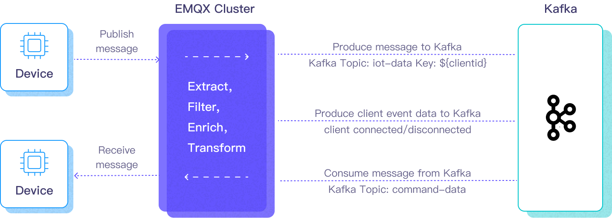
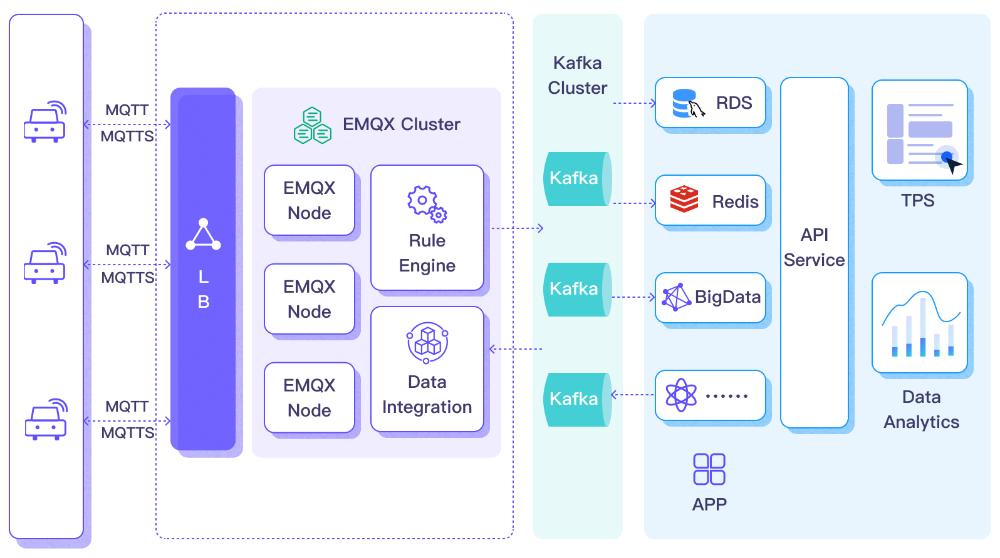

# Stream MQTT Data into Apache Kafka

[Apache Kafka](https://kafka.apache.org/) is a widely used open-source distributed event streaming platform designed for high-throughput, real-time data processing. However, Kafka is not built for edge IoT communication, as Kafka clients require a stable network connection and high system resources. In IoT scenarios, devices commonly use the lightweight MQTT protocol to transmit data efficiently over unreliable networks.

EMQX integrates MQTT with Kafka/[Confluent](https://www.confluent.io/) to enable seamless data streaming between IoT devices and backend systems. MQTT messages can be ingested into Kafka topics for real-time processing, storage, and analytics, while data from Kafka topics can also be consumed and delivered to MQTT clients to trigger timely actions.



This page introduces the EMQX–Kafka data integration and provides step-by-step guidance on how to create and validate the integration.

## How It Works

Apache Kafka data integration is a built-in feature in EMQX that streams MQTT-based IoT data into Kafka for downstream processing and analytics. By leveraging the built-in [rule engine](./rules.md), EMQX enables data filtering, transformation, and routing without requiring custom code.

The diagram below illustrates a typical EMQX–Kafka integration architecture in an automotive IoT scenario.



<!-- 将数据流入或流出 Apache Kafka 需要分别创建 Kafka Sink（向 Kafka 发送消息）和 Kafka Source（从 Kafka 接收消息）。以 Sink 为例，其工作流程如下： -->

To stream data into or out of Apache Kafka, you create a Kafka Sink (for sending data to Kafka) or a Kafka Source (for consuming data from Kafka). The following describes the Kafka Sink workflow:

1. **Message ingestion**: IoT devices connected to vehicles establish MQTT connections to EMQX and periodically publish messages containing status data. When EMQX receives the messages, it initiates rule matching in the rule engine.
2. **Rule-based processing**: Matching rules process the messages by filtering, transforming, or enriching the payload as defined.
3. **Data forwarding to Kafka**: The rules defined in the rule engine trigger actions to forward messages to Kafka. Using a Kafka Sink, MQTT topics are mapped to predefined Kafka topics, and all processed messages and data are written to Kafka topics.

Once data is ingested into Kafka, it can be consumed and processed in multiple ways:

- Backend services consume real-time data streams directly from Kafka topics.
- Kafka Streams can be used for real-time aggregation, correlation, and analytics.
- Kafka Connect can forward data to external systems such as MySQL or Elasticsearch for storage and further processing.

## Features and Benefits

The data integration with Apache Kafka provides the following features and benefits:

- **Dependable and bi-directional IoT data messaging**: EMQX reliably forwards MQTT messages to Kafka and delivers Kafka messages from backend systems to connected IoT clients, even over unstable networks.
- **Payload transformation**: Messages can be filtered, enriched, and transformed using SQL rules before being forwarded to Kafka.
- **Effective topic mapping:** MQTT topics and user properties can be flexibly mapped to Kafka topics and headers, supporting one-to-one, one-to-many, and wildcard-based mappings.
- **Flexible partition selection strategy**: Forwards messages to the same Kafka partition based on MQTT topics or clients.
- **High-throughput processing**: Supports synchronous and asynchronous Kafka writes to balance latency and throughput for different workload scenarios.
- **Runtime metrics**: Supports viewing runtime metrics for each Sink and Source, such as total messages, success/failure counts, current rate, etc.
- **Dynamic configuration**: You can dynamically configure Sink and Source in the Dashboard or configuration file.

These capabilities help you build a scalable and resilient IoT data platform with efficient data ingestion and management.

## Before You Start

This section describes the preparations you need to complete before you start to create the Kafka Sink and Source in the EMQX Dashboard.

### Prerequisites

- Knowledge about EMQX data integration [rules](./rules.md)
- Knowledge about [Data Integration](./data-bridges.md)

### Set Up a Kafka Server

This section takes macOS as an example to illustrate the process. You can install and run Kafka with the commands below:

```bash
wget https://archive.apache.org/dist/kafka/3.3.1/kafka_2.13-3.3.1.tgz

tar -xzf  kafka_2.13-3.3.1.tgz

cd kafka_2.13-3.3.1

# Use KRaft start Kafka
KAFKA_CLUSTER_ID="$(bin/kafka-storage.sh random-uuid)"

bin/kafka-storage.sh format -t $KAFKA_CLUSTER_ID -c config/kraft/server.properties

bin/kafka-server-start.sh config/kraft/server.properties
```

For detailed operation steps, you may refer to the [Quick Start section in Kafka Documentation](https://kafka.apache.org/41/getting-started/quickstart/).

### Create Kafka Topics

Relevant Kafka topics should be created before creating the data integration in EMQX. Use the commands below to create two topics in Kafka:  `testtopic-in` (for the Sink) and `testtopic-out` (for the Source).

```bash
bin/kafka-topics.sh --create --topic testtopic-in --bootstrap-server localhost:9092

bin/kafka-topics.sh --create --topic testtopic-out --bootstrap-server localhost:9092
```

## Create a Kafka Producer Connector

Before adding a Kafka Sink action, you need to create a Kafka producer connector to establish a connection between EMQX and Kafka.

1. Go to the EMQX Dashboard and click **Integration** -> **Connector**.

2. Click **Create** in the top right corner of the page, select **Kafka Producer** on the connector selection page, and click **Next**.

3. Enter a name and description, such as `my-kafka`. The name is used to associate the Kafka Sink with the connector and must be unique within the cluster.

4. Configure the parameters required to connect to Kafka:
   - **Bootstrap Hosts**: Enter `127.0.0.1:9092`. Note: The demonstration assumes that you run both EMQX and Kafka on the local machine. If you have Kafka and EMQX running remotely, please adjust the settings accordingly.

   - **Authentication**: Choose the authentication mechanism required by your Kafka cluster. The following methods are supported:

     - `None`: No authentication is required.
     - `AWS IAM for MSK`: Used for connecting to Amazon MSK clusters when EMQX is deployed on Amazon EC2 instances.
     - `MSK IAM Roles Anywhere`: Used for connecting to Amazon MSK clusters from environments outside EC2 by using the AWS IAM Roles Anywhere credential helper.
     - `OAuth`: Uses [OAuth 2.0](https://oauth.net/2/)–based authentication to connect to Kafka clusters that support OAuth or OIDC.
     - `Basic Auth`:  Uses a username and password for authentication. Requires selecting a mechanism (`plain`, `scram_sha_256`, or `scram_sha_512`).
     - `Kerberos`: Uses Kerberos (GSSAPI) for authentication. Requires specifying a Kerberos principal and a Kerberos keytab file.
   
     See [Authentication Method](#authentication-method) for details on each method.
   
   - If you want to establish an encrypted connection, click the **Enable TLS** toggle switch. For more information about TLS connections, see [TLS for External Resource Access](../network/overview.md#tls-for-external-resource-access).
   
   - **Advanced Settings** (optional): See [Advanced Configurations](#advanced-configurations).
   
5. Before clicking **Create**, you can click **Test Connection** to test that the connection to the Kafka server is successful.

6. Click the **Create** button to complete the creation of the connector.

Once created, the connector will automatically connect to Kafka. Next, you need to create a rule based on this connector to forward data to the Kafka cluster configured in the connector.

### Authentication Method

When creating a Kafka connector in EMQX, you can choose from several authentication methods depending on your Kafka cluster’s security setup:

- **None**: No authentication is required.

- **MSK IAM**: For connecting to Amazon MSK clusters when EMQX is deployed on Amazon EC2 instances.

  This method uses the AWS EC2 instance metadata service to generate authentication tokens based on the IAM policies attached to the instance.

  ::: tip Important Notice

  MSK IAM authentication is supported only when EMQX is running on EC2 instances connecting to MSK clusters, as it relies on the EC2 instance metadata service.

  If you apply host-level egress filtering with `iptables` or `nftables`, do not block `169.254.169.254`. EMQX must reach the instance metadata service to obtain credentials for MSK IAM authentication. The same exception applies to other AWS-based connectors that retrieve credentials from EC2 instance metadata, such as S3, S3 Tables, DynamoDB, and Kinesis. See [Mitigate SSRF with Rule Engine Policy and Firewall Rules](../deploy/cluster/security.md#mitigate-ssrf-with-rule-engine-policy-and-firewall-rules).

  :::

- **MSK IAM Roles Anywhere**: For connecting to Amazon MSK clusters from environments outside EC2, such as on-premises deployments, by using the AWS IAM Roles Anywhere credential helper.

  With this method, the credential helper process must run in `serve` mode and expose its HTTP API to EMQX. EMQX obtains temporary AWS credentials from this API and uses them to generate SASL/OAUTHBEARER tokens for MSK IAM authentication.

  This method requires:

  - **Roles Anywhere Endpoint**: The endpoint where the AWS IAM Roles Anywhere credential process serves its API. Enter a full HTTP endpoint with scheme and port, for example, `http://127.0.0.1:9911`.
  - **AWS Region**: The AWS region where the MSK cluster is running.

- **OAuth**: Uses OAuth 2.0–based authentication to connect EMQX to Kafka clusters that support OAuth or OIDC (such as Confluent Cloud or self-managed Kafka with OAuth enabled).

  With this method, EMQX acts as an OAuth 2.0 client and periodically retrieves access tokens from an OAuth authorization server. These tokens are then used to authenticate with the Kafka broker via the SASL/OAUTHBEARER mechanism.

  This method requires:

  - **OAuth Grant Type**: The OAuth 2.0 grant type used to obtain access tokens. (currently, only `client_credentials` is supported).

  - **OAuth Token Endpoint URI**: The token endpoint of the OAuth/OIDC provider. EMQX sends token requests to this endpoint to obtain access tokens.

  - **OAuth Client ID**: The client identifier registered with the OAuth authorization server.

  - **OAuth Client Secret**: The client secret associated with the OAuth client ID. This value is used to authenticate EMQX when requesting tokens.

  - **OAuth Request Scope**: (optional) The scope to include in the token request, if required by the OAuth provider.

  - **SASL Extensions**: (advanced, optional) 

  - Additional key-value pairs sent as SASL extensions during authentication. These are required by some Kafka providers (for example, Confluent Cloud) to pass metadata such as:

    - `logicalCluster`
    - `identityPoolId`

    The required extensions and their values depend on the Kafka cluster and OAuth provider configuration. For a complete description of OAuth / OIDC authentication in Confluent Cloud, refer to the [official documentation](https://docs.confluent.io/cloud/current/security/authenticate/workload-identities/identity-providers/oauth/overview.html).
- **Basic Auth**: Uses a username and password for authentication.

  When this method is selected, you must provide:
  - **Mechanism**: Choose from `plain`, `scram_sha_256`, or `scram_sha_512`.
  - **Username** and **Password**: Credentials to authenticate with the Kafka cluster.

- **Kerberos**: Uses Kerberos GSSAPI for authentication.

  This method requires:
  - **Kerberos Principal**: The Kerberos identity used for authentication.
  - **Kerberos Keytab File**: The file path to the keytab used for non-interactive authentication.

  ::: tip Important Notice

  The Kerberos keytab file must be located at the same path on all EMQX nodes, and the EMQX service user must have read permissions for the file.

  :::

## Create a Rule with Kafka Sink

This section demonstrates how to create a rule in EMQX to process messages from the MQTT topic `t/#` and send the processed results to Kafka's `testtopic-in` topic using the configured Kafka Sink.

1. Go to EMQX Dashboard, and click **Integration** -> **Rules**.

2. Click **Create** on the top right corner of the page.

3. Enter a rule ID, for example, `my_rule`.

4. Enter the following statement in the **SQL Editor** if you want to forward the MQTT messages from the topic `t/#` to Kafka.

   Note: If you want to specify your own SQL syntax, make sure that you have included all fields required by the sink in the `SELECT` part.

   ```sql
   SELECT
     *
   FROM
     "t/#"
   ```

   ::: tip

   If you are a beginner user, you can click **SQL Examples** and **Try It Out** to learn and test the SQL rule.

   :::

   ::: tip

   EMQX v5.7.2 introduced the functionality to read environment variables in Rule SQL, detailed in [Use Environment Variables in Rule SQL](#use-environment-variables).

   :::

5. On the **Create Rule** page, click + **Add Action** to define the output of the rule.

6. From the **Type of Action** dropdown, select `Kafka Producer`.

   In the **Action** dropdown, keep the default `Create Action`.

   > You may select an existing Sink from the **Action** instead; this example creates a new one.

7. Enter a **Name** and an optional **Description**.

8. From the **Connector** dropdown box, select the `my-kafka` connector created before. You can also create a new connector if needed. Refer to [Create a Kafka Producer Connector](#create-a-kafka-producer-connector).

9. Configure the data-sending method for the Sink, including:

      - **Kafka Topic**: The target Kafka topic to which messages are published. Enter `testtopic-in`. Starting from EMQX v5.7.2, this field also supports dynamic topics configuration. Refer to [Use Variable Templates](#use-variable-templates) for details.
      - **Kafka Headers**: Optional key-value metadata added to Kafka messages. Header values must resolve to an object. You can select how header values are encoded using the **Kafka Header Value Encode Type** dropdown and add multiple headers by clicking **Add**.
      - **Message Key**: The key of the Kafka message, used for partitioning and message ordering. It can be a static string or include placeholders (for example, `${.clientid}`).
      - **Message Value**: The Kafka message payload rendered from a template. It can be a static string or include placeholders (for example, `${.}`) to dynamically generate the value from the rule context. If the template resolves to `NULL` (for example, when the referenced field does not exist), a Kafka `NULL` value is produced instead of an empty string.
      - **Message Timestamp**: The timestamp of the Kafka message. You can enter a fixed value or use a placeholder (for example, `${timestamp}`) to dynamically set the message timestamp from the rule output.
      - **Partition Strategy**: Select how the producer distributes messages to Kafka partitions.
      - **Partitions Limit**: Limits the maximum number of partitions to which a producer can send messages. When enabled, the producer will only distribute messages among the specified number of partitions instead of all available partitions.
      - **Compression**: Specify whether to use compression algorithms to compress/decompress records in Kafka messages.


10. **Fallback Actions** (Optional): If you want to improve reliability in case of message delivery failure, you can define one or more fallback actions. These actions will be triggered if the primary Sink fails to process a message. See [Fallback Actions](./data-bridges.md#fallback-actions) for more details.

11. **Advanced Settings** (optional): See [Advanced Configuration](#advanced-configuration).

12. Click the **Create** button to complete the creation of the Sink. Once created, the page will return to **Create Rule**, and the new Sink will be added to the rule actions.

13. Click the **Create** button to complete the entire rule creation.


Now you have successfully created the rule, and you can see the newly created rule on the **Integration** -> **Rules** page, as well as the newly created Kafka Producer Sink on the **Actions(Sink)** tab.

You can also click **Integration** -> **Flow Designer** to view the topology. Through the topology, you can intuitively see that messages under topic `t/#` are sent and saved to Kafka after being parsed by rule `my_rule`.

### Configure Kafka Dynamic Topics

Starting from EMQX v5.7.2, you can dynamically configure the Kafka topics in the Kafka Producer Sink configuration using the environment variables or variable templates. This section introduces these two use cases in dynamic topic configuration.

#### Use Environment Variables

EMQX v5.7.2 introduces a new functionality of dynamically assigning the values retrieved from [environment variables](../configuration/configuration.md#environment-variables) to a field within messages during the SQL processing phase. This functionality uses the [getenv](../data-integration/rule-sql-builtin-functions.md#system-function) function from the built-in SQL functions of the rule engine to retrieve environment variables from EMQX. The values of the variables are then set into SQL processing results. As an application of this feature, when configuring Kafka topics in Kafka Sink rule actions, you can reference fields from rule output results to set the Kafka topic. The following is a demonstration of this application:

::: tip Note

To prevent leakage of other system environment variables, the names of environment variables used by rule engine must have a fixed prefix `EMQXVAR_`. For example, if the variable name read by `getenv` function is `KAFKA_TOPIC`, the environment variable name must be set to `EMQXVAR_KAFKA_TOPIC`.

:::

1. Start Kafka and pre-create a Kafka topic named `testtopic-in`. Refer to [Before You Start](#before-you-start) for related steps.

2. Start EMQX and configure environment variables. Assuming EMQX is installed via zip, you can directly specify environment variables during startup. For example, set Kafka topic `testtopic-in` as the value of environment variable `EMQXVAR_KAFKA_TOPIC`:

   ```bash
   EMQXVAR_KAFKA_TOPIC=testtopic-in bin/emqx start
   ```

3. Create a connector. Refer to [Create a Kafka Producer Connector](#create-a-kafka-producer-connector) for details.

4. Configure a Kafka Sink rule. Enter the following statement in the **SQL Editor**:

   ```sql
   SELECT
     getenv('KAFKA_TOPIC') as kafka_topic,
     payload
   FROM
     "t/#"
   ```

   

5. Enable the SQL test. Verify that the environment variable value `testtopic-in` is successfully retrieved.

   

6. Add an action to the Kafka Producer Sink. Under **Action Outputs** on the right-hand side of the rule, click **Add Action** to proceed.

   - **Connector**: Select the previously created connector `test-kafka`.
   - **Kafka Topic**: Configure using the variable template format `${kafka_topic}` based on the SQL rule output.

   

7. Complete additional configuration by referring to [Create a Rule with Kafka Sink](#create-a-rule-with-kafka-sink) for further steps, and finally click **Create** to complete the rule creation.

8. Refer to the steps in [Test Kafka Producer Rule](#test-kafka-producer-rule) to send a message to Kafka:

   ```bash
   mqttx pub -h 127.0.0.1 -p 1883 -i pub -t t/Connection -q 1 -m 'payload string'
   ```

   The message should be received under the Kafka topic `testtopic-in`:

   ```bash
   bin/kafka-console-consumer.sh --bootstrap-server 127.0.0.1:9092 \
     --topic testtopic-in
   
   {"payload":"payload string","kafka_topic":"testtopic-in"}
   {"payload":"payload string","kafka_topic":"testtopic-in"}
   ```

#### Use Variable Templates

Except for setting static topic names in the **Kafka Topic** field, you can also generate dynamic topics using variable templates. This enables constructing Kafka topics based on message content, facilitating flexible message processing and distribution. For example, you can specify formats like `device-${payload.device}` in the field to easily send messages from a specific device to topics suffixed with the device ID, such as `device-1`.

For this specific example, ensure that the message payload sent to Kafka contains a `device` key to correctly render the topic. Below is an example payload:

```json
{
    "topic": "t/devices/data",
    "payload": {
        "device": "1",
        "temperature": 25.6,
        "humidity": 60.2
    }
}
```

Failure to include this key will result in topic rendering failure, leading to message drops that cannot be recovered.

You also need to pre-create all resolved topics in Kafka, such as `device-1`, `device-2`, and so on. If the template resolves to a topic name that does not exist in Kafka, messages will also be dropped due to unrecoverable errors.

## Test Kafka Producer Rule

To test whether the Kafka Producer rule works as you expect, you can use [MQTTX](https://mqttx.app/en) to simulate a client publishing MQTT messages to EMQX.

1. Use MQTTX to send messages to topic  `t/1`:

```bash
mqttx pub -i emqx_c -t t/1 -m '{ "msg": "Hello Kafka" }'
```

2. On the **Actions(Sink)** page, click on the name of the Sink to view statistical information. Check the sink's running status; there should be one new incoming message and one new outgoing message.
3. Use the following command to check if the message has been written to the `testtopic-in` topic:

   ```bash
   bin/kafka-console-consumer.sh --bootstrap-server 127.0.0.1:9092  --topic testtopic-in
   ```

<!--TODO 5.4 refactor-->

## Create a Kafka Consumer Connector

Before adding a Kafka Source action, you need to create a Kafka consumer connector to establish a connection between EMQX and Kafka.

1. Go to EMQX Dashboard, and click **Integration** -> **Connector**.

2. Click **Create** on the top right corner of the page.

3. In the **Create Connector** page, click to select **Kafka Consumer**, and then click **Next**.

4. Enter a name for the source. The name should be a combination of upper/lower case letters and numbers, for example, `my-kafka-source`.

5. Enter the connection information for the source.
   - **Bootstrap Hosts**: Enter `127.0.0.1:9092`. Note: The demonstration assumes that you run both EMQX and Kafka on the local machine. If you have Kafka and EMQX running remotely, please adjust the settings accordingly.

   - **Authentication**: Choose the authentication mechanism required by your Kafka cluster. The following methods are supported:

     - `None`: No authentication.
     - `AWS IAM for MSK`: For use with AWS MSK clusters when EMQX is deployed on EC2 instances.
     - `MSK IAM Roles Anywhere`: For use with AWS MSK clusters from environments outside EC2 by using the AWS IAM Roles Anywhere credential helper.
     - `OAuth`: Specify parameters to authenticate using [OAuth 2.0](https://oauth.net/2/).
     - `Basic Auth`: Requires selecting a **Mechanism** (`plain`, `scram_sha_256`, or `scram_sha_512`), and providing a **Username** and **Password**.
     - `Kerberos`: Requires specifying a **Kerberos Principal** and a **Kerberos Keytab File**.
   
     See the [Authentication Method](#authentication-method) for details on each method.
   
   - If you want to establish an encrypted connection, click the **Enable TLS** toggle switch. For more information about TLS connections, see **TLS for External Resource Access**.
   
   - **Advanced Settings** (optional): See [Advanced Configuration](#advanced-configuration).
   
6. Before clicking **Create**, you can click **Test Connection** to test that the connection to the Kafka server is successful.

11. Click **Create**. You will be offered the option of creating an associated rule. See [Create a Rule with Kafka Consumer Source](#create-a-rule-with-kafka-consumer-source).

## Create a Rule with Kafka Consumer Source

This section demonstrates how to create a rule in EMQX to further process the message forwarded by a configured Kafka Consumer source and republish the message to an MQTT topic.

### Create a Rule SQL

1. Go to EMQX Dashboard, and click **Integration** -> **Rules**.

2. Click **Create** on the top right corner of the page.

3. Enter a rule ID, for example, `my_rule`.

4. Enter the following statement in the **SQL Editor** if you want to forward the messages transformed from the Kafka source`$bridges/kafka_consumer:<sourceName>` to EMQX.

   Note: If you want to specify your own SQL syntax, make sure that the `SELECT` part includes all fields required by the republishing action set in later steps. The `SELECT` statement for the Kafka Source can use fields such as `ts_type`, `topic`, `ts`, `event`, `headers`, `key`, `metadata`, `value`, `timestamp`, `offset`, `node`, etc.

   ```sql
   SELECT
     *
   FROM
     "$bridges/kafka_consumer:<sourceName>"
   ```

   Note: If you are a beginner user, you can click **SQL Examples** and **Enable Test** to learn and test the SQL rule.

### Add Kafka Consumer Source as Data Input

1. Select the **Data Inputs** tab on the right side of the Create Rule page and click **Add Input**.
2. Select **Kafka Consumer** from the **Input Type** dropdown list. keep the **Source** dropdown box to the default `Create Source` option, or choose a previously created Kafka Consumer source from the **Source** dropdown box. This demonstration creates a new consumer source and adds it to the rule.
3. Enter the name and description of the Source in the corresponding text boxes below.
4. In the **Connector** dropdown box, select the `my-kafka-consumer` connector you just created. You can also click the button next to the dropdown box to quickly create a new connector in the pop-up box, with the required configuration parameters referring to [Create a Kafka Consumer Connector](#create-a-kafka-consumer-connector).
5. Configure the following fields:

   - **Kafka Topic**: Specify the Kafka topic from which the consumer source will subscribe to for receiving messages.
   - **Group ID**: Specify the consumer group identifier for this source. If not provided, a group ID will be automatically generated based on the source name.
   - **Key Encoding Mode** and **Value Encoding Mode**: Select the encoding mode for Kafka message key and message value.
7. **Offset Reset Policy**: Select the policy for resetting the offset where Kafaka consumers start to read from a Kafka topic partition when there is no consumer’s offset or the offset becomes invalid.

   - Select `latest` if you want the consumer to start reading messages from the latest offset, skipping messages that were produced before the consumer started.
   - Select `earliest` if you want the consumer to start reading messages from the beginning of the partition, including messages that were produced before the consumer started, that is, to read all the historical data in a topic.
8. **Advanced Settings** (optional): See [Advanced Configuration](#advanced-configuration).
9. Before clicking **Create**, you can click **Test Connectivity** to test if the Source can be connected to the Kafka server.
10. Click **Create** to complete the Source creation. Back on the **Create Rule** page, you will see the new Source appear under the **Data Inputs** tab.

### Add a Republish Action

1. Select the **Action Outputs** tab and click the + **Add Action** button to define an action that will be triggered by the rule.
2. Select **Republish** from the **Type of Action** drop-down list.
3. In **Topic** and **Payload** fields, you can enter the topic and payload for the messages you want to republish. For example, enter `t/1` and `${.}` for this demonstration.
   - You can also use `${}` in the **Topic** field to dynamically specify the MQTT topic, such as `t/${key}` (Note: The parameter provided inside `${}` must be included in the SQL `Select` statement).
4. Click **Add** to include the action to the rule.
5. Back on the **Create Rule** page, click **Save**.


## Test Kafka Source Rule

To test if the Kafka source and rule work as expected, you can use [MQTTX](https://mqttx.app/) to simulate a client that subscribes to a topic in EMQX and use the Kafaka producer to produce data to a Kafka topic. Then, check if the data from Kafka is republished by EMQX to the topic subscribed by the client.

1. Use MQTTX to subscribe to topic `t/1`:

   ```bash
   mqttx sub -t t/1 -v
   ```

2. Open a new command line window and start the Kafka producer using the command below:

   ```bash
   bin/kafka-console-producer --bootstrap-server 127.0.0.1:9092 --topic testtopic-out
   ```

   You will be prompted to input a message.

3. Enter `{"msg": "Hello EMQX"}` to produce a message to the `testtopic-out` topic using the producer and press enter.

4. Check the subscription in MQTTX. The following message from Kafka should be received under the topic `t/1`:

   ```json
   {
       "value": "{\"msg\": \"Hello EMQX\"}",
       "ts_type": "create",
       "ts": 1679665968238,
       "topic": "testtopic-out",
       "offset": 2,
       "key": "key",
       "headers": {
           "header_key": "header_value"
       }
   }
   ```

## Advanced Configuration

This section describes some advanced configuration options that can optimize the performance of your data integration and customize the operation based on your specific scenarios. When creating the Connector, Sink and Source, you can unfold the **Advanced Settings** and configure the following settings according to your business needs.

| Fields                                    | Descriptions                                                 | Recommended Values |
| ----------------------------------------- | ------------------------------------------------------------ | ------------------ |
| Allow Auto Topic Creation                 | (For Producer Connector only) When enabled, EMQX allows automatic creation of a Kafka topic if it doesn’t exist when a client sends a metadata fetch request. | `disabled`         |
| Min Metadata Refresh Interval             | The minimum time interval the client must wait before refreshing Kafka broker and topic metadata. Setting this value too small may increase the load on the Kafka server unnecessarily. | `3 `second         |
| Metadata Request Timeout                  | The maximum duration to wait when the bridge requests metadata from Kafka. | `5` second         |
| Connect Timeout                           | The maximum time to wait for TCP connection establishment, which includes the authentication time if enabled. | `5` second         |
| Max Wait Time (Source)                    | The maximum duration to wait for a fetch response from the Kafka broker. | `1` second         |
| Fetch Bytes (Source)                      | The byte size to pull from Kafka with each fetch request. Note that if the configured value is smaller than the message size in Kafka, it may negatively impact fetch performance. | `896` KB           |
| Max Batch Bytes (Sink)                    | The maximum size, in bytes, for collecting messages within a Kafka batch. Typically, Kafka brokers have a default batch size limit of 1 MB. However, EMQX's default value is intentionally set slightly lower than 1 MB to account for Kafka message encoding overheads, particularly when individual messages are very small. If a single message exceeds this limit, it will still be sent as a separate batch. | `896` KB           |
| Offset Commit Interval (Source)           | The time interval between two offset commit requests sent for each consumer group. | `5` second         |
| Required Acks (Sink)                      | Required acknowledgments for the Kafka partition leader to await from its followers before sending an acknowledgment back to the EMQX Kafka producer: <br />`all_isr`: Requires acknowledgment from all in-sync replicas.<br />`leader_only`: Requires acknowledgment only from the partition leader.<br />`none`: No acknowledgment from Kafka is needed. | `all_isr`          |
| Partition Count Refresh Interval (Source) | The time interval at which the Kafka producer detects an increased number of partitions. Once Kafka's partition count is augmented, EMQX will incorporate these newly discovered partitions into its message dispatching process, based on the specified `partition_strategy`. | `60` second        |
| Max Inflight (Sink)                       | The maximum number of batches allowed for Kafka producer (per-partition) to send before receiving acknowledgment from Kafka. Greater value typically means better throughput. However, there can be a risk of message reordering when this value is greater than 1.<br />This option controls the number of unacknowledged messages in transit, effectively balancing the load to prevent overburdening the system. | `10`               |
| Query Mode (Source)                       | Allows you to choose asynchronous or synchronous query modes to optimize message transmission based on different requirements. In asynchronous mode, writing to Kafka does not block the MQTT message publish process. However, this might result in clients receiving messages ahead of their arrival in Kafka. | `Async`            |
| Synchronous Query Timeout (Sink)          | In synchronous query mode, establishes a maximum wait time for confirmation. This ensures timely message transmission completion to avoid prolonged waits.<br />It applies only when the bridge query mode is configured to `Sync`. | `5` second         |
| Buffer Mode (Sink)                        | Defines whether messages are stored in a buffer before being sent. Memory buffering can increase transmission speeds.<br />`memory`: Messages are buffered in memory. They will be lost in the event of an EMQX node restart.<br />`disk`: Messages are buffered on disk, ensuring they can survive an EMQX node restart.<br />`hybrid`: Messages are initially buffered in memory. When they reach a certain limit (refer to the `segment_bytes` configuration for more details), they are gradually offloaded to disk. Similar to the memory mode, messages will be lost if the EMQX node restarts. | `memory`           |
| Per-partition Buffer Limit (Sink)         | Maximum allowed buffer size, in bytes, for each Kafka partition. When this limit is reached, older messages will be discarded to make room for new ones by reclaiming buffer space. <br />This option helps to balance memory usage and performance. | `2` GB             |
| Segment File Bytes (Sink)                 | This setting is applicable when the buffer mode is configured as `disk` or `hybrid`. It controls the size of segmented files used to store messages, influencing the optimization level of disk storage. | `100` MB           |
| Memory Overload Protection (Sink)         | This setting applies when the buffer mode is configured as `memory`. EMQX will automatically discard older buffered messages when it encounters high memory pressure. It helps prevent system instability due to excessive memory usage, ensuring system reliability. <br />This configuration is effective only on Linux systems. | `Enabled`          |
| Socket Send / Receive Buffer Size         | Manages the size of socket buffers to optimize network transmission performance. | `1024` KB          |
| TCP Keepalive                             | This configuration enables TCP keepalive mechanism for Kafka bridge connections to maintain ongoing connection validity, preventing connection disruptions caused by extended periods of inactivity. The value should be provided as a comma-separated list of three numbers in the format `Idle, Interval, Probes`:<br />Idle: This represents the number of seconds a connection must remain idle before the server initiates keep-alive probes. The default value on Linux is 7200 seconds.<br />Interval: The interval specifies the number of seconds between each TCP keep-alive probe. On Linux, the default is 75 seconds.<br />Probes: This parameter defines the maximum number of TCP keep-alive probes to send before considering the connection as closed if there's no response from the other end. The default on Linux is 9 probes.<br />For example, if you set the value to '240,30,5,' it means that TCP keepalive probes will be sent after 240 seconds of idle time, with subsequent probes sent every 30 seconds. If there are no responses for 5 consecutive probe attempts, the connection will be marked as closed. | `none`             |
| Max Linger Time                           | Maximum duration for a per-partition producer to wait for messages in order to collect a batch to buffer. The default value `0` means no wait. For non-memory buffer mode, `5ms` will significantly reduce IOPS, though with the cost of increased latency. | `0` milliseconds   |
| Max Linger Bytes                          | Maximum number of bytes for a per-partition producer to wait for messages in order to collect a batch to buffer. | `10` MB            |
| Health Check Interval                     | The time interval for checking the running status of the connector. | `15` second        |

## More Information

EMQX provides bunches of learning resources on the data integration with Apache Kafka. Check out the following links to learn more:

**Blogs:**

- [Building Connected Vehicle Streaming Data Pipelines with MQTT and Kafka: A 3-Minute Guide](https://www.emqx.com/en/blog/building-connected-vehicle-streaming-data-pipelines-with-mqtt-and-kafka)
- [MQTT with Kafka: Supercharging IoT Data Integration](https://www.emqx.com/en/blog/mqtt-and-kafka)
- [MQTT Performance Benchmark Testing: EMQX-Kafka Integration](https://www.emqx.com/en/resources/emqx-enterprise-performance-benchmark-testing-kafka-integration)

**Benchmark Report**:

- [EMQX Enterprise Performance Benchmark Testing: Kafka Integration](https://www.emqx.com/en/resources/emqx-enterprise-performance-benchmark-testing-kafka-integration)

**Videos:**

- [Bridge device data to Kafka using the EMQX Cloud Rule Engine](https://www.emqx.com/en/resources/bridge-device-data-to-kafka-using-the-emqx-cloud-rule-engine) (This video is about Cloud rule engine; will be replaced with more suitable videos in the future)
