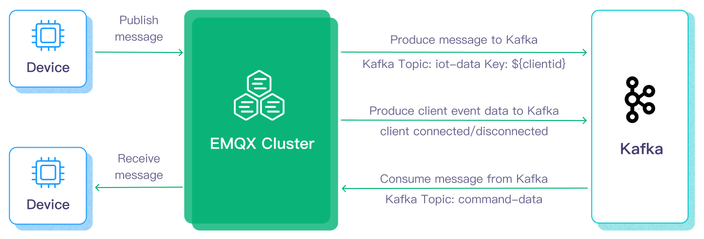
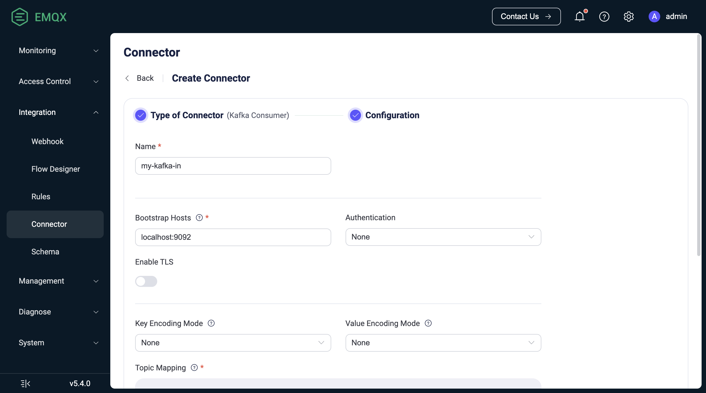

# Stream MQTT Data into Apache Kafka


:::tip
The Kafka data integration is an EMQX Enterprise Edition feature. EMQX Enterprise Edition provides comprehensive coverage of key business scenarios, rich data integration, product-level reliability, and 24/7 global technical support. Experience the benefits of this [enterprise-ready MQTT messaging platform](https://www.emqx.com/en/try?product=enterprise) today.
:::


[Apache Kafka](https://kafka.apache.org/) is a widely used open-source distributed event streaming platform that can handle the real-time transfer of data streams between applications and systems. However, Kafka is not built for edge IoT communication and Kafka clients require a stable network connection and more hardware resources. In the IoT realm, data generated from devices and applications are transmitted using the lightweight MQTT protocol. EMQX’s integration with Kafka/[Kafka](https://www.Kafka.io/) enables users to stream MQTT data seamlessly into or from Kafka. MQTT data streams are ingested into Kafka topics, ensuring real-time processing, storage, and analytics. Conversely, Kafka topics data can be consumed by MQTT devices, enabling timely actions.



This page provides a comprehensive introduction to the data integration between EMQX and Kafka with practical instructions on how to create and validate the data integration.

## How It Works

Apache Kafka data integration is an out-of-the box feature in EMQX designed to bridge the gap between MQTT-based IoT data and Kafka's powerful data processing capabilities. With a built-in [rule engine](./rules.md) component, the integration simplifies the process of streaming and processing data between the two platforms, eliminating the need for complex coding. 

The diagram below illustrates a typical architecture of data integration between EMQX and Kafka used in automotive IoT.


<!-- 将数据流入或流出 Apache Kafka 需要分别创建 Kafka Sink（向 Kafka 发送消息）和 Kafka Source（从 Kafka 接收消息）。以 Sink 为例，其工作流程如下： -->
Streaming data into and out of Apache Kafka needs to create a Kafka Sink (to send messages to Kafka) and a Kafka Source (to receive messages from Kafka), respectively. Take the Sink as an example, the flow is as follows:

1. **Message publication and reception**: IoT devices on connected vehicles establish successful connections to EMQX through the MQTT protocol and periodically publish messages containing status data via MQTT. When EMQX receives these messages, it initiates the matching process within its rules engine.
2. **Message data processing:** With an embedded rule engine working together with the broker as a single component, these MQTT messages can be processed based on topic-matching rules. When a message arrives, it passes through the rule engine, which evaluates the defined rules for that message. If any rules specify payload transformations, those transformations are applied, such as converting data formats, filtering out specific information, or enriching the payload with additional context.
3. **Bridging to Kafka:** The rule defined in the rule engine triggers the action of forwarding the messages to Kafka. Using the Kafka bridging functionality, MQTT topics are mapped to pre-defined Kafka topics, and all processed messages and data are written into Kafka topics.

After the vehicle data are ingested into Kafka, you can flexibly access and utilize the data:

- Your services can directly integrate with Kafka clients to consume real-time data streams from specific topics, enabling customized business processing.
- Utilize Kafka Streams for stream processing, and perform real-time monitoring by aggregating and correlating vehicle statuses in memory.
- By using Kafka Connect components, you can select various connectors to output data to external systems such as MySQL, ElasticSearch, for storage.

## Features and Benefits

The data integration with Apache Kafka brings the following features and benefits to your business:

- **Dependable and bi-directional IoT data messaging:**  The data communication between Kafka and resource-limited IoT devices running on unpredictable mobile networks can be processed under the MQTT protocol that excels in messaging in uncertain networks. EMQX not only batch forwards MQTT messages to Kafka but also subscribes to Kafka messages from backend systems and delivers them to connected IoT clients.
- **Payload transformation**: Message payload can be processed by the defined SQL rules during the transmission. For example, payloads containing some real-time metrics such as total message count, successful/failed delivery count, and message rate can go through data extraction, filtering, enrichment, and transformation before the messages are ingested into Kafka.
- **Effective topic mapping:** Numerous IoT business topics can be mapped into Kakfa topics by the configured kafka integration. EMQX supports the MQTT user property mapping to Kafka headers and adopts various flexible topic mapping methods, including one-to-one, one-to-many, many-to-many, and also includes support for MQTT topic filters (wildcards).
- **Flexible partition selection strategy**: Supports forwarding messages to the same Kafka partition based on MQTT topics or clients.
- **Processing capabilities in high-throughput situations**: EMQX Kafka producer supports both synchronous and asynchronous writing modes, allowing you to differentiate between real-time priority and performance priority for data writing strategies and enabling flexible balancing between latency and throughput according to different scenarios.
- **Runtime metrics**: Supports viewing runtime metrics for each Sink and Source, such as total messages, success/failure counts, current rate, etc.
- **Dynamic configuration**: You can dynamically configure Sink and Source in the Dashboard or configuration file.

These features enhance the integration capabilities and flexibility that help you establish an effective and robust IoT platform architecture. Your increasing volumes of IoT data can be transmitted under stable network connections and can be further stored and managed effectively.

## Before You Start

This section describes the preparations you need to complete before you start to create the Kafka Sink and Source in EMQX Dashboard.

### Prerequisites

- Knowledge about EMQX data integration [rules](./rules.md)
- Knowledge about [Data Integration](./data-bridges.md)

### Set Up a Kafka Server

This section takes macOS as an example to illustrate the process. You can install and run Kafka with the commands below:

```bash
wget https://archive.apache.org/dist/kafka/3.3.1/kafka_2.13-3.3.1.tgz

tar -xzf  kafka_2.13-3.3.1.tgz

cd kafka_2.13-3.3.1

# Use KRaft start Kafka
KAFKA_CLUSTER_ID="$(bin/kafka-storage.sh random-uuid)"

bin/kafka-storage.sh format -t $KAFKA_CLUSTER_ID -c config/kraft/server.properties

bin/kafka-server-start.sh config/kraft/server.properties
```

For detailed operation steps, you may refer to the [Quick Start section in Kafka Documentation](https://kafka.apache.org/documentation/#quickstart).

### Create Kafka Topics

Relevant Kafka topics should be created before creating the data integration in EMQX. Use the commands below to create two topics in Kafka:  `testtopic-in` (for the Sink) and `testtopic-out` (for the Source).

```bash
bin/kafka-topics.sh --create --topic testtopic-in --bootstrap-server localhost:9092

bin/kafka-topics.sh --create --topic testtopic-out --bootstrap-server localhost:9092
```

## Create a Kafka Producer Connector

Before adding a Kafka Sink action, you need to create a Kafka producer connector to establish a connection between EMQX and Kafka.

1. Go to the EMQX Dashboard and click **Integration** -> **Connector**.
2. Click **Create** in the top right corner of the page, select **Kafka Producer** on the connector selection page, and click **Next**.
3. Enter a name and description, such as `my-kafka`. The name is used to associate the Kafka Sink with the connector and must be unique within the cluster.
4. Configure the parameters required to connect to Kafka:
   - Enter `127.0.0.1:9092` for the **Bootstrap Hosts**. Note: The demonstration assumes that you run both EMQX and Kafka on the local machine. If you have Kafka and EMQX running remotely, please adjust the settings accordingly.
   - Leave other options as default or configure them according to your business needs.
   - If you want to establish an encrypted connection, click the **Enable TLS** toggle switch. For more information about TLS connection, see [TLS for External Resource Access](../network/overview.md/#tls-for-external-resource-access).
5. Click the **Create** button to complete the creation of the connector.

Once created, the connector will automatically connect to Kafka. Next, you need to create a rule based on this connector to forward data to the Kafka cluster configured in the connector.

## Create a Kafka Sink Rule

This section demonstrates how to create a rule in EMQX to process messages from the MQTT topic `t/#` and send the processed results to Kafka's `testtopic-in` topic using the configured Kafka Sink.

1. Go to EMQX Dashboard, and click **Integration** -> **Rules**.

2. Click **Create** on the top right corner of the page.

3. Enter a rule ID, for example, `my_rule`.

4. Enter the following statement in the **SQL Editor** if you want to forward the MQTT messages from the topic `t/#` to Kafka.

   Note: If you want to specify your own SQL syntax, make sure that you have included all fields required by the sink in the `SELECT` part.

   ```sql
   SELECT
     *
   FROM
     "t/#"
   ```

   Note: If you are a beginner user, you can click **SQL Examples** and **Enable Test** to learn and test the SQL rule.

5. Click the + **Add Action** button to define the action triggered by the rule. From the **Type of Action** dropdown list, select `Kafka Producer`, keep the **Action** dropdown box to the default `Create Action` option, or choose a previously created Kafka Producer action from the **Action** dropdown box. This demonstration creates a new rule and adds it to the rule.

6. Enter the name and description of the Sink in the corresponding text boxes below.

7. In the **Connector** dropdown box, select the `my-kafka` connector you just created. You can also click the button next to the dropdown box to quickly create a new connector in the pop-up box, with the required configuration parameters referring to [Create a Kafka Producer Connector](#create-a-kafka-producer-connector).

8. Configure the data sending method for the Sink, including:

   - **Kafka Topic**: Enter `testtopic-in`. Note: Variables are not supported here.
   - **Kafka Headers**: Enter metadata or context information related to Kafka messages (optional). The value of the placeholder must be an object. You can choose the encoding type for the header value from the **Kafka Header Value Encod Type** dropdown list. You can also add more key-value pairs by clicking **Add**.
   - **Message Key**: The key of the Kafka message. Enter a string here, which can be a pure string or a string containing placeholders (${var}).
   - **Message Value**: The value of the Kafka message. Enter a string here, which can be a pure string or a string containing placeholders (${var}).
   - **Partition Strategy**: Select how the producer distributes messages to Kafka partitions.
   - **Compression**: Specify whether to use compression algorithms to compress/decompress records in Kafka messages.

9. Advanced settings (optional): See [Advanced Configurations](#advanced-configurations).

10. Click the **Create** button to complete the creation of the Sink. Once created, the page will return to **Create Rule**, and the new Sink will be added to the rule actions.

11. Click the **Create** button to complete the entire rule creation.

Now you have successfully created the rule, and you can see the newly created rule on the **Integration** -> **Rules** page, as well as the newly created Kafka Producer Sink on the **Actions(Sink)** tab.

You can also click **Integration** -> **Flow Designer** to view the topology. Through the topology, you can intuitively see that messages under topic `t/#` are sent and saved to Kafka after being parsed by rule `my_rule`.


## Test Kafka Producer Rule

To test whether the Kafka Producer rule works as you expect, you can use [MQTTX](https://mqttx.app/en) to simulate a client publishing MQTT messages to EMQX.

1. Use MQTTX to send messages to topic  `t/1`:

```bash
mqttx pub -i emqx_c -t t/1 -m '{ "msg": "Hello Kafka" }'
```

2. On the **Actions(Sink)** page, click on the name of the Sink to view statistical information. Check the sink's running status; there should be one new incoming message and one new outgoing message.
3. Use the following command to check if the message has been written to the `testtopic-in` topic:

   ```bash
   bin/kafka-console-consumer.sh --bootstrap-server 127.0.0.1:9092  --topic testtopic-in
   ```

<!--TODO 5.4 refactor-->

## Create a Kafka Consumer Connector

Before adding a Kafka Source action, you need to create a Kafka producer connector to establish a connection between EMQX and Kafka.

1. Go to EMQX Dashboard, and click **Integration** -> **Connector**.

2. Click **Create** on the top right corner of the page.

3. In the **Create Connector** page, click to select **Kafka Consumer**, and then click **Next**.

4. Enter a name for the source. The name should be a combination of upper/lower case letters and numbers.

5. Enter the connection information for the source.
   - Enter `127.0.0.1:9092` for the **Bootstrap Hosts**. Note: The demonstration assumes that you run both EMQX and Kafka on the local machine. If you have Kafka and EMQX running remotely, please adjust the settings accordingly.
   - Leave other options as default or configure according to your business needs.
   - If you want to establish an encrypted connection, click the **Enable TLS** toggle switch. For more information about TLS connection, see **TLS for External Reesource Access**.

6. **Key Encoding Mode** and **Value Encoding Mode**: Select the encoding mode for Kafka message key and message value.

7. Click **Add** to add at least one Kafka-to-MQTT topic mapping in the **Topic Mapping** field. For example, enter `testtopic-out` in **Kafka Topic** and `t/1` in **MQTT Topic** for this demonstration. The **MQTT Payload Template** subfield specifies the MQTT payload that should be used, and has the following Kafka message fields available for templating:

   | **Field Name** | **Description**                                              |
   | :------------- | :----------------------------------------------------------- |
   | `headers`      | An object containing string key-value pairs                  |
   | `key`          | Kafka message key (uses the same encoding method as the selected key) |
   | `offset`       | Offset for the message in Kafka's topic partition            |
   | `topic`        | Original Kafka topic                                         |
   | `ts`           | Message timestamp                                            |
   | `ts_type`      | Message timestamp type, which is one of `create`, `append` or `undefined` |
   | `value`        | Kafka message value (uses the same encoding method as the selected key) |

   The default value for **MQTT Payload Template** is `${.}`, which includes all available data encoded as a JSON object. For example, choosing `${.}` as a template will produce the following for a Kafka message:

   ```json
   {
       "value": "value",
       "ts_type": "create",
       "ts": 1679665968238,
       "topic": "testtopic-out",
       "offset": 2,
       "key": "key",
       "headers": {"header_key": "header_value"}
   }
   ```

   Subfields from the Kafka message may be accessed with dot notation. For example, `${.value}` will resolve to the Kafka message value, and `${.headers.h1}` will resolve to the value of the `h1` Kafka header if such a subfield exists. Absent values will be replaced by empty strings.

   **Note**: Each Kafka-to-MQTT topic mapping must contain a unique Kafka topic name. That is, the Kafka topic must not be present in more than one mapping.

8. **Offset Reset Policy**: Select the policy for resetting the offset where Kafaka consumers start to read from a Kafka topic partition when there is no consumer’s offset or the offset becomes invalid.

   - Select `lastest` if you want the consumer to start reading messages from the latest offset, skipping messages that were produced before the consumer started.
   - Select `earliest` if you want the consumer to start reading messages from the beginning of the partition, including messages that were produced before the consumer started, that is, to read all the historical data in a topic.

9. Advanced settings (optional): See **Advanced Configurations.**

10. Before clicking **Create**, you can click **Test Connection** to test that the bridge can connect to the Kafka server.

11. Click **Create**. You will be offered the option of creating an associated rule. For the Kafka source, it is not strictly necessary to create a rule for further data processing. If you need to create a rule for the source, see [Create Rule for Kafka Source](#create-rule-for-kafka-source-optional).



## Create Rule for Kafka Source

This section demonstrates how to create a rule in EMQX to further process the message forwarded by configured Kafka source and republish the message to MQTT topic.

1. Go to EMQX Dashboard, and click **Integration** -> **Rules**.

2. Click **Create** on the top right corner of the page.

3. Enter a rule ID, for example, `my_rule`.

4. Enter the following statement in the **SQL Editor** if you want to forward the messages transformed from the Kafka source`$bridges/kafka_consumer:<sourceName>` to EMQX.

   Note: If you want to specify your own SQL syntax, make sure that the `SELECT` part includes all fields required by the republishing action set in later steps.

   ```sql
   SELECT
     *
   FROM
     "$bridges/kafka_consumer:<sourceName>"
   ```

   Note: If you are a beginner user, you can click **SQL Examples** and **Enable Test** to learn and test the SQL rule.

5. Click the + **Add Action** button to define an action that will be triggered by the rule. Select **Republish** from the drop-down list.
6. In **Topic** and **Payload** fields, you can enter the topic and payload for the messages you want to republish. For example, enter `t/1` and `${.}` for this demonstration.
7. Click **Add** to include the action to the rule.
8. Back on the **Create Rule** page, click **Create**.


## Test Kafka Source Rule

To test if the Kafka source and rule work as expected, you can use [MQTTX](https://mqttx.app/) to simulate a client that subscribes to a topic in EMQX and use the Kafaka producer to produce data to a Kafka topic. Then, check if the data from Kafka is republished by EMQX to the topic subscribed by the client.

1. Use MQTTX to subscribe to topic `t/1`:

   ```bash
   mqttx sub -t t/1 -v
   ```

2. Open a new command line window and start the Kafka producer using the command below:

   ```bash
   bin/kafka-console-producer --bootstrap-server 127.0.0.1:9092 --topic testtopic-out
   ```

   You will be prompted to input a message.

3. Enter `{"msg": "Hello EMQX"}` to produce a message to the `testtopic-out` topic using the producer and press enter.

4. Check the subscription in MQTTX. The following message from Kafka should be received under the topic `t/1`:

   ```json
   {
       "value": "{\"msg\": \"Hello EMQX\"}",
       "ts_type": "create",
       "ts": 1679665968238,
       "topic": "testtopic-out",
       "offset": 2,
       "key": "key",
       "headers": {
           "header_key": "header_value"
       }
   }
   ```

## Advanced Configurations

This section describes some advanced configuration options that can optimize the performance of your data integration and customize the operation based on your specific scenarios. When creating the Connector, Sink and Source, you can unfold the **Advanced Settings** and configure the following settings according to your business needs.

| Fields                                    | Descriptions                                                 | Recommended Values |
| ----------------------------------------- | ------------------------------------------------------------ | ------------------ |
| Min Metadata Refresh Interval             | The minimum time interval the client must wait before refreshing Kafka broker and topic metadata. Setting this value too small may increase the load on the Kafka server unnecessarily. | `3`                |
| Metadata Request Timeout                  | The maximum duration to wait when the bridge requests metadata from Kafka. | `5`                |
| Connect Timeout                           | The maximum time to wait for TCP connection establishment, which includes the authentication time if enabled. | `5`                |
| Fetch Bytes (Source)                      | The byte size to pull from Kafka with each fetch request. Note that if the configured value is smaller than the message size in Kafka, it may negatively impact fetch performance. | `896`              |
| Max Batch Bytes (Sink)                    | The maximum size, in bytes, for collecting messages within a Kafka batch. Typically, Kafka brokers have a default batch size limit of 1 MB. However, EMQX's default value is intentionally set slightly lower than 1 MB to account for Kafka message encoding overheads, particularly when individual messages are very small. If a single message exceeds this limit, it will still be sent as a separate batch. | `896`              |
| Offset Commit Interval (Source)           | The time interval between two offset commit requests sent for each consumer group. | `5`                |
| Required Acks (Sink)                      | Required acknowledgments for the Kafka partition leader to await from its followers before sending an acknowledgment back to the EMQX Kafka producer: <br />`all_isr`: Requires acknowledgment from all in-sync replicas.<br />`leader_only`: Requires acknowledgment only from the partition leader.<br />`none`: No acknowledgment from Kafka is needed. | `all_isr`          |
| Partition Count Refresh Interval (Source) | The time interval at which the Kafka producer detects an increased number of partitions. Once Kafka's partition count is augmented, EMQX will incorporate these newly discovered partitions into its message dispatching process, based on the specified `partition_strategy`. | `60`               |
| Max Inflight (Sink)                       | The maximum number of batches allowed for Kafka producer (per-partition) to send before receiving acknowledgment from Kafka. Greater value typically means better throughput. However, there can be a risk of message reordering when this value is greater than 1.<br />This option controls the number of unacknowledged messages in transit, effectively balancing the load to prevent overburdening the system. | `10`               |
| Query Mode (Source)                       | Allows you to choose asynchronous or synchronous query modes to optimize message transmission based on different requirements. In asynchronous mode, writing to Kafka does not block the MQTT message publish process. However, this might result in clients receiving messages ahead of their arrival in Kafka. | `Async`            |
| Synchronous Query Timeout (Sink)          | In synchronous query mode, establishes a maximum wait time for confirmation. This ensures timely message transmission completion to avoid prolonged waits.<br />It applies only when the bridge query mode is configured to `Sync`. | `5`                |
| Buffer Mode (Sink)                        | Defines whether messages are stored in a buffer before being sent. Memory buffering can increase transmission speeds.<br />`memory`: Messages are buffered in memory. They will be lost in the event of an EMQX node restart.<br />`disk`: Messages are buffered on disk, ensuring they can survive an EMQX node restart.<br />`hybrid`: Messages are initially buffered in memory. When they reach a certain limit (refer to the `segment_bytes` configuration for more details), they are gradually offloaded to disk. Similar to the memory mode, messages will be lost if the EMQX node restarts. | `memory`           |
| Per-partition Buffer Limit (Sink)         | Maximum allowed buffer size, in bytes, for each Kafka partition. When this limit is reached, older messages will be discarded to make room for new ones by reclaiming buffer space. <br />This option helps to balance memory usage and performance. | `2`                |
| Segment File Bytes (Sink)                 | This setting is applicable when the buffer mode is configured as `disk` or `hybrid`. It controls the size of segmented files used to store messages, influencing the optimization level of disk storage. | `100`              |
| Memory Overload Protection (Sink)         | This setting applies when the buffer mode is configured as `memory`. EMQX will automatically discard older buffered messages when it encounters high memory pressure. It helps prevent system instability due to excessive memory usage, ensuring system reliability. <br />**Note**: The threshold for high memory usage is defined in the configuration parameter `sysmon.os.sysmem_high_watermark`. This configuration is effective only on Linux systems. | Disabled           |
| Socket Send / Receive Buffer Size         | Manages the size of socket buffers to optimize network transmission performance. | `1024`             |
| TCP Keepalive                             | This configuration enables TCP keepalive mechanism for Kafka bridge connections to maintain ongoing connection validity, preventing connection disruptions caused by extended periods of inactivity. The value should be provided as a comma-separated list of three numbers in the format `Idle, Interval, Probes`:<br />Idle: This represents the number of seconds a connection must remain idle before the server initiates keep-alive probes. The default value on Linux is 7200 seconds.<br />Interval: The interval specifies the number of seconds between each TCP keep-alive probe. On Linux, the default is 75 seconds.<br />Probes: This parameter defines the maximum number of TCP keep-alive probes to send before considering the connection as closed if there's no response from the other end. The default on Linux is 9 probes.<br />For example, if you set the value to '240,30,5,' it means that TCP keepalive probes will be sent after 240 seconds of idle time, with subsequent probes sent every 30 seconds. If there are no responses for 5 consecutive probe attempts, the connection will be marked as closed. | `none`             |
| Health Check Interval                     | The time interval for checking the running status of the connector. | `15`               |

## More Information

EMQX provides bunches of learning resources on the data integration with Apache Kafka. Check out the following links to learn more:

**Blogs:**

- [Building Connected Vehicle Streaming Data Pipelines with MQTT and Kafka: A 3-Minute Guide](https://www.emqx.com/en/blog/building-connected-vehicle-streaming-data-pipelines-with-mqtt-and-kafka)
- [MQTT with Kafka: Supercharging IoT Data Integration](https://www.emqx.com/en/blog/mqtt-and-kafka)
- [MQTT Performance Benchmark Testing: EMQX-Kafka Integration](https://www.emqx.com/en/blog/mqtt-performance-benchmark-testing-emqx-kafka-integration)

**Benchmark Report**:

- [EMQX Enterprise Performance Benchmark Testing: Kafka Integration](https://www.emqx.com/en/resources/emqx-enterprise-performance-benchmark-testing-kafka-integration)

**Videos:**

- [Bridge device data to Kafka using the EMQX Cloud Rule Engine](https://www.emqx.com/en/resources/bridge-device-data-to-kafka-using-the-emqx-cloud-rule-engine) (This video is about Cloud rule engine; will be replaced with more suitable videos in the future)
