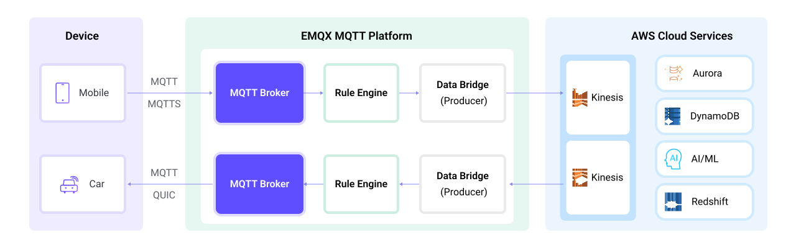

# Stream MQTT Data into Amazon Kinesis


::: tip
EMQX Enterprise Edition features. EMQX Enterprise Edition provides comprehensive coverage of key business scenarios, rich data integration, product-level reliability, and 24/7 global technical support. Experience the benefits of this [enterprise-ready MQTT messaging platform](https://www.emqx.com/en/try?product=enterprise) today.
:::


[AWS Kinesis](https://aws.amazon.com/cn/kinesis/) is a fully managed real-time streaming data processing service on AWS that facilitates easy collection, processing, and analysis of streaming data. It can economically and efficiently handle streaming data of any scale in real-time and offers high flexibility, capable of low-latency processing of any amount of streaming data from hundreds of thousands of sources.

EMQX supports seamless integration with [Amazon Kinesis Data Streams](https://aws.amazon.com/kinesis/data-streams/), enabling the connection of massive IoT devices for real-time message collection and transmission. Through a data bridge, it connects to Amazon Kinesis Data Streams for real-time data analysis and complex stream processing.

This page provides a comprehensive introduction to the data integration between EMQX and Amazon Kinesis with practical instructions on creating and validating the data integration.

## How It Works

Amazon Kinesis data bridge is an out-of-the-box feature of EMQX designed to help users seamlessly integrate MQTT data streams with Amazon Kinesis and leverage its rich services and capabilities for IoT application development.



EMQX forwards MQTT data to Amazon Kinesis through the rule engine and data bridge. The complete process is as follows:

1. **IoT Devices Publish Messages**: Devices publish telemetry and status data through specific topics, triggering the rule engine.
2. **Rule Engine Processes Messages**: Using the built-in rule engine, MQTT messages from specific sources are processed based on topic matching. The rule engine matches corresponding rules and processes messages, such as converting data formats, filtering specific information, or enriching messages with contextual information.
3. **Bridging to Amazon Kinesis**: The action triggered by rules to forward messages to Amazon Kinesis allows for custom configuration of partition keys, the data stream to write to, and message format, enabling flexible data integration.

After MQTT message data is written to Amazon Kinesis, you can perform flexible application development, such as:

- Real-time Data Processing and Analysis: Utilize powerful Amazon Kinesis data processing and analysis tools and its own streaming capabilities to perform real-time processing and analysis of message data, obtaining valuable insights and decision support.
- Event-Driven Functionality: Trigger Amazon event handling to achieve dynamic and flexible function triggering and processing.
- Data Storage and Sharing: Transmit message data to Amazon Kinesis storage services for secure storage and management of large volumes of data. This allows you to share and analyze this data with other Amazon services to meet various business needs.

## Features and Benefits

The data integration between EMQX and AWS Kinesis Data Streams can bring the following functionalities and advantages to your business:

- **Reliable Data Transmission and Sequence Guarantee**: Both EMQX and AWS Kinesis Data Streams provide reliable data transmission mechanisms. EMQX ensures the reliable transmission of messages through the MQTT protocol, while AWS Kinesis Data Streams uses partitions and sequence numbers to guarantee message ordering. Together, they ensure that messages sent from devices accurately reach their destination and are processed in the correct order.
- **Real-time Data Processing**: High-frequency data from devices can undergo preliminary real-time processing through EMQX's rule SQL, effortlessly filtering, extracting, enriching, and transforming MQTT messages. After sending data to AWS Kinesis Data Streams, further real-time analysis can be implemented by combining AWS Lambda and AWS-managed Apache Flink.
- **Elastic Scalability Support**: EMQX can easily connect millions of IoT devices and offers elastic scalability. AWS Kinesis Data Streams, on the other hand, employs on-demand automatic resource allocation and expansion. Applications built with both can scale with connection and data sizes, continuously meeting the growing needs of the business.
- **Persistent Data Storage**: AWS Kinesis Data Streams provides persistent data storage capabilities, reliably saving millions of incoming device data streams per second. It allows for the retrieval of historical data when needed and facilitates offline analysis and processing.

Utilizing AWS Kinesis Data Streams to build a streaming data pipeline significantly reduces the difficulty of integrating EMQX with the AWS platform, providing users with richer and more flexible data processing solutions. This can help EMQX users to build functionally complete and high-performance data-driven applications on AWS.

## Before You Start

This section describes the preparations you need to complete before you start to create an Amazon Kinesis data bridge, including how to set up the Kinesis service and emulate data streams service.

### Prerequisites

- Knowledge about EMQX data integration [rules](./rules.md)
- Knowledge about [data bridges](./data-bridges.md)

### Create Stream in Amazon Kinesis Data Streams

Follow the steps below to create a Stream via the AWS Management Console (see [this tutorial](https://docs.aws.amazon.com/streams/latest/dev/how-do-i-create-a-stream.html) for more details).

1. Sign in to the AWS Management Console and open the [Kinesis console](https://console.aws.amazon.com/kinesis).

2. In the navigation bar, expand the Region selector and choose a Region.

3. Choose **Create data stream**.

4. On the **Create Kinesis stream** page, enter a name for your data stream and then choose the **On-demand** capacity mode.

### Emulate Amazon Kinesis Data Streams locally

To facilitate the development and test, you can emulate the Amazon Kinesis Data Streams service locally via [LocalStack](https://localstack.cloud/). With LocalStack, you can run your AWS applications entirely on your local machine without connecting to a remote cloud provider.

1. Install and run it using a Docker Image:

   ```bash
   # To start the LocalStack docker image locally
   docker run --name localstack -p '4566:4566' -e 'KINESIS_LATENCY=0' -d localstack/localstack:2.1
   
   # Access the container
   docker exec -it localstack bash
   ```

2. Create a stream named **my_stream** with only one shard:

   ```bash
   awslocal kinesis create-stream --stream-name "my_stream" --shard-count 1
   ```

## Create a Kinesis Data Bridge

1. Go to EMQX Dashboard, click **Integration** -> **Connector**.
2. Click **Create** on the top right corner of the page.
3. In the **Create Connector** page, click to select **Amazon Kinesis**, and then click **Next**.
4. Enter a name for the data bridge. The name should be a combination of upper/lower case letters and numbers.
5. Enter the connection information:

   - **AWS Access Key ID**: Enter the [Access key ID](https://docs.aws.amazon.com/powershell/latest/userguide/pstools-appendix-sign-up.html). If using [LocalStack](#emulate-amazon-kinesis-data-streams-locally), enter any value.
   - **AWS Secret Access Key**: Enter the [secret access key](https://docs.aws.amazon.com/powershell/latest/userguide/pstools-appendix-sign-up.html). If using [LocalStack](#emulate-amazon-kinesis-data-streams-locally), enter any value.
   - **Amazon Kinesis Endpoint**: Enter the [Endpoint](https://docs.aws.amazon.com/general/latest/gr/ak.html) for the Kinesis service. If using [LocalStack](#emulate-amazon-kinesis-data-streams-locally), input `http://localhost:4566`.
   - **Amazon Kinesis Stream**: Enter the stream name you created in [Create Stream in Amazon Kinesis Data Streams](#create-stream-in-amazon-kinesis-data-streams).
   - **Partition Key**: Enter the Partition Key that shall be associated with records that are sent to this stream. Placeholders of the form `${variable_name}` are allowed (see next step for example on placeholders).
6. In the **Payload Template** field, leave it blank or define a template.

      -  If left blank, it will encode all visible inputs from the MQTT message using JSON format, such as clientid, topic, payload, etc.

      - If using the defined template, placeholders of the form `${variable_name}` will be filled with the corresponding value from the MQTT context. For example, `${topic}` will be replaced with `my/topic` if such is the MQTT message topic.


11. Advanced settings (optional): Choose whether to use buffer queue and batch mode as needed. For details, see [Data Integration](./data-bridges.md).

11. Before clicking **Create**, you can click **Test Connectivity** to test that the bridge can connect to the Amazon Kinesis server.

12. Click **Create** to finish the creation of the data bridge.

    A confirmation dialog will appear and ask if you like to create a rule using this data bridge, you can click **Create Rule** to continue creating rules to specify the data to be saved into Amazon Kinesis. You can also create rules by following the steps in [Create Rules for Amazon Kinesis Data Bridge](#create-a-rule-for-amazon-kinesis-data-bridge).

## Create a Rule for Amazon Kinesis Data Bridge

You can continue to create rules to specify the data to be saved into Amazon Kinesis.

1. Go to EMQX Dashboard, click **Integration** -> **Rules**.

2. Click **Create** on the top right corner of the page.

3. Input `my_rule` as the rule ID.

3. Set the rules in the **SQL Editor**. If you want to save the MQTT messages under topic `t/#` to Amazon Kinesis Data Streams, you can use the SQL syntax below.

   Note: If you want to specify your own SQL syntax, make sure that the `SELECT` part includes all fields required by the payload template in the data bridge.

   ```sql
   SELECT
     *
   FROM
     "t/#"
   ```

5. Click the **Add Action** button, select **Forwarding with Data Bridge** from the dropdown list, and then select the data bridge you just created under **Data Bridge**. Then click the **Add** button.

4. Click **Create** at the page bottom to finish the creation.

Now a rule to forward data to Amazon Kinesis Data Streams via the Amazon Kinesis bridge is created. You can click **Integration** -> **Flow Designer** to view the topology. It can be seen that the messages under topic `t/#` are sent and saved to Amazon Kinesis Data Streams after parsing by rule `my_rule`.

## Test Rule

1. Use MQTTX to send messages on the topic `t/my_topic`.

   ```bash
   mqttx pub -i emqx_c -t t/my_topic -m '{ "msg": "hello Amazon Kinesis" }'
   ```

2. Check the running status of the data bridge, there should be one new incoming and one new outgoing message.

3. Go to [Amazon Kinesis Data Viewer](https://docs.aws.amazon.com/streams/latest/dev/data-viewer.html). You should see the message when getting records.

### Use LocalStack to Check

If you use LocalStack, follow the steps below to check the received data.

1. Use the following command to get the *ShardIterator* before sending the message to the bridge.
   
   ```bash
   awslocal kinesis get-shard-iterator --stream-name my_stream --shard-id shardId-000000000000 --shard-iterator-type LATEST
   {
   "ShardIterator": "AAAAAAAAAAG3YjBK9sp0uSIFGTPIYBI17bJ1RsqX4uJmRllBAZmFRnjq1kPLrgcyn7RVigmH+WsGciWpImxjXYLJhmqI2QO/DrlLfp6d1IyJFixg1s+MhtKoM6IOH0Tb2CPW9NwPYoT809x03n1zL8HbkXg7hpZjWXPmsEvkXjn4UCBf5dBerq7NLKS3RtAmOiXVN6skPpk="
   }
   ```
   
2. Use MQTTX to send messages on the topic `t/my_topic`.

   ```bash
   mqttx pub -i emqx_c -t t/my_topic -m '{ "msg": "hello Amazon Kinesis" }'
   ```

3. Read the records and decode the received data.
   ```bash
   awslocal kinesis get-records --shard-iterator="AAAAAAAAAAG3YjBK9sp0uSIFGTPIYBI17bJ1RsqX4uJmRllBAZmFRnjq1kPLrgcyn7RVigmH+WsGciWpImxjXYLJhmqI2QO/DrlLfp6d1IyJFixg1s+MhtKoM6IOH0Tb2CPW9NwPYoT809x03n1zL8HbkXg7hpZjWXPmsEvkXjn4UCBf5dBerq7NLKS3RtAmOiXVN6skPpk="
   {
       "Records": [
           {
               "SequenceNumber": "49642650476690467334495639799144299020426020544120356866",
               "ApproximateArrivalTimestamp": 1689389148.261,
               "Data": "eyAibXNnIjogImhlbGxvIEFtYXpvbiBLaW5lc2lzIiB9",
               "PartitionKey": "key",
               "EncryptionType": "NONE"
           }
       ],
       "NextShardIterator": "AAAAAAAAAAFj5M3+6XUECflJAlkoSNHV/LBciTYY9If2z1iP+egC/PtdVI2t1HCf3L0S6efAxb01UtvI+3ZSh6BO02+L0BxP5ssB6ONBPfFgqvUIjbfu0GOmzUaPiHTqS8nNjoBtqk0fkYFDOiATdCCnMSqZDVqvARng5oiObgigmxq8InciH+xry2vce1dF9+RRFkKLBc0=",
       "MillisBehindLatest": 0
   }
   
   echo 'eyAibXNnIjogImhlbGxvIEFtYXpvbiBLaW5lc2lzIiB9' | base64 -d
   { "msg": "hello Amazon Kinesis" }
   ```
