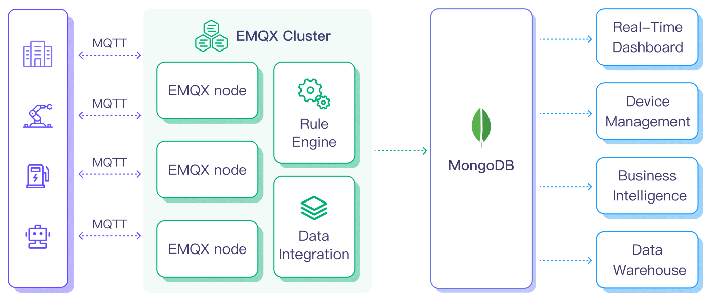

# Ingest MQTT Data into MongoDB


:::tip
EMQX Enterprise Edition features. EMQX Enterprise Edition provides comprehensive coverage of key business scenarios, rich data integration, product-level reliability, and 24/7 global technical support. Experience the benefits of this [enterprise-ready MQTT messaging platform](https://www.emqx.com/en/try?product=enterprise) today.
:::


[MongoDB](https://www.mongodb.com/), a leading NoSQL database, is renowned for its flexibility in schema design, scalability, and capacity to store large volumes of structured and semi-structured data. By integrating EMQX with MongoDB, users can efficiently ingest MQTT messages and client events directly into MongoDB. This facilitates long-term series data storage and advanced querying capabilities within MongoDB. The integration ensures a single-directional flow, where MQTT messages from EMQX are written into the MongoDB database. This powerful combination is a solid foundation for businesses looking to manage their IoT data effectively.

This page provides a comprehensive introduction to the data integration between EMQX and MongoDB with practical instructions on creating and validating the data integration.

## How It Works

MongoDB data integration is an out-of-the-box feature in EMQX designed to bridge the gap between MQTT-based IoT data and MongoDB's powerful data storage capabilities. With a built-in [rule engine](./rules.md) component, the integration simplifies the process of ingesting data from EMQX to MongoDB for storage and management, eliminating the need for complex coding.

The diagram below illustrates a typical architecture of data integration between EMQX and MongoDB. 



Ingesting MQTT data into MongoDB works as follows:

1. **Message publication and reception**: IoT devices, whether they are part of connected vehicles, IIoT systems, or energy management platforms, establish successful connections to EMQX through the MQTT protocol and publish MQTT messages to specific topics. When EMQX receives these messages, it initiates the matching process within its rules engine.
2. **Message data processing:** When a message arrives, it passes through the rule engine and is then processed by the rule defined in EMQX. The rules, based on predefined criteria, determine which messages need to be routed to MongoDB. If any rules specify payload transformations, those transformations are applied, such as converting data formats, filtering out specific information, or enriching the payload with additional context.
3. **Data ingestion into MongoDB**: Once the rule engine identifies a message for MongoDB storage, it triggers an action of forwarding the messages to MongoDB. Processed data will be seamlessly written into the collection of the MongoDB database.
4. **Data storage and utilization**: With the data now stored in MongoDB, businesses can harness its querying power for various use cases. For instance, in the realm of connected vehicles, this stored data can inform fleet management systems about vehicle health, optimize route planning based on real-time metrics, or track assets. Similarly, in IIoT settings, the data might be used to monitor machinery health, forecast maintenance, or optimize production schedules.

By using this integrated system, businesses in sectors like power and energy can continuously monitor grid health, forecast demand, or identify potential outages before they happen. The value derived from the real-time and historical data not only ensures operational efficiency but can also lead to significant cost savings and enhanced customer experiences.

## Features and Benefits

The data integration with MongoDB offers a range of features and benefits tailored to ensure effective data handling and storage:



- **Streamlined IoT Data Management**

  You can ingest, store, process, and analyze your IoT data all in one place, eliminating the need for complicated integrations and tedious data migrations. Say goodbye to data silos and hello to a unified view of your IoT data.

- **Real-time Data Processing**

  EMQX is built for handling real-time data streams, ensuring efficient and reliable data transmission from source systems to MongoDB. It enables organizations to capture and analyze data in real-time, making it ideal for use cases requiring immediate insights and actions.

- **Flexible MongoDB Connection Options**

  Whether you operate with a single MongoDB instance or leverage the robustness of a replica set, the data integration offers native support to connect with both configurations, providing businesses with the flexibility to adapt as per their infrastructure needs.

- **High Performance and Scalability**

  EMQX's distributed architecture and MongoDB's columnar storage format enable seamless scalability as data volumes increase. This ensures consistent performance and responsiveness, even with large datasets. As your IoT deployments grow, your data storage capabilities can scale with ease.

- **Flexible Data Transformation**

  EMQX provides a powerful SQL-based Rule Engine, allowing organizations to pre-process data before storing it in MongoDB. It supports various data transformation mechanisms, such as filtering, routing, aggregation, and enrichment, enabling organizations to shape the data according to their needs.

- **NoSQL**

  MongoDB's schema-less architecture ensures that diverse MQTT message structures can be easily stored without the need for rigid schemas, accommodating the dynamic nature of IoT data.

- **Reliable Data Storage**

  Once the EMQX rule engine processes and routes the message, it is stored in MongoDB with the platform's proven reliability, ensuring data integrity and consistent availability.

- **Operational Metrics and Advanced Analytics**

  Glean insights from metrics such as the total message count, egress traffic rate, and more. These metrics, combined with MongoDB's powerful querying, can be utilized to monitor, analyze, and optimize the data flow, empowering users to gain valuable insights from IoT data, enabling predictive analytics, anomaly detection, and more.

- **Latest MongoDB Version Support**

  The data integration is compatible with and supports the latest versions of MongoDB, ensuring users benefit from the newest features, optimizations, and security updates offered by the database platform.





- **Streamlined IoT Data Management**

  You can ingest, store, process, and analyze your IoT data all in one place, eliminating the need for complicated integrations and tedious data migrations. Say goodbye to data silos and hello to a unified view of your IoT data.
  
- **Real-time Data Processing**

  EMQX is built for handling real-time data streams, ensuring efficient and reliable data transmission from source systems to MongoDB. It enables organizations to capture and analyze data in real-time, making it ideal for use cases requiring immediate insights and actions.

- **Flexible MongoDB Connection Options**

  Whether you operate with a single MongoDB instance or leverage the robustness of a replica set, the data integration offers native support to connect with both configurations, providing businesses with the flexibility to adapt as per their infrastructure needs.

- **High Performance and Scalability**

  EMQX's distributed architecture and MongoDB's columnar storage format enable seamless scalability as data volumes increase. This ensures consistent performance and responsiveness, even with large datasets. As your IoT deployments grow, your data storage capabilities can scale with ease.

- **Flexible Data Transformation**

  EMQX provides a powerful SQL-based Rule Engine, allowing organizations to pre-process data before storing it in MongoDB. It supports various data transformation mechanisms, such as filtering, routing, aggregation, and enrichment, enabling organizations to shape the data according to their needs.

- **NoSQL**

  MongoDB's schema-less architecture ensures that diverse MQTT message structures can be easily stored without the need for rigid schemas, accommodating the dynamic nature of IoT data.

- **Reliable Data Storage**

  Once the EMQX rule engine processes and routes the message, it is stored in MongoDB with the platform's proven reliability, ensuring data integrity and consistent availability.

- **Operational Metrics and Advanced Analytics**

  Glean insights from metrics such as the total message count, egress traffic rate, and more. These metrics, combined with MongoDB's powerful querying, can be utilized to monitor, analyze, and optimize the data flow, empowering users to gain valuable insights from IoT data, enabling predictive analytics, anomaly detection, and more.

- **Latest MongoDB Version Support**

  The data integration is compatible with and supports the latest versions of MongoDB, ensuring users benefit from the newest features, optimizations, and security updates offered by the database platform.

- **Cost-Effective**

  EMQX and MongoDB are both open-source solutions, meaning they are cost-effective compared to proprietary solutions. This can help reduce the total cost of ownership and improve the return on investment for IoT projects.



This MongoDB data integration fortifies your IoT infrastructure, ensuring that vast amounts of data generated by your devices are not just stored but are also ready for future querying and analysis. The ease of setup and operational excellence it brings can greatly enhance the efficiency and reliability of your IoT systems.

## Before You Start

This section describes the preparations you need to complete before you start to create the MongoDB data integration in EMQX Dashboard.

### Prerequisites

- Knowledge about EMQX data integration [rules](./rules.md)
- Knowledge about [data integration](./data-bridges.md)
- Knowledge about [MongoDB](https://www.mongodb.com/)

### Set Up MongoDB Server

You can use the following commands to install MongoDB via Docker, run the docker image, and create a user.

```bash
#  To start the MongoDB docker image and set the password as public
docker run -d --name mongodb -p 27017:27017 mongo

# Access the container
docker exec -it mongodb bash

# Locate the MongoDB server in the container
mongo

# Create a user
use admin
db.createUser({ user: "admin", pwd: "public", roles: [ { role: "root", db: "admin" } ] })

```

### Create a Database

You can use the following command to create a database and collection in MongoDB.

```bash
# Create database emqx_data
use emqx_data

# create collection emqx_messages
db.createCollection('emqx_messages')
```

## Create a Connector

This section demonstrates how to create a Connector to connect the MongoDB Sink to the MongoDB Server.

The following steps assume that you run both EMQX and MongoDB on the local machine. If your MongDB is deployed elsewhere, adjust the settings accordingly.

1. Enter the EMQX Dashboard and click **Integration** -> **Connectors**.
2. Click **Create** in the top right corner of the page.
3. On the **Create Connector** page, select **MongoDB** and then click **Next**.
4. Enter a name for the Connector. The name should be a combination of upper/lower case letters and numbers, for example, `my_mongodb`.
5. Configure the MongoDB server connection information. Fill in the required fields (marked with an asterisk).

   - **MongoDB Mode**: Select the type of MongoDB deployment you are connecting to based on your actual deployment mode. In this demonstration, you can select `single` for example.
     - `single`: a single standalone MongoDB instance.
     - `rs`: Replica Set, a group of `mongod` processes that maintain the same data set.
     - `sharded`: a sharded cluster in MongoDB.
   - **Server Host**: Enter `127.0.0.1:27017`, or the actual URL if the MongoDB server is running remotely.
   - **Database Name**: Enter `emqx_data`.
   - **Username**: Enter `admin`.
   - **Password**: Enter `public`.
   - **Srv Record**: Disabled by default. Once enabled, it allows EMQX to use DNS SRV records to discover the MongoDB hosts it should connect to, which makes it easier to connect to replica sets or sharded clusters without having to specify each host in the connection string. 
   - Configure the other options according to your business needs.
   - If you want to establish an encrypted connection, click the **Enable TLS** toggle switch. For more information about TLS connection, see [TLS for External Resource Access](../network/overview.md/#tls-for-external-resource-access).

6. Advanced settings (optional):  For details, see [Advanced Configurations](#advanced-configurations).
7. Before clicking **Create**, you can click **Test Connectivity** to test if the Connector can connect to the MongoDB server.
8. Click the **Create** button at the bottom to complete the creation of the Connector. In the pop-up dialog, you can click **Back to Connector List** or click **Create Rule** to continue creating rules and Sink to specify the data to be forwarded to MongoDB. For detailed steps, see [Create a Rule and MongoDB Sink](#create-a-rule-and-mongodb-sink).

## Create a Rule with MongoDB Sink

This section demonstrates how to create a rule in the Dashboard for processing messages from the source MQTT topic `t/#`, and saving the processed data to MongoDB via a configured Sink. 

1. Go to EMQX Dashboard, and click **Integration** -> **Rules**.

2. Click **Create** on the top right corner of the page.

3. Enter `my_rule` as the rule ID, and set the rules in the **SQL Editor**. If you want to save the MQTT messages under topic `t/#`  to MongoDB, you can use the SQL syntax below. 

   Note: If you want to specify your own SQL syntax, ensure you have included all fields required by the Sink in the `SELECT` part.

   ```sql
   SELECT
     *
   FROM
     "t/#"
   ```

   For example, you can use the SQL syntax below to save `timestamp` as data type and the `payload`  in JSON as JSON strings:

   ```sql
   SELECT
     *,
     mongo_date(timestamp) as timestamp,
     json_encode(payload) as payload
   FROM
     "t/#"
   ```

   Note: If you are a beginner user, click **SQL Examples** and **Enable Test** to learn and test the SQL rule. 

4. Click the + **Add Action** button to define an action that will be triggered by the rule. With this action, EMQX sends the data processed by the rule to MongoDB.

5. Select `MongoDB` from the **Type of Action** dropdown list. Keep the **Action** dropdown with the default `Create Action` value. You can also select a Sink if you have created one. This demonstration will create a new Sink.

6. Enter a name for the Sink. The name should combine upper/lower case letters and numbers.

7. Select the Connector `my_mongodb` from the **Connector** dropdown box. You can also create a new Connector by clicking the button next to the dropdown box. For the configuration parameters, see [Create a Connector](#create-a-connector).

8. In the **Collection** field, enter the collection where the data will be stored. It supports dynamic setting through the placeholder `${var_name}`. In this example, enter `emqx_messages`.

9. Configure the **Payload template** to save `clientid`, `topic`, `qos`,  `timestamp`, and `payload` to MongoDB. This template will be executed via the MongoDB insert command, and the sample code is as follows:

   ```json
   {
     "clientid": "${clientid}",
     "topic": "${topic}",
     "qos": ${qos},
     "timestamp": ${timestamp},
     "payload": ${payload}
   }
   ```

   When configuring the payload template, pay attention to the following:

   - All `keys` need to be wrapped in double quotes `"`;
   - Auto-derivation of the data type of "value" is not supported:
     - Characters need to be wrapped with `"`, otherwise, an error will be reported;
     - Values do not need to be wrapped, otherwise, they will be recognized as characters;
     - For timestamp, date, and time types, if no special treatment is performed, they will be recognized as numeric or character types. To store them as date or time, use the `mongo_date` function in the rule SQL to process the fields. For details, see [Time and date functions](./rule-sql-builtin-functions.md#time-and-date-functions). 

   - Nested objects are allowed when the value is a JSON object:
     - It is not allowed to use `"` to nest the value in the template, otherwise, it will cause an execution error;
     - Objects will be nested and stored according to their own structure;

   - To store objects as JSON characters, use the `json_encode` function in rule SQL for the conversion, and the corresponding **value** in the template is still not allowed to be wrapped with `"`. 

10. Advanced settings (optional):  For details, see [Advanced Configurations](#advanced-configurations).

11. Before clicking **Create**, you can click **Test Connectivity** to test that the Sink can be connected to the MongoDB server.

12. Click the **Create** button to complete the Sink configuration. A new Sink will be added to the **Action Outputs.**

13. Back on the **Create Rule** page, verify the configured information. Click the **Create** button to generate the rule. 

Now you have successfully created the rule and you can see the new rule appear on the **Rule** page. Click the **Actions(Sink)** tab, you can see the new MongoDB Sink.

You can also click **Integration** -> **Flow Designer** to view the topology and you can see that the messages under topic `t/#` are sent and saved to MongoDB after parsing by rule `my_rule`.

## Test the Rule

To test if the rule and Sink work as you expected, you can use the [MQTTX](https://mqttx.app/) to simulate a client to publish MQTT messages to EMQX.

1. Use MQTTX  to send a message to topic  `t/1`:

   ```bash
   mqttx pub -i emqx_c -t t/1 -m '{ "msg": "hello MongoDB" }'
   ```

2. Check the running status of the Sink, there should be one new **Matched** and one new **Sent Successfully** message.

3. Check whether the message is written into collection `emqx_messages`:

   ```
   > db.emqx_messages.find().pretty()
   {
       "_id" : ObjectId("63db7059df489d01ed000009"),
       "clientid" : "emqx_c",
       "payload" : {
         "msg" : "hello MongoDB"
       },
       "qos" : 0,
       "timestamp" : NumberLong("1675325529070"),
       "topic" : "t/1"
   }
   ```

   If you use the second SQL syntax in rule configuration, the returned information should be: 

   ```
   > db.emqx_messages.find().pretty()
   {
       "_id" : ObjectId("63db7535df489d01ed000013"),
       "clientid" : "emqx_c",
       "payload" : "{ \"msg\": \"hello MongoDB\" }",
       "qos" : 0,
       "timestamp" : ISODate("2023-02-02T08:33:36.715Z"),
       "topic" : "t/1"
   }
   ```

## Advanced Configurations

This section delves deeper into the advanced configuration options available for the EMQX MongoDB Connector and Sink. When configuring the Connector and Sink, navigate to **Advanced Settings** to tailor the following parameters to meet your specific needs.

| **Fields**                   | **Descriptions**                                                                                                                                                                                                                                                                                                                                                            | **Recommended Value** |
|------------------------------|-----------------------------------------------------------------------------------------------------------------------------------------------------------------------------------------------------------------------------------------------------------------------------------------------------------------------------------------------------------------------------|-----------------------|
| **Connect Timeout**          | The time duration EMQX will wait while attempting to establish a connection to MongoDB before timing out.                                                                                                                                                                                                                                                                   | 30s                   |
| **Socket Timeout**           | This determines how long EMQX will wait while trying to send or receive data on a socket connection with MongoDB before it times out.                                                                                                                                                                                                                                       | 30s                   |
| **Max Overflow Workers**     | Specifies the additional number of workers that can be created when all existing workers are occupied. This setting is crucial in times of workload surges to permit more concurrent connections to MongoDB.                                                                                                                                                                | 0                     |
| **Wait Queue Timeout**       | The maximum duration a worker can remain idle while waiting for a connection to MongoDB to become available.                                                                                                                                                                                                                                                                | 10s                   |
| **Heartbeat Period**         | Defines the interval at which the driver checks the state of the MongoDB deployment. This specifies the time between consecutive checks, effectively controlling the frequency of these heartbeat signals to ensure MongoDB's operational status.                                                                                                                           | 200s                  |
| **Minimum Heartbeat Period** | Sets the shortest time interval allowed between heartbeats, ensuring that the driver doesn't check the MongoDB state too frequently. This is vital for avoiding unnecessary loads and ensuring efficient communication between EMQX and MongoDB.                                                                                                                            | 200s                  |
| **Use Legacy Protocol**      | Determines if MongoDB's legacy communication protocol should be used. MongoDB introduced a new wire protocol in version 3.6, with the legacy protocol retained for backward compatibility. This setting can be set to true, false, or auto. In "auto" mode (default option), EMQX will automatically determine which protocol to use based on the detected MongoDB version. | auto                  |


## More Information

Check out the following links to learn more:

**Blogs**:

[MQTT and MongoDB: Crafting Seamless Synergy for IoT Data Mangement](https://www.emqx.com/en/blog/mqtt-and-mongodb-crafting-seamless-synergy-for-iot-data-mangement)

**Reports**:

[MQTT Performance Benchmark Testing: EMQX-MongoDB Integration](https://www.emqx.com/en/blog/mqtt-performance-benchmark-testing-emqx-mongodb-integration)

**Videos:**

https://www.youtube.com/watch?v=c2M-rlkkT5o
