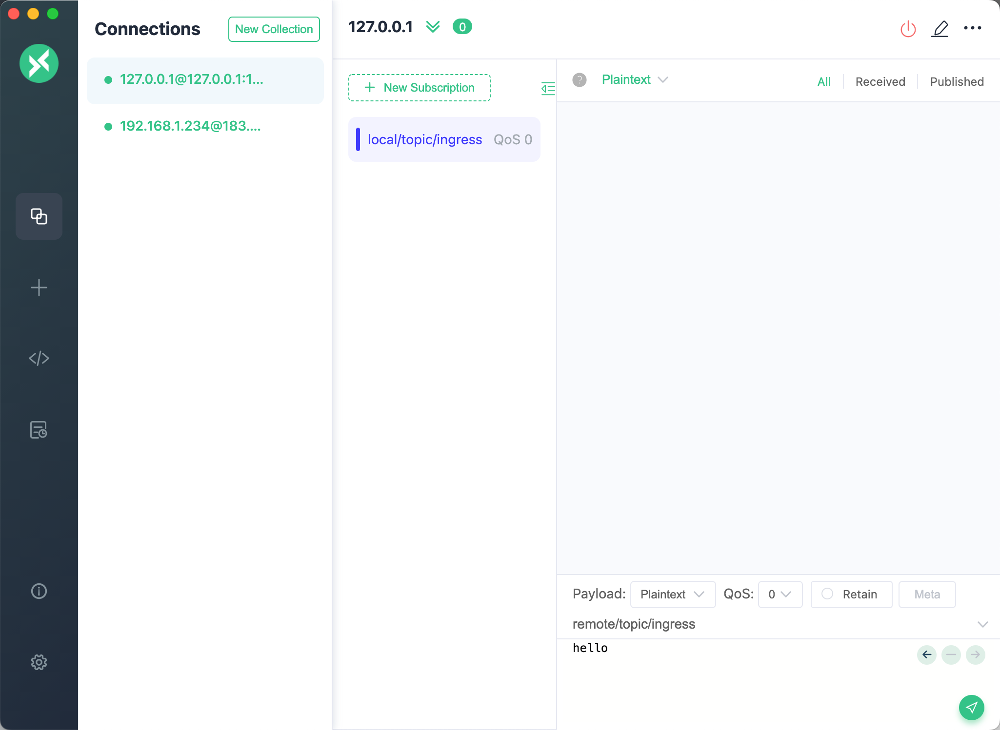
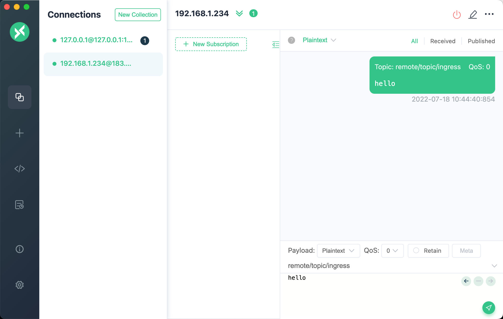
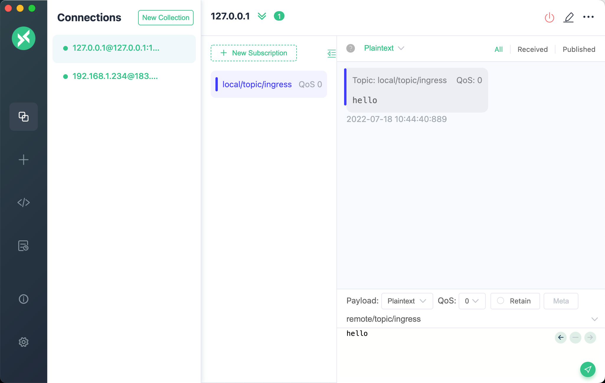
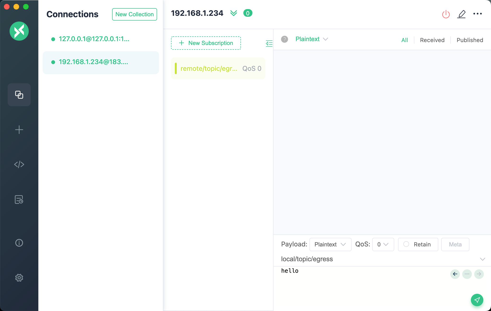
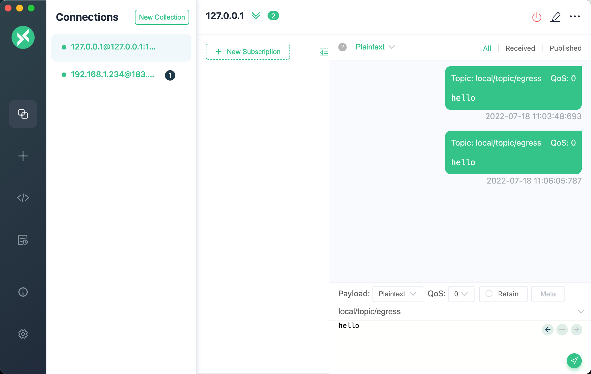
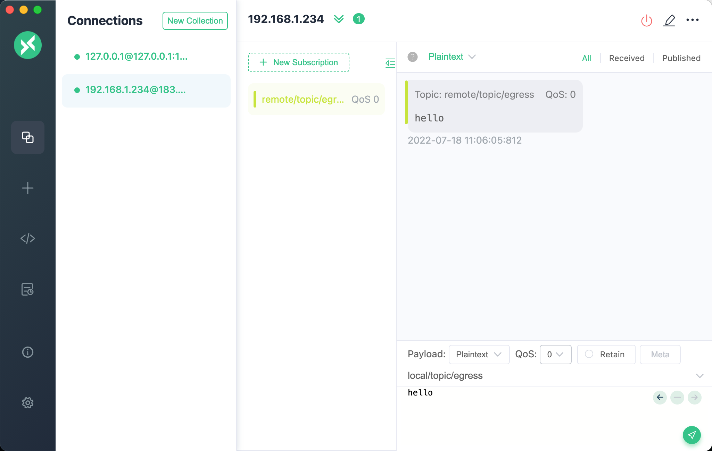

# MQTT Bridge

The MQTT bridge is a channel for EMQX to communicate with other MQTT services, either EMQX or other services that support the MQTT protocol. The MQTT bridge can either subscribe from external services or publish messages to external services. However, it only supports a one-way mode of operation. Can only be a producer, or a consumer. If a bidirectional bridge is required, multiple MQTT bridges with different directions need to be created to complete the bidirectional flow of data.

## Create MQTT bridge using the configuration file

### List of `ingress` type MQTT Bridge configurations

Bridges messages from external services to local.

| Parameter Name | Description | Type | Required | Range |
| -- | -- | -- | -- | -- |
| enable | Enable or disable | Boolean |  yes | - |
| direction  | Bridging direction. </br>`ingress` means subscribe messages from external service, publish to local</br>`egress` means publish messages from local to external service | String | yes | ingress |
| remote_topic | The topic of subscribed external services | String | yes |  - |
| remote_qos | The QoS of subscribed external services | Integer |  yes | 0 \| 1 \| 2 |
| local_topic | The topic published of local server | String | yes | - |
| local_qos | The QoS published of local server | Integer |  yes | 0 \| 1 \| 2 |
| retain | The Retain flag published of local server | Boolean |  yes | - |
| payload | The payload published of local server | String |  yes | - |
| connector | MQTT connector | connector() |  yes | MQTT Connecter configurations |

### List of `egress` type MQTT Bridge configurations

Bridges local messages to external services.

| Parameter Name | Description | Type | Required | Range |
| -- | -- | -- | -- | -- |
| enable       | Enable or disable | Boolean |  yes | - |
| direction    | Bridging direction. </br>`ingress` means subscribe messages from external service, publish to local</br>`egress` means publish messages from local to external service | String | yes | ingress |
| remote_topic | The topic published to external service        | String      | yes | -           |
| remote_qos   | The QoS published to external service          | Integer     | yes | 0 \| 1 \| 2 |
| retain       | The Retain flag published to external service  | Boolean     | yes | -           |
| payload      | The Payload flag published to external service | String      | yes | -           |
| local_topic  | Local Topic for getting data                   | String      | yes | -           |
| connector    | MQTT Connector                                 | connector() | yes | MQTT Connecter configurations |

### MQTT Connecter configurations

Connector used for MQTT Bridges.

| Parameter Name | Description | Type | Required | Range |
| -- | -- | -- | -- | -- |
| server | External service address, ip:port | String | yes | [0-255].[0-255].[0-255].[0-255]:[0-65535] |
| mode | Connector Mode | String | no | cluster_shareload |
| reconnect_interval | Automatic reconnection interval | Integer | no | - |
| proto_ver | Protocol Version | String | no |  v3 \| v4 \| v5 |
| bridge_mode | Bridging mode, which works only when the external service is EMQX, improves the concurrent performance of subscriptions | Boolean | no | - |
| username | Username used for connection | String | no | - |
| password | Password used for connection | String | no | - |
| clean_start | The `clean_session` used for connection | Boolean | no | - |
| keepalive | Keepalive interval used for connection | Integer | no | - |
| retry_interval | Retry interval | Integer | no | - |
| max_inflight | Maximum number of message windows, `Receive Maximum` in the MQTT V5 protocol | Integer | no | - |
| replayq | Local message caching | replayq() | no | replayq configurations |
| ssl | Encrypted connection certificate configuration | ssl() | no | - |

### replayq configurations

| Parameter Name | Description | Type | Required | Range |
| -- | -- | -- | -- | -- |
| dir | Local cache file directory, set to `false` to turn off | String \| `false` | no | String \| false |
| seg_bytes | Local cache file size limit, when the limit is exceeded, a new file will be created to hold the new cached messages | String | no | - |
| offload | If offload mode is enabled, messages will be stored in memory first, and will be written to file only when the cached data exceeds the upper line set by `seg_bytes`. | Boolean | no | - |

### SSL configurations

Reference [SSL](../security/ssl.md)

## MQTT Bridge Usage

Pre-start an EMQX node as an external service for message bridging, which is used in this article for an EMQX node deployed on IP `192.168.1.234`. The `ingress` and `egress` bridging demos below use this node as the external service. The IP address of the local service is `127.0.0.1`.

Edit `emqx.conf` and add the bridges configuration, using the following `ingress` and `egress` configuration examples, which create two bridges, `mqtt_bridge_ingress` and `mqtt_bridge_egress`. Start the local EMQX.

```js
bridges {
  mqtt {
    mqtt_bridge_ingress {
      connector {
        bridge_mode = false
        clean_start = true
        keepalive = "60s"
        max_inflight = 32
        mode = "cluster_shareload"
        password = "pwd1"
        proto_ver = "v4"
        reconnect_interval = "10s"
        replayq {offload = false, seg_bytes = "100MB"}
        retry_interval = "1s"
        server = "192.168.1.234:1883"
        ssl {
          ciphers = ["TLS_AES_256_GCM_SHA384", "TLS_AES_128_GCM_SHA256"]
          depth = 10
          enable = false
          reuse_sessions = true
          secure_renegotiate = true
          user_lookup_fun = "emqx_tls_psk:lookup"
          verify = "verify_none"
          versions = ["tlsv1.3", "tlsv1.2", "tlsv1.1", "tlsv1"]
        }
        username = "user1"
      }
      direction = "ingress"
      enable = true
      local_topic = "local/topic/ingress"
      local_qos = 0
      remote_qos = 0
      remote_topic = "remote/topic/ingress"
      payload = "${payload}"
      retain = false
    }
    mqtt_bridge_egress {
      connector {
        bridge_mode = false
        clean_start = true
        keepalive = "60s"
        max_inflight = 32
        mode = "cluster_shareload"
        password = "emqx"
        proto_ver = "v4"
        reconnect_interval = "15s"
        replayq {offload = false, seg_bytes = "100MB"}
        retry_interval = "15s"
        server = "192.168.1.234:1883"
        ssl {
          ciphers = ["TLS_AES_256_GCM_SHA384", "TLS_AES_128_GCM_SHA256"]
          depth = 10
          enable = false
          reuse_sessions = true
          secure_renegotiate = true
          user_lookup_fun = "emqx_tls_psk:lookup"
          verify = "verify_none"
          versions = ["tlsv1.3", "tlsv1.2", "tlsv1.1", "tlsv1"]
        }
        username = "emqx"
      }
      direction = "egress"
      enable = true
      local_topic = "local/topic/egress"
      remote_qos = 0
      remote_topic = "remote/topic/egress"
      payload = "${payload}"
      retain = false
    }
  }
}
```

Open EMQX Dashboard and click `Data Integration` - `Data Bridges` on the right side to see the two bridges created.


::: tip
Note that the 5.0.0 Dashboard does not support detachment rules at this time, using the MQTT Bridge alone, which can only be created using the configuration file
:::

### The `ingress bridge` message flow

```txt
 +-------------------------+
 | Remote                  |          +--------+
 | EMQX Broker             |<---------| Client |
 |                         |          +--------+
 +-------------------------+
             |
             |
             V
  +----------------------+
  |  MQTT Bridge Ingress |
  +----------------------+
             |
             V
  +------------------------+
  | Local                  |          +--------+
  | EMQX Broker            |--------->| Client |
  |                        |          +--------+
  +------------------------+

```

Using the desktop MQTT client MQTTX, create two connections, one to the local and one to the external service. And subscribe to `local/topic/ingress` locally.



Publish a message to an external service with a Topic of `remote/topic/ingress`.



Check the local connection, the message has been bridged locally by the MQTT Bridge.



### The `egress bridge` message flow

```txt
 +-------------------------+
 | Remote                  |          +--------+
 | EMQX Broker             |--------->| Client |
 |                         |          +--------+
 +-------------------------+
             ^
             |
             |
  +----------------------+
  |  MQTT Bridge Ingress |
  +----------------------+
             ^
             |
  +------------------------+
  | Local                  |          +--------+
  | EMQX Broker            |<---------| Client |
  |                        |          +--------+
  +------------------------+

```

Using the desktop MQTT client MQTTX, create two connections, one to the local and one to the external service. And subscribe to `remote/topic/egress` on the external service.



Publish a message to the local service, using Topic `local/topic/egress`.



View the external service connection, the message has been bridged to the external service by the MQTT Bridge.


