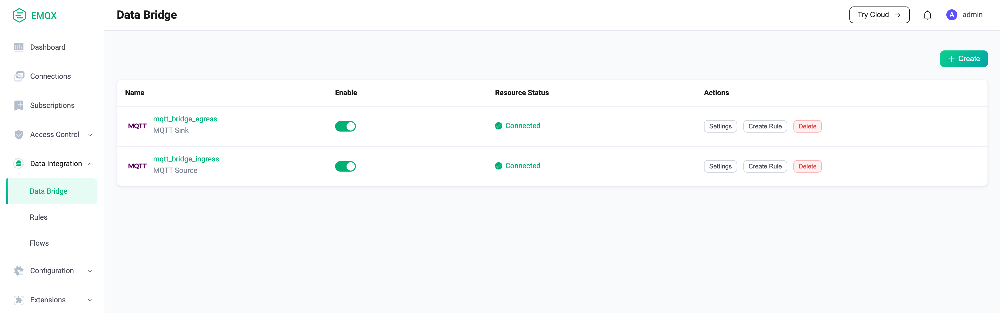
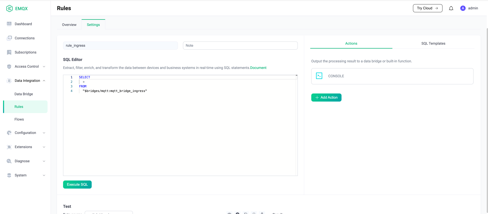
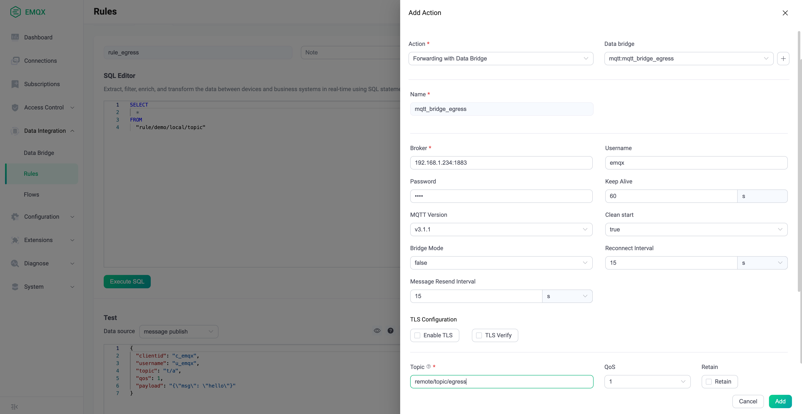

# MQTT

The MQTT bridge is a channel for EMQX to communicate with other MQTT services, either EMQX or other services that support the MQTT protocol. The MQTT bridge can either subscribe from the external services or publish messages to the external services. However, a single bridge only supports a one-way mode of operation: it can be either a producer or a consumer, but not both. If a bidirectional bridge is required, multiple MQTT bridges with different directions need to be created to complete the bidirectional flow of data.

## Create MQTT bridge using the configuration file

### List of `ingress` type MQTT Bridge configurations

Bridges messages from external services to local.

| Parameter Name | Description | Type | Required | Range |
| -- | -- | -- | -- | -- |
| enable       | Enable or disable | Boolean |  yes | - |
| direction    | Bridging direction. </br>`ingress` means subscribe messages from external service, publish to local</br>`egress` means publish messages from local to external service | String | yes | ingress |
| remote_topic | The topic of subscribed external services | String | yes |  - |
| remote_qos   | The QoS of subscribed external services | Integer |  yes | 0 \| 1 \| 2 |
| local_topic  | The topic published of local server. Support for placeholders in ${field} format       | String      | yes | - |
| local_qos    | The QoS published of local server. Support for placeholders in ${field} format         | Integer     | yes | 0 \| 1 \| 2 |
| retain       | The Retain flag published of local server. Support for placeholders in ${field} format | Boolean     | yes | - |
| payload      | The payload published of local server. Support for placeholders in ${field} format     | String      | yes | - |
| connector    | MQTT connector                                                                         | connector() | yes | MQTT Connecter configurations |

### List of `egress` type MQTT Bridge configurations

Bridges local messages to external services.

| Parameter Name | Description | Type | Required | Range |
| -- | -- | -- | -- | -- |
| enable       | Enable or disable | Boolean |  yes | - |
| direction    | Bridging direction. </br>`ingress` means subscribe messages from external service, publish to local</br>`egress` means publish messages from local to external service | String | yes | ingress |
| remote_topic | The topic published to external service. Support for placeholders in ${field} format        | String      | yes | -           |
| remote_qos   | The QoS published to external service. Support for placeholders in ${field} format          | Integer     | yes | 0 \| 1 \| 2 |
| retain       | The Retain flag published to external service. Support for placeholders in ${field} format  | Boolean     | yes | -           |
| payload      | The Payload flag published to external service. Support for placeholders in ${field} format | String      | yes | -           |
| local_topic  | Local Topic for getting data.                                                               | String      | yes | -           |
| connector    | MQTT Connector                                                                              | connector() | yes | MQTT Connecter configurations |

### MQTT Connector configurations

Connector used for MQTT Bridges.

| Parameter Name | Description | Type | Required | Range |
| -- | -- | -- | -- | -- |
| server             | External service address, ip:port or hostname:port                                                                      | String  | yes | [0-255].[0-255].[0-255].[0-255]:[0-65535] |
| mode               | cluster_shareload: Each node in the cluster establishes an MQTT connection to the remote Broker</br>cluster_singleton: Only one node in the entire cluster establishes an MQTT connection to the remote Broker | Enum  | no  | cluster_shareload \| cluster_singleton |
| reconnect_interval | Automatic reconnection interval                                                                                         | Integer | no  | - |
| proto_ver          | Protocol Version                                                                                                        | String  | no  |  v3 \| v4 \| v5 |
| bridge_mode        | Bridging mode, which works only when the external service is EMQX, improves the concurrent performance of subscriptions | Boolean | no  | - |
| username           | Username used for connection                                                                                            | String  | no  | - |
| password           | Password used for connection                                                                                            | String  | no  | - |
| clean_start        | The `clean_session` used for connection                                                                                 | Boolean | no  | - |
| keepalive          | Keepalive interval used for connection                                                                                  | Integer | no  | - |
| retry_interval     | Retry interval after failed QoS1/QoS2 message delivery                                                                  | Integer | no  | - |
| max_inflight       | Maximum number of message windows, `Receive Maximum` in the MQTT V5 protocol                                            | Integer | no  | - |
| ssl                | Encrypted connection certificate configuration                                                                          | ssl()   | no  | - |

### SSL configurations

Reference [SSL](../security/ssl.md)

## MQTT Bridge Usage

1. Prepare two EMQX nodes: local node and remote node. The local node uses local IP 127.0.0.1 and the remote node uses IP 192.168.1.234
2. Edit the configuration of the local node, open `emqx.conf`, and add the bridge configuration. The following configuration example creates the ingress bridge `mqtt_bridge_ingress` and the egress bridge `mqtt_bridge_egress`.
3. Start the two EMQX nodes. The local node is started using the console command, as the rule integration demo requires the console to observe the output.

```js
bridges {
  mqtt {
    mqtt_bridge_ingress {
      connector {
        bridge_mode = false
        clean_start = true
        keepalive = "60s"
        max_inflight = 32
        mode = "cluster_shareload"
        password = "pwd1"
        proto_ver = "v4"
        reconnect_interval = "10s"
        retry_interval = "1s"
        server = "192.168.1.234:1883"
        ssl {enable = false}
        username = "user1"
      }
      direction = "ingress"
      enable = true
      local_topic = "local/topic/ingress"
      local_qos = 0
      remote_qos = 0
      remote_topic = "remote/topic/ingress"
      payload = "${payload}"
      retain = false
    }
    mqtt_bridge_egress {
      connector {
        bridge_mode = false
        clean_start = true
        keepalive = "60s"
        max_inflight = 32
        mode = "cluster_shareload"
        username = "emqx"
        password = "emqx"
        proto_ver = "v4"
        reconnect_interval = "15s"
        retry_interval = "15s"
        server = "192.168.1.234:1883"
        ssl { enable = false }
      }
      direction = "egress"
      enable = true
      local_topic = "local/topic/egress"
      remote_qos = 0
      remote_topic = "remote/topic/egress"
      payload = "${payload}"
      retain = false
    }
  }
}
```

Open EMQX Dashboard and click `Data Integration` - `Data Bridges` on the right side to see the two bridges created.


::: tip
Note that the 5.0.0 Dashboard does not support detachment rules at this time, using the MQTT Bridge alone, which can only be created using the configuration file
:::

### The `ingress bridge` message flow

1. The ingress bridge will subscribe to the `remote/topic/ingress` topic on the remote node
2. Create two connections `Client A` to the remote node, `Client B` to the local node
3. `Client B` subscribes the topic `local/topic/ingress`
4. `Client A` publishes a message with topic `remote/topic/ingress`
5. The bridge client receives the subscription message and forwards the content to the local node using topic `local/topic/ingress`
6. `Client B` receives the subscription message

```txt
 +-------------------------+  Publish Message
 | Remote                  |  Topic remote/topic/ingress  +----------+
 | EMQX Broker         .---|<-----------------------------| Client A |
 |                     |   |                              +----------+
 |                     V   |
 +-------------------------+
        ^              |
        |              |
 Subscribe             | Send to subscriber
 Topic  |              |
 remote/topic/ingress  |
        |              |
        |              V
   +----------------------+
   |  MQTT Bridge Ingress |
   +----------------------+
                       |
                       | Publish to local broker
                       | Topic local/topic/ingress
                       |
                       V
 +------------------------+  Subscribe
 | Local               |  |  local/topic/ingress          +----------+
 | EMQX Broker         .->|------------------------------>| Client B |
 |                        |  Send to subscriber           +----------+
 +------------------------+

```

### The `egress bridge` message flow

1. `Client A` subscribes the topic `remote/topic/egress` on the remote node
2. `Client B` publishes a message with topic `local/topic/egress` on the local node
3. The bridge gets the message data and forwards it to the topic `remote/topic/egress` on the remote node
4. `Client A` receives the message from the bridge

```txt
 +-------------------------+  Subscribe
 | Remote                  |  remote/topic/egress          +----------+
 | EMQX Broker      .----->|------------------------------>| Client A |
 |                  |      |  Send to subscriber           +----------+
 +-------------------------+
                    ^
                    |
                    | Publish to remote topic
                    | remote/topic/egress
                    |
   +----------------------+
   |  MQTT Bridge Egress  |
   +----------------------+
                    ^
                    |
                    | From local topic
                    | local/topic/egress
                    |
 +------------------------+
 |                  ^     |  Publish
 | Local            |     |  Topic local/topic/egress    +----------+
 | EMQX Broker      .-----|<-----------------------------| Client B |
 |                        |                              +----------+
 +------------------------+

```

## Works with rules

MQTT Bridge can be used either alone or in conjunction with rules for more powerful and flexible data processing capabilities.

- When the bridge is ingress direction, it can be used as the data source of the rule
- When the bridge is egress direction, it can be used as the actions of the rule

### Ingress MQTT Bridge with rule

1. Use the `console` command to start EMQX. To make it easier to observe the output of the rules, we will use the console output as a check for the rule messages.
The path to start EMQX needs to be changed according to the deployment method.

```bash
./bin/emqx console
```

2. Login to EMQX Dashboard, click `Data Integration` - `Rules` - `Create` on the right side, edit SQL.

```SQL
SELECT
  *
FROM
  "$bridges/mqtt:mqtt_bridge_ingress"
```

Click on the left side, `Add Action`, and select Console Output.



3. Publish a message with topic `remote/topic/ingress` on the external service.
4. Looking at the EMQX console, you can see that the rule has consumed the data for the bridge.

```erlang
[rule action] rule_egress
        Action Data: #{dup => false,
                       event => <<"$bridges/mqtt:mqtt_bridge_ingress">>,
                       id => <<"0005E40E4C3F8BE7F443000009580002">>,
                       message_received_at => 1658124943461,
                       metadata => #{rule_id => <<"rule_egress">>},
                       node => 'emqx@127.0.0.1',payload => <<"hello! rule">>,
                       pub_props => #{},qos => 0,retain => false,
                       server => <<"192.168.1.234:1883">>,
                       timestamp => 1658124943461, 
                       topic => <<"remote/topic/ingress">>}
        Envs: #{dup => false,event => <<"$bridges/mqtt:mqtt_bridge_ingress">>,
                id => <<"0005E40E4C3F8BE7F443000009580002">>,
                message_received_at => 1658124943461,
                metadata => #{rule_id => <<"rule_egress">>},
                node => 'emqx@127.0.0.1',payload => <<"hello! rule">>,
                pub_props => #{},qos => 0,retain => false,
                server => <<"192.168.1.234:1883">>,
                timestamp => 1658124943461,
                topic => <<"remote/topic/ingress">>}
```

```txt
 +-------------------------+ Publish
 | Remote                  | remote/topic/ingress  +----------+
 | EMQX Broker      .------|<----------------------| Client A |
 |                  |      |                       +----------+
 +-------------------------+
       ^            |
Subscribe           | Send to subscriber
Remote Topic        |
remote/topic/ingress|
       |            V
  +-----------------------+
  | MQTT Bridge Ingress   |
  +-----------------------+
                    |
                    | Publish to local topic
                    | local/topic/ingress
                    |
                    V
  +-----------------------+
  | Rule            |     |     +---------------+
  |                 +-----|---->| Other Actions |
  |                 |     |     +---------------+
  +-----------------------+
                    |
                    V
  +------------------------+ Subscribe
  | Local           |      | local/topic/ingress   +----------+
  | EMQX Broker     .------|---------------------->| Client B |
  |                        | Send to subscriber    +----------+
  +------------------------+

```

### Egress MQTT Bridge with rule

1. Create rule. Login to EMQX Dashboard, click `Data Integration` - `Rules` - `Create` on the right side, edit SQL.

```SQL
SELECT
  *
FROM
  "rule/demo/local/topic"
```

Click Add Action on the left, select `use data bridge forwarding`, drop down and select the created bridge `mqtt:mqtt_bridge_egress`.
Click on `Add`, `Create`.



2. `Client B` publishes a message with topic `rule/demo/local/topic` on the local node
3. The message passes the rule and is sent to the bridge
4. The bridge forwards the message to the remote node
5. `Client A` receives a message with topic `remote/topic/egress

```txt
+-------------------------+ Subscribe
| Remote                  | remote/topic/egress   +----------+
| EMQX Broker      .------|---------------------->| Client A |
|                  |      | Send to subscriber    +----------+
+-------------------------+
                   ^
                   | Publish to remote topic
                   | remote/topic/egress
                   |
 +-----------------------+
 | MQTT Bridge Egress    |
 +-----------------------+
                   ^
                   |
           Actions |
                   |
 +-----------------------+
 | Rule            |     |
 +-----------------------+
                   ^
                   |
 +------------------------+ Publish
 | Local           |      | rule/demo/local/topic +----------+
 | EMQX Broker     .------|<----------------------| Client B |
 |                        |                       +----------+
 +------------------------+
```
