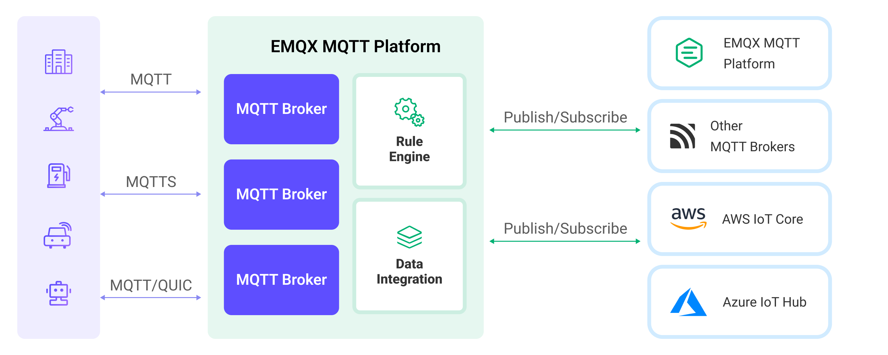

# Bridge MQTT Data into MQTT Broker

The MQTT data integration is a channel for EMQX to communicate with other MQTT services, including EMQX clusters that use the MQTT protocol. This page introduces how the MQTT broker data integration works in EMQX and provides a quick start tutorial on creating an MQTT broker Sink/Source in EMQX Dashboard or using the configuration file.

## How MQTT Broker Data Integration Works

EMQX supports the MQTT data integration that works in two primary modes: ingress (Source) and egress (Sink). The following sections explain how each mode works. Also, this section introduces the concept of connection pools used in both modes.

The diagram below illustrates a typical architecture of data integration between EMQX and other MQTT services:



### Ingress (Source) Mode

In ingress (Source) mode, the local EMQX subscribes to the topics from the remote MQTT brokers and distributes the received messages within the current cluster. Below is the message flow in the **ingress** direction:


The MQTT broker Source can be used either alone or in conjunction with rules for more powerful and flexible data processing capabilities. In **ingress** direction, the Source can be used as the data source of the rule. The message flow for MQTT broker Source working with rules is as follows:


### Egress (Sink) Mode

In egress mode, the local EMQX forwards messages from the current cluster to the remote MQTT brokers following the rule settings. This is the message flow in the **egress** direction:


Similar to the ingress mode, the MQTT broker Sink can also be used in conjunction with rules. In the **egress** direction, the Sink can be used as the action of the rule:


### Connection Pool

EMQX allows more than one client to connect to the MQTT broker Sink/Source at the same time. When creating the data bridge, you can set a pool of MQTT client connections and configure the pool size indicating the number of the client connections in the pool. Enabling connection pool allows for efficient utilization of server resources, leading to greater message throughput.

Because the MQTT protocol requires that a client connecting to the broker must have its own unique Client ID, EMQX automatically generates the Client ID for each client in the connection pool following the pattern below:

```bash
[${ClientIDPrefix}:]${BridgeName}:${Mode}:${NodeName}:${N}
```

| Fragment            | Description                                                  |
| ------------------- | ------------------------------------------------------------ |
| `${ClientIDPrefix}` | Prefix of the client ID as configured. If not set then whole first fragment is omitted. |
| `${BridgeName}`     | User-provided name of the bridge.                            |
| `${Mode}`           | Either `ingress` or `egress`.                                |
| `${NodeName}`       | [Name of the node](../configuration/cluster.md#node-names) on which the MQTT client is running. |
| `${N}`              | Number from `1` to the configured size of the connection pool. |

#### Use Connection Pool in Ingress Mode

Although the connection pool applies to both ingress and egress modes, using the connection pool in ingress mode should consider a few caveats. When you have EMQX [cluster](../deploy/cluster/introduction.md) with more than 1 node, and configure an ingress MQTT bridge to subscribe non-shared topics from the remote broker, clients in the connection pool will receive duplicated messages if they all subscribe to the same topic. In that case, it will bring pressure to the brokers, so it is strongly advised to use [shared subscription](../messaging/mqtt-shared-subscription.md) as a kind of safety measure. For example, you can configure the topic of the remote MQTT Broker to `$share/name1/topic1` or `$share/name2/topic2/#` if topic filter is used. In non-shared subscription cases, the MQTT client connection pool will be downscaled to one client, which means only one client will be started.

## Features and Benefits

The MQTT broker data integration has the following features and benefits:

- **Extensive Compatibility**: The MQTT broker data integration uses the standard MQTT protocol, allowing it to bridge to various IoT platforms, including AWS IoT Core, Azure IoT Hubs, and also supports open-source or other industry MQTT brokers and IoT platforms. This enables seamless integration and communication with a variety of devices and platforms.
- **Bidirectional Data Flow**: It supports bidirectional data flow, enabling the publishing of messages from EMQX locally to remote MQTT services, and also subscribing to messages from MQTT services and publishing them locally. This bidirectional communication capability makes data transfer between different systems more flexible and controllable.
- **Flexible Topic Mapping**: Based on the MQTT publish-subscribe model, the MQTT broker data integration implements flexible topic mapping. It supports adding prefixes to topics and dynamically constructing topics using the client's contextual information (such as client ID, username, etc.). This flexibility allows for customized processing and routing of messages according to specific needs.
- **High Performance**: The MQTT broker Sink offers performance optimization features, such as connection pools and shared subscriptions, to reduce the load on individual bridge clients, achieving lower bridge latency and higher bridge message throughput. Through these optimization measures, the overall system performance and scalability can be enhanced.
- **Payload Transformation**: The MQTT broker Sink allows for the processing of message payloads by defining SQL rules. This means that during message transmission, operations such as data extraction, filtering, enrichment, and transformation can be performed on the payload. For example, real-time metrics can be extracted from the payload and transformed and processed before the message is delivered to remote MQTT Broker.
- **Metrics Monitoring**: The runtime metrics monitoring is provided for each Sink/Source. It allows viewing of total message count, success/failure counts, current rates, etc., helping users to monitor and assess the performance and health of the Sink/Source in real time.

## Before You Start

Make sure you know the following:

- EMQX data integration [rules](./rules.md)
- [Data Integration](./data-bridges.md)

## Create MQTT Broker Connector

This section uses EMQX [public MQTT broker](https://www.emqx.com/en/mqtt/public-mqtt5-broker) as an example to demonstrate how to configure a connection between EMQX and this public MQTT broker in the Dashboard.

1. Go to EMQX Dashboard, and click **Integration** -> **Connector**.

2. Click **Create** in the top right corner of the page.

3. In the **Create Connector** page, click to select **MQTT Broker**, and then click **Next**.

4. Enter a name for the Connector. The name should be a combination of upper/lower case letters or numbers, for example, `my_mqtt_bridge`.

5. Enter the connection information. Enter `broker.emqx.io:1883` for **MQTT Broker**. As no authentication is required from the server side, you can leave the **Username** and **Password** blank. For the other fields in this section, you can keep the default value or set it as the actual condition.

6. Configure the **Ingress** or **Egress** field.

   :::tip
   You can choose to configure either the **Ingress** or **Egress** field or both fields, but at least one field should be set up. Turn on the toggle switch of the corresponding field to start the configuration.
   :::

   - **Ingress** (optional): You can configure the following for forwarding the messages received from `remote/topic/ingress` topic to the local MQTT Broker:
     
     - **Topic**: In cluster mode, you can use the shared subscription to avoid repeated messages, therefore you can fill in `$share/g/remote/topic/ingress`.
     - **QoS**: Select `0`.
     
     - **Connection Pool Size**: Specifies the size of the pool of MQTT client connections to the local broker. In this example, you can set `8`. This is safe as long as shared subscription is used for the remote topic.
     
     Messages subscribed to can be processed subsequently through the rule engine, such as forwarding messages to clients on EMQX nodes. The following fields can be obtained in the rules:
     
     | Field Name                    | Description                                                  |
     | ----------------------------- | ------------------------------------------------------------ |
     | topic                         | The topic of the source message                              |
     | server                        | The server address to which the Source is connected          |
     | retain                        | Whether to be published as a retain the message, with a value of false |
     | qos                           | Message Quality of Service                                   |
     | pub_props                     | MQTT 5.0 message properties object, including user property pairs, user properties, and other properties |
     | pub_props.User-Property-Pairs | Array of user property pairs, each containing key-value pairs, for example, `{"key":"foo", "value":"bar"}` |
     | pub_props.User-Property       | User property object, containing key-value pairs, for example, `{"foo":"bar"}` |
     | pub_props.*                   | Other message property key-value pairs, for example, `Content-Type: JSON` |
     | payload                       | Message content                                              |
     | message_received_at           | Message received timestamp in milliseconds                   |
     | id                            | Message ID                                                   |
     | dup                           | Whether it is a duplicate message                            |
     
     For example, when the message template is left blank, the following message will be published:
     
     ```json
     {
       "topic": "f/1",
       "server": "broker.emqx.io:1883",
       "retain": false,
       "qos": 0,
       "pub_props": {
           "User-Property-Pairs": [
               {
                   "value": "bar",
                   "key": "foo"
               }
           ],
           "User-Property": {
               "foo": "bar"
           },
           "Message-Expiry-Interval": 3600,
           "Content-Type": "JSON"
       },
       "payload": "Hello MQTTX CLI",
       "message_received_at": 1699603701552,
       "id": "000609C7D2E3D556F445000010E4000C",
       "dup": false
     }
     ```
     
   - **Egress** (optional): Publish messages from specific local MQTT topics to remote MQTT brokers, which can be understood as the reverse data flow of an ingress configuration. If you want to forward messages to the `remote/topic/egress` topic of a remote MQTT service, the configuration can be done as follows

       - **Topic**: Enter `remote/topic/egress`.
       - **QoS**: Select `0` or `${qos}` (to use the QoS of the received messages).
       - **Retain**: Confirm whether the message will be published as a retained message.
       - **Payload**: Payload template for the messages to be forwarded, and Supports reading data using `${field}` syntax.
       - **MQTT Client Pool Size**: Specifies the size of the pool of MQTT client connections to the local broker. In this example, you can set `8`.
   
7. Advanced settings (optional):  Choose whether to use **sync** or **async** query mode as needed. For details, see [Data Integration](./data-bridges.md).

8. Before clicking **Create**, you can click **Test Connectivity** to test that the bridge can connect to the MQTT broker.

9. Click the **Create** button. In the pop-up dialogue, you can click **Back to Connector List** to complete the creation of the MQTT Broker Connector or click **Create Rule** to enter the rule creation process.

## Create Rule for MQTT Broker Sink

This section demonstrates how to create a rule for specifying data to be forwarded to a remote MQTT service.

1. Go to the Dashboard **Integration** -> **Rules** page.

2. Click **Create** at the top right of the page.

3. Enter the rule ID `my_rule`. 

4. In the **SQL Editor**, enter the rule to store MQTT messages from the `t/#` topic to the remote MQTT server. The rule SQL is as follows:

   ```sql
   SELECT
     *
   FROM
     "t/#"
   ```

5. Add an action by selecting `MQTT Broker` from the **Action Type** dropdown list, and select the Connector you created before from the **Action** dropdown. Click the **Add** button to add it to the **Action Outputs.**

6. Back on the Create Rule page, click the **Create** button at the bottom to complete the rule creation.

You have now successfully created the rule. You can see the newly created rule on the **Integration** -> **Rules** page. Click the **Actions(Sink)** tab and you can see the new MQTT Broker Sink.

You can also click **Integration** -> **Flow Designer** to view the topology. The topology visually represents how messages under the topic `t/#` are sent to the remote MQTT Broker after being processed by the rule `my_rule`.

## Create Rule for MQTT Broker Source

This section demonstrates how to create a rule to forward data from a remote MQTT service to the local system.

1. Go to the Dashboard **Integration** -> **Rules** page.

2. Click **Create** at the top right of the page.

3. Enter the rule ID `my_rule`.

4. In the **SQL Editor**, enter the rule. If you want to process messages subscribed to in the MQTT Source named `my_mqtt_bridge`, enter the following statement in the **SQL Editor**:

   Note: If you want to specify your own SQL syntax, ensure the `SELECT` part contains all fields required for the message republish action set in later steps.

   ```sql
   SELECT
     *
   FROM `$bridges/mqtt:my_mqtt_bridge` 
   ```
   
5. Click the + **Add Action** button to define the action triggered by the rule. Select `Message Republish` from the dropdown list.

6. In the **Topic** and **Payload** fields, you can enter the topic and payload of the message you want to republish. For example, for this demonstration, enter `t/1` and `${.}`.

7. Click **Add** to include this action in the rule.

8. Return to the **Create Rule** page and click **Create**.
