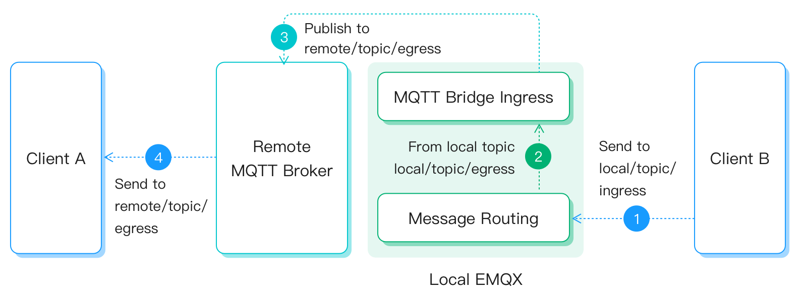

# MQTT

The MQTT data bridge is a channel for EMQX to communicate with other MQTT services, either EMQX clusters or services that support the MQTT protocol. Here is how it works:

- Forwarding messages from the current cluster to the bridged brokers following the rule settings;
- Subscribing to the topics of the bridged brokers to distribute the received messages within the current cluster.

:::tip Prerequisites

- Knowledge about EMQX data integration [rules](./rules.md)

- Knowledge about [data bridge](./data-bridges.md)

  :::

## Feature List

- [Connection pool](./data-bridges.md#连接池) <!-- TODO 确认改版后知否支持-->
- [Async mode](./data-bridges.md#异步请求模式)
- [Buffer queue](./data-bridges.md#缓存队列)

<!--  Configuration parameters TODO 链接到配置手册对应配置章节。 -->

## Quick Start

The following section will use EMQX [public MQTT broker](https://www.emqx.com/en/mqtt/public-mqtt5-broker) as an example to illustrate how to build a data bridge between EMQX and this public MQTT broker.

### Data Bridge Rules

The following topic mapping configuration is used here to implement message bridging between local and remote MQTT services:

| Topic                      | Direction                       | Target topic              |
| -------------------------- | ------------------------------- | ------------------------- |
| **`remote/topic/ingress`** | **`ingress`** (remote -> local) | **`local/topic/ingress`** |
| **`local/topic/egress`**   | **`egress`** (local -> remote)  | **`remote/topic/egress`** |

Below is the message flow in **ingress** direction:


And this is the message flow in **egress** direction:



## Configure MQTT Data Bridge via Dashboard

1. Go to EMQX Dashboard, click **Data Integration** -> **Data Bridge**.

2. Click **Create** on the top right corner of the page.

3. In the **Create Data Bridge** page, click to select **MQTT**, and then click **Next**.

4. Input a name for the data bridge. Note: It should be a combination of upper/lower case letters or numbers, for example, `my_mqtt_bridge`.

5. Input the connection information. Input `broker.emqx.io:1883` for **MQTT Broker**. As no authentication is required from the server side, we can leave the **Username** and **Password** blank. For the other fields in this section, you can keep the default value or set as the actual condition.

6. Set the data bridge rules with the **Ingress** or **Egress** field.

   :::tip
   You can choose to configure either the **Ingress** or **Egress** field or both fields, but at least one field should be set up. Turn on the toggle switch of the corresponding field to start the configuration.
   :::

   - **Ingress** (optional): Set the rules to forward the messages from remote MQTT brokers to local. In this example, we want to forward the messages from `remote/topic/ingress` to `local/topic/ingress`, so we will first subscribe to the remote topic and then specify the local topics to receive the messages:

     - **Remote MQTT Broker**: Subscribe to the remote topics.

       - **Topic**: In cluster mode, we can use the [Shared Subscription](../mqtt/mqtt-shared-subscription.md) to avoid repeated messages, therefore we will fill in `$share/g/remote/topic/ingress`
       - QoS: Select `0`.

     - **Local MQTT Broker**: Forward the received messages to specific local topics or leave blank, then these messages will first be processed by the configured rules and then forwarded with the [republish action](./rules.md).
       - **Topic**: Input `local/topic/ingress`.
       - **QoS**: Select `0` or `${qos}` (to use the QoS of the received messages).
       - **Retain**: Confirm whether the message will be published as a retained message.
       - **Payload**: Payload template for the messages to be forwarded, and Supports reading data using `${field}` syntax.

   - **Egress** (optional): Set the rules to publish messages from specific local MQTT topics to remote MQTT brokers. In this example, we want to publish the messages from `local/topic/egress` to `remote/topic/egress`:

     - **Local MQTT Broker**: Specify the local message topics.
       - **Topic**: Input `local/topic/egress`.
     - **Remote MQTT Broker**: Specify the target topics on the remote broker.
       - **Topic**: Input `remote/topic/egress`.
       - **QoS**: Select `0` or `${qos}` (to use the QoS of the received messages).
       - **Retain**: Confirm whether the message will be published as a retained message.
       - **Payload**: Payload template for the messages to be forwarded, and Supports reading data using `${field}` syntax.

7. Then you can configure whether to use sync/async mode and your buffer pool size as your business needs.

8. Click **Create** to finish the setting.

EMQX also supports to use configuration file to create an MQTT data bridge, and an example is as follows:

```bash
bridges.mqtt.my_mqtt_bridge {
  enable = true
  server = "broker.emqx.io:1883"
  username = "emqx_u"
  password = "public"
  proto_ver = "v4"
  clean_start = true
  keepalive = "60s"

  egress {
    local {topic = "local/topic/egress"}
    remote {
      payload = "${payload}"
      qos = 1
      retain = true
      topic = "remote/topic/egress"
    }
  }
  ingress {
    local {
      topic = "$share/g/remote/topic/ingress"
      qos = 1
      payload = "${payload}"
    }
    remote {qos = 1, topic = "local/topic/ingress"}
  }
}
```

## Work with Rules

MQTT Bridge can be used either alone or in conjunction with rules for more powerful and flexible data processing capabilities.

Now the message flow will be as follows:

In **ingress** direction, it can be used as the data source of the rule:


In **egress** direction, it can be used as the actions of the rule:


