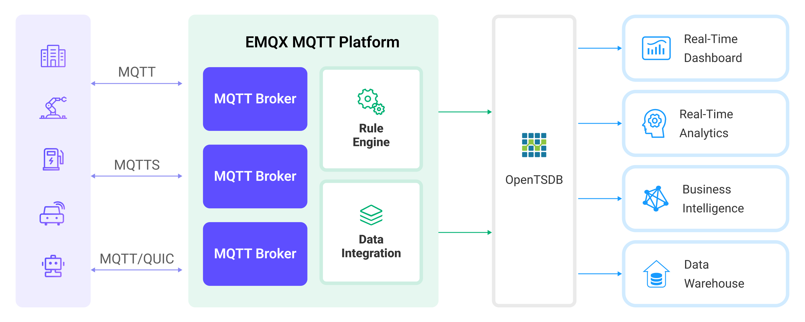

# Ingest MQTT Data into OpenTSDB


:::tip
EMQX Enterprise Edition features. EMQX Enterprise Edition provides comprehensive coverage of key business scenarios, rich data integration, product-level reliability, and 24/7 global technical support. Experience the benefits of this [enterprise-ready MQTT messaging platform](https://www.emqx.com/en/try?product=enterprise) today.
:::


[OpenTSDB](http://opentsdb.net/) is a scalable, distributed time series database. EMQX supports integration with OpenTSDB. You can save MQTT messages to OpenTSDB for subsequent analysis and retrieval.

This page provides a comprehensive introduction to the data integration between EMQX and OpenTSDB with practical instructions on creating and validating the data integration.

## How It Works

OpenTSDB data integration is an out-of-the-box feature in EMQX that combines EMQX's real-time data capturing and transmission capabilities with OpenTSDB's data storage and analysis functionality. With a built-in [rule engine](./rules.md) component, the integration simplifies the process of ingesting data from EMQX to OpenTSDB for storage and analysis, eliminating the need for complex coding.

The diagram below illustrates a typical architecture of data integration between EMQX and OpenTSDB:



EMQX inserts device data to OpenTSDB through the rule engine and Sink. OpenTSDB provides extensive query capabilities, supporting the generation of reports, charts, and other data analysis results. Taking industrial energy management scenarios as an example, the workflow is as follows:

1. **Message publication and reception**: Industrial devices establish successful connections to EMQX through the MQTT protocol and regularly publish energy consumption data using the MQTT protocol. This data includes production line identifiers and energy consumption values. When EMQX receives these messages, it initiates the matching process within its rules engine.  
2. **Rule Engine Processes Messages**: The built-in rule engine processes messages from specific sources based on topic matching. When a message arrives, it passes through the rule engine, which matches it with corresponding rules and processes the message data. This can include transforming data formats, filtering specific information, or enriching messages with context information.
3. **Data ingestion into OpenTSDB**: Rules defined in the rule engine trigger operations to write messages to OpenTSDB.

After data is written to OpenTSDB, you can flexibly use the data, for example:

- Connect to visualization tools like Grafana to generate charts based on the data, displaying energy storage data.
- Connect to business systems for monitoring and alerting on the status of energy storage devices.

## Features and Benefits

The OpenTSDB data integration offers the following features and advantages:

- **Efficient Data Processing**: EMQX can handle a massive number of IoT device connections and message throughput, while OpenTSDB excels in data writing, storage, and querying, providing outstanding performance to meet the data processing needs of IoT scenarios without overburdening the system.
- **Message Transformation**: Messages can undergo extensive processing and transformation through EMQX rules before being written into OpenTSDB.
- **Large-Scale Data Storage**: By integrating EMQX with OpenTSDB, a vast amount of device data can be directly stored in OpenTSDB. OpenTSDB is a database designed for storing and querying large-scale time-series data, capable of efficiently handling the massive volume of time-series data generated by IoT devices.
- **Rich Query Capabilities**: OpenTSDB's optimized storage structure and indexing enable rapid writing and querying of billions of data points, which is extremely beneficial for applications requiring real-time monitoring, analysis, and visualization of IoT device data.
- **Scalability**: Both EMQX and OpenTSDB are capable of cluster scaling, allowing flexible horizontal expansion of clusters as business needs grow.

## Before You Start

This section describes the preparations you need to complete before you start to create the OpenTSDB data integration, including how to set up the OpenTSDB server.

### Prerequisites

- Knowledge about EMQX data integration [rules](./rules.md)
- Knowledge about [data integration](./data-bridges.md)

### Install OpenTSDB

Install OpenTSDB via Docker, and then run the docker image (Only x86 platform is supported now). 

```bash
docker pull petergrace/opentsdb-docker

docker run -d --name opentsdb -p 4242:4242 petergrace/opentsdb-docker

```

## Create a Connector

This section demonstrates how to create a Connector to connect the Sink to the OpenTSDB server.

The following steps assume that you run both EMQX and OpenTSDB on the local machine. If you have OpenTSDB and EMQX running remotely, adjust the settings accordingly.

1. Enter the EMQX Dashboard and click **Integration** -> **Connectors**.
2. Click **Create** in the top right corner of the page.
3. On the **Create Connector** page, select **OpenTSDB** and then click **Next**.
4. In the **Configuration** step, configure the following information:
   - Enter the connector name, which should be a combination of upper and lower case letters and numbers, for example: `my_opentsdb`.
   - Enter `http://127.0.0.1:4242` as the **Server Host**, or the actual URL if the OpenTSDB server runs remotely.
   - Leave other options as default.
5. Before clicking **Create**, you can click **Test Connectivity** to test if the connector can connect to the OpenTSDB server.
6. Click the **Create** button at the bottom to complete the creation of the connector. In the pop-up dialog, you can click **Back to Connector List** or click **Create Rule** to continue creating rules and Sink to specify the data to be forwarded to OpenTSDB. For detailed steps, see [Create a Rule with OpenTSDB Sink](#create-a-rule-with-opentsdb-sink).

## Create a Rule with OpenTSDB Sink

This section demonstrates how to create rules to specify the data to be saved into OpenTSDB. 

1. Go to EMQX Dashboard, and click **Integration** -> **Rules**.

2. Click **Create** at the upper right corner of the page.

3. Input `my_rule` as the rule ID, and set the rules in the **SQL Editor** using the following statement, which means the MQTT messages under topic `t/#`  will be saved to OpenTSDB.

   Note: If you want to specify your own SQL syntax, make sure that you have included all fields required by the Sink in the `SELECT` part.

   ```sql
   	SELECT
     		payload.metric as metric, payload.tags as tags, payload.value as value
   	FROM
     		"t/#"
   ```

   Note: If you are a beginner user, click **SQL Examples** and **Enable Test** to learn and test the SQL rule. 

4. Click the **+ Add Action** button to define an action that will be triggered by the rule.  With this action, EMQX sends the data processed by the rule to OpenTSDB. 

5. Select `OpenTSDB` from the **Type of Action** dropdown list. Keep the **Action** dropdown with the default `Create Action` value. You can also select a Sink if you have created one. This demonstration will create a new Sink.

6. Enter a name for the Sink. The name should combine upper/lower case letters and numbers.

7. Select the `my_opentsdb` just created from the **Connector** dropdown box. You can also create a new Connector by clicking the button next to the dropdown box. For the configuration parameters, see [Create a Connector](#create-a-connector).

8. Specify how data is written into OpenTSDB in the **Write Data** field to correctly convert MQTT messages into the format required by OpenTSDB. For example, the client reports the following data:

   - Topic: `t/opents`
   - Payload:

   ```json
   {
     "metric": "cpu",
     "tags": {
       "host": "serverA"
     },
     "value": 12
   }
   ```

   Based on the provided Payload data format, configure the following format information:

   - **Timestamp**: OpenTSDB requires a timestamp to record the time of the data point. If the MQTT message does not provide a timestamp, you can use the current time as the timestamp when configuring the Sink in EMQX, or you may need to modify the client's reported data format to include a timestamp field.
   - **Metric**: In this example, `"metric": "cpu"` indicates that the metric name is `cpu`.
   - **Tags**: Tags are used to describe additional information about the metric. Here, the tag is `"tags": {"host": "serverA"}`, indicating that this metric data comes from host `serverA`.
   - **Value**: This is the actual metric value. In this example, it is `"value": 12`, indicating the metric value is 12.

9. Advanced settings (optional):  Choose whether to use **sync** or **async** query mode as needed. For details, see the relevant configuration information in [Features of Sink](./data-bridges.md).

10. Before clicking **Create**, you can click **Test Connectivity** to test that the Sink can be connected to the OpenTSDB server.

11. Click the **Create** button to complete the Sink configuration. A new Sink will be added to the **Action Outputs.**

12. Back on the **Create Rule** page, verify the configured information. Click the **Create** button to generate the rule. 

You have now successfully created the rule for forwarding data through the OpenTSDB Sink. You can see the newly created rule on the **Integration** -> **Rules** page. Click the **Actions(Sink)** tab and you can see the new OpenTSDB Sink.

You can also click **Integration** -> **Flow Designer** to view the topology and you can see that the messages under topic `t/#` are sent and saved to OpenTSDB after parsing by rule `my_rule`.

## Test the Rule

Use MQTTX to publish a message on topic `t/opents`. 

```bash
mqttx pub -i emqx_c -t t/opents -m '{"metric":"cpu","tags":{"host":"serverA"},"value":12}'
```

Check the running status of the Sink, there should be one new incoming and one new outgoing message. 

Check whether the data is written into the OpenTSDB: 

```bash
curl -X POST -H "Accept: Application/json" -H "Content-Type: application/json" http://localhost:4242/api/query -d '{
    "start": "1h-ago",
    "queries": [
        {
            "aggregator": "last",
            "metric": "cpu",
            "tags": {
                "host": "*"
            }
        }
    ],
    "showTSUIDs": "true",
    "showQuery": "true",
    "delete": "false"
}'
```

The formatted output of the query result is as follows:
```json
[
  {
    "metric": "cpu",
    "tags": {
      "host": "serverA"
    },
    "aggregateTags": [],
    "query": {
      "aggregator": "last",
      "metric": "cpu",
      "tsuids": null,
      "downsample": null,
      "rate": false,
      "filters": [
        {
          "tagk": "host",
          "filter": "*",
          "group_by": true,
          "type": "wildcard"
        }
      ],
      "percentiles": null,
      "index": 0,
      "rateOptions": null,
      "filterTagKs": [
        "AAAB"
      ],
      "explicitTags": false,
      "useFuzzyFilter": true,
      "preAggregate": false,
      "rollupUsage": null,
      "rollupTable": "raw",
      "showHistogramBuckets": false,
      "useMultiGets": true,
      "tags": {
        "host": "wildcard(*)"
      },
      "histogramQuery": false
    },
    "tsuids": [
      "000001000001000001"
    ],
    "dps": {
      "1683532519": 12
    }
  }
]% 
```


