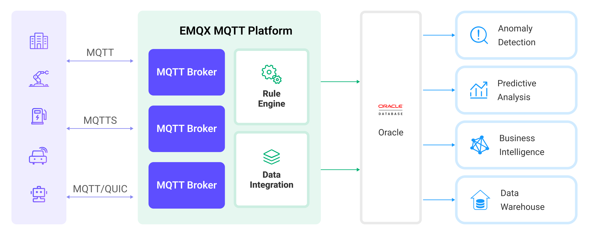

# Ingest MQTT Data into Oracle Database


::: tip
EMQX Enterprise Edition features. EMQX Enterprise Edition provides comprehensive coverage of key business scenarios, rich data integration, product-level reliability, and 24/7 global technical support. Experience the benefits of this [enterprise-ready MQTT messaging platform](https://www.emqx.com/en/try?product=enterprise) today.
:::


[Oracle Database](https://www.oracle.com/database/) is one of the leading relational commercial database solutions, widely used in enterprises and organizations of various sizes and types. EMQX supports integration with Oracle Database, enabling you to save MQTT messages and client events to Oracle Database. This allows for the construction of complex data pipelines and analytical processes for data management and analysis, or for managing device connections and integrating with other enterprise systems such as ERP and CRM.

This page provides a comprehensive introduction to the data integration between EMQX and Oracle Database with practical instructions on creating a rule and data bridge.

## How It Works

Oracle Database data integration is an out-of-the-box feature in EMQX designed to bridge the gap between MQTT-based IoT data and Oracle Database's powerful data storage capabilities. With a built-in [rule engine](./rules.md) component, the integration simplifies the process of ingesting data from EMQX to Oracle Database for storage and management, eliminating the need for complex coding.

The diagram below illustrates a typical architecture of data integration between EMQX and Oracle Database:



Ingesting MQTT data into Oracle Database works as follows:

1. **Message publication and reception**: Industrial IoT devices establish successful connections to EMQX through the MQTT protocol and publish real-time MQTT data from machines, sensors, and product lines based on their operational states, readings, or triggered events to EMQX. When EMQX receives these messages, it initiates the matching process within its rules engine.  
2. **Message data processing:** When a message arrives, it passes through the rule engine and is then processed by the rule defined in EMQX. The rules, based on predefined criteria, determine which messages need to be routed to Oracle Database. If any rules specify payload transformations, those transformations are applied, such as converting data formats, filtering out specific information, or enriching the payload with additional context.
3. **Data ingestion into Oracle Database**: The rule triggers the writing of messages to Oracle Database. With the help of SQL templates, users can extract data from the rule processing results to construct SQL and send it to Oracle Database for execution, so that specific fields of the message can be written or updated into the corresponding tables and columns of the database.
4. **Data Storage and Utilization**: With the data now stored in Oracle Database, businesses can harness its querying power for various use cases. For instance, by utilizing Oracle's advanced analytics and predictive capabilities, users can extract valuable information and insights from IoT data.

## Features and Benefits

The data integration with Oracle Database offers a range of features and benefits tailored to ensure efficient data transmission, storage, and utilization:

- **Real-time Data Streaming**: EMQX is built for handling real-time data streams, ensuring efficient and reliable data transmission from source systems to Oracle Database. It enables organizations to capture and analyze data in real-time, making it ideal for use cases requiring immediate insights and actions.
- **High Performance and Scalability**: EMQX's cluster and distributed architecture is capable of handling the ever-increasing volume of device connections and message transmissions. Oracle offers a variety of expansion and scaling solutions, including data partitioning, data replication and redundancy, clustering, and high availability, providing users with flexible, reliable, and high-performance database solutions.
- **Flexibility in Data Transformation:** EMQX provides a powerful SQL-based Rule Engine, allowing organizations to pre-process data before storing it in Oracle Database. It supports various data transformation mechanisms, such as filtering, routing, aggregation, and enrichment, enabling organizations to shape the data according to their needs.
- **Easy Deployment and Management:** EMQX provides a user-friendly interface for configuring data sources, pre-processing data rules, and Oracle Database storage settings. This simplifies the setup and ongoing management of the data integration process.
- **Advanced Analytics:** Oracle Database's powerful SQL-based query language and support for complex analytical functions empower users to gain valuable insights from IoT data, enabling predictive analytics, anomaly detection, and more.

## Before You Start

This section describes the preparations you need to complete before you start to create the Oracle Database data bridges, including how to set up the Oracle database server and create data tables.

### Prerequisites

- Knowledge about EMQX data integration [rules](./rules.md)
- Knowledge about [Data Integration](./data-bridges.md)

### Install Oracle Database Server

Install Oracle Database server via Docker, and then run the docker image.

```bash
# To start the Oracle Database docker image locally
docker run --name oracledb -p 1521:1521 -d oracleinanutshell/oracle-xe-11g:1.0.0

# To start the Oracle Database docker image remotely
docker run --name oracledb -p 1521:1521 -e ORACLE_ALLOW_REMOTE=true -d oracleinanutshell/oracle-xe-11g:1.0.0

# For performance concern, you may want to disable the disk asynch IO:
docker run --name oracledb -p 1521:1521 -e ORACLE_DISABLE_ASYNCH_IO=true -d oracleinanutshell/oracle-xe-11g:1.0.0

# Access the container
docker exec -it oracledb bash

# Connect to the default database "XE"
# username: "system"
# password: "oracle"
sqlplus
```

### Create Data Tables

Use the following SQL statements to create data table `t_mqtt_msgs` in Oracle Database for storing the message ID, client ID, topic, QoS, retain flag, message payload, and timestamp of every message.

  ```sql
  CREATE TABLE t_mqtt_msgs (
    msgid VARCHAR2(64),
    sender VARCHAR2(64),
    topic VARCHAR2(255),
    qos NUMBER(1),
    retain NUMBER(1),
    payload NCLOB,
    arrived TIMESTAMP
  );
  ```

Use the following SQL statements to create data table `t_emqx_client_events` in Oracle Database for storing the client ID, event type, and creation time of every event.

  ```sql
  CREATE TABLE t_emqx_client_events (
    clientid VARCHAR2(255),
    event VARCHAR2(255),
    created_at TIMESTAMP
  );
  ```

## Create Oracle Database Data Bridges

This section demonstrates how to create Oracle Database data bridges. It assumes that you run both EMQX and Oracle Database on the local machine. If you have Oracle Database and EMQX running remotely, adjust the settings accordingly.

Data bridges for message storage and event recording require different SQL templates. Therefore, you need to create 2 different data bridges to Oracle Database for message storage and event recording.

1. Go to EMQX Dashboard, and click **Integration** -> **Data Bridge**.

2. Click **Create** on the top right corner of the page.

3. In the **Create Data Bridge** page, click to select **Oracle Database**, and then click **Next**.

4. Input a name for the data bridge. The name should be a combination of upper/lower case letters and numbers.

5. Input the connection information:
n
   - **Server Host**: Input `127.0.0.1:1521`, or the actual hostname if the Oracle Database server is running remotely.
   - **Database Name**: Input `XE`.
   - **Oracle Database SID**: Input `XE`.
   - **Username**: Input `system`.
   - **Password**: Input `oracle`.

6. Configure the **SQL Template** based on the feature to use.

   Note: This is a [preprocessed SQL](./data-bridges.md#prepared-statement), so the fields should not be enclosed in quotation marks, and do not write a semicolon at the end of the statements.
   
   - To create a data bridge for message storage, use the SQL statement below:
   
     ```sql
     INSERT INTO t_mqtt_msgs(msgid, sender, topic, qos, retain, payload, arrived) VALUES(
       ${id},
       ${clientid},
       ${topic},
       ${qos},
       ${flags.retain},
       ${payload},
       TO_TIMESTAMP('1970-01-01 00:00:00', 'YYYY-MM-DD HH24:MI:SS') + NUMTODSINTERVAL(${timestamp}/1000, 'SECOND')
     )
     ```
   
   - To create a data bridge for online/offline status recording, use the SQL statement below:
   
     ```sql
     INSERT INTO t_emqx_client_events(clientid, event, created_at) VALUES (
       ${clientid},
       ${event},
       TO_TIMESTAMP('1970-01-01 00:00:00', 'YYYY-MM-DD HH24:MI:SS') + NUMTODSINTERVAL(${timestamp}/1000, 'SECOND')
     )
     ```

7. Leave other options as default.

8. Before clicking **Create**, you can click **Test Connectivity** to test that the bridge can connect to the Oracle Database server.

9. Click **Create** to finish the creation of the data bridge.

   A confirmation dialog will appear and ask if you like to create a rule using this data bridge, you can click **Create Rule** to continue creating rules to specify the data to be saved into Oracle Database. For detailed steps, refer to [Create Rules for Oracle Database Data Bridge](#create-rules-for-oracle-database-data-bridge).

Now the Oracle Database data bridge should appear in the data bridge list (**Integration** -> **Data Bridge**) with **Resource Status** as **Connected**.

## Create Rules for Oracle Database Data Bridge

After you have successfully created the data bridges to Oracle Database, you can continue to create rules to specify the data to be saved into Oracle Database and rules for the online/offline status recording.

1. Go to EMQX Dashboard, click **Integration** -> **Rules**.

2. Click **Create** on the top right corner of the page.

3. Input `my_rule` as the rule ID, and set the rules in the **SQL Editor** based on the feature to use:

   - To create a rule for message storage, input the following SQL syntax, which means the MQTT messages under topic `t/#`  will be saved to Oracle Database.

     Note: If you want to specify your own SQL syntax, make sure that you have included all fields required by the data bridge in the `SELECT` part.

     ```sql
     SELECT 
       *
     FROM
       "t/#"
     ```

   - To create a rule for online/offline status recording, input the following SQL syntax:

     ```sql
     SELECT
       *
     FROM
       "$events/client_connected", "$events/client_disconnected"
     ```

4. Click the **Add Action** button, select **Forwarding with Data Bridge** from the dropdown list, and then select the Oracle Database data bridge just created. Click the **Add** button.
6. Click the **Create** button to finish the setup.

Now you have successfully created the data bridges to Oracle Database. You can click **Integration** -> **Flows** to view the topology. It can be seen that the messages under topic `t/#`  are sent and saved to Oracle Database after parsing by rule  `my_rule`.

## Test Data Bridges and Rules

Use MQTTX  to send a message to topic  `t/1`  to trigger an online/offline event.

```bash
mqttx pub -i emqx_c -t t/1 -m '{ "msg": "hello Oracle Database" }'
```

Check the running status of the two data bridges, there should be one new incoming and one new outgoing message.

Check whether the data is written into the `t_mqtt_msgs` data table.

```sql
SELECT * FROM t_mqtt_msgs;

MSGID                            SENDER TOPIC QOS RETAIN PAYLOAD                            ARRIVED
-------------------------------- ------ ----- --- ------ ---------------------------------- ----------------------------
0005FA6CE9EF9F24F442000048100002 emqx_c t/1   0   0      { "msg": "hello Oracle Database" } 28-APR-23 08.22.51.760000 AM

```

Check whether the data is written into the `t_emqx_client_events` table.

```sql
SELECT * FROM t_emqx_client_events;

CLIENTID EVENT               CREATED_AT
-------- ------------------- ----------------------------
emqx_c   client.connected    28-APR-23 08.22.51.757000 AM
emqx_c   client.disconnected 28-APR-23 08.22.51.760000 AM
```
