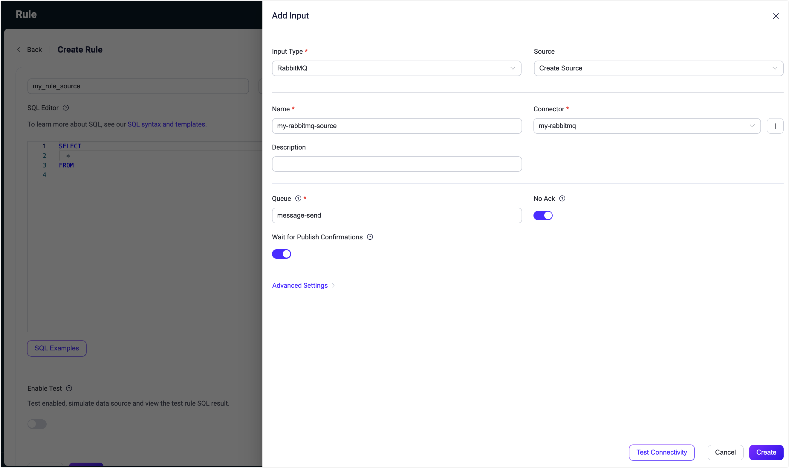

# Ingest MQTT Data into RabbitMQ

::: tip

The RabbitMQ data integration is an EMQX Enterprise edition feature.

:::

[RabbitMQ](https://www.rabbitmq.com/) is a widely used open-source message broker that implements the Advanced Message Queuing Protocol (AMQP). It provides a robust and scalable platform for messaging between distributed systems. EMQX supports integration with RabbitMQ, allowing you to forward MQTT messages and events to RabbitMQ. It also enables consuming data from the RabbitMQ Server and publishing it to specific topics in EMQX, achieving message delivery from RabbitMQ to MQTT.

This page provides a detailed overview of the data integration between EMQX and RabbitMQ with practical instructions on creating and validating the data integration.

## How It Works

The RabbitMQ data integration is an out-of-the-box feature in EMQX designed to bridge the gap between MQTT-based IoT data and RabbitMQ's powerful message queue processing capabilities. With a built-in [rule engine](./rules.md) component, the integration simplifies the process of ingesting data from EMQX to RabbitMQ for storage and management, eliminating the need for complex coding.

Take the RabbitMQ Sink for an example, the diagram below illustrates a typical architecture of data integration between EMQX and RabbitMQ: 


Ingesting MQTT data into RabbitMQ works as follows:

1. **Message publication and reception**: Industrial IoT devices establish successful connections to EMQX through the MQTT protocol and publish real-time MQTT data to EMQX. When EMQX receives these messages, it initiates the matching process within its rules engine.  
2. **Message data processing:** When a message arrives, it passes through the rule engine and is then processed by the rule defined in EMQX. The rules, based on predefined criteria, determine which messages need to be routed to RabbitMQ. If any rules specify payload transformations, those transformations are applied, such as converting data formats, filtering out specific information, or enriching the payload with additional context.
3. **Message ingestion into RabbitMQ**: When the rule has finished processing the message, it triggers an action of forwarding the messages to RabbitMQ. Processed messages will be seamlessly written into RabbitMQ.
4. **Data persistence and Utilization**: RabbitMQ stores the messages in queues and delivers them to the appropriate consumers. The messages can be consumed by other applications or services for further processing, such as data analysis, visualization, and storage.

## Features and Benefits

The data integration with RabbitMQ brings the following features and advantages to your business:

- **Reliable IoT Data Message Delivery**: EMQX ensures reliable connections and message delivery from devices to the cloud, while RabbitMQ handles message persistence and reliable delivery across different services, ensuring data reliability throughout various processes. 
- **MQTT Message Transformation**: Using the rule engine, EMQX can filter and transform MQTT messages. Messages can undergo data extraction, filtering, enrichment, and transformation before being sent to RabbitMQ.
- **Flexible Message Mapping**: RabbitMQ data integration supports flexible mapping of MQTT topics to RabbitMQ Routing Key and Exchange, allowing seamless integration between MQTT and RabbitMQ.
- **High Availability and Cluster Support**: EMQX and RabbitMQ both support the construction of highly available message broker clusters, ensuring that the system can continue to provide services even in the event of node failures. Leveraging the cluster capabilities also provides excellent scalability.
- **Processing Capabilities in High-Throughput Scenarios**: RabbitMQ data integration supports both synchronous and asynchronous write modes, allowing for a flexible balance between latency and throughput according to different scenarios.

## Before You Start

This section describes the preparations you need to complete before you start to create the RabbitMQ data integration, including how to create a RabbitMQ server and create RabbitMQ test exchange and queue.

### Prerequisites

- Knowledge about EMQX data integration [rules](./rules.md)

- Knowledge about [data integration](./data-bridges.md) and [republish action](./rule-get-started.md#add-republish-action)

- Basic knowledge of UNIX terminal and commands

### Start a RabbitMQ Server

This section introduces how to start a RabbitMQ server using [Docker](https://www.docker.com/).

Run the following command to start a RabbitMQ server with the management plugin enabled. The management plugin allows you to inspect RabbitMQ with a web interface.

```bash
docker run -it --rm --name rabbitmq -p 127.0.0.1:5672:5672 -p 127.0.0.1:15672:15672 rabbitmq:3.11-management
```

You can find more information about running [RabbitMQ in Docker on Docker Hub](https://hub.docker.com/_/rabbitmq).


### Create an Exchange and Queue for Message Receiving

After the RabbitMQ server is started, you can use the RabbitMQ Management Web Interface to create a test exchange and a queue for receiving messages forwarded from EMQX. You can skip this section if you already have an exchange and queue to test with.

1. Open your web browser and navigate to http://localhost:15672/ to access the RabbitMQ Management Web Interface. On the login page, enter the default credentials and click **Login**.
   - **Username**: `guest`
   - **Password**: `guest`
2. Click the **Exchanges** tab in the top menu. Unfold **Add a new exchange**, and input the following information:
   * **Name**: Type `test_exchange`
   * **Type**: Select `direct` from the drop-down list
   * **Durability**: Select `Durable` to make the exchange persistent, that is the queue exists after the RabbitMQ server is restarted.
   * **Auto delete**: `No`
   * **Internal**: `No`
   * **Arguments**: Leave empty

3. Click the **Add exchange** button to create the test exchange.
4. Click the **Queues** tab in the top menu. Unfold **Add a new queue**, and input the following information:
   * **Type**: `Default for virtual host`
   * **Name**: Type `test_queue`
   * **Durability**: Select `Durable` to make the queue persistent,
   * **Arguments**: Leave empty
5. Click the **Add queue** button to create the test queue. The new `test_queue` should appear in **All queues** section.
6. Click the queue name **test_queue** to open its details page. Unfold **Bindings**. In the **Add binding to this queue** section, input the following information:
   * **From exchange**: Type `test_exchange` 
   * **Routing key**: Type `test_routing_key`
   * **Arguments**: Leave empty
7. Click the **Bind** button to bind the `test_queue` to the `test_exchange` with the specified routing key.

### Create a Queue for Message Publishing

You can use the RabbitMQ Management Web Interface to create a queue for publishing RabbitMQ messages.

1. Login to the RabbitMQ Management Web Interface. 
2. Click the **Queues** tab in the top menu. Unfold **Add a new queue**, and input the following information:
   * **Type**: `Default for virtual host`
   * **Name**: Type `message-send`
   * **Durability**: Select `Durable` to make the queue persistent, that is the queue exists after the RabbitMQ server is restarted. 
   * **Arguments**: Leave empty

3. Click the **Add queue** button to create the test queue. The new `message-send` should appear in **All queues** section.

## Create a Connector

This section demonstrates how to create a Connector to connect the Rabbit Sink/Source to the RabbitMQ Server.

The following steps assume that you run both EMQX and RabbitMQ on the local machine. If your RabbitMQ is deployed elsewhere, adjust the settings accordingly.

1. Enter the Dashboard and click **Integration** -> **Connectors**.
2. Click **Create** in the top right corner of the page.
3. On the **Create Connector** page, select **RabbitMQ** and then click **Next**.
4. Enter a name for the Connector. The name should be a combination of upper/lower case letters and numbers, for example, `my_rabbitmq`.
5. Enter the connection information. 
   - **Server**: Enter `localhost` or the actual hostname/IP if the RabbitMQ server is running remotely.
   - **Port**: Enter `5672` or the actual port if different.
   - **Username**: Enter `guest`.
   - **Password**: Enter `guest`.
   - **Virtual Host**: Enter RabbitMQ virtual host;  `/` by default.
   - If you want to establish an encrypted connection, click the **Enable TLS** toggle switch. For more information about TLS connection, see [TLS for External Resource Access](../network/overview.md/#tls-for-external-resource-access).
6. Before clicking **Create**, you can click **Test Connectivity** to test if the Connector can connect to the RabbitMQ server.
7. Click the **Create** button at the bottom to complete the creation of the Connector. In the pop-up dialog, you can click **Back to Connector List** or **Create Rule**. By clicking **Create Rule**, you have the following options:
   - **Action Outputs**: creating a rule with RabbitMQ Sink to specify the data to be forwarded to RabbitMQ. You can also follow the steps in [Create a Rule with RabbitMQ Sink](#create-a-rule-with-rabbitmq-sink).
   - **Data Inputs**: creating a rule with RabbitMQ Source. You can also follow the steps in [Create a Rule with RabbitMQ Source](#create-a-rule-with-rabbitmq-source).

## Create a Rule with RabbitMQ Sink

This section demonstrates how to create a rule in the Dashboard for processing messages from the source MQTT topic `t/#`, and forwarding the processed data to the queue `test_queque` in RabbitMQ via a configured Sink. 

1. Go to the EMQX Dashboard, and click Data **Integration -> Rules**.

2. Click **Create** on the top right corner of the page.

3. Enter a rule ID, for example, `my_rule`.

4. Enter the following statement in the SQL editor, which will forward the MQTT messages matching the topic pattern `t/#`:

   ```sql
   SELECT 
     payload as data,
     now_timestamp() as timestamp
   FROM
     "t/#"
   ```

   ::: tip

   If you are a beginner user, click **SQL Examples** and **Enable Test** to learn and test the SQL rule. 

   :::

5. Click the + **Add Action** button to define an action to be triggered by the rule. With this action, EMQX sends the data processed by the rule to RabbitMQ.

6. Select `RabbitMQ` from the **Type of Action** dropdown list. Keep the **Action** dropdown with the default `Create Action` value. You can also select a Sink if you have created one. This demonstration will create a new Sink.

7. Enter a name for the Sink. The name should be a combination of upper/lower case letters and numbers.

8. Select the Connector `my_rabbitmq` from the **Connector** dropdown box. You can also create a new Connector by clicking the button next to the dropdown box. For the configuration parameters, see [Create a Connector](#create-a-connector).

9. Configure the following information for the Sink:

   * **Exchange**: Enter `test_exchange` created before, which means messages will be published to this exchange.

   * **Routing Key**: Enter `test_routing_key` created before, which is the RabbitMQ routing key to be used when publishing messages.

   * **Virtual Host**: Enter RabbitMQ virtual host;  `/` by default.

   * In the **Message Delivery Mode** dropdown, select between `non_persistent` and `persistent`:

     * `non_persistent` (default): Messages are not persisted to disk and may be lost if RabbitMQ restarts or crashes.

     * `persistent`: Messages are persisted to disk, providing durability in case RabbitMQ restarts or crashes. 

       ::: tip

       You may also need to set the queue and exchange as durable to prevent messages from being lost in case RabbitMQ is restarted. See the RabbitMQ [documentation](https://www.rabbitmq.com/documentation.html) for more information.

       :::

   * **Payload Template**: The default value is an empty string, meaning the message payload will be forwarded as JSON-formatted text to RabbitMQ without modification.

     You can also define a custom message payload format using placeholders within the template to dynamically include data from the incoming MQTT messages. For example, if you want to include the MQTT message payload and its timestamp in the RabbitMQ message, you can use the following template:

     ```json
      {"payload": "${payload}", "timestamp": ${timestamp}}
     ```

     This template will produce a JSON-formatted message containing the payload and timestamp of the incoming MQTT message. `${payload}` and `${timestamp}` are placeholders and will be replaced by the actual values from the message when it is forwarded to the RabbitMQ server. 

   - **Wait for Publish Confirmations**: Enabled by default to ensure that messages are successfully published to RabbitMQ.

     ::: tip

     With this option enabled RabbitMQ broker acknowledges the receipt of a published message before considering it successfully published, which improves the reliability of your message delivery. 
   
     :::

11. Advanced settings (optional):  

    - **Publish Confirmation Timeout**: `30` seconds by default. The publish confirmation timeout determines the duration the publisher will wait for the broker's acknowledgment before considering the publish operation a failure.
    - Choose whether to use **sync** or **async** query mode as needed. For details, see the relevant configuration information in [Features of Sink](./data-bridges.md#features-of-sink).

12. Before clicking **Create**, you can click **Test Connectivity** to test that the Sink can be connected to the RabbitMQ server.

13. Click the **Create** button to complete the Sink configuration. A new Sink will be added to the **Action Outputs.**

14. Back on the **Create Rule** page, verify the configured information. Click the **Create** button to generate the rule. 

You have now successfully created the rule for forwarding data through the RabbitMQ Sink. You can see the newly created rule on the **Integration** -> **Rules** page. Click the **Actions(Sink)** tab and you can see the new RabbitMQ Sink.

You can also click **Integration** -> **Flow Designer** to view the topology and you can see that the messages under topic `t/#` are sent and saved to RabbitMQ after parsing by rule `my_rule`.

## Test the RabbitMQ Sink Rule

You can use the built-in WebSocket client in the EMQX dashboard to test our rule and Sink.

1. Click **Diagnose** -> **WebSocket Client** in the left navigation menu of the Dashboard.

2. Fill in the connection information for the current EMQX instance.
   - If you run EMQX locally, you can use the default value.
   - If you have changed EMQX's default configuration. For example, the configuration change on authentication can require you to type in a username and password.

3. Click **Connect** to connect the client to the EMQX instance.

1. Scroll down to the publish area and type the following:
   * **Topic**: `t/test`
   * **Payload**: `Hello World RabbitMQ from EMQX`
   * **QoS**: `2`
   
5. Click **Publish** to send the message. 

   If the Sink and rule are created successfully, a message should have been published to the specified exchange in the RabbitMQ server with the specified routing key. 

6. Visit the RabbitMQ Management Console at http://localhost:15672 and navigate to the Queues section. 

   ::: tip

   Use `guest` as both username and password if you have not changed the default setting.

   :::

7. Verify that the message has been routed to the appropriate queue(s). Click the queue to see details and then click the **Get Message(s)** button to see the detailed message contents.


## Create a RabbitMQ Source Rule

This section demonstrates how to create a rule for forwarding data from a RabbitMQ queue to EMQX. You need to create both a RabbitMQ Source and a message republish action to consume messages from the RabbitMQ service and forward them to EMQX.

1. Go to the Dashboard **Integration** -> **Rules** page.

2. Click **Create** in the top right corner of the page.

3. Enter the rule ID `my_rule_source`.

4. Configure the source (Data Inputs) that triggers the rule. Click the **Data Inputs** tab on the right side of the page, delete the default `Messages` input, and click **Add Input** to create a RabbitMQ Source.

5. In the **Add Input** popup, select `RabbitMQ` from the **Input Type** dropdown. Keep the **Source** dropdown box to the default `Create Source` option; this example will create a new Source and add it to the rule.

6. Enter the **Name** and **Description** (optional) for the Source. The name should combine upper/lower case letters and numbers, for example, `my-rabbitmq-source`.

7. Select the previously created `my-rabbitmq` connector from the **Connector** dropdown box. You can also click the create button next to the dropdown box to quickly create a new connector in the popup, with required configuration parameters referring to [Create a Connector](#create-a-connector).

8. Configure the Source information to complete the setup for consuming messages from RabbitMQ to EMQX:

   - **Queue**: Fill in the queue name `message-send` previously created in RabbitMQ.
   - **No Ack**: Select according to the situation, whether to consume messages from RabbitMQ using the `no_ack` mode. Enabling `no_ack` mode means RabbitMQ does not wait for a message to be acknowledged after delivering it to a consumer, so it is removed from the queue immediately, even if the consumer has not processed it successfully.
   - **Wait for Publish Confirmations**: Specify whether to wait for RabbitMQ to confirm messages when using message publisher acknowledgments.

9. Advanced settings (optional): Use the default values.

10. Click the **Create** button to complete the creation of the Source, adding it to the rule data inputs. At the same time, you can see the rule SQL has changed to:

    ```sql
    SELECT
    *
    FROM
    "$bridges/rabbitmq:my-rabbitmq-source"
    ```

    The rule SQL can access the following fields from the RabbitMQ Source, and you can adjust the SQL for data processing operations. The default SQL can be used here.

    | Field Name | Description                                                  |
    | :--------- | :----------------------------------------------------------- |
    | payload    | The content of the RabbitMQ message                          |
    | event      | The event topic, formatted as `$bridges/rabbitmq:<source name>` |
    | metadata   | Rule ID information                                          |
    | timestamp  | The timestamp when the message arrives at EMQX               |
    | node       | The name of the EMQX node where the message arrives          |


By now, you have completed the creation of the RabbitMQ Source, but the subscribed data will not be published directly to EMQX. Next, continue to create a message republish action, through which the Source's messages will be forwarded to EMQX.



### Add Republish Action to the Rule

This section demonstrates how to add a Republish action to the rule for forwarding the message consumed from the RabbitMQ source and publishing to the EMQX topic `t/1`.

1. Select the **Action Output** tab on the right side of the page, click the **Add Action** button, and select the `Republish` action from the **Type of Action** dropdown list.

2. Fill in the message republish configuration:

   - **Topic**: The topic to publish to MQTT, enter `t/1` here.

   - **QoS**: Select `0`, `1`, `2`, or `${qos}`, or enter a placeholder to set QoS from other fields. Selecting `${qos}` here means to follow the original message's QoS.

   - **Retain**: Select `true` or `false`. Determine whether to publish the message as a retained message, placeholders can also be entered to set the retain message flag from other fields. In this example, select `false`.

   - **Payload**: Set a template for generating the forwarded message payload. Leaving it blank by default means forwarding the rule output result. Here you can enter `${payload}` to indicate forwarding Payload only.

   - **MQTT 5.0 Message Properties**: Disabled by default. For detailed settings, see [Add Republish Action](./rule-get-started.md#add-republish-action).

3. Click **Create** to complete the action creation. After successful creation, you will return to the create rule page, and the republish action will be added to the **Action Outputs** tab.

4. On the rule creation page, click the **Create** button to complete the entire rule creation.

Now that you have successfully created a rule, you can see the newly created rule on the **Rules** page. On the **Sources** tab, you can see the newly created RabbitMQ Source.

You can also click **Integrate** -> **Flow Designer** to view the topology. Through the topology, you can intuitively see that messages from the RabbitMQ Source will be published to `t/1` through message republishing.

## Test the RabbitMQ Source Rule

1. Use [MQTTX CLI](https://mqttx.app/cli) to subscribe to the topic `t/1`:

   ```bash
   mqttx sub -t t/1
   ```

2. You can produce a message in RabbitMQ using the following command:

   ```bash
   rabbitmqadmin --username=guest --password=guest \
   	publish routing_key=message-send \
   	payload="{ \"msg\": \"Hello EMQX\"}"
   ```

   - `publish` is the command used to publish a message.
   - `routing_key=message-send` option is used to set the message's routing key. In this example, the queue's name is used as the routing key.
   - `payload="{ \"msg\": \"Hello EMQX\"}"` option is used to set the content of the message.

   Alternatively, you can also publish a message from the RabbitMQ management interface:

   1. Click the **Queues** tab in the top menu bar.
   2. Click **message-send** in the **Name** column to open its details page.
   3. Expand **Publish message**, enter `"Hello EMQX"` in the **Payload** box, and then click the **Publish message** button.

3. You will see the output in MQTTX:

   ```bash
   [2024-2-23] [16:59:28] › payload: {"payload":{"msg":"Hello EMQX"},"event":"$bridges/rabbitmq:my-rabbitmq-source","metadata":{"rule_id":"rule_0ly1"},"timestamp":1708678768449,"node":"emqx@127.0.0.1"}
   ```
