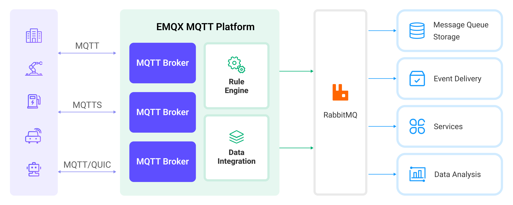
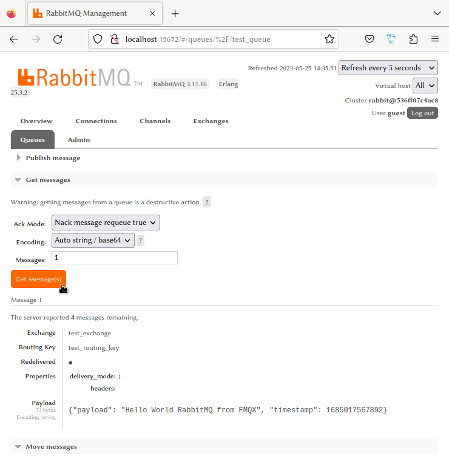

# Ingest MQTT Data into RabbitMQ


:::tip
The RabbitMQ bridge is an EMQX Enterprise Edition feature. EMQX Enterprise Edition provides comprehensive coverage of key business scenarios, rich data integration, product-level reliability, and 24/7 global technical support. Experience the benefits of this [enterprise-ready MQTT messaging platform](https://www.emqx.com/en/try?product=enterprise) today.
:::


[RabbitMQ](https://www.rabbitmq.com/) is a widely used open-source message broker that implements the Advanced Message Queuing Protocol (AMQP). It provides a robust and scalable platform for messaging between distributed systems. EMQX supports integration with RabbitMQ, allowing you to forward MQTT messages and events to RabbitMQ.

This page provides a comprehensive introduction to the data integration between EMQX and RabbitMQ with practical instructions on creating a rule and data bridge.

## How It Works

The RabbitMQ data integration is an out-of-the-box feature in EMQX designed to bridge the gap between MQTT-based IoT data and RabbitMQ's powerful message queue processing capabilities. With a built-in [rule engine](./rules.md) component, the integration simplifies the process of ingesting data from EMQX to RabbitMQ for storage and management, eliminating the need for complex coding.

The diagram below illustrates a typical architecture of data integration between EMQX and RabbitMQ:



Ingesting MQTT data into RabbitMQ works as follows:

1. **Message publication and reception**: Industrial IoT devices establish successful connections to EMQX through the MQTT protocol and publish real-time MQTT data to EMQX. When EMQX receives these messages, it initiates the matching process within its rules engine.  
2. **Message data processing:** When a message arrives, it passes through the rule engine and is then processed by the rule defined in EMQX. The rules, based on predefined criteria, determine which messages need to be routed to RabbitMQ. If any rules specify payload transformations, those transformations are applied, such as converting data formats, filtering out specific information, or enriching the payload with additional context.
3. **Message ingestion into RabbitMQ**: When the rule has finished processing the message, it triggers an action of forwarding the messages to RabbitMQ. Processed messages will be seamlessly written into RabbitMQ.
4. **Data persistence and Utilization**: RabbitMQ stores the messages in queues and delivers them to the appropriate consumers. The messages can be consumed by other applications or services for further processing, such as data analysis, visualization, and storage.

## Features and Benefits

The data integration with RabbitMQ brings the following features and advantages to your business:

- **Reliable IoT Data Message Delivery**: EMQX ensures reliable connections and message delivery from devices to the cloud, while RabbitMQ handles message persistence and reliable delivery across different services, ensuring data reliability throughout various processes. 
- **MQTT Message Transformation**: Using the rule engine, EMQX can filter and transform MQTT messages. Messages can undergo data extraction, filtering, enrichment, and transformation before being sent to RabbitMQ.
- **Flexible Message Mapping**: RabbitMQ Data Bridge supports flexible mapping of MQTT topics to RabbitMQ Routing Key and Exchange, allowing seamless integration between MQTT and RabbitMQ.
- **High Availability and Cluster Support**: EMQX and RabbitMQ both support the construction of highly available message broker clusters, ensuring that the system can continue to provide services even in the event of node failures. Leveraging the cluster capabilities also provides excellent scalability.
- **Processing Capabilities in High-Throughput Scenarios**: RabbitMQ Data Bridge supports both synchronous and asynchronous write modes, allowing for a flexible balance between latency and throughput according to different scenarios.

## Before You Start

This section describes the preparations you need to complete before you start to create the RabbitMQ data bridges, including how to create a RabbitMQ server and create RabbitMQ test exchange and queue.

### Prerequisites

- Knowledge about EMQX data integration [rules](./rules.md)

- Knowledge about [data bridges](./data-bridges.md)

- Basic knowledge of UNIX terminal and commands

### Start a RabbitMQ Server

This section introduces how to start a RabbitMQ server using [Docker](https://www.docker.com/).

Run the following command to start a RabbitMQ server with the management plugin enabled. The management plugin allows you to inspect RabbitMQ with a web interface.

```bash
docker run -it --rm --name rabbitmq -p 127.0.0.1:5672:5672 -p 127.0.0.1:15672:15672 rabbitmq:3.11-management
```

You can find more information about running [RabbitMQ in Docker on Docker Hub](https://hub.docker.com/_/rabbitmq).


### Create a RabbitMQ Test Exchange and Queue

After the RabbitMQ server is started, you can create a test exchange and a queue using the RabbitMQ Management Web Interface. You can skip this section if you already have an exchange and queue to test with.

1. Open your web browser and navigate to http://localhost:15672/ to access the RabbitMQ Management Web Interface. On the login page, enter the default credentials and click **Login**.
   - **Username**: `guest`
   - **Password**: `guest`
2. Click the **Exchanges** tab in the top menu. Unfold **Add a new exchange**, and input the following information:
   * **Name**: Type `test_exchange`
   * **Type**: Choose `direct` from the drop-down list
   * **Durability**: Choose `Durable` to make the exchange persistent
   * **Auto delete**: `No`
   * **Internal**: `No`
   * **Arguments**: Leave empty

3. Click the **Add exchange** button to create the test exchange.
4. Click the **Queues** tab in the top menu. Unfold **Add a new queue**, and input the following information:
   * **Type**: `Default for virtual host`
   * **Name**: Type `test_queue`
   * **Durability**: Choose `Durable` to make the queue persistent
   * **Arguments**: Leave empty
5. Click the **Add queue** button to create the test queue. The new **test_queue** should appear in **All queues** section.
6. Click the queue name **test_queue** to open its details page. Unfold **Bindings**. In the **Add binding to this queue** section, input the following information:
   * **From exchange**: Type `test_exchange` 
   * **Routing key**: Type `test_routing_key`
   * **Arguments**: Leave empty
7. Click the **Bind** button to bind the test queue to the test exchange with the specified routing key.

## Create a RabbitMQ Data Bridge

This section demonstrates how to create a RabbitMQ data bridge in EMQX Dashboard. It assumes that you run both EMQX and RabbitMQ on the local machine. If you have RabbitMQ and EMQX running remotely, please adjust the settings accordingly.

1. Go to the EMQX Dashboard, and click **Integration -> Data Bridge**.

2. Click **Create** on the top right corner of the page.

3. In the **Create Connector** page, click to select **RabbitMQ**, and then click **Next**.

4. Input a name for the data bridge. The name should be a combination of upper/lower case letters and numbers.

5. Input the connection information:
   * **Server**: Input `localhost` or the actual hostname/IP if the RabbitMQ server is running remotely.
   
   * **Port**: Input `5672` or the actual port if different.
   
   * **Username**: Input `guest`.
   
   * **Password**: Input `guest`.
   
   * **Exchange**: Input `test_exchange` created before, which means messages will be published to this exchange.
   
   * **Routing Key**: Input `test_routing_key` created before, which is the RabbitMQ routing key to be used when publishing messages.
   
   * **Virtual Host**: Input RabbitMQ virtual host;  `/` by default.
   
   * In the **Message Delivery Mode** dropdown, choose between `non_persistent` and `persistent`:
       * `non_persistent` (default): Messages are not persisted to disk and may be lost if RabbitMQ restarts or crashes.

       * `persistent`: Messages are persisted to disk, providing durability in case RabbitMQ restarts or crashes. 
       
         ::: tip
       
         You may also need to set the queue and exchange as durable to prevent messages from being lost in case RabbitMQ is restarted. See the RabbitMQ [documentation](https://www.rabbitmq.com/documentation.html) for more information.
       
         :::
   
   * **Wait for Publish Confirmations**: Enabled by default to ensure that messages are successfully published to RabbitMQ. 
   
       ::: tip
   
       With this option enabled RabbitMQ broker acknowledges the receipt of a published message before considering it successfully published, which improves the reliability of your message delivery. 
   
       :::
   
   * **Publish Confirmation Timeout**: `30` seconds by default. The publish confirmation timeout determines the duration the publisher will wait for the broker's acknowledgment before considering the publish operation a failure.
   
   * **Payload Template**: The default value is an empty string, meaning the message payload will be forwarded as JSON-formatted text to RabbitMQ without modification.
   
       You can also define a custom message payload format using placeholders within the template to dynamically include data from the incoming MQTT messages. For example, if you want to include the MQTT message payload and its timestamp in the RabbitMQ message, you can use the following template:
   
       ```json
       {"payload": "${payload}", "timestamp": ${timestamp}}
       ```
   
       This template will produce a JSON-formatted message containing the payload and timestamp of the incoming MQTT message. `${payload}` and `${timestamp}` are placeholders and will be replaced by the actual values from the message when it is forwarded to the RabbitMQ server. 
   
6. Leave other options as default.
7. Before clicking **Create**, you can click **Test Connectivity** to test that the bridge can connect to the RabbitMQ server.

8. Click **Create** to finish the creation of the data bridge.

   A confirmation dialog will appear and ask if you like to create a rule using this data bridge, you can click **Create Rule** to continue creating rules to specify the data to be saved into RabbitMQ. For detailed steps, refer to [Create a Rule for RabbitMQ Data Bridge](#create-a-rule-for-rabbitmq-data-bridge).

Now the RabbitMQ data bridge should appear in the data bridge list (**Integration -> Data Bridge**) with **Resource Status** as Connected. You can continue to create a rule to forward data to the new RabbitMQ bridge.

## Create a Rule for RabbitMQ Data Bridge

1. Go to the EMQX Dashboard, and click Data **Integration -> Rules**.
2. Click **Create** on the top right corner of the page.
3. Input a rule ID, for example, `my_rule`.
4. Input the following statement in the SQL editor, which will forward the MQTT messages matching the topic pattern `t/#`:
   
   ```sql
   SELECT 
     payload as data,
     now_timestamp() as timestamp
   FROM
     "t/#"
   ```
   
5. Click the **Add Action** button, select **Forwarding with Data Bridge** from the dropdown list, and then select the data bridge you just created under **Data Bridge**.
6. Click the **Add** button to finish the setup.
7. Click the **Create** button at the bottom of the page to finish the setup.

Now a rule to forward data to RabbitMQ via a RabbitMQ bridge is created. You can click **Integration -> Flows** to view the topology. It can be seen that the messages under the topic `t/#` are sent and saved to RabbitMQ.

## Test Data Bridge and Rule

You can use the built-in WebSocket client in the EMQX dashboard to test our rule and bridge.

1. Click **Diagnose** -> **WebSocket Client** in the left navigation menu of the Dashboard.

2. Fill in the connection information for the current EMQX instance.
   - If you run EMQX locally, you can use the default value.
   - If you have changed EMQX's default configuration. For example, the configuration change on authentication can require you to type in a username and password.

3. Click **Connect** to connect the client to the EMQX instance.

1. Scroll down to the publish area and type the following:
   * **Topic**: `t/test`
   * **Payload**: `Hello World RabbitMQ from EMQX`
   * **QoS**: `2`
   
5. Click **Publish** to send the message. 

   If the data bridge and rule are created successfully, a message should have been published to the specified exchange in the RabbitMQ server with the specified routing key. 

6. Visit the RabbitMQ Management Console at http://localhost:15672 and navigate to the Queues section. 

   ::: tip

   Use `guest` as both username and password if you have not changed the default setting.

   :::

7. Verify that the message has been routed to the appropriate queue(s). Click the queue to see details and then click the **Get Message(s)** button to see the detailed message contents.



