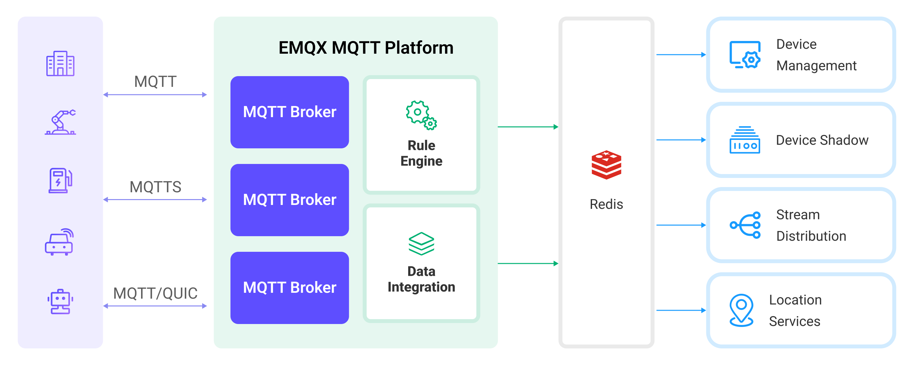

# Ingest MQTT Data into Redis


:::tip
EMQX Enterprise Edition features. EMQX Enterprise Edition provides comprehensive coverage of key business scenarios, rich data integration, product-level reliability, and 24/7 global technical support. Experience the benefits of this [enterprise-ready MQTT messaging platform](https://www.emqx.com/en/try?product=enterprise) today.
:::


[Redis](https://redis.io/) is an open-source, in-memory data store used by millions of developers as a database, cache, streaming engine, and message broker. EMQX supports integration with Redis so you can save MQTT messages and client events to Redis. With Redis data integration, you can use Redis for message caching and statistics of client events.

This page provides a detailed overview of the data integration between EMQX and Redis with practical instructions on creating and validating the data integration.

## How It Works

Redis data integration is an out-of-the-box feature in EMQX that combines the real-time data capturing and transmission capabilities of EMQX with Redis's rich data structures and powerful Key-Value read and write performance capabilities. With a built-in [rule engine](./rules.md) component, the integration simplifies the process of ingesting data from EMQX to Redis for data caching and operations., eliminating the need for complex coding.

The diagram below illustrates a typical architecture of data integration between EMQX and Redis:



Ingesting MQTT data into Redis works as follows:

1. **Message publication and reception**: Industrial IoT devices establish successful connections to EMQX through the MQTT protocol and publish real-time MQTT data from machines, sensors, and product lines based on their operational states, readings, or triggered events to EMQX. When EMQX receives these messages, it initiates the matching process within its rules engine.  
2. **Message data processing:** When a message arrives, it passes through the rule engine and is then processed by the rule defined in EMQX. The rules, based on predefined criteria, determine which messages need to be routed to Redis. If any rules specify payload transformations, those transformations are applied, such as converting data formats, filtering out specific information, or enriching the payload with additional context.
3. **Data ingestion into Redis**: Once the rules engine has processed the data, it triggers actions to execute preset Redis commands for caching, counting, and other operations on the data.
4. **Data storage and utilization**: By reading data stored in Redis, enterprises can leverage its rich data operation capabilities to implement various use cases. For example, in the logistics field, it's possible to obtain the latest status of devices, as well as carry out GPS geographical location analysis based on data and perform operations like real-time data analysis and sorting. This facilitates functionalities like real-time tracking, route recommendations, and more.

## Features and Benefits

The data integration with Redis offers a range of features and benefits tailored to ensure efficient data transmission, processing, and utilization:

- **High Performance and Scalability**: Supported by EMQX's distributed architecture and Redis's cluster mode, applications can seamlessly scale with increasing data volumes. Even for large datasets, consistent performance and responsiveness are ensured.
- **Real-time Data Streams**: EMQX is built specifically for handling real-time data streams, ensuring efficient and reliable data transmission from devices to Redis. Redis is capable of quickly executing data operations, meeting the needs for real-time data caching and making it an ideal data storage component for EMQX.
- **Real-time Data Analysis**: Redis can be used for real-time data analysis, capable of computing real-time metrics like device connections, message publishing, and specific business indicators. EMQX, on the other hand, can handle real-time message transmission and processing, providing real-time data inputs for data analysis.
- **Geographic Location Analysis**: Redis offers geospatial data structures and commands for storing and querying geographic location information. Combined with EMQX's powerful device connection capabilities, it can be widely applied in various IoT applications like logistics, connected vehicles, smart cities, and more.

## Before You Start

This section describes the preparations you need to complete before you start to create the Redis data integration, including how to set up the Redis server.

### Prerequisites

- Knowledge about EMQX data integration [rules](./rules.md)
- Knowledge about [data integration](./data-bridges.md)

### Install Redis Server

Install and run Redis via Docker:

```bash
# Start a Redis container and set the password to public
docker run --name redis -p 6379:6379 -d redis --requirepass "public"

# Access the container
docker exec -it redis bash

# Access the Redis server, use the AUTH command for authentication
redis-cli
127.0.0.1:6379> AUTH public
OK

# Verify the installation
127.0.0.1:6379> set emqx "Hello World"
OK
127.0.0.1:6379> get emqx
"Hello World"
```

Now you have successfully installed Redis and verified the installation with the `SET` and `GET` commands. For more Redis commands, see [Redis Commands](https://redis.io/commands/).

## Create a Connector

This section demonstrates how to create a Connector to connect the Redis Sink to the Redis Server.

The following steps assume that you run both EMQX and Redis on the local machine. If you have MongDB and EMQX running remotely, adjust the settings accordingly.

1. Enter the Dashboard and click **Integration** -> **Connectors**.
2. Click **Create** in the top right corner of the page.
3. On the **Create Connector** page, select **Redis** and then click **Next**.
4. Enter a name for the Connector. The name should be a combination of upper/lower case letters and numbers, for example, `my_redis`.
5. Set **Redis Mode** as the business needs, for example, `single`.
6. Enter the connection information. 
   - **Server Host**: Enter `127.0.0.1:6379`.
   - **Username**: Enter `admin`.
   - **Password**: Enter `public`.
   - **Database ID**: Enter `0`.
   - Configure the other options according to your business needs.
   - If you want to establish an encrypted connection, click the **Enable TLS** toggle switch. For more information about TLS connection, see [TLS for External Resource Access](../overview.md/#tls-for-external-resource-access).
8. Before clicking **Create**, you can click **Test Connectivity** to test if the Connector can connect to the Redis server.
9. Click the **Create** button at the bottom to complete the creation of the Connector. In the pop-up dialog, you can click **Back to Connector List** or click **Create Rule** to continue creating rules and Sink to specify the data to be forwarded to Redis. For detailed steps, see [Create a Rule and Redis Sink](#create-a-rule-and-redis-sink).

## Create a Rule and Redis Sink

This section demonstrates how to create rules for caching the last message of every client and collecting the message discard statistics. 

You need to create 2 separate Redis Sinks for the messaging caching and statistics features. Follow the specific **Redis Command Template** configuration instructions based on what type of Sinks you need to create.

1. Go to EMQX Dashboard, and click **Integration** -> **Rules**.

2. Click **Create** on the top right corner of the page.

3. Enter `cache_to_redis` as the rule ID, and set the rules in the **SQL Editor** based on the feature to use:

   - To create a rule for message caching, input the following statement, which means the MQTT messages under topic `t/#`  will be saved to Redis.

     Note: If you want to specify your own SQL syntax, make sure that you have included all fields required by the Sink in the `SELECT` part.

     ```bash
     SELECT
       *
     FROM
       "t/#"
     ```

   - To create a rule for message discard statistics, enter the following statement.

     ```bash
     SELECT
       *
     FROM
       "$events/message_dropped", "$events/delivery_dropped"
     ```

     EMQX rules define 2 message discarding events, through which the rules can be triggered and recorded in Redis:

     | Event                                    | Topic                    | Parameter                                                    |
     | ---------------------------------------- | ------------------------ | ------------------------------------------------------------ |
     | Messages are discarded during forwarding | $events/message_dropped  | [$events/message_dropped](./rule-sql-events-and-fields.md#events-message-dropped) |
     | Messages are discarded during delivery   | $events/delivery_dropped | [$events/delivery_dropped](./rule-sql-events-and-fields.md#events-delivery-dropped) |

   ::: tip

   If you are a beginner user, click **SQL Examples** and **Enable Test** to learn and test the SQL rule. 

   :::

4. Click the + **Add Action** button to define an action that will be triggered by the rule. With this action, EMQX sends the data processed by the rule to Redis.

5. Select `Redis` from the **Type of Action** dropdown list. Keep the **Action** dropdown with the default `Create Action` value. You can also select a Sink if you have created one. This demonstration will create a new Sink.

6. Enter a name for the Sink. The name should be a combination of upper/lower case letters and numbers.

7. Select the Connector `my_redis` from the **Connector** dropdown box. You can also create a new Connector by clicking the button next to the dropdown box. For the configuration parameters, see [Create a Connector](#create-a-connector).

8. Configure **Redis Command Template** based on the feature to use:

   - To create a Sink for message caching, use the Redis [HSET](https://redis.io/commands/hset/) command and hash data structure to store messages, the data format uses `clientid` as the key, and stores fields such as `username`, `payload`, and `timestamp`. To distinguish it from other keys in Redis, add an `emqx_messages` prefix to the message and separate it with `:`

     ```bash
     # HSET key filed value [field value...]
     HSET emqx_messages:${clientid} username ${username} payload ${payload} timestamp ${timestamp}
     ```

   - To create a Sink for message discard statistics, use [HINCRBY](https://redis.io/commands/hincrby/) command below to collect the discarded messages under every topic.

     ```bash
     # HINCRBY key field increment
     HINCRBY emqx_message_dropped_count ${topic} 1
     ```

     Each time the command is executed, the corresponding counter is incremented by 1.

9. Advanced settings (optional):  Choose whether to use **sync** or **async** query mode as needed. For details, see [Features of Sink](./data-bridges.md).

10. Before clicking **Create**, you can click **Test Connectivity** to test that the Sink can be connected to the Redis server.

11. Click the **Create** button to complete the Sink configuration. A new Sink will be added to the **Action Outputs.**

12. Back on the **Create Rule** page, verify the configured information. Click the **Create** button to generate the rule. 

You have now successfully created a rule for the Redis Sink. You can see the newly created rule on the **Integration** -> **Rules** page. Click the **Actions(Sink)** tab and you can see the new Redis Sink.

You can also click **Integration** -> **Flow Designer** to view the topology and you can see that the messages under topic `t/#` are sent and saved to Redis after parsing by rule `my_rule`.

### Test the Rule

Use MQTTX  to send a message to topic  `t/1`  to trigger a message caching event. If topic  `t/1`  does not have any subscribers, the message will be discarded and trigger the message discard rule.

```bash
mqttx pub -i emqx_c -u emqx_u -t t/1 -m '{ "msg": "hello Redis" }'
```

Check the running status of the two Sinks, there should be one new Matched and one Sent Successfully message.

Check whether the message is cached.

```bash
127.0.0.1:6379> HGETALL emqx_messages:emqx_c
1) "username"
2) "emqx_u"
3) "payload"
4) "{ \"msg\": \"hello Redis\" }"
5) "timestamp"
6) "1675263885119"
```

Rerun the test, the `timestamp` field should be updated.

Check whether the discarded messages are collected:

```bash
127.0.0.1:6379> HGETALL emqx_message_dropped_count
1) "t/1"
2) "1"
```

Repeat the test, the number on the counter corresponding to `t/1` should also increase.
