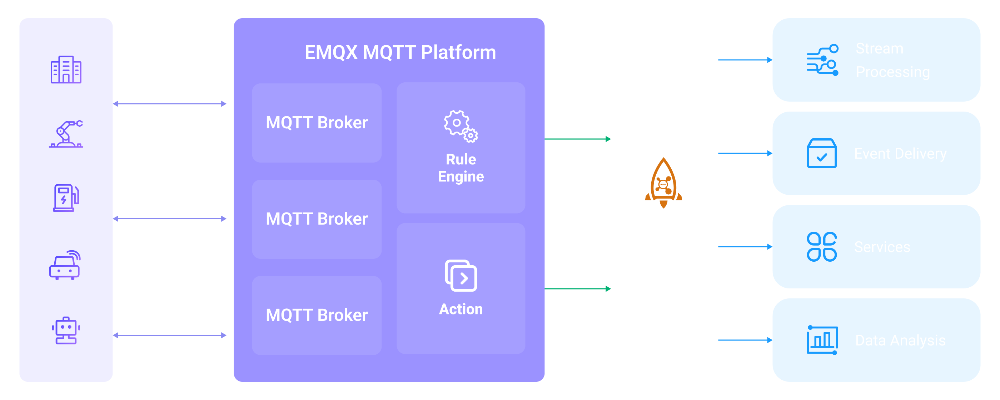

# Bridge MQTT Data into RocketMQ

::: tip

The RocketMQ data integration is an EMQX Enterprise edition feature.

:::

EMQX supports bridging data into [RocketMQ](https://rocketmq.apache.org/), so you can forward MQTT messages and client events to RocketMQ. For example, you can use RocketMQ to collect sensor data from devices, log data, etc.

This page provides a detailed overview of the data integration between EMQX and RocketMQ with practical instructions on creating and validating the data integration.

## How It Works

The RocketMQ data integration is an out-of-the-box feature in EMQX that combines the real-time data capturing and transmission capabilities of EMQX with RocketMQ's powerful message queue processing capabilities. With a built-in [rule engine](./rules.md) component, the integration simplifies the process of ingesting data from EMQX to RocketMQ for storage and management, eliminating the need for complex coding.

The diagram below illustrates a typical architecture of data integration between EMQX and RocketMQ:



Ingesting MQTT data into RocketMQ works as follows:

1. **Message publication and reception**: Industrial IoT devices establish successful connections to EMQX through the MQTT protocol and publish real-time MQTT data to EMQX. When EMQX receives these messages, it initiates the matching process within its rules engine.  
2. **Message data processing:** When a message arrives, it passes through the rule engine and is then processed by the rule defined in EMQX. The rules, based on predefined criteria, determine which messages need to be routed to RocketMQ. If any rules specify payload transformations, those transformations are applied, such as converting data formats, filtering out specific information, or enriching the payload with additional context.
3. **Data ingestion into RocketMQ**: Once the rule has processed the message, it triggers an action of forwarding the messages to RocketMQ. Processed data will be seamlessly written into RocketMQ.
4. **Data Storage and Utilization**: With the data now stored in RocketMQ, businesses can harness its querying power for various use cases. For example, in the financial industry, RocketMQ can be used as a reliable high-performance message queue to store and manage data from payment terminals and transaction systems. It can connect messages to data analysis and regulatory platforms, fulfilling requirements such as risk management, fraud detection and prevention, and regulatory compliance.

## Features and Benefits

The data integration with RocketMQ brings the following features and advantages to your business:

- **Reliable IoT Data Message Delivery**: EMQX can reliably batch and send MQTT messages to RocketMQ, enabling the integration of IoT devices with RocketMQ and application systems.
- **MQTT Message Transformation**: Using the rule engine, EMQX can filter and transform MQTT messages. Messages can undergo data extraction, filtering, enrichment, and transformation before being sent to RocketMQ.
- **Cloud-Native Elastic Scaling**: EMQX and RocketMQ are both applications built on cloud-native architecture, offering friendly Kubernetes (K8s) support and integration with the cloud-native ecosystem. They can infinitely and elastically scale to accommodate the rapid development of business needs.
- **Flexible Topic Mapping**: RocketMQ data integration supports flexible mapping of MQTT topics to RocketMQ topics, allowing easy configuration of keys (Key) and values (Value) for data in RocketMQ messages.
- **Processing Capabilities in High-Throughput Scenarios**: RocketMQ data integration supports both synchronous and asynchronous write modes, allowing for a flexible balance between latency and throughput according to different scenarios.

## Before You Start

This section describes the preparations you need to complete before you start to create the RocketMQ data integration, including how to set up the RocketMQ server.

### Prerequisites

- Knowledge about EMQX data integration [rules](./rules.md)
- Knowledge about [data integration](./data-bridges.md)

### Install RocketMQ 

1. Prepare a docker-compose file, `rocketmq.yaml`, to set up the RocketMQ.

```yaml
version: '3.9'

services:
  mqnamesrv:
    image: apache/rocketmq:4.9.4
    container_name: rocketmq_namesrv
    ports:
      - 9876:9876
    volumes:
      - ./rocketmq/logs:/opt/logs
      - ./rocketmq/store:/opt/store
    command: ./mqnamesrv

  mqbroker:
    image: apache/rocketmq:4.9.4
    container_name: rocketmq_broker
    ports:
      - 10909:10909
      - 10911:10911
    volumes:
      - ./rocketmq/logs:/opt/logs
      - ./rocketmq/store:/opt/store
      - ./rocketmq/conf/broker.conf:/etc/rocketmq/broker.conf
    environment:
        NAMESRV_ADDR: "rocketmq_namesrv:9876"
        JAVA_OPTS: " -Duser.home=/opt"
        JAVA_OPT_EXT: "-server -Xms1024m -Xmx1024m -Xmn1024m"
    command: ./mqbroker -c /etc/rocketmq/broker.conf
    depends_on:
      - mqnamesrv
```

2. Prepare the folders and configurations required for running RocketMQ.

```bash
mkdir rocketmq
mkdir rocketmq/logs
mkdir rocketmq/store
mkdir rocketmq/conf
```

3. Save the below content into `rocketmq/conf/broker.conf`.

```bash
brokerClusterName=DefaultCluster
brokerName=broker-a
brokerId=0

brokerIP1=change me to your real IP address

defaultTopicQueueNums=4
autoCreateTopicEnable=true
autoCreateSubscriptionGroup=true

listenPort=10911
deleteWhen=04

fileReservedTime=120
mapedFileSizeCommitLog=1073741824
mapedFileSizeConsumeQueue=300000
diskMaxUsedSpaceRatio=100
maxMessageSize=65536

brokerRole=ASYNC_MASTER

flushDiskType=ASYNC_FLUSH
```

4. Start the server.

```bash
docker-compose -f rocketmq.yaml up
```

5. Start a consumer.

```
docker run --rm -e NAMESRV_ADDR=host.docker.internal:9876 apache/rocketmq:4.9.4 ./tools.sh org.apache.rocketmq.example.quickstart.Consumer
```
::: tip

In Linux, you should change the `host.docker.internal` to your real IP address.

:::

## Create a Connector

This section demonstrates how to create a Connector to connect the Sink to the RocketMQ server.

The following steps assume that you run both EMQX and RocketMQ on the local machine. If you have RocketMQ and EMQX running remotely, adjust the settings accordingly.

1. Enter the EMQX Dashboard and click **Integration** -> **Connectors**.
2. Click **Create** in the top right corner of the page.
3. On the **Create Connector** page, select **RocketMQ** and then click **Next**.
4. In the **Configuration** step, configure the following information:
   - **Connector name**: Enter a name for the connector, which should be a combination of upper and lower-case letters and numbers, for example: `my_rocketmq`.
   - **Server**: Enter `127.0.0.1:9876`.
   - **Topic**: Enter `TopicTest`.
   - Leave others as default.
5. Advanced settings (optional):  For details, see [Features of Sink](./data-bridges.md#features-of-sink).
6. Before clicking **Create**, you can click **Test Connectivity** to test if the connector can connect to the RocketMQ server.
7. Click the **Create** button at the bottom to complete the creation of the connector. In the pop-up dialog, you can click **Back to Connector List** or click **Create Rule** to continue creating rules with Sinks to specify the data to be forwarded to the RocketMQ and record client events. For detailed steps, see [Create a Rule with RocketMQ Sink for Message Storage](#create-a-rule-with-rocketmq-sink-for-message-storage) and [Create a Rule with RocketMQ Sink for Events Recording](#create-a-rule-with-rocketmq-sink-for-events-recording).

## Create a Rule with RocketMQ Sink for Message Storage

This section demonstrates how to create a rule in the Dashboard for processing messages from the source MQTT topic `t/#`, and forwarding the processed data to the RocketMQ topic `TopicTest` via the configured Sink.

1. Go to EMQX Dashboard, and click **Integration** -> **Rules**.

2. Click **Create** on the top right corner of the page.

3. Enter `my_rule` as the rule ID. To create a rule for message storage, enter the following statement in the **SQL Editor**, which means the MQTT messages under topic `t/#`  will be saved to RocketMQ.

   Note: If you want to specify your own SQL syntax, make sure that you have included all fields required by the Sink in the `SELECT` part.

   ```sql
   SELECT 
     *
   FROM
     "t/#"
   ```

   ::: tip

   If you are a beginner user, click **SQL Examples** and **Enable Test** to learn and test the SQL rule. 

   :::

4. Click the + **Add Action** button to define an action to be triggered by the rule. With this action, EMQX sends the data processed by the rule to RocketMQ.

5. Select `RocketMQ` from the **Type of Action** dropdown list. Keep the **Action** dropdown with the default `Create Action` value. You can also select a Sink if you have created one. This demonstration will create a new Sink.

6. Enter a name for the Sink. The name should be a combination of upper/lower case letters and numbers.

8. From the **Connector** dropdown box, select the `my_rocketmq` created before. You can also create a new Connector by clicking the button next to the dropdown box. For the configuration parameters, see [Create a Connector](#create-a-connector).

9. Leave the **Template** empty by default.

   ::: tip

   When this value is empty the whole message will be forwarded to the RocketMQ. The actual value is JSON template data.

   :::

10. Advanced settings (optional): For details, see [Features of Sink](./data-bridges.md#features-of-sink).

11. Before clicking **Create**, you can click **Test Connectivity** to test that the Sink can be connected to the RocketMQ server.

12. Click the **Create** button to complete the Sink configuration. A new Sink will be added to the **Action Outputs.**

13. Back on the **Create Rule** page, verify the configured information. Click the **Create** button to generate the rule. 

You have now successfully created the rule for the RocketMQ Sink. You can see the newly created rule on the **Integration** -> **Rules** page. Click the **Actions(Sink)** tab and you can see the new RocketMQ Sink.

You can also click **Integration** -> **Flow Designer** to view the topology and you can see that the messages under topic `t/#` are sent and saved to RocketMQ after parsing by rule `my_rule`.

## Create a Rule with RocketMQ Sink for Events Recording

This section demonstrates how to create a rule for recording the clients' online/offline status and forwarding the events data to the RocketMQ topic `TestTopic` via a configured Sink.

The rule creation steps are similar to those in [Create a Rule with RocketMQ Sink for Message Storage](#create-a-rule-with-rocketmq-sink-for-message-storage) except for the SQL rule syntax.

The SQL rule syntax for online/offline status recording is as follows:

```sql
SELECT
  *
FROM 
  "$events/client_connected", "$events/client_disconnected"
```

::: tip

For convenience, the `TopicTest` topic will be reused to receive online/offline events.

:::

## Test the Rules

Use MQTTX to send a message to topic `t/1` to trigger an online/offline event. 

```bash
mqttx pub -i emqx_c -t t/1 -m '{ "msg": "hello RocketMQ" }'
```

Check the running status of the Sink, there should be one new incoming and one new outgoing message. 

Check whether the data is forwarded to the `TopicTest` topic. 

The following data will be printed by the consumer.
```bash
ConsumeMessageThread_please_rename_unique_group_name_4_1 Receive New Messages: [MessageExt [brokerName=broker-a, queueId=3, storeSize=581, queueOffset=0, sysFlag=0, bornTimestamp=1679037578889, bornHost=/172.26.83.106:43920, storeTimestamp=1679037578891, storeHost=/172.26.83.106:10911, msgId=AC1A536A00002A9F000000000000060E, commitLogOffset=1550, bodyCRC=7414108, reconsumeTimes=0, preparedTransactionOffset=0, toString()=Message{topic='TopicTest', flag=0, properties={MIN_OFFSET=0, MAX_OFFSET=8, CONSUME_START_TIME=1679037605342, CLUSTER=DefaultCluster}, body=[...], transactionId='null'}]]
ConsumeMessageThread_please_rename_unique_group_name_4_2 Receive New Messages: [MessageExt [brokerName=broker-a, queueId=3, storeSize=511, queueOffset=1, sysFlag=0, bornTimestamp=1679037580174, bornHost=/172.26.83.106:43920, storeTimestamp=1679037580176, storeHost=/172.26.83.106:10911, msgId=AC1A536A00002A9F0000000000000E61, commitLogOffset=3681, bodyCRC=1604860416, reconsumeTimes=0, preparedTransactionOffset=0, toString()=Message{topic='TopicTest', flag=0, properties={MIN_OFFSET=0, MAX_OFFSET=8, CONSUME_START_TIME=1679037605342, CLUSTER=DefaultCluster}, body=[...], transactionId='null'}]]
ConsumeMessageThread_please_rename_unique_group_name_4_3 Receive New Messages: [MessageExt [brokerName=broker-a, queueId=3, storeSize=458, queueOffset=2, sysFlag=0, bornTimestamp=1679037584933, bornHost=/172.26.83.106:43920, storeTimestamp=1679037584934, storeHost=/172.26.83.106:10911, msgId=AC1A536A00002A9F000000000000166E, commitLogOffset=5742, bodyCRC=383397630, reconsumeTimes=0, preparedTransactionOffset=0, toString()=Message{topic='TopicTest', flag=0, properties={MIN_OFFSET=0, MAX_OFFSET=8, CONSUME_START_TIME=1679037605342, CLUSTER=DefaultCluster}, body=[...], transactionId='null'}]]
```


