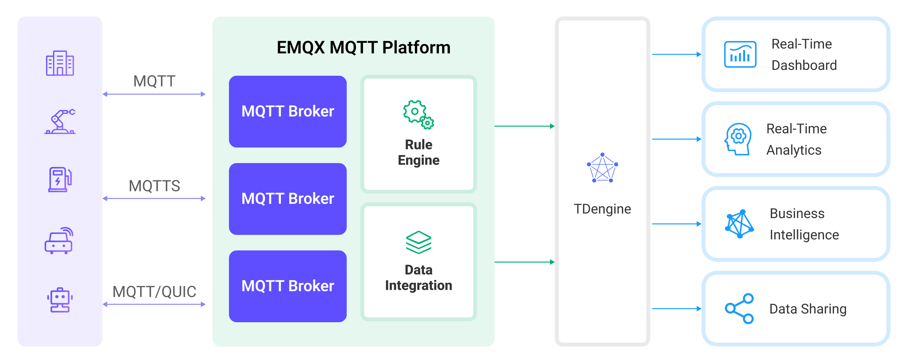

# Ingest MQTT Data into TDengine


::: tip
EMQX Enterprise Edition features. EMQX Enterprise Edition provides comprehensive coverage of key business scenarios, rich data integration, product-level reliability, and 24/7 global technical support. Experience the benefits of this [enterprise-ready MQTT messaging platform](https://www.emqx.com/en/try?product=enterprise) today.
:::


[TDengine](https://tdengine.com/) is a big data platform, designed and optimized specifically for the Internet of Things (IoT) and Industrial Internet of Things (IIoT) scenarios. At its heart lies a high-performance time-series database, characterized by its cluster-oriented architecture, cloud-native design, and minimalistic approach. EMQX supports integration with TDengine, enabling massive data transmission, storage, analysis, and distribution from a large number of devices and data collectors. It provides real-time monitoring and early warning of business operation states, offering real-time business insights.

This page provides a comprehensive introduction to the data integration between EMQX and TDengine with practical instructions on creating and validating the data integration.

## How It Works

TDengine data integration is a built-in feature in EMQX. With a built-in [rule engine](./rules.md) component, the integration simplifies the process of ingesting data from EMQX to TDengine, eliminating the need for complex coding. EMQX forwards device data to TDengine through the rule engine and Sink. Through the TDengine data integration, MQTT messages and client events can be stored in TDengine. Additionally, data updates or deletions in TDengine can be triggered by events, thereby enabling the recording of information such as device online status and historical online/offline events.

The diagram below illustrates the typical architecture of EMQX and TDengine data integration in the industrial IoT:



Taking the industrial energy consumption management scenario as an example, the workflow is as follows:

1. **Message publication and reception**: Industrial devices establish successful connections to EMQX through the MQTT protocol and regularly publish energy consumption data using the MQTT protocol. This data includes production line identifiers and energy consumption values. When EMQX receives these messages, it initiates the matching process within its rules engine.  
2. **Rule Engine Processes Messages**: The built-in rule engine processes messages from specific sources based on topic matching. When a message arrives, it passes through the rule engine, which matches it with corresponding rules and processes the message data. This can include transforming data formats, filtering specific information, or enriching messages with context information.
3. **Data ingestion into TDengine**: Rules defined in the rule engine trigger operations to write messages to TDengine. The TDengine Sink provides SQL templates that allow flexible definitions of the data format to write specific message fields to the corresponding tables and columns in TDengine.

After energy consumption data is written to TDengine, you can analyze your data in real-time using standard SQL and powerful time-series extensions, seamlessly integrating with numerous third-party batch analyses, real-time analysis, reporting tools, AI/ML tools, and visualization tools. For example:

- Connect to visualization tools such as Grafana to generate charts and display energy consumption data.
- Connect to application systems such as ERP or Power BI for production analysis and production plan adjustments.
- Connect to business systems to perform real-time energy usage analysis, facilitating data-driven energy management.

## Features and Benefits

The TDengine data integration brings the following features and advantages to your business:

- **Efficient Data Handling**: EMQX can handle a large number of IoT device connections and message throughput efficiently. TDengine excels in data writing, storage, and querying, meeting the data processing needs of IoT scenarios without overwhelming the system.
- **Message Transformation**: Messages can undergo rich processing and transformation within EMQX rules before being written to TDengine.
- **Cluster and Scalability**: EMQX and TDengine support clustering capabilities and are built on cloud-native architecture, enabling full utilization of the cloud platform's elastic storage, computing, and network resources, allowing for flexible horizontal scaling as your business grows to meet expanding demands. 
- **Advanced Querying Capabilities**: TDengine provides optimized functions, operators, and indexing techniques for efficient querying and analysis of timestamp data, enabling precise insights to be extracted from IoT time-series data.

## Before You Start

This section describes the preparations you must complete before you start creating the TDengine data integration, including how to set up the TDengine server and create data tables.

### Prerequisites

- Knowledge about EMQX data integration [rules](./rules.md)
- Knowledge about [data integration](./data-bridges.md)

### Install TDengine

Install TDengine via Docker, and then run the docker image. 

```bash
# To start the TDengine docker image 
docker run --name TDengine -p 6041:6041 tdengine/tdengine

# Access the container
docker exec -it TDengine bash

# Locate the TDengine server in the container
taos

# Create and then select the database
CREATE DATABASE mqtt;

use mqtt;
```

### Create Data Tables in TDengine

Before you create data bridges for TDengine, you need to create two data tables in TDengine database for message storage and status recording. 

1. Use the following SQL statements to create data table `t_mqtt_msg` in TDengine database. The data table stores the client ID, topic, payload, and creation time of every message. 

```sql
   CREATE TABLE t_mqtt_msg (
       ts timestamp,
       msgid NCHAR(64),
       mqtt_topic NCHAR(255),
       qos TINYINT,
       payload BINARY(1024),
       arrived timestamp
     );
```

2. Use the following SQL statements to create data table `emqx_client_events` in TDengine database. This data table stores the client ID, event type, and creation time of every event. 

```sql
     CREATE TABLE emqx_client_events (
         ts timestamp,
         clientid VARCHAR(255),
         event VARCHAR(255)
       );
```

## Create a Connector

This section demonstrates how to create a Connector to connect the Sink to the TDengine server.

The following steps assume that you run both EMQX and TDengine on the local machine. If you have TDengine and EMQX running remotely, adjust the settings accordingly.

1. Enter the EMQX Dashboard and click **Integration** -> **Connectors**.
2. Click **Create** in the top right corner of the page.
3. On the **Create Connector** page, select **TDengine** and then click **Next**.
4. In the **Configuration** step, configure the following information:
   - **Connector name**: Enter a name for the connector, which should be a combination of upper and lower case letters and numbers, for example: `my_tdengine`.
   - **Server Host**: Enter `http://127.0.0.1:6041`, or the actual URL if the TDengine server is running remotely.
   - **Database Name**: Enter `mqtt`.
   - **Username**: Enter `root`.
   - **Password**: Enter `taosdata`.
5. Advanced settings (optional):  For details, see [Features of Sink](./data-bridges.md#features-of-sink).
6. Before clicking **Create**, you can click **Test Connectivity** to test if the connector can connect to the TDengine server.
7. Click the **Create** button at the bottom to complete the creation of the connector. In the pop-up dialog, you can click **Back to Connector List** or click **Create Rule** to continue creating rules with Sinks to specify the data to be forwarded to TDengine and to record client events. For detailed steps, see [Create a Rule with TDengine Sink for Message Storage](#create-a-rule-with-tdengine-sink-for-message-storage) and [Create a Rule with TDengine Sink for Events Recording](#create-a-rule-with-tdengine-sink-for-events-recording).

## Create a Rule with TDengine Sink for Message Storage

This section demonstrates how to create a rule to specify the data to be saved into TDengine.

1. Go to EMQX Dashboard, and click **Integration** -> **Rules**.

2. Click **Create** on the top right corner of the page.

3. Enter `my_rule` as the rule ID, and create a rule for message storage in the **SQL Editor**. For example, entering the following statement means the MQTT messages under topic `t/#`  will be saved to TDengine.

   Note: If you want to specify your own SQL syntax, make sure that you have included all fields required by the Sink in the `SELECT` part.

   ```sql
     SELECT
       *,
       now_timestamp('millisecond')  as ts
     FROM
       "t/#"
   ```
   
   ::: tip

   If you are a beginner user, click **SQL Examples** and **Enable Test** to learn and test the SQL rule. 

   :::
   
4. Click the + **Add Action** button to define an action that will be triggered by the rule. With this action, EMQX sends the data processed by the rule to TDengine.

5. Select `TDengine` from the **Type of Action** dropdown list. Keep the **Action** dropdown with the default `Create Action` value. You can also select a TDengine Sink if you have created one. This demonstration will create a new Sink.

6. Enter a name for the Sink. The name should combine upper/lower case letters and numbers.

7. Select the `my_tdengine` just created from the **Connector** dropdown box. You can also create a new Connector by clicking the button next to the dropdown box. For the configuration parameters, see [Create a Connector](#create-a-connector).

8. Configure the **SQL Template** for the Sink. You can use the following SQL to complete data insertion. It also supports batch setting via CSV file. For details, refer to [Batch Setting](#batch-setting).

   ::: tip

   There is a breaking change in EMQX 5.1.1. Earlier than this version, string-type values were automatically quoted. However, starting from EMQX 5.1.1, users are required to manually quote these values.

   :::

   ```sql
   INSERT INTO t_mqtt_msg(ts, msgid, mqtt_topic, qos, payload, arrived) 
       VALUES (${ts}, '${id}', '${topic}', ${qos}, '${payload}', ${timestamp})
   ```
   
9. Advanced settings (optional):  Choose whether to use **sync** or **async** query mode as needed. For details, see [Features of Sink](./data-bridges.md#features-of-sink).

10. Before clicking **Create**, you can click **Test Connectivity** to test that the Sink can be connected to the TDengine. 

11. Click the **Create** button to complete the Sink configuration. A new Sink will be added to the **Action Outputs.**

12. Back on the **Create Rule** page, verify the configured information. Click the **Create** button to generate the rule. 

You have now successfully created the rule for the TDengine Sink. You can see the newly created rule on the **Integration** -> **Rules** page. Click the **Actions(Sink)** tab and you can see the new TDengine Sink.

You can also click **Integration** -> **Flow Designer** to view the topology and you can see that the messages under topic `t/#` are sent and saved to TDengine after parsing by rule `my_rule`.

### Batch Setting

In TDengine, a single data entry may contain hundreds of data points, making the task of writing SQL statements challenging. To address this issue, EMQX offers a feature for batch setting SQL.

When editing the SQL template, you can use the batch setting feature to import fields for insertion operations from a CSV file.

1. Click the **Batch Setting** button below the **SQL Template** to open the **Import Batch Setting** popup.

2. Follow the instructions to download the batch setting template file, then fill in the key-value pairs of Fields in the template file. The default template file content is as follows:

   | Field      | Value             | Char Value | Remarks (Optional) |
   | ---------- | ----------------- | ---------- | ------------------ |
   | ts         | now               | FALSE      | Example Remark     |
   | msgid      | ${id}             | TRUE       |                    |
   | mqtt_topic | ${topic}          | TRUE       |                    |
   | qos        | ${qos}            | FALSE      |                    |
   | temp       | ${payload.temp}   | FALSE      |                    |
   | hum        | ${payload.hum}    | FALSE      |                    |
   | status     | ${payload.status} | FALSE      |                    |

   - **Field**: Field key, supports constants or ${var} format placeholders.
   - **Value**: Field value, supports constants or ${var} format placeholders. Although SQL requires character types to be wrapped in quotes, quotes are not needed in the template file, but whether the field is a character type is specified in the `Char Value` column.
   - **Char Value**: Used to specify whether the field is a character type, to add quotes to the field when generating SQL upon import. If the field is a character type, fill in `TRUE` or `1`; otherwise, fill in `FALSE` or `0`.
   - **Remarks**: Used only for notes within the CSV file, cannot be imported into EMQX.

   Note that the data in the CSV file for batch setting should not exceed 2048 rows.

3. Save the filled template file and upload it to the **Import Batch Setting** popup, then click **Import** to complete the batch setting.

4. After importing, you can further adjust the SQL in the **SQL Template**, such as setting table names, formatting SQL code, etc.

## Create a Rule with TDengine Sink for Events Recording

This section demonstrates how to create a rule for the online/offline status recording.

The rule creation steps are similar to those in [Creating a rule with TDengine Sink for Message Storage](#create-a-rules-with-tdengine-sink-for-message-storage) except for the SQL rule syntax and SQL template.

The SQL rule syntax for online/offline status recording is as follows:

```sql
SELECT
      *,
      now_timestamp('millisecond')  as ts
    FROM 
      "$events/client_connected", "$events/client_disconnected"
```

The SQL template for the Sink is as follows:

Note: The fields should not include quotation marks, and do not end SQL statements with a semicolon (`;`).

```sql
INSERT INTO emqx_client_events(ts, clientid, event) VALUES (
      ${ts},
      '${clientid}',
      '${event}'
    )
```

## Test the Rules

Use MQTTX  to send a message to topic  `t/1`  to trigger an online/offline event. 

```bash
mqttx pub -i emqx_c -t t/1 -m '{ "msg": "hello TDengine" }'
```

Check the running status of the two Sinks, there should be 1 new incoming and 1 new outgoing message and 2 event records.

Check whether the data is written into the `t_mqtt_msg` data table. 

```bash
taos> select * from t_mqtt_msg;
           ts            |             msgid              |           mqtt_topic           | qos  |            payload             |         arrived         |
==============================================================================================================================================================
 2023-02-13 06:10:53.787 | 0005F48EB5A83865F440000014F... | t/1                            |    0 | { "msg": "hello TDengine" }    | 2023-02-13 06:10:53.787 |
Query OK, 1 row(s) in set (0.002968s)
```

`emqx_client_events`  table:

```bash
taos> select * from emqx_client_events;
           ts            |            clientid            |             event              |
============================================================================================
 2023-02-13 06:10:53.777 | emqx_c                         | client.connected               |
 2023-02-13 06:10:53.791 | emqx_c                         | client.disconnected            |
Query OK, 2 row(s) in set (0.002327s)
```
