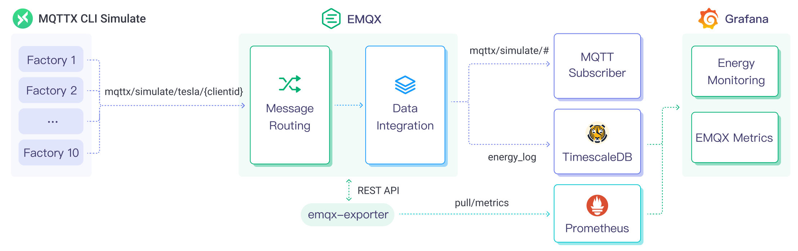

# Ingest MQTT Data into TimescaleDB



::: tip

EMQX Enterprise Edition features. EMQX Enterprise Edition provides comprehensive coverage of key business scenarios, rich data integration, product-level reliability, and 24/7 global technical support. Experience the benefits of this [enterprise-ready MQTT messaging platform](https://www.emqx.com/en/try?product=enterprise) today.

:::



[TimescaleDB](https://www.timescale.com/) (Timescale) is a database specifically designed for storing and analyzing time-series data. Its exceptional data throughput and reliable performance make it an ideal choice for the Internet of Things (IoT) domain, providing efficient and scalable data storage and analysis solutions for IoT applications.

This page provides a comprehensive introduction to the data integration between EMQX and TimescaleDB with practical instructions on creating a rule and data bridge.

## How It Works

TimescaleDB data integration is a built-in feature in EMQX that combines the real-time data capturing and transmission capabilities of EMQX with the data storage and analysis capabilities of TimescaleDB. With a built-in [rule engine](./rules.md) component, the integration simplifies the process of ingesting data from EMQX to TimescaleDB for storage and analysis, eliminating the need for complex coding.

The diagram below illustrates the typical architecture of EMQX and TimescaleDB data integration in the industrial IoT.



EMQX and TimescaleDB provide a scalable IoT platform for efficiently collecting and analyzing energy consumption data in real-time. In this architecture, EMQX serves as the IoT platform, responsible for device access, message transmission, and data routing, while TimescaleDB acts as the data storage and analysis platform, handling data storage and analysis functions.

EMQX forwards device data to TimescaleDB through the rule engine and data bridge. TimescaleDB analyzes the data using SQL statements, generates reports, charts, and other data analysis results, and displays them to users through TimescaleDB's visualization tools. The workflow is as follows:

1. **Message publication and reception**: Industrial devices establish successful connections to EMQX through the MQTT protocol and regularly publish energy consumption data using the MQTT protocol. This data includes production line identifiers and energy consumption values. When EMQX receives these messages, it initiates the matching process within its rules engine.  
3. **Rule Engine Processes Messages**: The built-in rule engine processes messages from specific sources based on topic matching. When a message arrives, it passes through the rule engine, which matches it with corresponding rules and processes the message data. This can include transforming data formats, filtering specific information, or enriching messages with context information.
4. **Data ingestion into TimescaleDB**: Rules defined in the rule engine trigger operations to write messages to TimescaleDB. The TimescaleDB data bridge provides SQL templates that allow flexible definitions of the data format to write specific message fields to the corresponding tables and columns in TimescaleDB.

After energy consumption data is written to TimescaleDB, you can flexibly use SQL statements to analyze the data. For example:

- Connect to visualization tools such as Grafana to generate charts and display energy consumption data.
- Connect to application systems such as ERP for production analysis and production plan adjustments.
- Connect to business systems to perform real-time energy usage analysis, facilitating data-driven energy management.

## Features and Benefits

Using TimescaleDB data bridging in EMQX brings the following features and advantages to your business:

- **Efficient Data Handling**: EMQX can handle a large number of IoT device connections and message throughput efficiently. TimescaleDB excels in data writing, storage, and querying, meeting the data processing needs of IoT scenarios without overwhelming the system.
- **Message Transformation**: Messages can undergo rich processing and transformation within EMQX rules before being written to TimescaleDB.
- **Efficient Storage and Scalability**: EMQX and TimescaleDB both have cluster scaling capabilities, allowing flexible horizontal scaling as your business grows to meet expanding demands.
- **Advanced Querying Capabilities**: TimescaleDB provides optimized functions, operators, and indexing techniques for efficient querying and analysis of timestamp data, enabling precise insights to be extracted from IoT time-series data.

## Before You Start

This section describes the preparations you need to complete before you start to create a TimescaleDB data bridge, including installing Timescale and creating a data table.

### Prerequisites

- Knowledge about EMQX data integration [rules](./rules.md)
- Knowledge about [data bridge](./data-bridges.md)

### Install Timescale and Create Data Table

EMQX supports integration with self-deployed TimescaleDB or Timescale Service on the cloud. You can use Timescale Service as a cloud service or deploy a TimescaleDB instance using Docker.

:::: tabs 
::: tab Timescale Service

1. If you do not have a Timescale account, create an account by referring to [Create your Timescale account](https://docs.timescale.com/getting-started/latest/services/#create-your-timescale-account).

2. Log in to Timescale portal and [Create Timescale service](https://docs.timescale.com/getting-started/latest/services/#create-your-first-service). Save the password for your service.

3. Get the connection information from the service overview page. The fields required by EMQX include **Database name**, **Host**, **Port,** and **Username**.

4. [Connect to service](https://docs.timescale.com/getting-started/latest/services/#connect-to-your-service) with `psql client`.

   ```bash
   # Connect to service by service URL
   psql "postgres://tsdbadmin@xxxxx.xxxxx.tsdb.cloud.timescale.com:32541/tsdb?sslmode=require"
   # Use password in you saved in previous step
   Password for user tsdbadmin:
   ```

5. Create a table `sensor_data` to save the data in the message from the client.

   ```sql
   CREATE TABLE sensor_data (
       time        TIMESTAMPTZ       NOT NULL,
       location    TEXT              NOT NULL,
       temperature DOUBLE PRECISION  NULL,
       humidity    DOUBLE PRECISION  NULL
   );
   
   SELECT create_hypertable('sensor_data', 'time');
   ```

After the table is successfully created, you can view the information of the table `sensor_data` under the **Explorer** tab in Services.


:::

::: tab TimescaleDB Docker

1. If you do not Docker environment, refer to [Install Docker](https://docs.docker.com/install/).

2. Create a TimescaleDB container with Docker, and set the password of the database by `POSTGRES_PASSWORD` environment variable.

   ```bash
   docker run -d --name timescaledb \
       -p 5432:5432 \
       -e POSTGRES_PASSWORD=public \
       timescale/timescaledb:latest-pg13
   ```

3. Create a database to save the client data.

   ```bash
   docker exec -it timescaledb psql -U postgres
   
   ## create tsdb database
   > CREATE database tsdb;
   
   > \c tsdb;
   ```

4. Create a table `sensor_data` to save the data in the message from the client.

   ```sql
   CREATE TABLE sensor_data (
       time        TIMESTAMPTZ       NOT NULL,
       location    TEXT              NOT NULL,
       temperature DOUBLE PRECISION  NULL,
       humidity    DOUBLE PRECISION  NULL
   );
   
   SELECT create_hypertable('sensor_data', 'time');
   ```

:::
::::

## Create Rule and Data Bridge

This section demonstrates how to create a rule in EMQX to process messages from the source MQTT topic `t/#`  and send the processed results through a configured data bridge to TimescaleDB. 

The instructions below assume that you run both EMQX and Timescale (if self-deployed) on the local machine. If you have Timescale and EMQX running remotely, adjust the settings accordingly.

1. Go to EMQX Dashboard and click **Integration** -> **Rules** from the left navigation menu.

2. Click **+ Create** on the top right corner of the page.

3. On the Create Rule page, enter a rule ID `my_rule`. 

4. Enter the following SQL rule in **SQL Editor** to save the MQTT message with the topic `t/#` to TimescaleDB：

   ```sql
   SELECT
     payload.temp as temp,
     payload.humidity as humidity,
     payload.location as location
   FROM
       "t/#"
   ```

   Note: If you are a beginner user, click **SQL Examples** and **Enable Test** to learn and test the SQL rule. 

5. Click the **+ Add Action** button to define an action that will be triggered by the rule. Select **Forwarding with Data Bridge** from the dropdown list. With this action, EMQX sends the data processed by the rule to TimescaleDB. 

6. Click the **+** icon next to the **Data bridge** drop-down box to create a data bridge. Select `TimescaleDB` from the **Type of Data Bridge** drop-down list. 

7. Enter a name for the data bridge. The name should be a combination of upper/lower case letters and numbers.

8. Enter the connection information according to how the TimescaleDB is deployed. If it is deployed using Docker, input `127.0.0.1:5432` as **Server Host**, `tsdb` as **Database Name**,  `postgres` as **Username,** and `public` as **Password**.

9. Configure the **SQL Template** using the following SQL statement for data inserting.

   Note: This is a preprocessed SQL, so the fields should not be enclosed in quotation marks, and do not write a semicolon at the end of the statements.

   ```sql
     INSERT INTO
    sensor_data (time, location, temperature, humidity)
     VALUES
      (NOW(), ${location}, ${temp}, ${humidity})
   ```

10. Advanced settings (optional):  See [Advanced Configurations](#advanced-configurations).

11. Click the **Add** button to complete the data bridge configuration. You will be redirected back to the **Add Action** page. Select the TimescaleDB Data Bridge you just created from the **Data bridge** drop-down list. Click the **Add** button at the bottom to include this action in the rule.

12. Back on the **Create Rule** page, verify the configured information. Click the **Create** button to generate the rule. The rule you created is shown in the rule list and the **status** should be connected.

Now you have successfully created the data bridge to Timescale. You can click **Integration** -> **Flows** to view the topology. It can be seen that the messages under topic `t/#`  are sent and saved to Timescale after parsing by the rule `my_rule`. 


### Test Rule and Data Bridge

Use MQTTX to send a message to topic `t/1` and trigger an online/offline event at the same time：

```bash
mqttx pub -i emqx_c -t t/1 -m '{"temp":24,"humidity":30,"location":"hangzhou"}'
```

Check the running status of the data bridge, there should be one new Matched and one Sent Successfully message.

Verify the Timescale table `sensor_data`. New records should be inserted:

```bash
tsdb=# select * from sensor_data;
             time              | location | temperature | humidity 
-------------------------------+----------+-------------+----------
 2023-07-10 08:28:48.813988+00 | hangzhou |          24 |       30
 2023-07-10 08:28:57.737768+00 | hangzhou |          24 |       30
 2023-07-10 08:28:58.599537+00 | hangzhou |          24 |       30
(3 rows)
```

## Advanced Configurations

This section delves deeper into the advanced configuration options available for the TimescaleDB data bridge. When configuring the data bridge in the Dashboard, navigate to **Advanced Settings** to tailor the following parameters to meet your specific needs.

| **Fields**                | **Descriptions**                                             | **Recommended Value** |
| ------------------------- | ------------------------------------------------------------ | --------------------- |
| **Connection Pool Size**  | Specifies the number of concurrent connections that can be maintained in the connection pool when interfacing with the Timescale service. This option helps in managing the application's scalability and performance by limiting or increasing the number of active connections between EMQX and TimescaleDB.<br/>**Note**: Setting an appropriate connection pool size depends on various factors such as system resources, network latency, and the specific workload of your application. Too large a pool size may lead to resource exhaustion, while too small a size may limit throughput. | `8`                   |
| **Start Timeout**         | Determines the maximum time interval, in seconds, that the EMQX data bridge will wait for an auto-started resource to reach a healthy state before responding to resource creation requests. This setting helps ensure that the data bridge does not proceed with operations until it verifies that the connected resource—such as a database instance in TimescaleDB—is fully operational and ready to handle data transactions. | `5`                   |
| **Buffer Pool Size**      | Specifies the number of buffer worker processes that will be allocated for managing data flow in egress-type bridges between EMQX and TimescaleDB. These worker processes are responsible for temporarily storing and handling data before it is sent to the target service. This setting is particularly relevant for optimizing performance and ensuring smooth data transmission in egress (outbound) scenarios. For bridges that only deal with ingress (inbound) data flow, this option can be set to "0" as it is not applicable. | `16`                  |
| **Request TTL**           | The "Request TTL" (Time To Live) configuration setting specifies the maximum duration, in seconds, that a request is considered valid once it enters the buffer. This timer starts ticking from the moment the request is buffered. If the request stays in the buffer for a period exceeding this TTL setting or if it is sent but does not receive a timely response or acknowledgment from TimescaleDB, the request is deemed to have expired. | `45`                  |
| **Health Check Interval** | Specifies the time interval, in seconds, at which the data bridge will perform automated health checks on the connection to TimescaleDB. | `15`                  |
| **Max Buffer Queue Size** | Specifies the maximum number of bytes that can be buffered by each buffer worker in the TimescaleDB data bridge. Buffer workers temporarily store data before it is sent to TimescaleDB, serving as an intermediary to handle data flow more efficiently. Adjust the value according to your system's performance and data transfer requirements. | `256`                 |
| **Max Batch Size**        | Specifies the maximum size of data batches transmitted from EMQX to TimescaleDB in a single transfer operation. By adjusting the size, you can fine-tune the efficiency and performance of data transfer between EMQX and TimescaleDB.<br />If the "Max Batch Size" is set to "1," data records are sent individually, without being grouped into batches. | `1`                   |
| **Query Mode**            | Allows you to choose `asynchronous` or `synchronous` query modes to optimize message transmission based on different requirements. In asynchronous mode, writing to TimescaleDB does not block the MQTT message publish process. However, this might result in clients receiving messages ahead of their arrival in TimescaleDB. | `Async`               |
| **Inflight Window**       | An "in-flight query" refers to a query that has been initiated but has not yet received a response or acknowledgment. This setting controls the maximum number of in-flight queries that can exist simultaneously when the data bridge is communicating with TimescaleDB.<br/>When the **Query Mode** is set to `async` (asynchronous), the "Inflight Window" parameter gains special importance. If it is crucial for messages from the same MQTT client to be processed in strict order, you should set this value to 1. | `100`                 |

## More Information

Check out the following links to learn more:

**Blogs**:

[MQTT Performance Benchmark Testing: EMQX-TimescaleDB Integration](https://www.emqx.com/en/blog/mqtt-performance-benchmark-series-emqx-timescaledb-integration)

[Build an IoT Time-Series Data Application for Industrial Energy Monitoring with MQTT and Timescale](https://www.emqx.com/en/blog/build-an-iot-time-series-data-application-for-energy-storage-with-mqtt-and-timescale)
