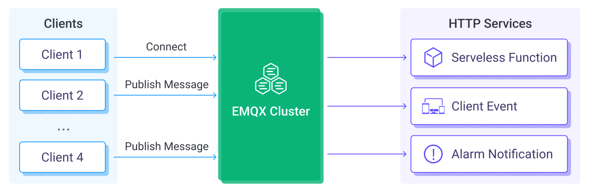

# Ingest MQTT Data into HTTP Server

The HTTP server data integration provides a quick way to integrate EMQX with external HTTP services. It supports flexible configuration of request methods and request data formats, offers secure communication through HTTPS, and provides authentication mechanisms. It can efficiently and flexibly transmit client messages and event data in real-time, enabling scenarios such as IoT device state notifications, alert notifications, and data integration.

This page provides a detailed overview of the features and capabilities of the data integration with HTTP server and offers practical guidance on setting up an HTTP server data integration.

:::tip 

For users who need to integrate with HTTP services but do not require data processing using rules, we recommend using [Webhook](./webhook.md) as it is simpler and easier to use. 

:::

## How It Works

HTTP server data integration is an out-of-the-box feature in EMQX, allowing integration with external HTTP services through simple configuration. With the HTTP service, users can write code in their preferred programming language and framework to implement custom, flexible, and complex data processing logic.



EMQX forwards device events and data to the HTTP server through the rule engine and data bridge. The workflow is as follows:

1. **Devices Connect to EMQX**: When IoT devices successfully connect, an online event is triggered, containing device ID, source IP address, and other attributes.
2. **Devices Publish Messages**: Devices publish telemetry and status data through specific topics, triggering the rule engine.
3. **Rule Engine Processes Messages**: Using the built-in rule engine, MQTT messages and events from specific sources are processed based on topic matching. The rule engine matches corresponding rules and processes messages and events, such as converting data formats, filtering specific information, or enriching messages with context information.
4. **Bridging to HTTP Server**: The configured rule triggers the action of forwarding the processed messages and events to the HTTP server. Users can extract data from rule processing results and dynamically construct request headers, request bodies, or even URLs, allowing flexible integration of data with external services.

After events and message data are sent to the HTTP server, you can perform flexible processing, such as:

- Implementing device status updates and event logging for developing device management systems based on data.
- Writing message data to a database to achieve lightweight data storage functionality.
- For abnormal data filtered by SQL rules, you can directly use the HTTP service to trigger alert notification systems for device anomaly monitoring.

## Features and Benefits

Using EMQX's HTTP server integration can bring the following advantages to your business:

- **Extend Data Delivery to More Downstream Systems**: The HTTP service enables seamless integration of MQTT data with various external systems, such as analytics platforms and cloud services, facilitating data distribution across multiple systems.
- **Real-time Responses and Business Process Triggering**: Through the HTTP service, external systems can receive MQTT data in real-time and trigger business processes, ensuring quick responses. For example, receiving alert data and triggering business workflows.
- **Custom Data Processing**: External systems can perform secondary processing on received data as per their needs, allowing for more complex business logic that is not limited by EMQX's capabilities.
- **Loosely Coupled Integration**: The HTTP service uses a simple HTTP interface, providing a loosely coupled approach to system integration.

In summary, the HTTP service offers real-time, flexible, and customizable data integration capabilities for your business, catering to flexible and diverse application development needs.

## Before You Start

This section describes the preparations you need to complete before you start to create the HTTP server data bridge, including setting up a simple HTTP server.

### Prerequisites

- Knowledge about EMQX data integration [rules](./rules.md)

- Knowledge about [Data Integration](./data-bridges.md)


### Set up a Simple HTTP Server

1. Use Python to build a simple HTTP service. This HTTP service will receive the `POST /` requests and will return `200 OK` after printing the requested content:

```bash
from flask import Flask, json, request

api = Flask(__name__)

@api.route('/', methods=['POST'])
def print_messages():
  reply= {"result": "ok", "message": "success"}
  print("got post request: ", request.get_data())
  return json.dumps(reply), 200

if __name__ == '__main__':
  api.run()
```

2. Save the above code as `http_server.py` file. Then start the server by running:

```shell
pip install flask

python3 http_server.py
```

## Create an HTTP Server Data Bridge

This section demonstrates how to configure an HTTP server data bridge to connect to the HTTP server.

1. Go to EMQX Dashboard, and click **Integration** -> **Connector**.

2. Click **Create** on the top right corner of the page. Click to select the **HTTP Server** and click **Next**:

3. Input a name for the data bridge. The name should be a combination of upper/lower case letters or numbers, for example, `my_httpserver`. 

   Set **URL** to `http://localhost:5000`. For the rest, you can keep the default value.

4. Before clicking **Create**, you can click **Test Connectivity** to test that the bridge can connect to the HTTP server.

5. Click **Create** to finish the creation of the data bridge.

   A confirmation dialog will appear and ask if you like to create a rule using this data bridge, you can click **Create Rule** to continue creating rules to specify the data to be saved into HTTP Server. You can also create rules by following the steps in [Create a Rule for HTTP Server Data Bridge](#create-a-rule-for-http-server-data-bridge).

Now the HTTP server data bridge should appear in the data bridge list (**Integration** -> **Connector**) with **Resource Status** as **Connected**. 

## Create a Rule for HTTP Server Data Bridge

Now you have successfully created the data bridges to HTTP Server. you can continue to create a rule to forward data to the HTTP Server.

1. Go to EMQX Dashboard, and click **Integration** -> **Rules**.

2. Click **Create** on the top right corner of the page.

3. Input `my_rule` as the rule ID, and set the rules in the **SQL Editor**. 

4. Input the following statement in the **SQL Editor** as an example, which means the MQTT messages under topic `t/#`  will be saved to the HTTP server.

   Note: If you want to specify your own SQL syntax, make sure that you have included all fields required by the data bridge in the `SELECT` part.

   ```bash
   SELECT
     *
   FROM
     "t/#"
   ```

5. Click the **Add Action** button, select **Forwarding with Data Bridge** from the dropdown list and then select the data bridge you just created under **Data bridge**. Then click the **Add** button.
6. Click the **Create** button at the page bottom to finish the creation.

Now a rule to forward data to the HTTP server via an HTTP Server data bridge is created. You can click **Integration** -> **Flow Designer** to view the topology. It can be seen that the messages under topic `t/#` are sent and saved to the HTTP server.

## Test Rule

Use MQTTX  to send a message to topic  `t/1`  to trigger an online/offline event.

```bash
mqttx pub -i emqx_c -t t/1 -m '{ "msg": "hello HTTP Server" }'
```

Check the running status of the two data bridges, there should be one new incoming and one new outgoing message.

Verify whether the message has been sent to the HTTP server:

```
python3 http_server.py
 * Serving Flask app 'http_server' (lazy loading)
 * Environment: production
   WARNING: This is a development server. Do not use it in a production deployment.
   Use a production WSGI server instead.
 * Debug mode: off
 * Running on http://127.0.0.1:5000 (Press CTRL+C to quit)

got post request:  b'hello HTTP Server'
```
