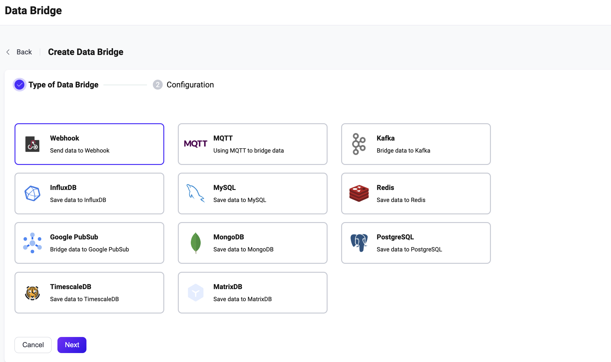
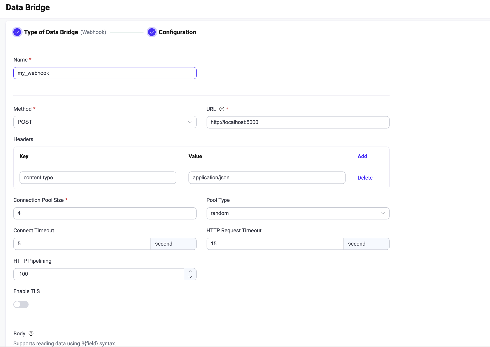

# Ingest Data into Webhook

Webhook is the channel through which EMQX sends messages to HTTP services.
Through webhooks, users can send to the remote HTTP service from a local topic,
or from the output of a rule.

:::tip Prerequisites

- Knowledge about EMQX data integration [rules](./rules.md)

- Knowledge about [data bridge](./data-bridges.md)

  :::

## Feature List

- [Connection pool](./data-bridges.md)
- [Buffer queue](./data-bridges.md)

## Quick Start Tutorial

This section introduces how to configure a Webhook data bridge, including how to set up an HTTP server, configure a Webhook data bridge to connect to the HTTP server, and test the data bridge and rule.

### Set up a Simple HTTP Server

1. Use Python to build a simple HTTP service. This HTTP service will receive the `POST /` requests and will return `200 OK` after printing the requested content:

```bash
from flask import Flask, json, request

api = Flask(__name__)

@api.route('/', methods=['POST'])
def print_messages():
  reply= {"result": "ok", "message": "success"}
  print("got post request: ", request.get_data())
  return json.dumps(reply), 200

if __name__ == '__main__':
  api.run()
```

2. Save the above code as `http_server.py` file. Then start the server by running:

```shell
pip install flask

python3 http_server.py
```

### Create a Webhook Data Bridge

1. Go to EMQX Dashboard, and click **Data Integration** -> **Data Bridge**.

2. Click **Create** on the top right corner of the page. Click to select the **Webhook** and click **Next**:



3. Input a name for the data bridge. The name should be a combination of upper/lower case letters or numbers, for example, `my_webhook`. 

   Set **URL** to `http://localhost:5000`. For the rest, you can keep the default value.



4. Before clicking **Create**, you can click **Test Connectivity** to test that the bridge can connect to the HTTP server.

5. Click **Create** to finish the creation of the data bridge.

   A confirmation dialog will appear and ask if you like to create a rule using this data bridge, you can click **Create Rule** to continue creating rules to specify the data to be saved into Redis. You can also create rules by following the steps in [Create a Rule for Webhook Data Bridge](#create-a-rule-for-webhook-data-bridge).

Now the Webhook data bridge should appear in the data bridge list (**Data Integration** -> **Data Bridge**) with **Resource Status** as **Connected**. 

### Create a Rule for Webhook Data Bridge

Now you have successfully created the data bridges to HTTP Server. you can continue to create a rule to forward data to the HTTP Server.

1. Go to EMQX Dashboard, and click **Data Integration** -> **Rules**.

2. Click **Create** on the top right corner of the page.

3. Input `my_rule` as the rule ID, and set the rules in the **SQL Editor**. 

4. Input the following statement in the **SQL Editor** as an example, which means the MQTT messages under topic `t/#`  will be saved to the HTTP server.

   Note: If you want to specify your own SQL syntax, make sure that you have included all fields required by the data bridge in the `SELECT` part.

   ```bash
   SELECT
     *
   FROM
     "t/#"
   ```

5. Click the **Add Action** button, select **Forwarding with Data Bridge** from the dropdown list and then select the data bridge you just created under **Data bridge**. Then click the **Add** button.
6. Click the **Create** button at the page bottom to finish the creation.

Now a rule to forward data to the HTTP server via a Webhook data bridge is created. You can click **Data Integration** -> **Flows** to view the topology. It can be seen that the messages under topic `t/#` are sent and saved to the HTTP server.

### Test the Data Bridge and Rule

Use MQTTX  to send a message to topic  `t/1`  to trigger an online/offline event.

```bash
mqttx pub -i emqx_c -t t/1 -m '{ "msg": "hello Webhook" }'
```

Check the running status of the two data bridges, there should be one new incoming and one new outgoing message.

Verify whether the message has been sent to the HTTP server:

```
python3 http_server.py
 * Serving Flask app 'http_server' (lazy loading)
 * Environment: production
   WARNING: This is a development server. Do not use it in a production deployment.
   Use a production WSGI server instead.
 * Debug mode: off
 * Running on http://127.0.0.1:5000 (Press CTRL+C to quit)

got post request:  b'hello Webhook'
```
