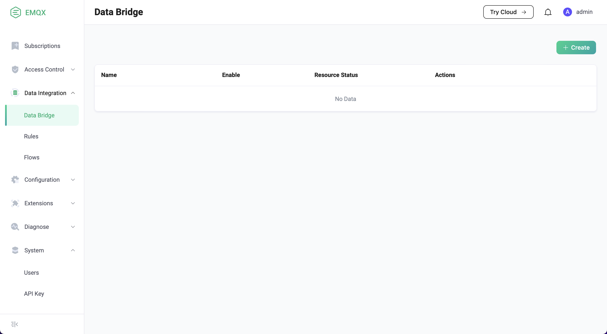
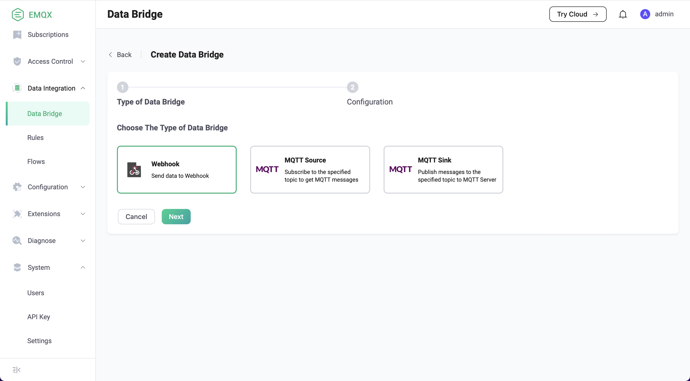
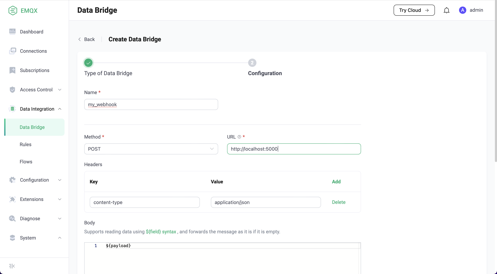
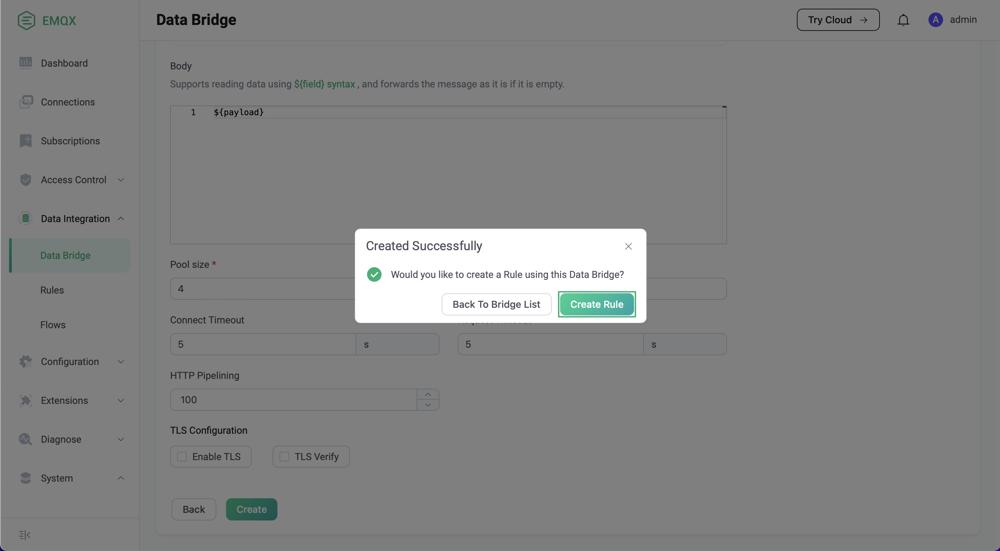

# Webhook

A WebHook is an HTTP callback. EMQX uses WebHooks to POST a message to HTTP services.
Through webhooks, users can send messages to remote HTTP services from a local topic.

## Prerequisites

- Knowledge about EMQX data integration [rules](./rules.md)
- Knowledge about [data bridge](./data-bridges.md)

## Features supported

- [Connection pool](./data-bridges.md#连接池) <!-- TODO 确认改版后知否支持-->
- [Buffer queue](./data-bridges.md#缓存队列)

## Quick Starts

We will illustrate how to create an HTTP server and a Webhook, and then create a data bridge to connect the Webhook and the HTTP server. 

### Setup a Simple HTTP Server

First, we use Python to build a simple HTTP service. This HTTP service will receive the `POST /` requests and will return `200 OK` after printing the requested content:

```
from flask import Flask, json, request

api = Flask(__name__)

@api.route('/', methods=['POST'])
def print_messages():
  reply= {"result": "ok", "message": "success"}
  print("got post request: ", request.get_data())
  return json.dumps(reply), 200

if __name__ == '__main__':
  api.run()
```

Save the above code as `http_server.py` file. Then start the server by running:

```shell
pip install flask

python3 http_server.py
```

### Create a Webhook

1. Go to EMQX Dashboard, click **Data Integration** -> **Data Bridge**.



2. Click **Create** on the top right corner of the page. Click to select the **Webhook** and click **Next**:



3. Input a name for the data bridge, for example, `my_webhook`. Note: It should be a combination of upper/lower case letters or numbers. and set **URL** to `http://localhost:5000`. For the rest, you can keep the default value. 



4. Then click **Create** to finish the creation of the data bridge. Now we can continue to create rules to specify the data to be saved into the HTTP server. We will click **Create Rule** in the pop-up dialog box



5. Here we want to save the MQTT messages under topic `t/#`  to the HTTP server, we can use the SQL statements below. Note: If you are testing with your SQL, please ensure you have included all required fields in the `SELECT` part. 

   ```
   SELECT 
     *
   FROM
     "t/#"
   ```

6. Then click the **Add Action** button, select **Forwarding with Data Bridge** from the dropdown list and then select the data bridge we just created under **Data bridge**. Then click **Add** button.
7. Click **Create** at the page bottom to finish the creation. 

### Test

Use MQTTX  to send a message to topic  `t/1`  to trigger an online/offline event. 

```bash
mqttx pub -i emqx_c -t t/1 -m '{ "msg": "hello Webhook" }'
```

Check the running status of the two data bridges, there should be one new incoming and one new outgoing message. 

Verify whether the message has been sent to the HTTP server:

```
python3 http_server.py
 * Serving Flask app 'http_server' (lazy loading)
 * Environment: production
   WARNING: This is a development server. Do not use it in a production deployment.
   Use a production WSGI server instead.
 * Debug mode: off
 * Running on http://127.0.0.1:5000 (Press CTRL+C to quit)

got post request:  b'hello Webhook'
```
