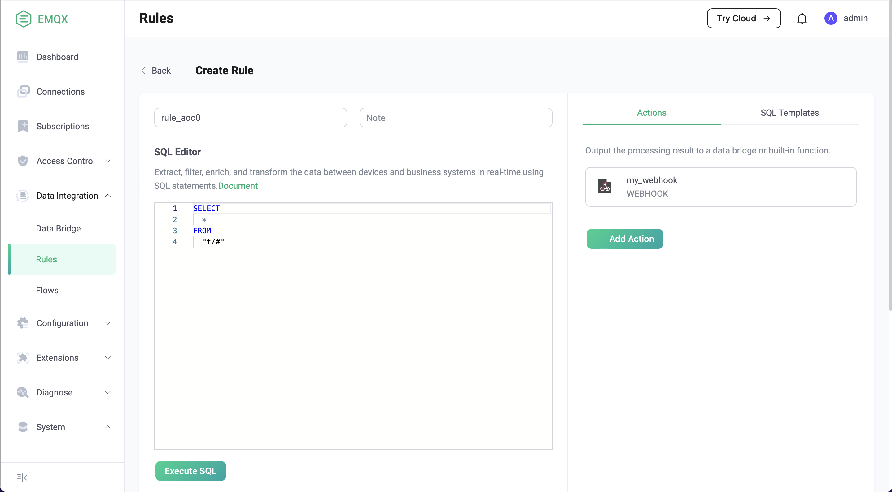
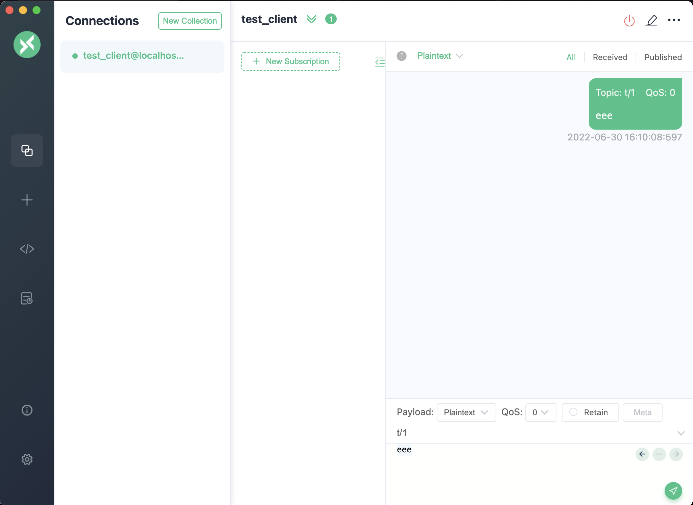

# Introduction to Data Bridges

Data bridge is a channel used to connect emqx and external data systems. The external data system can be mysql, mongodb and other databases, or message brokers such as Kafka and RabbitMQ, or event an HTTP server.

Through data bridges, users can send messages from emqx to the external data system in real time, or pull data from the external data system and send it to a topic in emqx.

::: tip
Only MQTT bridge and Webhook are supported in the emqx open source version. 
For the list of data bridges supported in the enterprise version, see:
[data integration with emqx enterpise](https://www.emqx.com/en/integrations)
:::

## Quick Start with Data Bridge

We use an example to show how to use dashboard to create a simple webhook that bridges to an HTTP server.

### Setup a Simple HTTP Server

First, we use Python to build a simple HTTP service. This HTTP service receives `POST /` requests,
It returns `200 OK` after simply printing the requested content:

```
from flask import Flask, json, request

api = Flask(__name__)

@api.route('/', methods=['POST'])
def print_messages():
  reply= {"result": "ok", "message": "success"}
  print("got post request: ", request.get_data())
  return json.dumps(reply), 200

if __name__ == '__main__':
  api.run()
```

Save the above code as `http_server.py` file. Then start the server by running:

```shell
pip install flask

python3 http_server.py
```

### Create Webhook and Bind it to the Rule

Now let's visit the dashboard and select "Data Integration" - "Data Bridge" in the sidebar on the left:


Then click "Create", select "Webhook", and click "Next":


We named webhook as `my_webhook`, and set URL to `http://localhost:5000`:


Click the "Create", then select "Create Rule" in the dialog box:


On the rule creation page, fill in the following SQL statements, and keep the default values of other parameters:

```SQL
SELECT * FROM "t/#"
```



Click the "Create" button at the bottom of the page, the creation should be OK.

### Send Messages for Testing

Next we use [MQTTX](https://mqttx.app/) to send a message to `t/1`



Then we verify that the message has been sent to the HTTP server:

```
python3 http_server.py
 * Serving Flask app 'http_server' (lazy loading)
 * Environment: production
   WARNING: This is a development server. Do not use it in a production deployment.
   Use a production WSGI server instead.
 * Debug mode: off
 * Running on http://127.0.0.1:5000 (Press CTRL+C to quit)

got post request:  b'eee'
```
