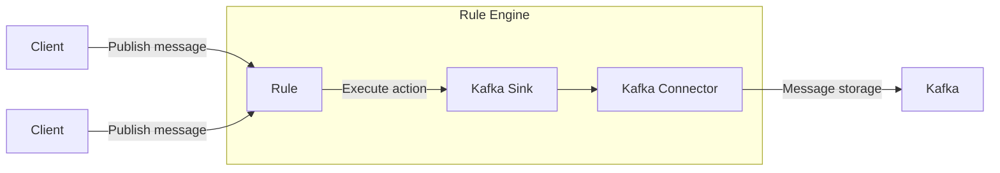
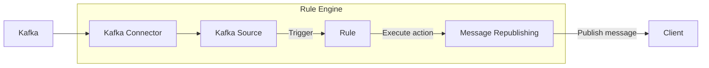
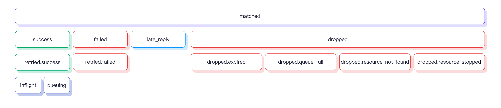

# Data Integration

As an MQTT messaging platform, EMQX connects IoT devices through the MQTT protocol and transmits messages in real-time. Building on this, data integration in EMQX introduces connections to external data systems, thereby enabling seamless integration of devices with other business systems.

Data integration uses Sink and Source components to connect with external data systems. Sinks are used to send messages to external data systems, such as MySQL, Kafka, or HTTP services, while Sources are used for receiving messages from external data systems, including MQTT, Kafka, or GCP PubSub.

This process allows EMQX to extend beyond just message transmission between IoT devices, integrating device-generated data organically into the entire business ecosystem. It provides a broader range of application scenarios for IoT applications, enriching and diversifying interactions between devices and business systems.

::: tip Note

- Starting from EMQX v5.4.0, the original data bridge was separated according to the data flow direction and renamed as Sink and Source.

- Currently, EMQX only supports the following external data systems to be served as Sources:

  - MQTT Services
  - Kafka 
  - GCP PubSub

  Among them, Kafka and GCP PubSub Sources are only supported in the EMQX Enterprise edition.

:::

This page offers a comprehensive overview of Sinks and Sources, including their working principles, supported external data systems, key features, and management methods.

## How It Works

EMQX data integration is an out-of-the-box feature. As an MQTT messaging platform, EMQX receives data from IoT devices via MQTT protocol. With the help of a built-in rule engine, the received data is processed by the rules configured in the rule engine. The rule will trigger an action of forwarding the processed data to the external data system through a configured Sink/Source. You can easily create a rule, attach an action to the rule, and create a Sink/Source using [Rules](./rule-get-started.md) or [Flow Designer](../flow-designer/introduction.md) on the Dashboard without any coding efforts.

### Built-in Rule Engine

Data sources from various IoT devices and systems have all kinds of data types and formats. EMQX is equipped with a powerful built-in rule engine based on SQL rules, which is a core component for processing and distributing data. The Rule Engine has a wide range of functionalities, including conditional judgments, string operations, data type conversions, and compression/decompression capabilities, enabling flexible handling of complex data.

When clients trigger specific events or when messages reach EMQX, the Rule Engine can process the data in real-time according to predefined rules. It performs operations such as data extraction, filtering, enrichment, and format conversion, and then forwards the processed data to the designated Sink.

You can find detailed information on how the rule engine works in the [Rule Engine](./rules.md) chapter.

### Sink

A Sink is a data output component added to the [actions](./rules.md) of a rule. When a device triggers an event or a message arrives at EMQX, the system matches and executes the corresponding rule, filtering and processing the data. The data processed by the Rule Engine is forwarded to the specified Sink. In the Sink, you can configure how the data is handled, for example, by using `${var}` or `${.var}` syntax to extract variables from the data, dynamically generating SQL statements or data templates. Then, the data is sent to external data systems through a corresponding [connector](./connector.md), enabling operations such as message storage, data updates, and event notifications.



The variable extraction syntax supported in Sink is as follows:

- `${var}`: This syntax is used to extract variables from the output results of a rule, for example, `${topic}`. If you wish to extract nested variables, you can use a period `.` for this, such as `${payload.temp}`. Note that if the variable you want to extract is not included in the output result, you will get the string `undefined`.
- `${.}`, `${.var}`: The `${.}` syntax is used to extract the JSON string containing all the output results of the rule, while `${.var}` has the same meaning as `${var}` syntax.

### Source

A Source is a data input component, serving as a [data source](./rule-sql-events-and-fields.md) for rules, and is selected through rule SQL.

Source subscribes or consumes messages from external data systems such as MQTT or Kafka. When new messages arrive through the connector, the rule engine matches and executes the corresponding rules, filtering and processing the data. Once processed, the data can be published to a specified EMQX topic, enabling operations like cloud command distribution.



## Supported Integrations

The EMQX Open Source edition only supports two types of data integrations: [MQTT Services](./data-bridge-mqtt.md) and [HTTP Server](./data-bridge-webhook.md). The EMQX Enterprise edition also supports data integrations with the following types of data systems:

**Cloud**

- [Amazon Kinesis](./data-bridge-kinesis.md)
- [Azure EventHub](./data-bridge-azure-event-hub.md)
- [GCP PubSub](./data-bridge-gcp-pubsub.md)

**TSDB**

- [Apache IoTDB](./data-bridge-iotdb.md)
- [InfluxDB](./data-bridge-influxdb.md)
- [OpenTSDB](./data-bridge-opents.md)
- [TimescaleDB](./data-bridge-timescale.md)
- [Datalayers](./data-bridge-datalayers.md)

**SQL**

- [Cassandra](./data-bridge-cassa.md)
- [Microsoft SQL Server](./data-bridge-sqlserver.md)
- [MySQL](./data-bridge-mysql.md)
- [Oracle](./data-bridge-oracle.md)
- [PostgreSQL](./data-bridge-pgsql.md)

**NoSQL**

- [ClickHouse](./data-bridge-clickhouse.md)
- [Couchbase](./data-bridge-couchbase.md)
- [DynamoDB](./data-bridge-dynamo.md)
- [Greptime](./data-bridge-greptimedb.md)
- [MongoDB](./data-bridge-mongodb.md)
- [Redis](./data-bridge-redis.md)
- [TDengine](./data-bridge-tdengine.md)
- [Elasticsearch](./elasticsearch.md)

**Message Queue**

- [Apache Kafka/Confluent](./data-bridge-kafka.md)
- [HStreamDB](./data-bridge-hstreamdb.md)
- [Pulsar](./data-bridge-pulsar.md)
- [RabbitMQ](./data-bridge-rabbitmq.md)
- [RocketMQ](./data-bridge-rocketmq.md)

**Others**

- [SysKeeper](./syskeeper.md)
- [Amazon S3](./s3.md)
- [Azure Blob Storage](./azure-blob-storage.md)
- [Snowflake](./snowflake.md)

## Features of Sink

Sink enhances usability and further improves the performance and reliability of data integration with the following features. Not all Sinks fully implement these features; please refer to their respective documentation for specific support details.

### Asynchronous Request Mode

Asynchronous request mode is designed to prevent the message publish-subscribe process from being affected by the execution speed of the Sink. However, when asynchronous request mode is enabled, there might be instances where the subscriber receives the message, but it has not yet been written to the external data system.

To enhance data processing efficiency, EMQX enables asynchronous request mode by default. If you have strict requirements regarding the timing of message delivery to subscribers and external data systems, you should disable asynchronous request mode.

The `max_inflight` parameter also affects message order in asynchronous requests. Some Sinks have this parameter, and when the request mode is asynchronous, if it is necessary to strictly ensure that messages from the same MQTT client are processed in order, this value must be set to 1.

### Batch Mode

Batch mode allows writing multiple data entries simultaneously into an external data integration system. When batch mode is enabled, EMQX will temporarily store each request's data (single entry) and write the entire batch of stored data to the target data system after reaching a certain time or accumulating a certain number of data entries (both of which can be configured).

**Advantages:**

- Improved write efficiency: Compared to writing single messages, batch mode allows database systems to cache or preprocess messages before formal processing, enhancing write efficiency.
- Reduced network latency: Batch writing reduces the number of network transmissions, thereby decreasing network latency.

**Issues:**

Delayed Data Writing: Data is held back from immediate writing until a set time is reached or a specified number of entries accumulates, causing delays. You can modify these settings, adjusting either the time delay or the number of entries, using the available parameters.

### Buffer Queue

The buffer queue provides a certain level of fault tolerance for Sink, and it's recommended to enable this option to improve data safety.

Each resource connection (not MQTT connection) has a buffer queue length (by capacity size), and data exceeding this length will be discarded according to the FIFO principle.

#### Buffer File Location

For Kafka Sink, disk cache files are located in `data/kafka`, while for other Sinks, disk cache files are in `data/resource_worker`.

In actual use, the `data` directory can be mounted on a high-performance disk to improve throughput.

### Prepared Statement

In SQL databases like MySQL, PostgreSQL, etc., SQL templates will undergo preprocessing execution without the need to explicitly specify field variables.

When executing SQL directly, you must explicitly set topic and payload as character types and qos as an int type using single quotes:

```sql
INSERT INTO msg(topic, qos, payload) VALUES('${topic}', ${qos}, '${payload}');
```

However, in Sinks that support prepared statements, the SQL template **must** use unquoted prepared statements:

```sql
INSERT INTO msg(topic, qos, payload) VALUES(${topic}, ${qos}, ${payload});
```

In addition to automatically inferring field types, the prepared statement technology also prevents SQL injection to enhance security.

## Sink Status and Statistics

You can view the running status and statistics of a Sink on the Dashboard to know if the Sink is operating properly.

### Running Status

A Sink can have the following status:

- `connecting`: The initial state before any health probes are made, and the bridge is still attempting to connect to the external data system.
- `connected`: The Sink is successfully connected and operating normally. If a health probe fails, the Sink may transition to either the `connecting` or `disconnected` state, depending on the severity of the failure.
- `disconnected`: The Sink has failed the health probes and is in an unhealthy state. It may try periodically to reconnect automatically depending on its configuration.
- `stopped`: The Sink has been manually disabled.
- `inconsistent`: There is a disagreement on the Sink status among the cluster nodes.

### Running Statistics

EMQX provides the running statistics of data integration in the following categories:

- Matched (counter)
- Sent Successfully (counter)
- Sent Failed (counter)
- Dropped (counter)
- Late Reply (counter)
- Inflight (gauge)
- Queuing (gauge)



#### Matched

The `matched` statistic counts the number of requests/messages that were routed to the Sink, regardless of its state.  Each message is ultimately accounted by other metrics, so the caluculation of `matched` is: `matched = success + failed + inflight + queuing + late_reply + dropped`.

#### Sent Successfully

The `success` statistic counts the number of messages that were successfully received by the external data system.  `retried.success` is a sub-count of `success` which tracks the number of messages with delivery retried at least once. Therefore, `retried.success <= success`.

#### Sent Failed

The `failed` statistic counts the number of messages that failed to be received by the external data system.  `retried.failed` is a sub-count of `failed` which tracks the number of messages with delivery retried at least once.  Therefore, `retried.failed <= failed`.

#### Dropped 

The `dropped` statistic counts the number of messages that were dropped without any delivery attempt. It contains several more specific categories, each indicating a distinct reason for the drop. The calculation for `dropped` is:`dropped = dropped.expired + dropped.queue_full + dropped.resource_stopped + dropped.resource_not_found`.

- `expired` : The message time-to-live (TTL) was reached during queuing before it got a chance to be sent.
- `queue_full` : The maximum queue size was reached and the message was dropped to prevent memory overflow.
- `resource_stopped` : The message being attempted for delivery when the Sink was already stopped.
- `resource_not_found` : The message was attempted to be sent when the Sink was no longer found. It occurs rarely and usually due to race conditions during the removal of a Sink.

#### Late Reply

The `late_reply` statistic incremented when the message was attempted to be sent, but a response from the underlying driver was received after the message time-to-live (TTL) had expired.

::: tip
Note that `late_reply` does not indicate whether the message succeeded nor failed to be sent: it's an unknown status.  It could either have succeeded to be inserted in the external data system, failed to be inserted, or even the connection to the data system timed out while trying to be established.
:::

#### Inflight

The `inflight` statistic gauges the number of messages in the buffering layer that are currently inflight and waiting for a response from the external data system.

#### Queuing

The `queuing` gauges the number of messages that have been received by the buffering layer but have not been sent yet to the external data system.
