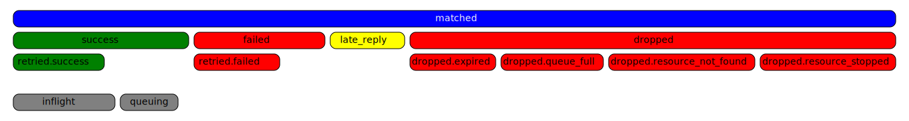

# Data Integration

Data integration is a channel used to connect EMQX and external data systems, for example, databases like MySQL, MongoDB, message brokers like Apache Kafka and RabbitMQ, or even an HTTP server.

Through data integration, users can send messages from EMQX to the external data system in real time. If bi-directional data integration is used, users can also pull data from the external data system and send it to a topic in EMQX.

::: tip Note

Currently, EMQX only supports bi-directional data integration with Kafka and Pulsar.

:::


::: tip
Only data bridges to MQTT and HTTP Server are supported in the EMQX open-source version. For the data systems supported in the EMQX enterprise version, you may refer to the [Data integration page on EMQX website](https://www.emqx.com/en/integrations).
:::


<!-- TODO sync zh -->

## Data Integration Execution Statistics

EMQX provides the running statistics of data integration in the following categories:

- Matched (counter)
- Sent Successfully (counter)
- Sent Failed (counter)
- Dropped (counter)
- Late Reply (counter)
- Inflight (gauge)
- Queuing (gauge)



### Matched

The `matched` statistic counts the number of requests/messages that were routed to the bridge, regardless of its state.  Each message is ultimately accounted by other metrics, so the caluculation of `matched` is: `matched = success + failed + inflight + queuing + late_reply + dropped`.

### Sent Successfully

The `success` statistic counts the number of messages that were successfully received by the external data system.  `retried.success` is a sub-count of `success` which tracks the number of messages with delivery retried at least once. Therefore, `retried.success <= success`.

### Sent Failed

The `failed` statistic counts the number of messages that failed to be received by the external data system.  `retried.failed` is a sub-count of `failed` which tracks the number of messages with delivery retried at least once.  Therefore, `retried.failed <= failed`.

### Dropped 

The `dropped` statistic counts the number of messages that were dropped without any delivery attempt. It contains several more specific categories, each indicating a distinct reason for the drop. The calculation for `dropped` is:`dropped = dropped.expired + dropped.queue_full + dropped.resource_stopped + dropped.resource_not_found`.

- `expired` : The message time-to-live (TTL) was reached during queuing before it got a chance to be sent.
- `queue_full` : The maximum queue size was reached and the message was dropped to prevent memory overflow.
- `resource_stopped` : The message being attempted for delivery when the bridge was already stopped.
- `resource_not_found` : The message was attempted to be sent when the bridge was no longer found. It occurs rarely and usually due to race conditions during the removal of a bridge.

### Late Reply

The `late_reply` statistic incremented when the message was attempted to be sent, but a response from the underlying driver was received after the message time-to-live (TTL) had expired.

::: tip
Note that `late_reply` does not indicate whether the message succeeded nor failed to be sent: it's an unknown status.  It could either have succeeded to be inserted in the external data system, failed to be inserted, or even the connection to the data system timed out while trying to be established.
:::

### Inflight

The `inflight` statistic gauges the number of messages in the buffering layer that are currently inflight and waiting for a response from the external data system.

### Queuing

The `queuing` gauges the number of messages have been received by the buffering layer but have not been sent yet to the external data system.

## Data Bridge Status

A data bridge can has the following status:

- `connecting`: The initial state before any health probes are made, and the bridge is still attempting to connect to the external data system.
- `connected`: The bridge is successfully connected and operating normally. If a health probe fails, the bridge may transition to either the `connecting` or `disconnected` state, depending on the severity of the failure.
- `disconnected`: The bridge has failed the health probes and is in an unhealthy state.  It may try periodically to reconnect automatically depending on its configuration.
- `stopped`: The bridge has been manually disabled.
- `inconsistent`: There is a disagreement on the bridge status among the cluster nodes.

## Features Supported

You can further improve the performance and reliability of data integration with the following easy-to-use data integration features. 

::: tip

The features supported may differ depending on the data system you are connecting to. You may refer to the document about different data systems for feature support.

:::

### Connection Pool

Connection pool is a set of reusable connection objects. With connection pooling, users no longer need to re-create connections for each request, which can help to significantly reduce resource consumption, improve connection efficiency, and achieves better support for high concurrent requests.

EMQX will create a separate connection pool for each node with data integration to be created. For example, let's say you use a cluster with 3 EMQX nodes and set the connection pool size for each data integration to 8, then EMQX will create 3 x 8 = 24 connection. Note: Please ensure the number of connection pools to build should not exceed the connection limit of your resources.

### Async Mode

Async mode is the data processing mode of the data integration. By enabling the Async mode, we can prevent the message publishing services from being blocked by the I/O pressure. Note: The time series of the message publishing might be affected, as the data integration may be still processing the queued messages while the client has already sent several new messages.

To improve the data processing efficiency, EMQX has enabled the Async mode by default. Use the following command to disable it if your application has strict requirements on the time series.

Example code

```bash
bridges.mysql.foo {
  server = "localhost"
  database = "emqx"
  enable = true
  ...
  resource_opts {
  # sync | async
    query_mode = "sync"
    ...
  }
}
```

::: tip

To ensure the time series of messages, please also add `max_inflight = 1` to the configuration file `emqx.conf`.

:::

### Batch Mode

In batch mode, multiple pieces of data will be simultaneously written into the external data integrations. After enabling the Batching mode, EMQX will temporarily store the data of each request and put the data in batches into the target data system after reaching a specified batch time or size. You can configure the batch time and batch size as needed.

**Advantages**

- Improve writing efficiency: Compared with the single-message writing mode, the database system will usually use techniques like caching or preprocessing to optimize the batch files before further operations, so the writing efficiency can be improved.
- Reduce network latency: The batch mode can reduce the times of net transmissions, thereby reducing network latency.

**Disadvantages**

- Hard to troubleshoot data errors: If data error occurs during batch writing, the data with error or even the entire batch of data will be discarded, so it is difficult to do troubleshooting.
- Long data writing delay: Data will be written into the target data systems only after reaching the specified batch time or batch size, so the delay is prolonged. You can configure the batch time or size to control the delay.

The Batch mode is enabled by default, you can disable it as needed.

Example code

```bash
bridges.mysql.foo {
  server = "localhost"
  database = "emqx"
  enable = true
  ...
  resource_opts {
    batch_size = 100
    batch_time = "20ms"
    ...
  }
}
```

### Buffer Queue

When external resources are unavailable, for example, due to network fluctuations or service downtime, the buffer queue feature can help to save the message generated during this period as memory or disk cache and then resume the messaging after the service is restored.

It is recommended to enable this feature to improve the fault tolerance capability of the data integration.

For each resource connection (not MQTT connection), you can specify the cache queue size based on the storage size. If the cached size exceeds the limit, data will be discarded following the First In First Out (FIFO) rule.

#### Configuration

For the data stream connecting to Kafka, the disk cache file is saved under `data/kafka`, for other data systems, the disk cache file is saved under `data/resource_worker`.

In actual use, it is recommended to mount the `data` folder in a high-performance disk to improve the throughput capacity.

Example code

```bash
bridges.mysql.foo {
  server = "localhost"
  database = "emqx"
  enable = true
  ...
  resource_opts {
    max_queue_bytes = "100MB"
    query_mode = "async"
    ...
  }
}
```

### Prepared Statement

[Prepared statement](https://dev.mysql.com/doc/refman/8.0/en/sql-prepared-statements.html) provides a way to run SQL with prepared statements. It simplifies the operation and maintenance and also helps to avoid SQL injection and improve security.

For data integration supporting prepared statements, you need not explicitly specify the field variables; otherwise, you will need to explicitly specify the field variables.

For example, you will insert the following data into the database:

```json
{
  "topic": "t/1",
  "qos": 0,
  "payload": "Hello EMQX"
}
```

- topic: message topic, string
- payload: message body, string
- qos: message QoS, integer

For data integration not supporting prepared statements, the fields should be enclosed in quotation marks, as shown below:

```sql
INSERT INTO msg(topic, qos, payload) VALUES('${topic}', ${qos}, '${payload}');
```

But for data integration supporting prepared statements, the fields in the SQL template should **NOT** be enclosed in quotation marks, as shown below:

```sql
INSERT INTO msg(topic, qos, payload) VALUES(${topic}, ${qos}, ${payload});
```
