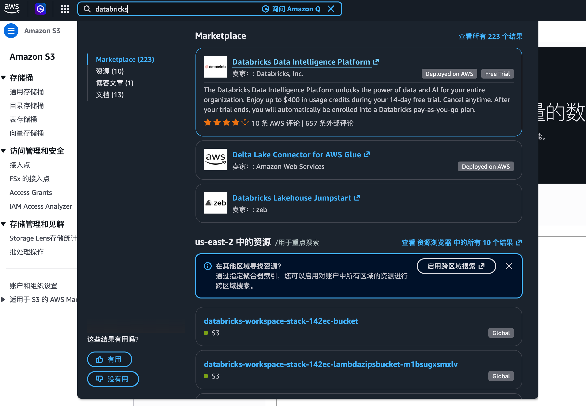
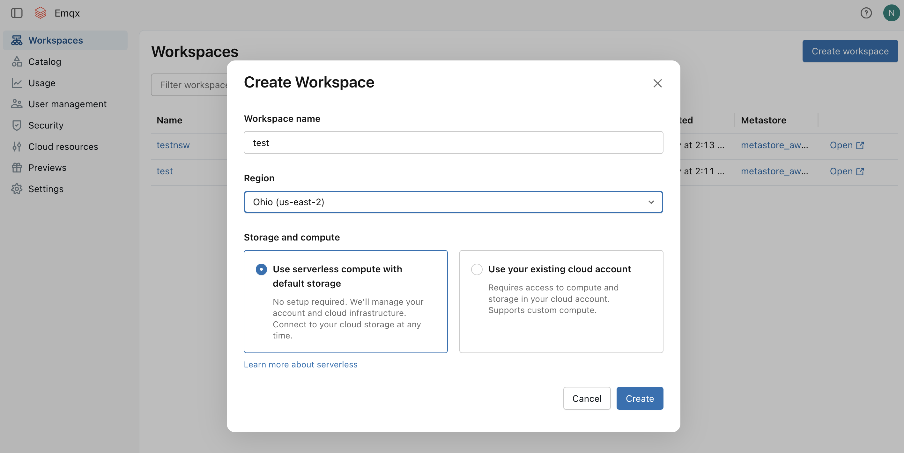
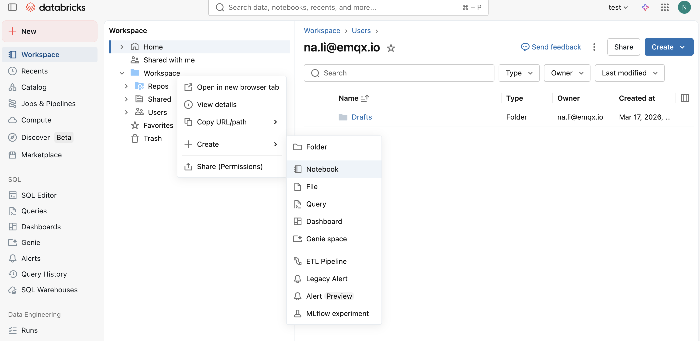

# Ingest MQTT Data into Databricks

[Databricks](https://www.databricks.com/) is a unified data analytics platform built on Apache Spark, designed for large-scale data engineering, machine learning, and collaborative analytics. EMQX integrates with Databricks by writing MQTT data into an Amazon S3 bucket managed by Databricks, which Databricks can then query directly through external locations.

This page provides a detailed introduction to the data integration between EMQX and Databricks and offers practical guidance on the connector and Sink creation.

## How It Works

Databricks data integration in EMQX is built on top of the Amazon S3 integration. EMQX writes MQTT data into an S3 bucket managed by Databricks. Databricks accesses this bucket via an external location, allowing direct SQL queries over the stored data.


The specific workflow is as follows:

1. **Device Connection to EMQX**: IoT devices trigger an online event upon successfully connecting via the MQTT protocol. The event includes device ID, source IP address, and other property information.
2. **Device Message Publishing and Receiving**: Devices publish telemetry and status data through specific topics. EMQX receives the messages and compares them within the rules engine.
3. **Rules Engine Processing Messages**: The built-in rules engine processes messages and events from specific sources based on topic matching. It matches corresponding rules and processes messages and events, such as data format transformation, filtering specific information, or enriching messages with context information.
4. **Writing to Amazon S3**: The rule triggers the Amazon S3 Sink to write the processed data into the S3 bucket associated with the Databricks workspace.
5. **Databricks Reads from S3**: Databricks queries the data stored in the S3 bucket directly via an external location, enabling real-time analytics and machine learning workflows.

## Features and Benefits

Using Databricks data integration in EMQX can bring the following features and advantages to your business:

- **Message Transformation**: Messages can undergo extensive processing and transformation in EMQX rules before being written to S3, facilitating subsequent storage and analysis.
- **Flexible Data Operations**: With the Amazon S3 Sink, specific fields of data can be conveniently written into the Databricks-managed S3 bucket, supporting dynamic object key configuration for flexible data storage.
- **Unified Analytics Platform**: By integrating EMQX with Databricks, IoT data becomes immediately available for SQL analytics, machine learning, and data engineering pipelines within the Databricks workspace.
- **Low-Cost Long-Term Storage**: Leveraging S3 as the underlying storage provides a highly available, reliable, and cost-effective data store, suitable for large-scale IoT workloads.

## Before You Start

This section introduces the preparations required before creating the Amazon S3 connector and Sink for Databricks in EMQX.

### Prerequisites

Before proceeding, make sure you are familiar with the following:

#### EMQX Concepts:

- [Rule Engine](./rules.md): Understand how rules define the logic for extracting and transforming data from MQTT messages.
- [Data Integration](./data-bridges.md): Understand the concept of connectors and sinks in EMQX data integration.

#### Databricks Concepts:

- **Workspace**: A Databricks workspace is the environment where you access all Databricks assets.
- **External Location**: A Databricks feature that maps an external S3 path so that data stored there can be queried directly using SQL.
- **Storage Credential**: An access credential in Databricks that grants permission to read and write an external storage location.

### Set Up Databricks on AWS Marketplace

This section uses subscribing to Databricks on AWS Marketplace as an example deployment.

1. Subscribe to Databricks on the [AWS Marketplace](https://aws.amazon.com/marketplace/). You will be guided to create a Databricks account and a Databricks workspace.

   

2. Once subscribed, create a workspace. Select a region and storage option, then click **Create**.

   

   After the workspace is created, it will appear in the **Workspaces** list. Note the S3 bucket name automatically provisioned for the workspace (for example, `databricks-workspace-stack-142ec-bucket`). This bucket will be used to store MQTT data from EMQX.

   

3. Open the workspace, go to **Catalog** -> **External locations** to create an external location that points to the S3 path where EMQX will write data.

   

   Click **Create location**, set the **Storage type** to `S3`, enter the **URL** as `s3://databricks-workspace-stack-142ec-bucket/emqx-iot-data-new`, and select a **Storage credential**.

   

4. Obtain the AWS access credentials (Access Key ID and Secret Access Key) for the IAM user or role that has read/write access to the S3 bucket. These credentials will be used to configure the EMQX connector.

With the Databricks workspace and S3 bucket configured, you are now ready to create the connector and Sink in EMQX.

## Create a Connector

Before adding the Amazon S3 Sink, you need to create the corresponding connector.

1. Go to the Dashboard **Integration** -> **Connector** page.
2. Click the **Create** button in the top right corner.
3. Select **Amazon S3** as the connector type and click **Next**.
4. Enter a name for the connector. The name must start with a letter or number and can contain letters, numbers, hyphens, or underscores. In this example, enter `my-databricks`.
5. Enter the connection information:
   - **Host**: Enter the S3 endpoint for the AWS region where your Databricks workspace is deployed, formatted as `s3.{region}.amazonaws.com`.
   - **Port**: Enter `443`.
   - **Access Key ID** and **Secret Access Key**: Enter the AWS access credentials obtained in [Set Up Databricks on AWS Marketplace](#set-up-databricks-on-aws-marketplace).
6. Use the default values for the remaining settings.
7. Before clicking **Create**, you can click **Test Connectivity** to test if the connector can connect to the S3 service.
8. Click the **Create** button at the bottom to complete the connector creation.

You have now completed the connector creation and will proceed to create a rule and Sink for specifying the data to be written into the Databricks-managed S3 bucket.

## Create a Rule with Amazon S3 Sink

This section demonstrates how to create a rule in EMQX to process messages from the source MQTT topic `t/#` and write the processed results to the Databricks-managed S3 bucket through the configured Sink.

1. Go to the Dashboard **Integration** -> **Rules** page.
2. Click the **Create** button in the top right corner.
3. Enter the rule ID `my_rule`, and input the following rule SQL in the SQL editor:

   ```sql
   SELECT
     *
   FROM
       "t/#"
   ```

   ::: tip

   If you are new to SQL, you can click **SQL Examples** and **Enable Debug** to learn and test the rule SQL results.

   :::

4. Add an action, select `Amazon S3` from the **Action Type** dropdown list, keep the action dropdown as the default `create action` option, or choose a previously created Amazon S3 action from the action dropdown. Here, create a new Sink and add it to the rule.

5. Enter the Sink's name and description.

6. Select the `my-databricks` connector created earlier from the connector dropdown. You can also click the create button next to the dropdown to quickly create a new connector in the pop-up box. The required configuration parameters can be found in [Create a Connector](#create-a-connector).

7. Set the **Bucket** by entering `databricks-workspace-stack-142ec-bucket`. This field also supports `${var}` format placeholders, but ensure the corresponding bucket exists in S3.

8. Select **ACL** as needed, specifying the access permission for the uploaded object.

9. Select the **Upload Method**:

   - **Direct Upload**: Each time the rule is triggered, data is uploaded directly to S3 according to the preset object key and content. This method is suitable for storing binary or large text data.
   - **Aggregated Upload**: This method packages the results of multiple rule triggers into a single file (such as a CSV file) and uploads it to S3, making it suitable for storing structured data. It can reduce the number of files and improve write efficiency.

   The configuration parameters differ for each method. Please configure according to the selected method:

   :::: tabs type

   ::: tab Direct Upload

   Direct Upload requires configuring the following fields:

   - **Object Key**: Defines the object's location to be uploaded to the bucket. It supports placeholders in the format of `${var}` and can use `/` to specify storage directories. Here, enter `emqx-iot-data-new/${clientid}_${timestamp}.json`, where `${clientid}` is the client ID and `${timestamp}` is the timestamp of the message.
   - **Object Content**: By default, this is in JSON text format containing all fields. It supports placeholders in the format of `${var}`. Here, enter `${payload}` to use the message body as the object content.

   :::

   ::: tab Aggregate Upload

   Aggregate Upload requires configuring the following parameters:

   - **Object Key**: Used to specify the storage path of the object. The following variables can be used:

     - **`${action}`**: Action name (required).
     - **`${node}`**: Name of the EMQX node performing the upload (required).
     - **`${datetime.{format}}`**: Start date and time of the aggregation, with the format specified by the `{format}` string (required):
       - **`${datetime.rfc3339utc}`**: RFC3339 date and time in UTC format.
       - **`${datetime.rfc3339}`**: RFC3339 date and time in local time zone format.
       - **`${datetime.unix}`**: Unix timestamp.
     - **`${datetime_until.{format}}`**: End date and time of the aggregation, with format options as above.
     - **`${sequence}`**: Sequence number for aggregated uploads within the same time interval (required).

   - **Aggregation Type**: Currently, CSV and JSON Lines are supported.
     - `CSV`: Data will be written to S3 in comma-separated CSV format.
     - `JSON Lines`: Data will be written to S3 in [JSON Lines](https://jsonlines.org/) format.

   - **Column Order** (applies only when the Aggregation Type is `CSV`): Adjust the order of rule result columns through a dropdown selection.

   - **Max Records**: When the maximum number of records is reached, the aggregation of a single file will be completed and uploaded.

   - **Time Interval**: When the time interval is reached, even if the maximum number of records has not been reached, the aggregation of a single file will be completed and uploaded.

   :::

   ::::

10. **Fallback Actions (Optional)**: If you want to improve reliability in case of message delivery failure, you can define one or more fallback actions. See [Fallback Actions](./data-bridges.md#fallback-actions) for more details.

11. Expand **Advanced Settings** and configure the advanced setting options as needed (optional). For more details, refer to [Advanced Settings](#advanced-settings).

12. Use the default values for the remaining settings. Click the **Create** button to complete the Sink creation. After successful creation, the page will return to the rule creation, and the new Sink will be added to the rule actions.

13. Back on the rule creation page, click the **Create** button to complete the entire rule creation process.

You have now successfully created the rule. You can see the newly created rule on the **Rules** page and the new Amazon S3 Sink on the **Actions (Sink)** tab.

## Test the Rule

Use MQTTX to publish a message to the topic `t/1`:

```bash
mqttx pub -i emqx_c -t t/1 -m '{ "msg": "hello Databricks" }'
```

After sending a few messages, in your Databricks workspace, right-click **Workspace**, select **Create** -> **Notebook** to create a new notebook.



In the notebook, run a SQL query against the external location to verify the data has been ingested successfully:

```sql
SELECT * FROM json.`s3://databricks-workspace-stack-142ec-bucket/emqx-iot-data-new/`
```


## Advanced Settings

This section delves into the advanced configuration options available for the Amazon S3 Sink. In the Dashboard, when configuring the Sink, you can expand **Advanced Settings** to adjust the following parameters based on your specific needs.

| Field Name                       | Description                                                  | Default Value   |
| -------------------------------- | ------------------------------------------------------------ | --------------- |
| **Buffer Pool Size**             | Specifies the number of buffer worker processes, which are allocated to manage the data flow between EMQX and S3. | `16`            |
| **Request TTL**                  | Specifies the maximum duration, in seconds, that a request is considered valid once it enters the buffer. | `45`            |
| **Health Check Interval**        | Specifies the time interval (in seconds) for the Sink to perform automatic health checks on its connection with S3. | `15` seconds    |
| **Health Check Interval Jitter** | A uniform random delay added on top of the base health check interval to reduce the chance that multiple nodes initiate health checks at the same time. | `0` millisecond |
| **Health Check Timeout**         | Specify the timeout duration for the connector to perform automatic health checks on its connection with S3. | `60` seconds    |
| **Max Buffer Queue Size**        | Specifies the maximum number of bytes that can be buffered by each buffer worker process in the S3 Sink. | `256` MB        |
| **Query Mode**                   | Allows you to choose between `synchronous` or `asynchronous` request modes to optimize message transmission. | `Asynchronous`  |
| **In-flight Window**             | Controls the maximum number of in-flight queue requests that can exist simultaneously during Sink communication with S3. | `100`           |
| **Min Part Size**                | The minimum chunk size for part uploads after aggregation is complete. | `5MB`           |
| **Max Part Size**                | The maximum chunk size for part uploads. | `5GB`           |
