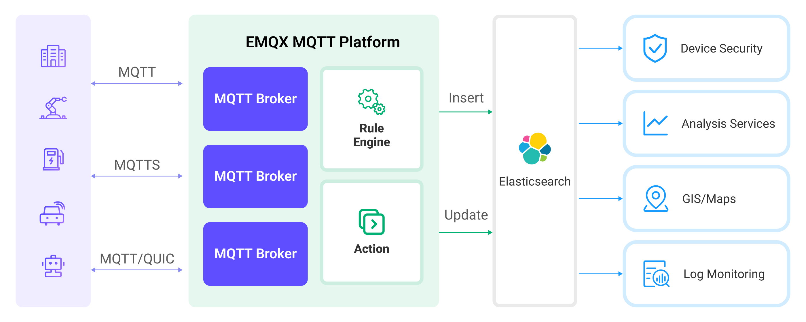

# Ingest MQTT Data into Elasticsearch



::: tip

EMQX Enterprise Edition features. EMQX Enterprise Edition provides comprehensive coverage of key business scenarios, rich data integration, product-level reliability, and 24/7 global technical support. Experience the benefits of this [enterprise-ready MQTT messaging platform](https://www.emqx.com/en/try?product=enterprise) today.

:::



[Elasticsearch](https://www.elastic.co/elasticsearch/) is a distributed, RESTful style search and data analysis engine that offers full-text search, structured search, and analysis capabilities for diverse data types. By integrating with Elasticsearch, EMQX enables seamless incorporation of MQTT data into Elasticsearch for storage. This integration leverages the powerful scalability and analysis capabilities of Elasticsearch, providing efficient and scalable data storage and analysis solutions for IoT applications.

This page details the data integration between EMQX and Elasticsearch and provides practical guidance on rule and Sink creation.

## How It Works

Data integration with Elasticsearch is an out-of-the-box feature in EMQX, combining EMQX's device access and message transmission capabilities with Elasticsearch’s data storage and analysis capabilities. Seamless integration of MQTT data can be achieved through simple configuration.



EMQX and Elasticsearch provide a scalable IoT platform for efficiently collecting and analyzing real-time device data. In this architecture, EMQX acts as the IoT platform, responsible for device access, message transmission, and data routing, while Elasticsearch serves as the data storage and analysis platform, handling data storage, data search, and analysis.

EMQX forwards device data to Elasticsearch through its rule engine and Sink, where Elasticsearch utilizes its powerful search and analysis capabilities to generate reports, charts, and other data analysis results, displayed to users through Kibana’s visualization tools. The workflow is as follows:

1. **Device Message Publishing and Receiving**: IoT devices connect via the MQTT protocol and publish telemetry and status data to specific topics, which EMQX receives and compares in the rule engine.
2. **Rule Engine Processes Messages**: Using the built-in rule engine, MQTT messages from specific sources can be processed based on topic matching. The rule engine matches corresponding rules and processes messages, such as transforming data formats, filtering out specific information, or enriching messages with context information.
3. **Writing to Elasticsearch**: Rules defined in the rule engine trigger the operation of writing messages to Elasticsearch. Elasticsearch Sink provides flexible operation methods and document templates to construct documents in the desired format, writing specific fields from messages into corresponding indices in Elasticsearch.

Once device data is written to Elasticsearch, you can flexibly use Elasticsearch's search and analysis capabilities to process data, such as:

1. **Log Monitoring**: IoT devices generate a large amount of log data, which can be sent to Elasticsearch for storage and analysis. By connecting to visualization tools, such as Kibana, charts can be generated based on these log data, displaying real-time information on device status, operation records, and error messages. This helps developers or operators quickly locate and resolve potential issues.
2. **Geographical Data (Maps)**: IoT devices often generate geographic location data, which can be stored in Elasticsearch. Using Kibana’s Maps feature, device location information can be visualized on a map for tracking and analysis.
3. **Endpoint Security**: Security log data from IoT devices can be sent to Elasticsearch. By connecting to Elastic Security, security reports can be generated, monitoring the security status of devices in real time, detecting potential security threats, and responding accordingly.

## Features and Advantages

The Elasticsearch data integration offers the following features and advantages to your business:

- **Efficient Data Indexing and Search**: Elasticsearch can easily handle large-scale real-time message data from EMQX. Its powerful full-text search and indexing capabilities enable IoT message data to be quickly and efficiently retrieved and queried.
- **Data Visualization**: Through integration with Kibana (part of the Elastic Stack), powerful data visualization of IoT data is possible, aiding in understanding and analyzing the data.
- **Flexible Data Manipulation**: EMQX's Elasticsearch integration supports dynamic setting of indices, document IDs, and document templates, allowing for the creation, update, and deletion of documents, suitable for a wider range of IoT data integration scenarios.
- **Scalability**: Both Elasticsearch and EMQX support clustering and can easily expand their processing capabilities by adding more nodes, facilitating uninterrupted business expansion.

## Before you Start

This section introduces the preparatory work needed before creating Elasticsearch data integration in EMQX, including installing Elasticsearch and creating indices.

### Prerequisites

- Understand [rules](https://chat.openai.com/c/rules.md).
- Understand [data integration](https://chat.openai.com/c/data-bridges.md).

### Install Elasticsearch and Create Indices

EMQX supports integration with privately deployed Elasticsearch or with Elastic in the cloud. You can use Elastic Cloud or Docker to deploy an Elasticsearch instance.

1. If you don't have a Docker environment, [install Docker](https://docs.docker.com/install/).

2. Start an Elasticsearch container with X-Pack security authentication enabled. Set the default username `elastic` with the password `public`.

   ```bash
   docker run -d --name elasticsearch \
       -p 9200:9200 \
       -p 9300:9300 \
       -e "discovery.type=single-node" \
       -e "xpack.security.enabled=true" \
       -e "ELASTIC_PASSWORD=public" \
       docker.elastic.co/elasticsearch/elasticsearch:7.10.1
   ```

3. Create the `device_data` index for storing messages published by devices. Make sure to replace Elasticsearch username and password.

   ```bash
   curl -u elastic:public -X PUT "localhost:9200/device_data?pretty" -H 'Content-Type: application/json' -d'
   {
     "mappings": {
       "properties": {
         "ts": { "type": "date" },
         "clientid": { "type": "keyword" },
         "payload": {
           "type": "object",
           "dynamic": true
         }
       }
     }
   }'
   ```

## Create a Connector

Before adding the Elasticsearch Sink, you need to create an Elasticsearch connector.

The following steps assume you are running EMQX and Elasticsearch on the same local machine. If you have EMQX and Elasticsearch running remotely, adjust the settings accordingly.

1. Go to the Dashboard **Integration** -> **Connectors** page.
2. Click **Create** in the upper right corner of the page.
3. Select **Elasticsearch** as the connector type and click next.
4. Enter the connector name, for example, `my-elasticsearch`. The name must combine uppercase and lowercase letters and numbers.
5. Enter Elasticsearch connection information according to your deployment method.
   - **URL**: Enter the REST interface URL of the Elasticsearch service as `http://localhost:9200`.
   - **Username**: Specify the Elasticsearch service username as `elastic`.
   - **Password**: Provide the Elasticsearch service password as `public`.
6. Click the **Create** button at the bottom to complete the connector creation.

Now you have created the Connector. Next, you need to create a rule to specify the data that needs to be written into Elasticsearch.

## Create a Rule for Elasticsearch Sink 

This section demonstrates how to create a rule in EMQX to process messages from the source MQTT topic `t/#` and write the processed results to the `device_data` index in Elasticsearch through the configured Sink.

1. Go to the Dashboard **Integration** -> **Rules** page.

2. Click **Create** in the upper right corner.

3. Enter rule ID `my_rule`, and in the SQL editor, enter the rule to store MQTT messages from the `t/#` topic in Elasticsearch. The rule SQL is as follows:

   ```sql
   SELECT
     clientid,
     timestamp as ts,
     payload
   FROM
       "t/#"
   ```
   
   ::: tip
   
   If you are new to SQL, you can click **SQL Examples** and **Enable Debugging** to learn and test the rule SQL results.
   
   :::
   
4. Click **Add Action**. Select `Elasticsearch` from the **Action Type** dropdown list. Keep the **Action** dropdown box as the default `Create Action` option. Or, you can select a previously created Elasticsearch action from the action dropdown box. This demonstration will create a new Sink and add it to the rule.

5. Enter the name and description of the Sink.

6. Select the `my-elasticsearch` connector you just created from the connector dropdown box. You can also click the button next to the dropdown box to create a new connector on the pop-up page. The required configuration parameters can be referred to [Create a Connector](#create-a-connector).

7. Configure the document template for inserting JSON-formatted data as follows:

   - **Action**: Optional actions `Create`, `Update`, and `Delete`.

   - **Index Name**: The name of the index or index alias on which to perform the action. Placeholders in `${var}` format are supported.

   - **Document ID**: Optional for `Create` action, required for other actions. The unique identifier of a document within the index. Placeholders in `${var}` format are supported. If an ID is not specified, Elasticsearch will generate one automatically.

   - **Routing**: Specifies which shard of the index the document should be stored in. If left blank, Elasticsearch will decide.

   - **Document Template**: Custom document template, must be convertible into a JSON object and supports `${var}` format placeholders, e.g., `{ "field": "${payload.field}"}` or `${payload}`.

   - **Max Retries**: The maximum number of times to retry when writing fails. The default is 3 attempts.

   - **Overwrite Document** (Specific to `Create` action): Whether to overwrite the document if it already exists. If “No”, the document write will fail.

   - **Enable Upsert** (Specific to `Update` action): Treat the update operation as an insert operation when the document to be updated does not exist, and insert the provided document as a new document.

     In this example, the index name is set to `device_data`, using a combination of client ID and timestamp `${clientid}_${ts}` as the document ID. The document stores the client ID, current timestamp, and the entire message body. The document template is as follows:

     ```json
     {
       "clientid": "${clientid}",
       "ts": ${ts},
       "payload": ${payload}
     }
     ```

8. Keep the rest of the parameters at their default values. 
9.  Click the **Create** button to complete the creation of the Sink. The new Sink will be added to the **Action Outputs**.
10. Back on the Create Rule page, click the **Create** button to complete the entire rule creation.

Now you have successfully created the rule. You can see the newly created rule on the **Rules** page and the new Elasticsearch Sink under the **Actions (Sink)** tab.

You can also click **Integration** -> **Flow Designer** to view the topology. The topology visually shows that messages from the `t/#` topic are written to Elasticsearch after being parsed by the rule `my_rule`.

## Test the Rule

Use MQTTX to publish messages to the `t/1` topic:

```bash
mqttx pub -i emqx_c -t t/1 -m '{"temp":24,"humidity":30}'
```

Check the Sink operation statistics, both hit and successful send counts +1.

Use the `_search` API to view the document content in the index and check whether the data has been written to the `device_data` index:

```bash
curl -X GET "localhost:9200/device_data/_search?pretty"
```

The correct responding results are as follows:

```json
  "took" : 1098,
  "timed_out" : false,
  "_shards" : {
    "total" : 1,
    "successful" : 1,
    "skipped" : 0,
    "failed" : 0
  },
  "hits" : {
    "total" : {
      "value" : 1,
      "relation" : "eq"
    },
    "max_score" : 1.0,
    "hits" : [
      {
        "_index" : "device_data",
        "_type" : "_doc",
        "_id" : "emqx_c_1705479455289",
        "_score" : 1.0,
        "_source" : {
          "clientid" : "emqx_c",
          "ts" : 1705479455289,
          "payload" : {
            "temperature": 24,
            "humidity": 30
          }
        }
      }
    ]
  }
}
```

<!-- ## Advanced Settings-->

<!-- TODO -->
