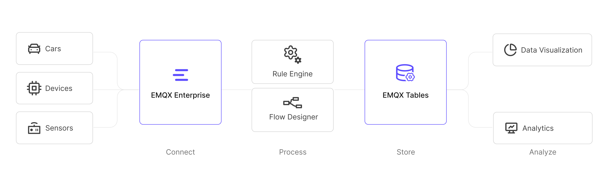
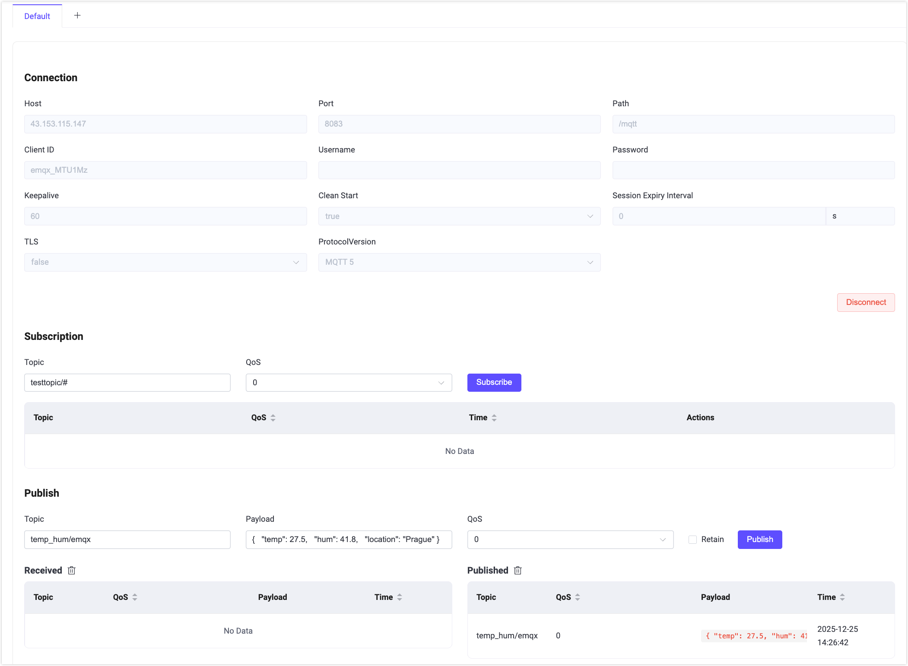
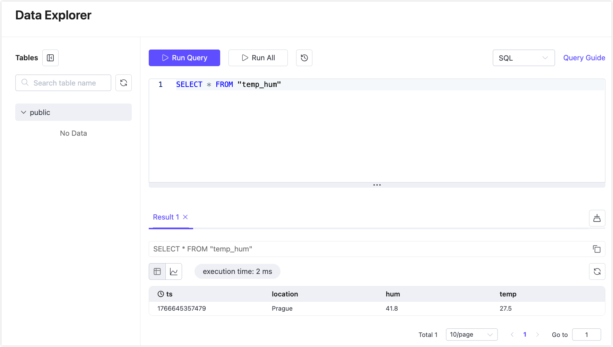
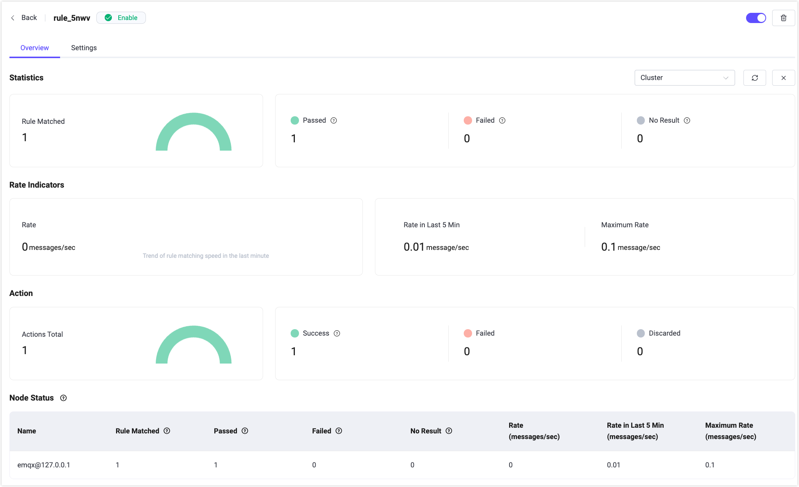

# Ingest MQTT Data into EMQX Tables

EMQX Tables is a native, fully managed time-series data storage service built into [EMQX Cloud](https://docs.emqx.com/en/cloud/latest/). It is optimized for high-throughput, low-latency ingestion and analysis of MQTT data, making it ideal for Internet of Things (IoT) use cases.

Powered by GreptimeDB, EMQX Tables integrates seamlessly with EMQX Broker and supports InfluxDB Line Protocol, enabling efficient storage, querying, and visualization of telemetry data. To learn more, see the [EMQX Tables Overview](https://docs.emqx.com/en/cloud/latest/emqx_tables/emqx_tables_overview.html).

Starting from EMQX Enterprise 6.1, an EMQX Tables connector and Sink are provided, allowing on-premise EMQX Enterprise deployments to securely write MQTT data into an EMQX Tables deployment hosted in EMQX Cloud for centralized querying and processing.



This page walks you through ingesting MQTT data from EMQX Enterprise into EMQX Tables in EMQX Cloud by:

- Establishing network connectivity between EMQX Enterprise and EMQX Tables
- Creating an EMQX Tables connector
- Creating a rule with an InfluxDB Line Protocol writer
- Testing data ingestion and querying results

## Prerequisites

Before you start, ensure that you meet the following requirements:

- EMQX Enterprise version 6.1 or later is deployed in an on-premise or private environment.

- An EMQX Tables deployment is created and running in [EMQX Cloud Console](https://accounts.emqx.com/signin?continue=https://cloud-intl.emqx.com/console/). 

  - For instructions on creating EMQX Tables, see [Create an EMQX Tables deployment](https://docs.emqx.com/en/cloud/latest/emqx_tables/emqx_tables_create_deployment.html).
  - Retrieve the connection information on the **Deployment Overview** page:

  

- Your EMQX Enterprise deployment can reach the EMQX Tables endpoint over the network (public endpoint or private connectivity, depending on your setup).

- You are familiar with:
  - [EMQX Rules](./rules.md)
  - [Data Integration](./data-bridges.md)
  - [InfluxDB Line Protocol](https://docs.influxdata.com/influxdb/v2.5/reference/syntax/line-protocol/)

## Create an EMQX Tables Connector

Before writing data, create a connector to EMQX Tables in your EMQX Enterprise deployment.

1. In the EMQX Enterprise Dashboard, navigate to **Data Integration** -> **Connectors**.

2. Click **+ New Connector** and select **EMQX Tables**.

3. On the **Create Connector** page, configure the following settings:
   - **Connector Name**: Enter a unique name for the connector.
   
   - **Description** (Optional): Add a brief description for identification purposes.
   
   - **Server Host**: Enter the EMQX Tables service address in the format `<host>:<port>`. For example: `tables.example.emqx.com:4001`.
   
   - **Database**: Specify the target database name in EMQX Tables, for example, `public`.
   
     ::: tip
   
     When you create the EMQX Tables deployment, the default `public` database is created. If you want to create a custom database, see [Create a Custom Database](https://docs.emqx.com/en/cloud/latest/emqx_tables/emqx_tables_quick_start.html#create-a-custom-database).
   
     :::
   
   - **Username**: Enter the username provided by your EMQX Tables deployment.
   
   - **Password**: Enter the corresponding password.
   
   - **Enable TLS**: Enable this option to use TLS encryption when connecting to EMQX Tables. TLS is recommended for production environments.
   
   - **Advanced Settings** (Optional): Expand this section to configure advanced options such as connection pool size, timeouts, or retry behavior, if required.
   
4. Click **Test Connectivity** to verify connectivity. If the EMQX Tables service is reachable, a success message is displayed.

5. Click **Create** to complete the connector creation.

You can now use this connector when defining rules and actions.

## Create a Rule for Data Ingestion into EMQX Tables

Next, create a rule to specify which MQTT messages should be written and how they are stored in EMQX Tables.

### Define the SQL Rule

1. Go to **Data Integration** -> **Rules**.

2. Click **+ Create**.

3. In the **SQL Editor**, define the rule logic. In this example, the rule is triggered when a client publishes temperature and humidity data to the `temp_hum/emqx` topic:

   ```sql
   SELECT
     timestamp,
     payload.location AS location,
     payload.temp AS temp,
     payload.hum AS hum
   FROM "temp_hum/emqx"
   ```

   ::: tip

   If you are new to EMQX Rules, click **Try It Out** to learn and test the SQL rule interactively.

   :::

4. Click **+ Add Action** to append an action to the rule.

### Add an EMQX Tables Action

After defining the SQL rule, add an action to write the selected data into EMQX Tables when the rule is triggered.

1. In **Type of Action**, select **EMQX Tables**.

2. Keep **Action** set to **Create Action**.

3. Configure the following fields:

   - **Name**: Enter a name for the action.

   - **Connector**: Select the EMQX Tables connector you just created.

   - **Description** (optional): Add a description for this action.

   - **Write Syntax**:  Define the InfluxDB Line Protocol format used to write data into EMQX Tables.

     The placeholders in the Write Syntax (for example, `${location}`, `${temp}`) must correspond to the fields selected in the SQL rule. When the rule is triggered, EMQX replaces these placeholders with the values produced by the SQL query.

     The measurement at the beginning of the line protocol determines the table name. A table is created automatically when data is written successfully for the first time.

     Example:

     ```pgsql
     temp_hum,location=${location} temp=${temp},hum=${hum} ${timestamp}
     ```

     In this example:

     - `temp_hum` is the measurement and will be used as the table name.
     - `location` is written as a tag.
     - `temp` and `hum` are written as fields.
     - `${timestamp}` provides the timestamp generated by the rule engine.

     > Note: 
     >
     > - To write a signed integer value, append `i` after the placeholder, for example: `${payload.int}i`.
     > - To write an unsigned integer value, append `u` after the placeholder, for example: `${payload.int}u`.

   - **Time Precision**: Select the time precision for timestamps. The default value is `millisecond`.

   - **Fallback Actions** (optional): Configure fallback actions to be executed if this action fails. By default, no fallback action is configured. See [Fallback Actions](./data-bridges.md#fallback-actions) for more details.

   - **Advanced Settings** (optional): Expand this section to configure advanced behavior such as batching or retry policies, if required.

   

4. Click **Create** to save the action.

5. On the **Create Rule** page, click **Save** to save the rule.

## Test Rule and Query Data

You are recommended to use [MQTTX](https://mqttx.app/) or other client tools to simulate temperature and humidity data reporting. For quick demonstration, you can just use built-in diagnostic tool inside your Dashboard.

### Publish Test Data Using Websocket Client

1. In the EMQX Enterprise Dashboard, click **Diagnostic Tools** -> **Websocket Client** from the left menu.

2. Connect as a simulated client using a username/password or auto-generated authentication.

3. In the **Publish** section, publish a message with the following settings:

   - **Topic**: `temp_hum/emqx`
   
   - **Payload**:
   
     ```json
     {
       "temp": 27.5,
       "hum": 41.8,
       "location": "Prague"
     }
     ```
   



The message should trigger the rule and be written into EMQX Tables.

### Query Data in EMQX Tables

1. Log in to the EMQX Cloud Console.

2. Navigate to your EMQX Tables deployment.

3. Click **Data Explorer**.

4. Run the following SQL query:

   ```sql
   SELECT * FROM "temp_hum"
   ```

You should see the newly ingested record in the query results.



## View Rule Statistics

To verify runtime behavior and performance:

1. Return to your EMQX Enterprise Dashboard.
2. Go to **Data Integration** -> **Rules**.
3. Click the rule ID you created.

You can view execution statistics for the rule and its associated EMQX Tables action, including success and failure counts.

