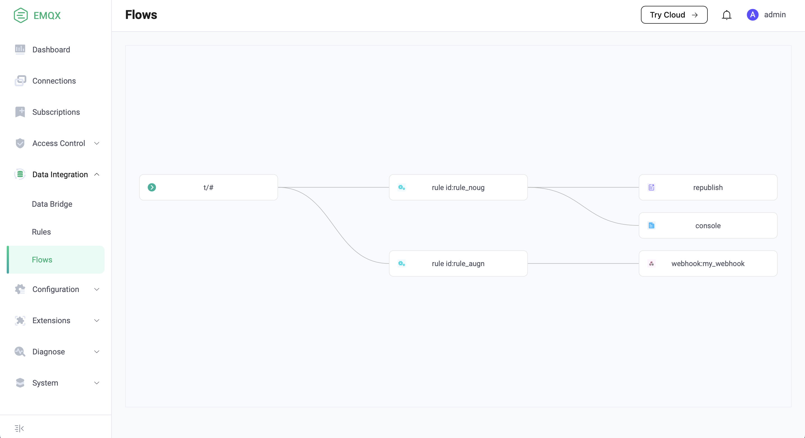

# Introduction to Data Integration

Data integration is a data processing and distribution component of EMQX based on the publish/subscribe model. 
Through simple and visual configuration, message flow and device events can be integrated with messaging brokers such as Kafka and RabbitMQ, as well as various SQL/NoSQL or time series databases.

EMQX provides a real-time, concise and efficient data integration scheme by combining **Rules** and **Data Bridges**.
The rules are used to process messages or events, and the data bridge is used to connect the data system.

## Rules

Based on the publish/subscribe model, EMQX provides rules to handle messages or events, such as data format conversion, message encoding and decoding, and business logic processing.

For more information about rules, see [Rules](./rules.md)。

## Data Bridges

A data bridge is a channel used to connect EMQX and external data systems.
Through data bridges, users can send messages from EMQX to external data systems in real time,
or pull data from the external data system and send it to a topic of EMQX.

For more information about data bridges, see [Data Bridges](./data-bridges.md)。

## Flow Charts

After data bridges and rules are created, we can see the topology of data integration on the dashboard:

