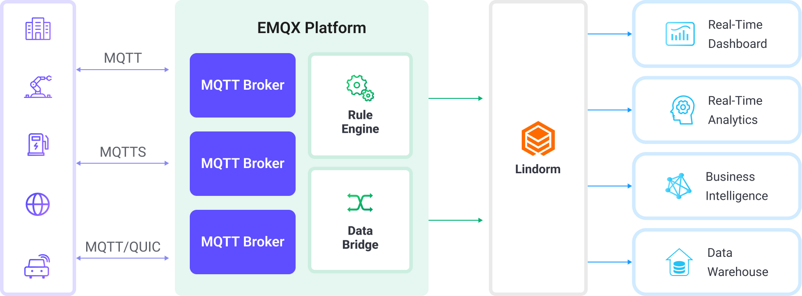

# Ingest MQTT into Lindorm

[Alibaba Cloud Lindorm](https://cn.aliyun.com/product/apsaradb/lindorm?from_alibabacloud=) is a cloud-native multi-model database featuring high throughput, high compression, and scalability. It supports time-series (TSDB), wide table, and vector data models, and is widely used in IoT telemetry, industrial monitoring, and connected vehicle scenarios.

While EMQX does not provide a dedicated Lindorm Sink, Lindorm offers MySQL-compatible interfaces. Users can utilize the MySQL Sink in EMQX's data integration to write device data into Lindorm. This page explains how to extract, transform, and store MQTT data using the EMQX data integration with Lindorm to build a stable and efficient IoT data pipeline.

## Lindorm

Lindorm’s backend supports multiple data engines. Among them, the TSDB node is optimized for time-series data, offering high compression, high concurrency, and efficient querying. EMQX, as a MQTT messaging platform, leverages its Rule Engine and Data Integration features to efficiently write MQTT messages to Lindorm (typically to TSDB nodes) without complex coding. This enables structured collection, processing, and storage of device telemetry data.



The workflow is as follows:

- **Device connects to EMQX**: IoT devices establish MQTT connections with EMQX.
- **Device message publish and receive**: Devices publish telemetry and status data to specific topics, which are received and matched by EMQX's Rule Engine.
- **Rule Engine processes messages**: Rules match messages based on topics and perform actions such as data transformation, filtering, or enriching with context.
- **Write to Lindorm**: Triggered rules use the MySQL Sink to call Lindorm's MySQL-compatible interface.
- **Lindorm backend storage & optimization**: Lindorm organizes data into time-series or wide table formats based on schema definitions, handling compression, indexing, and aggregation.
- **External applications query and analyze**: Business systems or visualization tools (like QuickBI, DataV) perform device status monitoring, metric tracking, and trend analysis via SQL queries.

## Features and Benefits

Integrating Lindorm with EMQX offers the following advantages:

- **High concurrency write capability**: Lindorm TSDB nodes are designed for high-concurrency scenarios, supporting massive device telemetry ingestion, ideal for industrial monitoring, smart cities, etc.
- **Message transformation**: Messages can be processed and transformed by EMQX rules before being written to Lindorm, simplifying storage and usage.
- **Flexible field mapping and rule handling**: EMQX Rule Engine allows dynamic extraction and transformation of message fields with customizable SQL templates for precise data structure control.
- **Efficient compression & persistent storage**: Lindorm optimizes storage for time-series and structured data, effectively reducing storage costs in high-frequency write scenarios while supporting long-term data retention.
- **Runtime metrics**: View runtime metrics for each Sink, including total messages, success/failure counts, current rates, etc.

Combined with EMQX's rich message transformation and Lindorm's storage/query capabilities, you can build a reliable and scalable IoT data pipeline to meet diverse business needs.

## Before You Start

This section covers the necessary preparations before creating Lindorm Data Integration in EMQX, including Lindorm instance creation, connection setup, and table creation.

### Prerequisites

- Familiarity with [Rules](./rules.md).
- Familiarity with [Data Integration](./data-bridges.md).

### Create and Connect a Lindorm Instance

Before integration, ensure you have created a Lindorm instance and configured network access:

1. Log in to Alibaba Cloud Console and [create a Lindorm instance](https://www.alibabacloud.com/help/en/lindorm/getting-started/create-an-instance).
2. [Configure whitelist access](https://www.alibabacloud.com/help/en/lindorm/getting-started/configure-a-whitelist) to allow EMQX host IP access.
3. Depending on EMQX deployment methods, choose the appropriate Lindorm connection method:
   - If EMQX is deployed on Alibaba Cloud ECS or VPC, use Lindorm's internal VPC access address for better stability and low latency.
   - If EMQX is deployed in local data centers or other clouds:
     - Enable public access for Lindorm.
     - Use the public SQL endpoint (typically port `33060`).
     - Add EMQX host's public IP to Lindorm's whitelist.

For details, refer to the [official connection guide](https://www.alibabacloud.com/help/en/lindorm/getting-started/connect-to-an-instance) and [JDBC connection for TSDB engine](https://www.alibabacloud.com/help/en/lindorm/user-guide/use-the-jdbc-driver-for-lindorm-to-connect-to-and-use-lindormtsdb).

### Create Database and Table

```sql
CREATE DATABASE emqx_data;

CREATE TABLE demo_sensor (
  device_id VARCHAR(255) COMMENT 'TAG',
  time BIGINT,
  msg VARCHAR(255),
  PRIMARY KEY (device_id, time)
);
```

This table structure is suitable for time-series data, using `device_id` as the tag, `time` as timestamp, and `msg` for business data.

## Create a Connector

Before creating a Lindorm Sink (via MySQL protocol), you need to create a MySQL connector in EMQX to establish connectivity with Lindorm.

1. Navigate to **Integration** -> **Connectors** in the Dashboard, click **Create**.

2. Select **MySQL** as the connector type, click **Next**.

3. Configure the following:
   - **Connector Name**: Alphanumeric, e.g., `my_lindorm`.

   - **Server Host**:
     
     - If EMQX is deployed within Alibaba Cloud VPC network (such as ECS instances), fill in the internal SQL address of the Lindorm instance. The format is typically the internal domain provided by Lindorm, for example: `ld-xxxx-proxy-sql-lindorm.lindorm.rds.aliyuncs.com:33060`.
     - If EMQX is deployed in a local data center or other non-Alibaba Cloud environments, ensure that public access has been enabled in the Lindorm console, and fill in the assigned public SQL address. The format is typically: `ld-xxxx-proxy-sql-public.lindorm.rds.aliyuncs.com:33060`.
     
     Ensure that the IP address of the host where EMQX is deployed has been added to the Lindorm access whitelist.
     
   - **Database Name**: `emqx_data`.

   - **Username**: `root`.

   - **Password**: `public`.

4. Advanced settings (optional):  See [Advanced Configurations](#advanced-configurations).

5. Before clicking **Create**, you can click **Test Connectivity** to test if the connector can connect to the Lindorm.

6. Click the **Create** button at the bottom to complete the creation of the connector. In the pop-up dialog, you can click **Back to Connector List** or click **Create Rule** to continue creating rules with Sinks to specify the data to be forwarded to Lindorm.

## Create Lindorm Sink Rule

This section shows how to create a rule to handle MQTT messages from topic `#` and write them into the `demo_sensor` table in Lindorm.

1. Go to **Integration** -> **Rules** in Dashboard.

2. Click **Create**, enter Rule ID `my_rule`.

3. Enter the rule ID `my_rule`, and input the rule in the SQL editor. In this example, you can store MQTT messages from the `#` topic into Lindorm. Make sure that the fields selected in the **SELECT** clause include all the variables used in the SQL template. The rule SQL is as follows:

   ```sql
   SELECT
     clientid AS device_id,
     timestamp AS time,
     payload.msg AS msg
   FROM
     "#"
   ```

   ::: tip

   If you are a beginner user, click **SQL Examples** and **Enable Test** to learn and test the SQL rule. 

   :::

4. Click the + **Add Action** button to define an action to be triggered by the rule. With this action, EMQX sends the data processed by the rule to Lindorm. 

5. Select `MySQL` from the **Type of Action** dropdown list. Keep the **Action** dropdown with the default `Create Action` value. You can also select a Sink if you have created one. This demonstration will create a new Sink.

6. Enter a name for the Sink. The name should be a combination of upper/lower case letters and numbers.

7. Select the `my_lindorm` just created from the **Connector** dropdown box. You can also create a new Connector by clicking the button next to the dropdown box. For the configuration parameters, see [Create a Connector](#create-a-connector).

8. Configure the **SQL Template** based on the feature to use:

   Note: This is a preprocessed SQL, so the fields should not be enclosed in quotation marks, and do not write a semicolon at the end of the statements.

   ```sql
   INSERT INTO demo_sensor(device_id, time, msg) VALUES (
     ${device_id},
     ${time},
     ${msg}
   )
   ```

   If a placeholder variable is undefined in the SQL template, you can toggle the **Undefined Vars as Null** switch above the **SQL template** to define the rule engine behavior:

   - **Disabled** (default): The rule engine can insert the string `undefined` into the database.

   - **Enabled**: Allow the rule engine to insert `NULL` into the database when a variable is undefined.

     ::: tip

     If possible, this option should always be enabled; disabling the option is only used to ensure backward compatibility.

     :::

9. **Fallback Actions (Optional)**: If you want to improve reliability in case of message delivery failure, you can define one or more fallback actions. These actions will be triggered if the primary Sink fails to process a message. See [Fallback Actions](./data-bridges.md#fallback-actions) for more details.

10. **Advanced settings (optional)**:  See [Advanced Configurations](#advanced-configurations).

11. Click the **Create** button to complete the Sink configuration. A new Sink will be added to the **Action Outputs.**

12. Back on the **Create Rule** page, verify the configured information. Click the **Create** button to generate the rule. 

You have now successfully created the rule. You can see the newly created rule on the **Integration** -> **Rules** page. Click the **Actions(Sink)** tab and you can see the new MySQL Sink.

You can also click **Integration** -> **Flow Designer** to view the topology and you can see that the messages under topic `#`  are sent and saved to MySQL. 

## Test the Rule

Publish a message to the `sensor/1` topic using MQTTX:

```bash
mqttx pub -i emqx_test -t sensor/1 -m '{ "msg": "hello lindorm" }'
```

Check the running status of the Sink, there should be one new incoming and one new outgoing message.

Use API to query if data are written in Lindorm successfully: 

```bash
curl -X POST http://${LINDORM_SERVER}:8242/api/v2/sql?database=emqx_data \
  -H "Content-Type: text/plain" \
  -d 'SELECT * FROM demo_sensor'
```

## Advanced Configurations

Detailed explanation of advanced configuration options for MySQL Connector and Sink (Lindorm):

| Field                     | Description                                                  | Default |
| ------------------------- | ------------------------------------------------------------ | ------- |
| **Connection Pool Size**  | Number of concurrent connections maintained in the pool for MySQL service communication. Adjust based on system resources and workload. | `8`     |
| **Start Timeout**         | Maximum wait time (in seconds) for resource readiness after creation. Ensures Lindorm connection is healthy before processing data. | `5s`    |
| **Buffer Pool Size**      | Number of worker processes managing data flow before sending to Lindorm. Set to `0` for ingress-only scenarios. | `16`    |
| **Request TTL**           | TTL for buffered requests (in seconds). Requests exceeding this time are considered expired. | `45s`   |
| **Health Check Interval** | Frequency (in seconds) for automatic Lindorm connection health checks. | `15s`   |
| **Max Buffer Queue Size** | Maximum byte size each buffer worker can hold before flushing data to Lindorm. | `256MB` |
| **Max Batch Size**        | Maximum number of records per batch sent to Lindorm. For single-record transfers, set to `1`. | `1`     |
| **Query Mode**            | Choose between `sync` and `async` modes. Async mode avoids blocking MQTT message publishing but may affect strict ordering. | `async` |
| **In-flight Window**      | Maximum number of in-flight requests pending response. Set to `1` if strict message order from same client is required. | `100`   |


------
