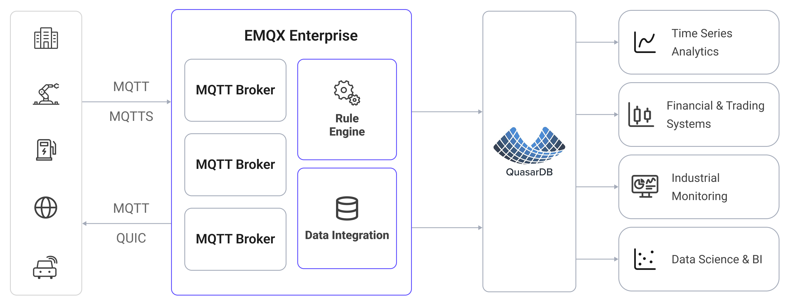

# Ingest MQTT Data into QuasarDB

[QuasarDB](https://www.quasardb.net/) is a high-performance, column-oriented time-series database designed for storing and querying large volumes of time-stamped data. EMQX supports integration with QuasarDB, enabling you to save MQTT messages and client events to QuasarDB. This facilitates the construction of data pipelines and analytical processes for IoT telemetry management and analysis.

This page provides a detailed overview of the data integration between EMQX and QuasarDB, with practical instructions on creating and validating the data integration.


## How It Works

QuasarDB data integration is an out-of-the-box feature in EMQX that combines EMQX's device connectivity and message transmission capabilities with the high-performance time-series storage of QuasarDB. Through the built-in [rule engine](./rules.md) component and Sink, you can store MQTT messages and client events in QuasarDB. This integration simplifies the process of ingesting data from EMQX to QuasarDB for storage and management, eliminating the need for complex coding.

The diagram below illustrates a typical architecture of data integration between EMQX and QuasarDB:



Ingesting MQTT data into QuasarDB works as follows:

1. **Message publication and reception**: IoT devices establish successful connections to EMQX through the MQTT protocol and publish real-time MQTT data to EMQX. When EMQX receives these messages, it initiates the matching process within its rules engine.
2. **Message data processing**: When a message arrives, it passes through the rule engine and is then processed by the rule defined in EMQX. The rules, based on predefined criteria, determine which messages need to be routed to QuasarDB. If any rules specify payload transformations, those transformations are applied, such as converting data formats, filtering out specific information, or enriching the payload with additional context.
3. **Data ingestion into QuasarDB**: The rule triggers the writing of messages to QuasarDB. With the help of SQL templates, users can extract data from the rule processing results to construct SQL and send it to QuasarDB for execution, so that specific fields of the message can be written into the corresponding tables.
4. **Data storage and utilization**: With data now stored in QuasarDB, businesses can harness its time-series querying capabilities for analytics, monitoring, and operational use cases.

## Features and Benefits

The data integration with QuasarDB offers a range of features and benefits:

- **Real-time data streaming**: EMQX is built for handling real-time data streams, ensuring efficient and reliable data transmission from source systems to QuasarDB. It enables organizations to capture and analyze data in real-time, making it ideal for use cases requiring immediate insights and actions.
- **High-performance time-series storage**: QuasarDB's columnar engine is optimized for time-series workloads, providing fast ingestion throughput and efficient range queries over large volumes of timestamped data.
- **Flexibility in data transformation**: EMQX provides a powerful SQL-based Rule Engine, allowing organizations to pre-process data before storing it in QuasarDB. It supports various data transformation mechanisms such as filtering, routing, aggregation, and enrichment.
- **Batching support**: The QuasarDB Sink supports batch writes, reducing the number of round trips and improving overall ingestion throughput.

## Before You Start

This section describes the preparations you need to complete before creating the QuasarDB data integration, including how to configure the ODBC driver and install QuasarDB.

### Prerequisites

- Knowledge about EMQX data integration [rules](./rules.md)
- Knowledge about [data integration](./data-bridges.md)

### Install and Configure the ODBC Driver

The QuasarDB connector uses ODBC to connect to the database. You need to install and configure the QuasarDB ODBC driver on the host where EMQX is running before creating a connector.

Refer to the [QuasarDB ODBC documentation](https://doc.quasar.ai/master/user-guide/integration/odbc.html) for full installation instructions. The steps below show a typical setup on Debian-based systems using driver version 3.14.1.

1. Download and install the QuasarDB C API package and ODBC driver:

   ```bash
   curl -fsSL -O https://download.quasar.ai/quasardb/3.14/3.14.1/api/c/qdb-api_3.14.1.deb
   curl -fsSL -O https://download.quasar.ai/quasardb/3.14/3.14.1/api/odbc/qdb-3.14.1-linux-64bit-odbc-driver.tar.gz
   apt-get install -yqq ./qdb-api_3.14.1.deb
   tar -C /tmp/qdb_odbc_driver -xf qdb-3.14.1-linux-64bit-odbc-driver.tar.gz
   ```

2. Register the driver in `/etc/odbcinst.ini`:

   ```ini
   [qdb_odbc_driver]
   Description=Quasardb ODBC Driver
   Driver=/tmp/qdb_odbc_driver/lib/libqdb_odbc_driver.so
   Setup=/tmp/qdb_odbc_driver/lib/libqdb_odbc_driver.so
   ```

3. Create a Data Source Name (DSN) entry in `/etc/odbc.ini`:

   ```ini
   [qdb]
   Driver = qdb_odbc_driver
   Description = QuasarDB ODBC Data Source
   #URI = qdb://172.100.239.30:2836
   #UID = user_name
   #PWD = user_key
   #KEY = cluster_public_key
   ```

The DSN name you set here (e.g., `qdb`) is what you enter in the **ODBC Data Source Name** field when creating the connector.

### Install and Connect to QuasarDB

This section describes how to start a QuasarDB instance using Docker.

1. Pull and start the QuasarDB Docker image:

   ```bash
   docker run -d --name qdb \
     -p 2836:2836 \
     bureau14/qdb:3.14.1
   ```

   ::: tip

   QuasarDB requires connecting via an **IP address**, not a hostname. Use `127.0.0.1` (or the actual host IP) in the URI. Hostname-based connections are not supported.

   :::

2. Verify the instance is running by connecting with the QuasarDB shell:

   ```bash
   docker run -it --rm bureau14/qdbsh --cluster qdb://127.0.0.1:2836
   ```

To enable user authentication or cluster key authentication, refer to the [QuasarDB security documentation](https://doc.quasar.ai/).

### Create a Table

Create a table in QuasarDB to receive ingested data. The example below creates a table for storing temperature and humidity readings:

```sql
CREATE TABLE temp_hum (temp DOUBLE, hum DOUBLE);
```

::: tip

QuasarDB tables always include an implicit `$timestamp` index column. You do not need to declare it when creating a table, but you can reference it in INSERT statements.

:::

## Create a Connector

This section demonstrates how to create a Connector to connect EMQX to QuasarDB.

1. Go to the EMQX Dashboard and click **Integration** -> **Connectors**.

2. Click **Create** in the top right corner of the page.

3. On the **Create Connector** page, select **QuasarDB** and then click **Next**.

4. Enter a name for the connector, which must be a combination of upper/lower case letters and numbers, for example, `my_quasardb`.

5. Configure the connection information:

   - **Server URI**: Enter the URI of your QuasarDB cluster using an IP address, for example `qdb://127.0.0.1:2836`.
   - **ODBC Data Source Name**: Enter the DSN name defined in `/etc/odbc.ini`, for example `qdb`.
   - **Username**: Enter the username, if any.
   - **Password**: Enter the user secret key, if any.
   - **Cluster Public Key**: Enter the cluster public key, if any.

6. Advanced settings (optional): For details, see [Advanced Configuration](#advanced-configuration).

7. Before clicking **Create**, you can click **Test Connectivity** to verify that EMQX can connect to QuasarDB.

8. Click the **Create** button to complete the connector setup. A **Created Successfully** dialog appears asking whether to create a rule now. Click **Create Rule** to proceed directly to rule creation with the connector pre-selected, or click **Back To Connector List** to return and create a rule later.

## Create a Rule with QuasarDB Sink

This section demonstrates how to create a rule in the Dashboard for processing messages from the source MQTT topic `t/#` and saving the processed data to the QuasarDB table `temp_hum` via the configured Sink.

1. If you clicked **Create Rule** in the previous step, the **Add Action** panel opens automatically with **Type of Action** set to `QuasarDB` and the connector pre-selected. Skip to step 5.

   Otherwise, go to the EMQX Dashboard, click **Integration** -> **Rules**, click **Create** in the top right corner, then click **+ Add Action**.

2. In the **SQL Editor** on the left, enter a rule ID and the following SQL to match messages from topic `t/#`:

   Note: If you want to specify your own SQL syntax, make sure all fields required by the Sink are included in the `SELECT` part.

   ```sql
   SELECT
     *
   FROM
     "t/#"
   ```

   ::: tip

   If you are a beginner user, click **SQL Examples** and **Enable Test** to learn and test the SQL rule.

   :::

3. In the **Add Action** panel on the right, select `QuasarDB` from the **Type of Action** dropdown list. Keep the **Action** dropdown with the default `Create Action` value.

4. From the **Connectors** dropdown, select the `my_quasardb` connector you just created. You can also create a new Connector by clicking the button next to the dropdown. For configuration parameters, see [Create a Connector](#create-a-connector).

5. Enter a name and optional description for the Sink.

6. Configure the **SQL Template** to define how data is written to QuasarDB.

   ::: tip Note

   The SQL Template only accepts **INSERT** statements. Other statement types, such as UPDATE and DELETE, are not supported.

   :::

   The SQL template supports placeholder variables such as `${clientid}`. QuasarDB uses `$timestamp` as the implicit timestamp index column; you can use `now()` to insert the current server time.

   ::: tip Note

   The QuasarDB ODBC driver does not support prepared statements. Any value that resolves to a `STRING` or `BLOB` type must be manually quoted with single quotes (`'`) in your SQL template.

   :::

   ```sql
   insert into temp_hum($timestamp, temp, hum)
   values (now(), ${.temp}, ${.hum})
   ```

7. **Fallback Actions (Optional)**: Define one or more fallback actions to improve reliability in case of message delivery failure. See [Fallback Actions](./data-bridges.md#fallback-actions) for more details.

8. **Advanced settings (optional)**: For details, see [Sink Advanced Settings](#sink-advanced-settings).

9. Before clicking **Create**, you can click **Test Connectivity** to test that the Sink can connect to QuasarDB.

10. Click the **Create** button to complete the Sink configuration. A new Sink will be added to the **Action Outputs**.

11. Back on the **Create Rule** page, verify the configured information and click the **Save** button to generate the rule.

You have now successfully created the rule. You can see the newly created rule on the **Integration** -> **Rules** page. Click the **Actions(Sink)** tab to see the new QuasarDB Sink.

You can also click **Integration** -> **Flow Designer** to view the topology and verify that messages under topic `t/#` are forwarded to QuasarDB after processing by rule `my_rule`.

## Test the Rule

Use MQTTX to send a message to topic `t/1` to trigger the rule.

```bash
mqttx pub -i emqx_c -t t/1 -m '{ "temp": "27.5", "hum": "41.8" }'
```

Check the running statistics of the QuasarDB Sink. There should be 1 new matching and 1 new outgoing message. Verify that the data is written into the `temp_hum` table in QuasarDB.

## Advanced Configuration

This section describes the advanced configuration options available for the QuasarDB Connector and Sink. When configuring them in the Dashboard, you can expand **Advanced Settings** to adjust the following parameters based on your specific needs.

### Connector Advanced Settings

| Field Name | Description | Default Value |
| --- | --- | --- |
| Connection Pool Size | Number of concurrent connections maintained in the pool. Too large a value may exhaust system resources; too small a value may limit throughput. | `8` |
| Connect Timeout | Maximum time to wait when establishing a connection to QuasarDB. | `5` seconds |
| Start Timeout | Maximum time the connector waits for an auto-started resource to become healthy before accepting requests. | `5` seconds |
| Health Check Interval | How often the connector runs an automated health check on the QuasarDB connection. | `15` seconds |
| Health Check Timeout | Maximum time allowed for each health check to complete. | `60` seconds |

### Sink Advanced Settings

| Field Name | Description | Default Value |
| --- | --- | --- |
| Buffer Pool Size | Number of buffer worker processes that handle data flow between EMQX and QuasarDB. Increase this value to improve throughput under high load. | `16` |
| Request TTL | Maximum time a request remains valid in the buffer. Requests that exceed this duration — whether still queued or sent without acknowledgment — are discarded. | `45` seconds |
| Health Check Interval | How often the Sink runs an automated health check on the QuasarDB connection. | `15` seconds |
| Health Check Interval Jitter | Random delay added to the health check interval to prevent multiple nodes from checking simultaneously. Useful when multiple Actions or Sources share the same Connector. | `0` milliseconds |
| Health Check Timeout | Maximum time allowed for each Sink health check to complete. | `60` seconds |
| Max Buffer Queue Size | Maximum bytes each buffer worker can hold. Increase this value if your workload produces bursts that exceed default capacity. | `256` MB |
| Batch Size | Maximum number of records sent to QuasarDB in a single operation. Set to `1` to disable batching and send records individually. | `100` |
| Query Mode | `async` lets EMQX continue publishing without waiting for QuasarDB to confirm each write; `sync` waits for confirmation before proceeding. Async mode offers higher throughput but may result in out-of-order delivery. | `Async` |
| Inflight Window | Maximum number of unacknowledged requests allowed in flight at once. When **Query Mode** is `async`, set this to `1` to guarantee per-client message ordering. | `100` |
