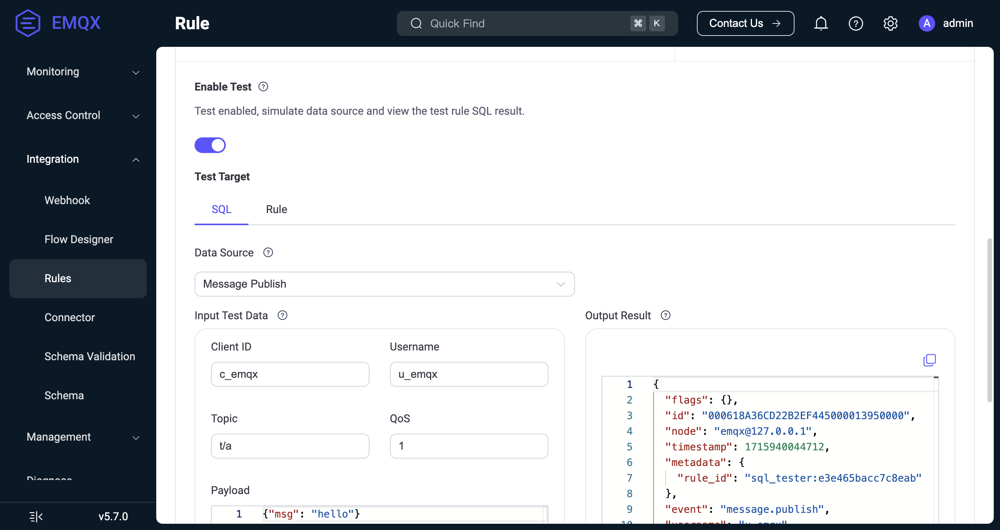
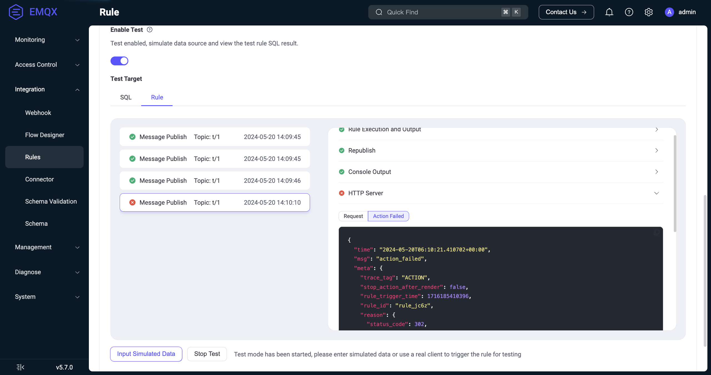
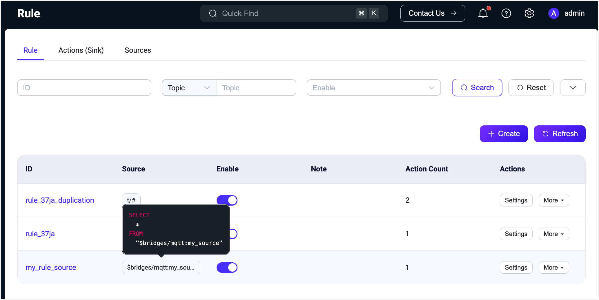
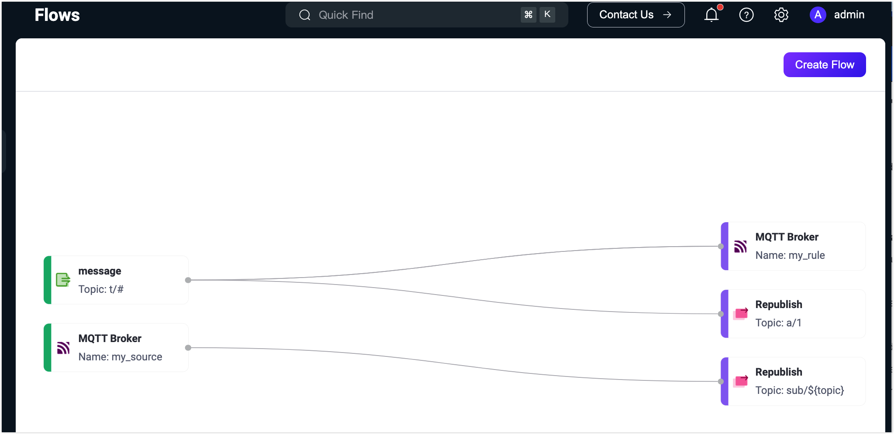
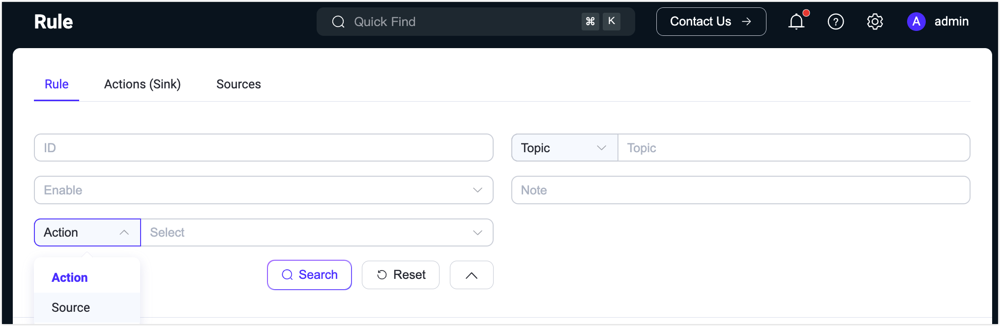

# Create Rules

This page provides guidance on how to create rules for data processing and attach an action to a rule using the EMQX Dashboard. It also introduces how to test rules and view rules after the rule creation.

The demonstration on this page takes the republish action as an example, describing how to create a rule that processes messages received on the topic `t/#` and republishes the message to the topic `a/1`. However, the actions "printing the result to the Console" and "forwarding with Sinks" are also mentioned in [Add Action](#add-action).

## Define a Data Source
Log in to the EMQX Dashboard and click **Integration** -> **Rules** in the left navigation menu. 

Click the **Create** button on the **Rule** page and you will be directed to the **Create Rule** page. Here, you can define the data source for your rule and determine the subsequent actions for the filtered messages. 

Enter a name for your rule and add a note to facilitate future management. In the **SQL Editor**, you can customize the statements to add a data source that suits your business needs. For this tutorial, keep the default setting, which selects and returns all messages under topics that follow the `"t/#"` pattern (e.g., `t/a`, `t/a/b`, `t/a/b/c`, etc.).

::: tip

This tutorial assumes the message payload is JSON. If the payload is formatted in some other way, you can convert the data type, for example, with the [Schema Registry](./schema-registry.md).

EMQX has embedded rich SQL statement samples to help you get started, you can click the **SQL Example** button under the **SQL Editor** to explore. For more details about the SQL syntax and usages, see [SQL Syntax](./rule-sql-syntax.md).

:::


### Test SQL Statement

You can use simulated data to execute SQL statements. Before adding actions and creating rules, you can verify whether the SQL execution results meet expectations. This is an optional step, but it is recommended if you are new to EMQX rules. If you want to test the execution of the entire rule, refer to [Test Rule](#test-rule).

Follow the instructions below to test the SQL statement:

1. Turn on the **Try It Out** toggle switch to enable the SQL statement testing.
2. Select the **Data Source** that matches the SQL and ensure it is consistent with the specified source in the rule (FROM clause).
3. Enter test data. Once you select the data source, EMQX provides default values for all simulated data fields, such as **Client ID**, **Username**, **Topic**, **QoS**, **Payload**, etc. Modify them to appropriate values as needed.
4. Click the **Run Test** button to submit the test. If everything is normal, a **Test Passed** prompt will be displayed.



The processing result of SQL will be presented in the **Output Result** section in JSON format. All the fields in SQL processing results can be referenced in the form of `${key}` by the subsequent actions (built-in actions or Sink). For a detailed explanation of the fields, see [SQL Data Sources and Fields](./rule-sql-events-and-fields.md).

This demonstration assumes that the Payload is in JSON format. In actual use, you can also use [Schema Registry](./schema-registry.md) to handle messages in other formats.

Next, you can click the **Add Action** button on the right side of the **Create Rule** page to add different types of actions to the rule.

## Add Actions

On the **Create Rule** page, click the **Add Action** button on the right side to bring up the **Add Action** page. You can select either of the three types of actions from the **Action** drop-down list: Republish, Console Output, and Forwarding with Data Bridge.

### Add Republish Action

This section demonstrates how to add an action to republish the original messages received from the topic `t/#` to another topic `a/1`. 

Select **Republish** from the drop-down menu under **Action**, and configure the following settings before clicking the **Add** button to confirm:

- **Topic**: Set the target topic, "a/1" in this example;

- **QoS**: Set the QoS of the republished message, "0" in this example;

- **Retain**: Set whether to forward this message as a retained message, for this tutorial, keep the default setting, **false**;

- **Payload**: Enter "${payload}", indicating the republished message will have the same payload as the original message, without any modifications.

- **MQTT 5.0 Message Properties**: Click the toggle switch to configure the user properties and MQTT properties as necessary. The properties options allow you to add rich message metadata descriptions for the republished message.

  <!-- - **User Properties**: You can add custom key-value pairs to configure the [user properties](https://www.emqx.com/en/blog/mqtt5-user-properties) of the republished message, which represent custom message metadata. -->

  - **Payload Format Indicator**: Enter a value to indicate whether the payload of the message is in a specific format. When the value is set to `false`, the message is considered as undetermined bytes. When set to `true`, it indicates that the payload within the message body is UTF-8 encoded character data. This will help MQTT clients or MQTT servers parse message content more efficiently without the need for explicit formatting or type identification for the message body.

  - **Message Expiry Interval**: Enter a value (in seconds) to specify a time interval after which the message should expire and be considered invalid if it hasn't been delivered to the intended recipient.
  - **Content Type**: Enter a value to specify the type or format of the payload content within the republished message (MIME type), for example, `text/plain` represents a text file, `audio/aac` represents an audio file, and `application/json` signifies an application message in JSON format.
  
  - **Response Topic**: Enter the specific MQTT topic to which you want the response message to be published. For example, if you want responses to be sent to a topic named "response/my_device," you would enter: `response/my_device`.
  
  - **Correlation Data**: Enter a unique identifier or data to correlate a response message with the original request message. For example, you could enter a unique request identifier, a transaction ID, or any other information that is meaningful in your application context.
  


On the **Create Rule** page, click the **Create** button at the bottom to complete the rule creation. This rule will be added as a new entry on the **Rule** page. 

::: tip
The republishing action does not prevent the delivery of the original message. For example, according to the rule, messages under topic "t/1" will be republished under topic "a/1", in the meantime "t/1" message will still be delivered to the clients subscribed to topic  "t/1".
:::

### Add Console Output Action

::: tip
The console output action should only be used for debugging. If it is used in the production environment, it may cause performance problems.
:::

The console output action is used to view the output results of the rule. The result messages will be printed to the console or log file.

- When EMQX is launched in either `console` or `foreground` mode, with `foreground` being the default mode in Docker environments, its output is directed to the console.
- If EMQX is started via systemd, the output is captured and stored by the journal system. This can be examined using the `journalctl` command.

The output will be in the format below

```bash
[rule action] rule_id1
    Action Data: #{key1 => val1}
    Envs: #{key1 => val1, key2 => val2}
```

Where

-  `[rule action]` is the rule ID where the republish action is triggered.
-  `Action Data` is the output result of the rule, indicating the data or parameter that should be passed to the action when it is executed, that is, the payload part when you set up the republish action.
-  `Envs` is the environment variable that should be set when republishing, which could be the data source and other internal information related to the execution of this action.

### Add Forwarding with Sinks Action

You can also add actions to forward the processed results using sinks. All you need is to select the target Sink from the Type of Action drop-down list in the Dashboard. For details on each sink in EMQX, see [Data Integration](./data-bridges.md).

## Test Rules

The rule engine provides a rule testing feature, which allows you to trigger rules using simulated data or real client data, execute rule SQL, and perform all actions added to the rule, obtaining the execution results for each step.

By testing rules, you can verify whether the rules work as expected, and quickly identify and solve any issues. This not only speeds up the development process but also ensures that the rules can run as expected in real environments, avoiding failures in production.

### Testing Steps

1. Toggle the **Try It Out** switch and select **Rule** as the test target. Note that before starting the test, you need to save the rule.
2. Click the **Start Test** button to begin the test. The browser will wait for the current rule to be triggered to generate the test results.
3. Trigger the rule for testing. The following 2 methods are supported:
   - **Use simulated data**: Click the **Input Simulated Data** button, select the **Data Source** that matches the SQL in the pop-up window, and ensure it matches the specified source in the rule (FROM clause). EMQX provides default values for all fields, such as **Client ID**, **Username**, **Topic**, **QoS**, **Payload**, etc. Modify them as needed, and click the **Submit Test** button to trigger the rule for testing once.
   - **Use real device data**: Keep the current page open, connect to EMQX using a real client or MQTT client tool, trigger the corresponding events, and perform testing.
4. View the test results: When the rule is triggered, the execution results will be output to the Dashboard, displaying detailed execution results for each step.

### Testing Example

You can use [MQTTX](https://mqttx.app/) to test the rule with the republish action. Create one client, and use this client to subscribe to the `a/1` topic and send a `t/1` message. You will see in the dialog box that this message is republished to the topic `a/1`.

For details on how to build the connection between the MQTTX client tool and EMQX, see [MQTTX - Get Started](https://mqttx.app/docs/get-started).


Correspondingly, on the Dashboard test interface, the execution results of the entire rule will be displayed, with the following contents:

- On the left are the rule execution records. Each time the rule is triggered, a record is generated. Clicking on it can switch to the corresponding message or event details.
- On the right is the list of actions recorded by the selected rule. Clicking on it can expand to view the action execution results and logs.

When the execution of the rule SQL or any action fails, the entire rule record will be marked as failed. You can select the record to view the corresponding action's error information for troubleshooting.



From the above example, it can be seen that the rule was triggered 4 times, with 3 times the rule execution being completely successful. The 4th time failed due to the **HTTP Server** action execution failure, with the error reason being a response with a 302 status code.

For more usage guides on testing rules, you can refer to the blog [Enhancing Data Integration Stability: A Guide on EMQX Platform E2E Rule Testing](https://www.emqx.com/en/blog/emqx-platform-e2e-rule-testing-guide).

## View Rules

The **Rule** page provides a comprehensive list of all the rules you have created.

Each entry in the list displays basic information, including the rule ID, associated source, enable status, and the number of actions. Hovering over the source reveals the corresponding SQL statement details. To modify a rule's configuration, click **Settings** in the **Actions** column. You can also use the **More** button to duplicate or delete a rule.



You can also view rules in the [Flow Designer](../flow-designer/introduction.md) by navigating to **Integration** -> **Flow Designer**. Rules created on the **Rules** page and those created through the Flow Designer are fully interoperable.

To view the execution and action statistics for a rule, click the rule ID on **Rule** page or the rule name on the **Flows** page.



::: tip

If you update the rule action or redefine the data source, the statistics listed on the page below will reset and start fresh.

:::


### View Actions (Sink) and Sources

The **Actions (Sink)** and **Sources** tabs on the **Rule** page display all created actions (sinks) and sources. You can view essential details, such as names, connection statuses, associated rules, and enable statuses. Clicking the number of associated rules will take you to a list of rules containing that specific action (sink) or source, making it easier to manage your data integration settings.

You can reconnect or modify the settings of an action (sink) or source through the **Action** column. By clicking **More**, you can delete the action (sink) or source, or create a new rule using it.

### Search Rules

When there are many rules in the list, you can use the filter to narrow down your search and display the rules you want to view. You can filter rules by rule ID, incoming message topic or wildcard, enable status, rule notes, and the actions or sources associated with the rule.


