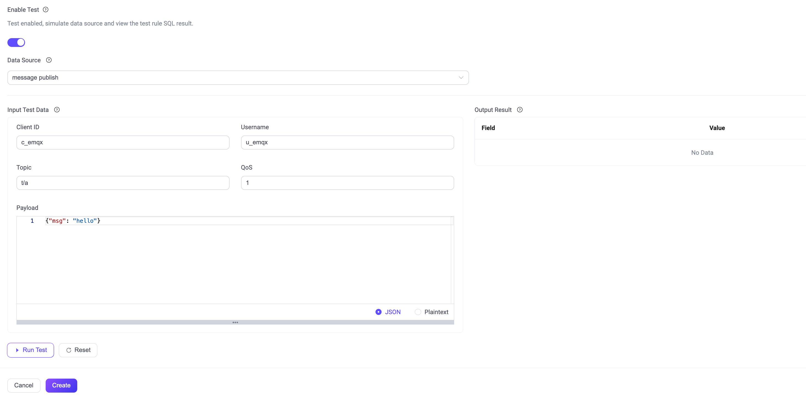

# Rule-Engine Language

EMQX uses a SQL-based rule engine for data extraction, filtering, enriching, and transformation in real time. The rule engine language also supports embedding [JQ programs](https://stedolan.github.io/jq/) in expressions, which allows you to do complex data transformations when it is needed.

EMQX has provided a rich set of built-in functions that you can access by clicking **Data Integration** -> **Rules** -> **SQL Example** on EMQX Dashboard. For more customized needs, EMQX also supports creating your own SQL-like statements. This section will introduce the SQL-like language. 

This SQL-like language has two types of statements: `SELECT` and `FOREACH`. Each rule can have exactly one statement. 

| Statement | Description                                                  |
| --------- | ------------------------------------------------------------ |
| `SELECT`  | For situations where the result of the SQL statement is a single message. |
| `FOREACH` | For producing zero or more messages from a single input message. |

The rule engine language also supports complex expressions that can be embedded within the `SELECT` and `FOREACH` statements. 

## The `SELECT` Statement 

The rule engine SQL in EMQX uses a `SELECT` statement to select specific fields from an input message, rename fields, transform data, and filter messages based on conditions. 

The basic format of a `SELECT` statement in the rule engine SQL is as follows:

```sql
SELECT <fields_expressions> FROM <topic> [WHERE <conditions>]
```

To use the `SELECT` statement, you need to specify which fields to include in the output message using the `SELECT` clause. You can select fields from the message's payload and metadata, and give them custom names using the `as` keyword. You can also transform data using expressions, and filter messages based on conditions using the `WHERE` clause. Below are some typical use cases regarding how to use the `SELECT` statement.

### Filter by Topics

You can use the `SELECT` clause to filter the fields to include in the output message. 

For example, if you want to defines a rule applies to all messages published to topics matching the pattern `t/#` and `my/other/topic`, you can work with the statement below:

```sql
SELECT clientid, payload.clientid as myclientid FROM "t/#", "my/other/topic"
```

This statement defines a rule applies to all messages published to topics matching the pattern `t/#` and `my/other/topic`.

This `SELECT` statement retrieves the `a` and `b` fields from the message payload, along with `clientid` from both the message payload and metadata (using `payload.clientid`), and renames the `clientid` field from the payload as `myclientid` to prevent any naming conflicts. The resulting output will contain all four fields: `a`, `b`, `clientid`, and `myclientid`.

::: tip

You can find all available event topics in EMQX Dashboard for editing rules (**Subscriptions** -> **Topics**).

:::

### Filter by Events

You can also attach rules to events. For example, if you want to selects the IP address and port number of when client `c1` initiates a connection request to EMQX, you can use the statement below:

```sql
SELECT peername as ip_port FROM "$events/client_connected" WHERE clientid = 'c1'
```

### The `WHERE` clause

The `WHERE` clause provides an optional way to refine message filtering by specifying additional conditions that the messages must meet, in addition to the topic/event filter specified in the `FROM` clause.

For instance, the following SQL statement filters messages under topic `t/#` that are sent by the user name `eric`:

```sql
SELECT * FROM "t/#" WHERE username = 'eric'
```

::: tip

The fields used in the `WHERE` clause must be one field available in the message metadata or payload, or there will be an error. 

:::

### Work with Expressions

[Expressions](#expressions-and-operations) can also be used to transform data in the `SELECT` clause. For example, the following SQL statement formats the `clientid` field value by converting it to uppercase and adding a suffix. The result is named `cid` in the output message: 

```sql
SELECT (upper(clientid) + '_UPPERCASE_LETTERS') as cid FROM "t/#"
```

The following showcase the use of a parenthesized arithmetic expression to transform data: 

```sql
SELECT (payload.integer_field + 2) * 2 as num FROM "t/#"
```

You can also use dot notation to access fields in a payload with a complex structure: 

```sql
SELECT payload.a.b.c.deep as my_field FROM "t/#"
```

<!--The arguments for the `WHERE` clause is an expression that evaluates to a boolean value. The expression can be a combination of field names, constants, and operators. We will introduce expressions and the available operations in more details after we have introduced the `FOREACH` statement. do not quite see what this is about and also need some explanations about using expressions in where clause-->

## The `FOREACH` Statement

The `FOREACH` statement is to specify an array and apply filters to each element of the array.  The `FOREACH` clause is used in combination with the `SELECT` statement to transform and filter data.

Besides the `FROM` and `WHERE` clause, This `FOREACH` statement has two types of clauses:

| Clause   | Optional/Required | Description                                                  |
| -------- | ----------------- | ------------------------------------------------------------ |
| `DO`     | Optional          | To transform each element in the array selected by `FOREACH`<br><br>Correspond to the `SELECT` clause in the `SELECT` statement and accepts the same expressions |
| `INCASE` | Optional          | To filter out array elements that do not match the specified conditions.<br><br>Accepts the same expressions as the `WHERE` clause |

The basic format of a `FOREACH` statement in the rule engine SQL is as follows:

```sql
FOREACH <expression_that_evaluates_to_array> [as <name>]
[DO <fields_expressions>]
[INCASE <condition>]
FROM <topic>
[WHERE <condition>]
```

Below are some typical use cases regarding how to use the `FOREACH` statement.

### Work with `jq` function

The built-in function `jq` can be combined with the `FOREACH` statement to transform data from the input message into an array that the `FOREACH` statement can process. On details about using the `jq` function in EMQX, see [documentation page for the build-in `jq` function](./rule-sql-jq).

For exmaple, to uses the  build-in `jq` function to wrap the payload in an array, you can work with the statement below:

```sql
FOREACH jq('.', payload) 
DO item.field_1, item.field_2 
FROM "t/#"
```

:::tip Note:

As all but the `FOREACH` clause have corresponding clauses in the `SELECT` statement, so the above statement is the same as the statement below:

```sql
SELECT payload.field_1, payload.field_2
FROM "t/#"
```

:::

The following will give two output values. Both values contain only one field called `value`. The value of the field `value` is the value of the field `field_1` in one of the messages and the value of `field_2` in the other message:

```sql 
FOREACH jq('[.field_1, .field_2]', payload) 
DO item as value
FROM "t/#"
```

All actions specified for a rule with a `FOREACH` statement will be executed for each output value produced by the `FOREACH` statement. Thus, a rule with the above statement and a single action will trigger the action two times every time a message matches the rule.

### Split One Message into Multiple

For example for messages published to topics `t/#`, if you want to output the timestamp, client ID, sensor name, and idx when the sensor idx is 1 or above, you can use the code below:

```sql
FOREACH
    ## The data must be an array
    payload.sensors as sensor  
DO  ## The Do clause is used to select fields to the output message
    payload.timestamp,
    payload.client_id,
    upper(sensor.name) as name,
    sensor.idx as idx
INCASE
    sensor.idx >= 1
FROM "t/#"
```

Where,

- the `FOREACH` clause specifies the `sensors` field in the input message's payload as the array to iterate over
- the `DO` clause specifies the fields to be included in the output:
  - `payload.timestamp` is the time stamp from the message payload
  -  `payload.clientid` is the client ID from the message payload, 
  - `sensor.name` will be capitalized with the build-in `upper` function and renamed as `name` with the `as` clause
  -  `sensor.idx`  will be renamed as `idx` with the `as` clause
- the `INCASE` clause adds another filter condition, when the sensor.idx value is 1 and above. 
- the `FROM` clause sets where to retrieve the messages. 

Then you can continue to use the `jq` function to transform the input message's payload into an array of objects with the following fields: `sensor_type`, `value`. The `DO` clause specifies that the `timestamp`, `clientid`, `sensor_type` and `value` fields should be included in the output message's payload. The `FROM` clause specifies that the rule should be applied to messages with a topic matching the [topic filter](https://www.emqx.com/en/blog/advanced-features-of-mqtt-topics) `car/measurements`.

```sql
FOREACH
    ## The data must be an array
    jq('
       [{
         sensor_type: "temprature",
         value: .temprature
        },
        {
         sensor_type: "humidity",
         value: .humidity
        },
        {
         sensor_type: "pressure",
         value: .pressure
        },
        {
         sensor_type: "light",
         value: .light
        },
        {
         sensor_type: "battery",
         value: .battery
        },
        {
         sensor_type: "speed",
         value: .speed
        }]',
        payload) as sensor  
DO
    payload.client_id,
    payload.timestamp,
    sensor.sensor_type,
    sensor.value
FROM "car/measurements"
```

The following example is equivalent to the previous example, but uses a different JQ program and no `DO` clause. This example is meant to illustrate that the JQ programs are very powerful and can be used to do any type of transformation. That being said, one should avoid doing computationally expensive transformations in EMQX rules as this can affect the performance of the EMQX broker. 

```sql
FOREACH
    jq('
       # Save the input
       . as $payload |
       
       # All sensor types
       [ 
         "temperature",
         "humidity",
         "pressure",
         "light",
         "battery",
         "speed" 
       ] as $sensor_types |
       
       # Output an object for each sensor type
       $sensor_types[] |
       {
         client_id: $payload.client_id,
         timestamp: $payload.timestamp,
         sensor_type: .,
         value: $payload[.] 
       }
       ',
       payload) as sensor  
FROM "car/measurements"
```

## Expressions and Operations 

The rule engine language allows using expressions to transform data and filter messages, which can be used in various clauses, including `SELECT`, `FOREACH`, `DO`, `INCASE`, and `WHERE` clauses. This section offers more information on using these expressions. The following are the operations that can be used to form expressions, and remember that there is a wide range of built-in functions that can also be used in expressions.


### Arithmetic Operations

| Function | Purpose                                                                                               | Returned value              |      |
| -------- | ------------------------------------------------------------                                          | --------------------------- | ---- |
| `+`      | addition, or string concatenation                                                                     | Sum, or concatenated string |      |
| `-`      | Subtraction                                                                                           | Difference                  |      |
| `*`      | multiplication                                                                                        | product                     |      |
| `/`      | division                                                                                              | Quotient                    |      |
| `div`    | Integer division                                                                                      | Integer quotient            |      |
| `mod`    | modulus                                                                                               | module                      |      |


### Logical Operations

| Function | Purpose | Returned Value |
| ------ | ------------------- | ---------- |
| `>` | greater than | true/false |
| `<` | less than | true/false |
| `<=` | less than or equal | true/false |
| `>=` | greater than or equal | true/false |
| `<>` | not equal | true/false |
| `!=` | not equal | true/false |
| `=`      | Check if the two operands are completely equal. It can be used to compare values                      | true/false                  |
| `=~`     | Check if a topic can match the topic filter. It can only be used for topic matching                   | true/false                  |
| `and`    | logical and                                                                                           | true/false                  |
| `or`     | logical or                                                                                            | true/false                  |


### CASE Expressions 

The `CASE` expression can be used to perform conditional operations. A case expression corresponds to an if-then-else statement in other languages. How to use the `CASE` expression is illustrated by the following example.

```sql
SELECT
  CASE WHEN payload.x < 0 THEN 0
       WHEN payload.x > 7 THEN 7
       ELSE payload.x
  END as x
FROM "t/#"
```

Suppose the message is:

```json
{"x": 8}
```

Then the output will be:

```json
{"x": 7}
```


## Test the Rules 

After creating your rules, it's always recommended testing your rules before putting into product. The Dashboard UI contains a test feature that allows you to test your rules with sample messages. 

To use this feature, click Data Integration -> Rules on the left navigation menu, and tTurn on the **Enable Test** switch).




## More Examples

### Examples of SELECT Statements 

-  Extract all fields from the messages with the topic "t/a":
    ```sql
    SELECT * FROM "t/a"
    ```
-  Extract all fields from the messages with the topics "t/a" or "t/b":
    ```sql
    SELECT * FROM "t/a","t/b"
    ```
-  Extract all fields from the message with a topic that matches 't/#'.
    ```sql
    SELECT * FROM "t/#"
    ```
-  Extract the qos, username, and clientid fields from the input message with a topic that matches 't/#' (the output message will have a payload with the fields qos, username, and clientid):
    ```sql
    SELECT qos, username, clientid FROM "t/#"
    ```
-  Extract the username field from any message with a payload field named username with the value 'Steven' (it is not recommended to use the [topic filter](https://www.emqx.com/en/blog/advanced-features-of-mqtt-topics) '#' in the FROM clause as this means that the rule has to be checked for all messages that are sent to EMQX):
    ```sql
    SELECT username FROM "#" WHERE username='Steven'
    ```
- Extract the `x` field from the payload of the input message and rename the field to `y` in the output message. The new alias `y` for `payload.x` can also be used in the `WHERE` clause. A rule with this SQL statement matches messages with the payload `{"x": 1}` but not messages with the payload `{"x": 2}`:
    ```sql
    SELECT payload.x as x FROM "tests/test_topic_1" WHERE y = 1
    ```
- This SQL statement matches messages with the payload `{"x": {"y": 1}}` (and for example `{"x": {"y": 1}, "other": "field}`):
    ```sql
    SELECT * FROM "#" WHERE payload.x.y = 1
    ```
-  If an MQTT client with clientid = 'c1' connected, extract its source IP address and port number:
    ```sql
    SELECT peername as ip_port FROM "$events/client_connected" WHERE clientid = 'c1'
    ```
- Matches all subscriptions to topics that matches the pattern 't/topic' and have a quality of service (QoS) level of 1. It extracts the clientid to the output message.
    ```sql
    SELECT clientid FROM "$events/session_subscribed" WHERE topic = 'my/topic' and qos = 1
    ```
- Similar to the above example but here the topic match operator `=~` is used to match the [topic filter](https://www.emqx.com/en/blog/advanced-features-of-mqtt-topics) 't/#':
    ```sql
    SELECT clientid FROM "$events/session_subscribed" WHERE topic =~ 't/#' and qos = 1
    ```
- Extract the User Property with Key "foo" (User properties is new in the MQTT 5.0 protocol so this is not relevant for older MQTT versions):
    ```sql
    SELECT pub_props.'User-Property'.foo as foo FROM "t/#"
    ```

::: tip
- Topics in the `FROM` clause need to be enclosed in double quotes (`""`).
- The `WHERE` clause is followed by the filter condition. If a string is used in the condition, it needs to be enclosed in single quotes (`''`).
- If there are multiple topics in the FROM clause, they need to be separated by commas `","`. For example, `SELECT * FROM "topic1", "topic2" WHERE topic1.id = topic2.id`.

    ```sql
    SELECT * FROM "t/1", "t/2".
    ```
- You can use the period symbol (`.`) to access inner fields of the payload. For example, if the payload is a nested JSON structure, you can use `payload.outer_field.inner_field` to access the `inner_field` of the `outer_field`. 
:::

### Examples of FOREACH Statements

Suppose there are messages with client ID `c_steve` coming to the topic ` t/1`. The message body is in JSON format, and the sensors field is an array containing multiple objects as is shown in the following example:

```json
{
    "date": "2020-04-24",
    "sensors": [
        {"name": "a", "idx":0},
        {"name": "b", "idx":1},
        {"name": "c", "idx":2}
    ]
}
```

#### Example 1

In this example it is required that each object in sensors array is re-published to the topic `sensors/${idx}` (where index is taken from the object) with the content of `${name}` (where name is taken from the object). That means that for for the example input given above the rule engine will issue the following three messages:

1. *Topic*: sensors/0
   *Content*: a
2. *Topic*: sensors/1
   *Content*: b
3. *Topic*: sensors/2
   *Content*: c

For the rule in this example, we need to configure the following action:

- *Action type*: message republish
- *Target topic*: `sensors/${idx}`
- *Target QoS*: 2 
- Message content template: `${name}`

And the following SQL statement:

```sql
FOREACH
    payload.sensors
FROM "t/#"
```

In the SQL statement above, the `FOREACH` clause specifies the array `sensors` that needs to be traversed. The `FOREACH` statement will perform a "message republish" action for each object in the result array, so the republish action will be performed three times.


#### Example 2

In this example, it is required that each object in the `sensors` array with a value for the `id` field which is greater than or equal to 1 is re-published to the topic `sensors/${idx}` with the content `clientid=${clientid},name=${name},date=${date}`. This means that the rule will issue two messages when given the example input message specified above (since the array element with the `id` field set to zero will be filtered out).

1. *Topic*: sensors/1
   *Content*: clientid=c_steve,name=b,date=2023-04-24
2. *Topic*: sensors/2
   *Content*: clientid=c_steve,name=c,date=2023-04-24

For the rule in this example, we need to configure the following action:

- *Action type*: message republish
- *Target topic*: `sensors/${idx}`
- *Target QoS*: 2 
- *Message content template*: `clientid=${clientid},name=${name},date=${date}`

And the following SQL statement:

```sql
FOREACH
    payload.sensors
DO
    clientid,
    item.name as name,
    item.idx as idx
INCASE
    item.idx >= 1
FROM "t/#"
```

In the above SQL statement, the `FOREACH` clause specifies that the array `sensors` needs to be traversed. The `DO` clause selects the fields required for each operation. The `clientid` field is selected from the message meta data and `name` and `idx` are selected from the current sensor object. The name `item` represents the current object in the sensors array. The `INCASE` clause specifies a filter condition for the array objects (objects that do not match the filter will be ignored).

In `DO` and `INCASE` clauses, you can use `item` to access the current object, or you can customize a variable name by using the `as` syntax in `FOREACH`. So the SQL statement in this example can also be written as follows:


```sql
FOREACH
    payload.sensors as s
DO
    clientid,
    s.name as name,
    s.idx as idx
INCASE
    s.idx >= 1
FROM "t/#"
```

#### Example 3

This extends Example 2 by also removing the `c_` prefix of `c_steve` in the clientid field.

The rule engine comes with a number of built in functions can be called in the `FOREACH`, `DO` and `INCASE` clauses. If you want to change `c_steve` into `steve`, you can change the SQL in Example 2 into:

```sql
FOREACH
    payload.sensors as s
DO
    nth(2, tokens(clientid,'_')) as clientid,
    s.name as name,
    s.idx as idx
INCASE
    s.idx >= 1
FROM "t/#"
```

Multiple expressions can be placed in the `FOREACH` clause as long as the last expression specifies the array to be traversed.
For example, if the input messages payload was formatted like this instead:

```json
{
    "date": "2020-04-24",
    "data": {
        "sensors": [
            {"name": "a", "idx":0},
            {"name": "b", "idx":1},
            {"name": "c", "idx":2}
        ]
    }
}
```

Then the `FOREACH` clause can give the payload data another name before selecting the array:

```sql
FOREACH
    payload.data as d
    d.sensors as s
...
```

This is equivalent to:

```sql
FOREACH
    payload.data.sensors as s
...
```

This feature can be useful when you are working with payloads that are structured in complex ways.


