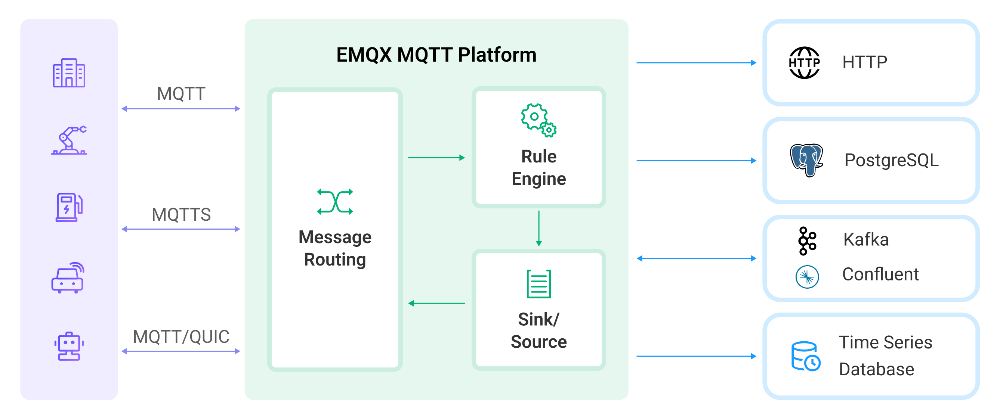
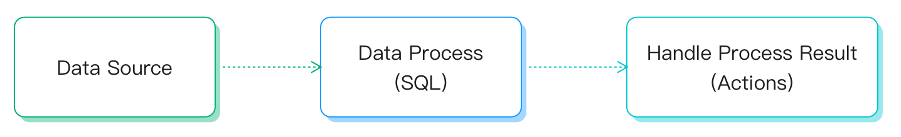

# Introduction to Rule Engine

The Rules Engine is EMQX's built-in SQL-based data processing component, which works with [data-bridges](./data-bridges.md) can be used to help extract, filter, enrich, transform and store IoT data in real-time to accelerate application integration and business innovation.



## Composition of Rules

The rules describe **data source**, **data processing process**, and **processing result destination**:

- **data source**: the data source of a rule can be a message or event, or an external data system. Rules specify the source of data through the FROM clause of SQL;

- **data processing**: rules describe the data processing process through SQL statements and functions. The WHERE clause of SQL is used to filter data, the SELECT clause and SQL function are used to extract and transform data;

- **processing result destination**: a rule can define one or more actions to process SQL output results. If the SQL execution passes, the rules will perform corresponding actions in sequence, such as storing the processing results in the database or republishing them to another MQTT topic.




### Introduction to rule SQL statements

SQL statements are used to specify the data source of rules, define data processing procedures, and so on. An example of an SQL statement is given below:

```SQL
SELECT
    payload.data as d
FROM
    "t/#"
WHERE
    clientid = "foo"
```

In the above SQL:

- Data Source: the messages with topic `t/#`;
- Data Processing: If the client ID of the message is `foo`, select the `data` field from the message content and assign it to the new variable `d`

::: tip
The dot (".") syntax requires that the data must be of JSON or Map type. If it is of other data types, SQL functions must be used for data type conversion.
:::

For the SQL syntax and usages, see [SQL syntax](./rule-sql-syntax.md).

### Actions

Actions are components used to process the output results of rules and determine the final destination of data.

The current rule supports the following two actions:

- Built-in Actions: Currently, there are only two supported built-in actions: `republish` and `console`.

- Data Bridges: A data bridge is a channel to the external data system. Rules can directly use the ID of data bridge as the action, sending the output of the rule to the data bridge for further processing. For details of data bridge, see [data bridges](./data-bridges.md).

## The republish Action

The republish action is used to publish a new MQTT message, which is applicable to the scenarios where downlink messages need to be sent to the device.

::: tip
The republish action does not prevent the delivery of the original message. For example, if a "a/1" message triggers a "republish" action through a rule and sends a new message "a/2", then the "a/1" message will still be delivered to the client subscribed to the topic.
:::

In the republish action, you can customize the payload, topic, QoS and other parameters of the message,
and fields in the rule output can be referenced as values of these parameters in the form of `${field name}`.

## The console Action

The console output action is used to view the output results of rules. The results will be printed to the console in the form of logs.

If the emqx is started with `emqx console`, the results will be printed to the foreground.
If the emqx is started with `emqx start`, the results will be printed to `erlang log.*` under the log dir of EMQX.

### Output Format

In the first line it prints the `[rule action]` header followed by the rule ID.
The outputs from the second line is divided into two parts:

- The `Action Data` section is the output result of the rule. The fields contained in `Action Data` can be referenced in the form of `${field name}` in the action parameters.

- The `Envs` is the environment variable information available for the action. The environment variable information includes all available fields of the data source and other internal information related to the execution of this action.

Example of the outputs:

```bash
[rule action] rule_id1
    Action Data: #{key1 => val1}
    Envs: #{key1 => val1, key2 => val2}
```

::: tip
The console output action is only used for debugging. If it is used in the production environment, it will cause performance degradation.
:::

## Typical Use Cases of Rules

- Action monitoring: in the development of smart home smart door locks, the door locks will be offline due to network, power failure, man-made damage and other reasons, resulting in abnormal functions. Use rule configuration to monitor offline events and push the fault information to the application service, so as to realize the ability of fault detection at the access layer at the first time;

- Data filtering: in the truck fleet management of the Internet of vehicles, vehicle sensors collect and report a large amount of operation data. The application platform only focuses on the data when the vehicle speed is greater than 40 km/h. In this scenario, rules can be used to filter messages conditionally and write data that meets the conditions to the business message queue;

- Message routing: in the intelligent billing application, the terminal equipment distinguishes the service types through different topics. The charging service messages can be connected to the charging message queue through the configuration rules and send a confirmation notice to the service system after the messages arrive at the device end. The non charging information is connected to other message queues to realize the service message routing configuration;

- Message encoding and decoding: in other public/private TCP protocol access, industrial control industry and other application scenarios, the encoding and decoding of binary/special format message bodies can be done through the regular local processing functions (which can be customized and developed on emqx); It can also flow relevant messages to external computing resources such as function calculation for processing through regular message routing (the processing logic can be developed by the user), and turn the messages into JSON format that is easy to handle, simplifying the difficulty of project integration and improving the ability of rapid application development and delivery.
