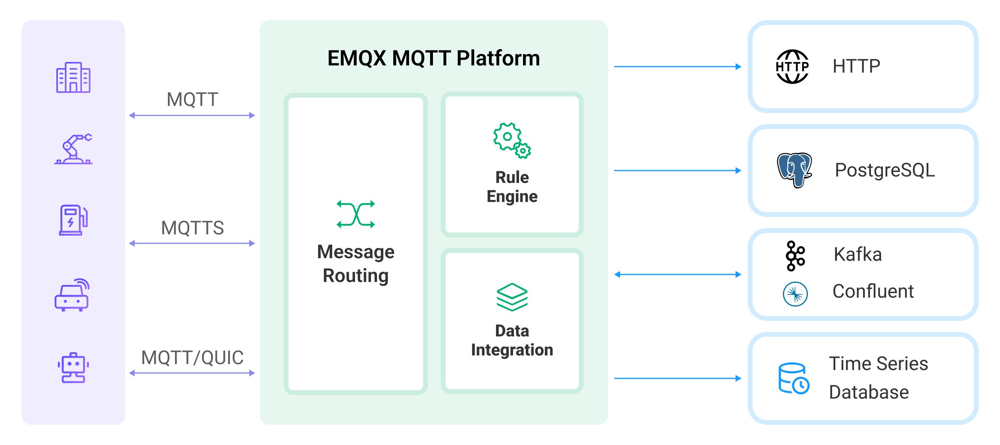

# Rule Engine

EMQX provides users with the rule engine feature for data processing, which works in conjunction with [Data Integration](./data-bridges.md) to extract, filter, enrich, transform, and store IoT data. This accelerates application integration and drives business innovation.



EMQX rule engine is especially useful for transforming or rerouting incoming messages. For instance, you can create rules that filter out irrelevant data, perform transformations, and trigger alerts or notifications based on specific events or conditions.

This chapter provides an in-depth exploration of the rule engine and its capabilities. 

## How Rule Engine Works

Rules specify how to retrieve data from a **data source**, perform **data transformations**, and the **actions** that should be applied to the results.


- **Data Source**: The data source of a rule can be a message, event, or external data system. The `FROM` clause in the rule's SQL specifies the data source, while the `WHERE` clause adds additional constraints on which messages the rule processes.

  For more information on the various types of supported data sources and fields that can be referenced in the `WHERE` clause, see [Data Sources and Fields](./rule-sql-events-and-fields.md).

- **Data Transformation**: Data transformations describe the process of transforming an input message. The `SELECT` part of the SQL extracts and transforms data from the input message. Embedded SQL sample statements can be used to implement advanced transformations, such as adding a timestamp to the output message.

  For a detailed explanation of the syntax and built-in SQL functions, see [Rule SQL Reference](./rule-sql-syntax.md) and [Built-in SQL Functions](./rule-sql-builtin-functions.md).

- **Actions**: After the input is processed according to the specified rules, one or more actions can be defined to process the SQL execution results. The Rule Engine will sequentially perform corresponding actions, such as storing the processing results in a database or republishing them to another MQTT topic. The supported actions are as follows:

  - [Message Republishing](./rule-get-started.md#add-republish-action): Publish the results to a specified MQTT topic.
  - [Console Output](./rule-get-started.md#add-console-output-action): Output the results to the console or logs.
  - [Forwarding to Sinks](./data-bridges.md#add-forwarding-with-sinks-action): Send the results to external data systems, such as MQTT services, Kafka, PostgreSQL, etc.

For a step-by-step guide on creating a rule with the EMQX dashboard, see [Create Rules](./rule-get-started.md).

## Rule SQL Example

Rule SQL is used to specify the data source of a rule and define the data processing procedure. Here is an example of an SQL statement:

```sql
SELECT
    payload.data as d
FROM
    "t/#"
WHERE
    clientid = "foo"
```

In the above SQL statement:

- Data source: Messages with the topic `t/#`;
- Data processing: If the client ID of the message sender is `foo`, select the `data` field from the message content and assign it to a new variable `d`.

::: tip 

The "." syntax requires the data to be in JSON or Map format. If it's in another data type, SQL functions must be used for data type conversion. 

:::

For detailed information on the format and usage of Rule SQL statements, refer to the [SQL Manual](./rule-sql-syntax.md).

## Typical Application Scenarios of Rules

- **Action Monitoring**: In the development of smart home intelligent locks, locks may go offline due to network, power failures, or vandalism, leading to functional abnormalities. By using rules to monitor offline events and push this fault information to application services, it's possible to achieve immediate fault detection capabilities at the access layer.
- **Data Filtering**: In truck fleet management for connected vehicles, vehicle sensors collect and report a large amount of operational data. The application platform is only concerned with data when the vehicle speed exceeds 40 km/h. In this scenario, rules can be used to conditionally filter messages, writing only the relevant data to the business message queue.
- **Message Routing**: In smart billing applications, terminal devices use different topics to distinguish between business types. By configuring rules, messages related to billing can be directed to a billing message queue and send confirmation notifications to business systems upon message arrival at the device. Non-billing information can be directed to other message queues, thereby achieving business message routing configuration.
- **Message Encoding/Decoding**: In applications such as other public/private TCP protocol access or industrial scenarios, local processing functions in rules (which can be custom-developed on EMQX) can be used for encoding/decoding binary/special format message bodies. Messages can also be routed through rules to external computational resources like serverless functions for processing (which can be developed by users), converting messages into a JSON format that is easier for business applications to handle. This simplifies project integration difficulties and enhances the capability for rapid application development and delivery.

## Key Benefits

EMQX's rule engine feature offers users the following benefits:

**Simplified data processing**

The SQL-like syntax and stream processing capabilities of the rule engine streamline filtering, transforming, and distributing data without the need for custom code or additional tools.

**Real-time insights and actions**

By triggering actions based on specific conditions, the Rule Engine empowers users to gain real-time insights and take appropriate actions.

**Reduced development time and effort**

The Rule Engine eases IoT application development by providing an extensive range of built-in capabilities, minimizing the need for custom code and maintenance efforts.

**Scalability and reliability**

Designed to handle high throughput and numerous connected devices, the Rule Engine allows users to scale their IoT solutions without compromising performance or reliability.
