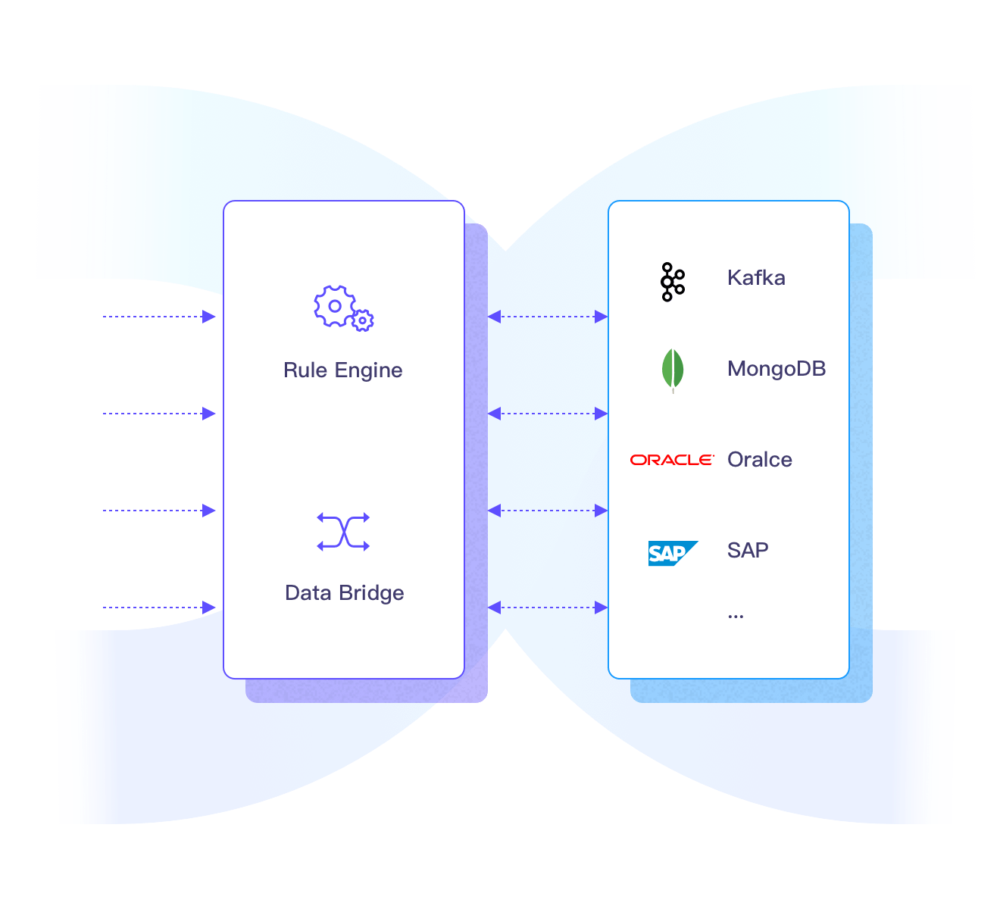

# Rule Engine

The Rule Engine is EMQX's built-in data processing component, which works with [data bridges](./data-bridges.md) and can be used to help extract, filter, enrich, transform and store IoT data to accelerate application integration and business innovation. 



The Rule Engine is particularly useful when you need to transform or reroute incoming messages from multiple sources, for example, you can create rules that filter out irrelevant data, perform calculations, and trigger alerts or notifications based on specific events or conditions.

This chapter provides an in-depth exploration of the Rule Engine and its capabilities. A rule defines the data source and transformation, and then a set of actions that will be triggered every time when outputting a value.

## What is the Rule Engine

EMQX uses a powerful SQL-based IoT rule engine for data processing and integration, where the rules are partly specified with a domain-specific SQL-like language.


## How the Rule Engine Works

Rules describe how to retrieve data from a **data source**, perform **data transformations**, and what actions should be applied to the results.


- **Data Source**: The data source of a rule can be a message or event, or an external data system. You can use the `FROM` clause in the rule's SQL to specify the data source, and then use the `WHERE` clause to add additional constraints on which messages will be processed by the rule. 
- **Data Transformation**: Data transformations describe how to transform an input message. You can use the `SELECT` part of the SQL to extract and transform data from the input message. You can use the embedded SQL sample statements to implement advanced transformations, for example, to add a time stamp to the output message.

- **Actions**: After the input is processed as per the rules specified, you can continue to define one or more actions to process the SQL execution results. The Rule Engine will perform corresponding actions in sequence, such as storing the processing results in a database or republishing them to another MQTT topic.

The below section introduces how to configure a rule with the Dashboard. 

## Configure with EMQX Dashboard

Log in to EMQX Dashboard, and click **Data Integration** -> **Rules** on the left navigation tree. Then click the **Create** button, and you will be directed to the **Rules** page, where you can customize your rules. Input a name for your rule and add a note to facilitate future management. 

### Data processing

Specify the data source and data processing method. 

In the SQL Editor section, input your SQL statements based on your business needs.

For example, if you want EMQX to retrieve input messages from an MQTT topic under topic `t/#` and with `clientid` equal to `foo`, then rename the `data` field to `d`, you can try the SQL statement below: 

```sql
SELECT
    payload.data as d
FROM
    "t/#"
WHERE
    clientid = "foo"
```

The above SQL statement specifies the following for the rule:

- **Data source**: Messages with topic `t/#` and client ID equals to `foo`
- **Data transformation**: Extract the `data` field from the payload and rename the field from `data` to `d`. So in the above example, the output data will have the following structure `{d: "value of the payload's data field"}`.

::: tip
This example assumes the payload is structured data (such as JSON, avro, and protobuf), if the payload is formatted in some other way, you can convert the data type, for example, with the [jq function](./rule-sql-jq.md). 

EMQX has embedded rich SQL statement samples to help you get started, you can click the **SQL Example** button under the **SQL Editor** to explore. For more details about the SQL syntax and usages, see [SQL Syntax](./rule-sql-syntax.md).

:::

### Add Actions

Actions are components used to process the output of the rule's SQL statement and determine the final destination of the data. On the **Rules** page,  click the **Add Actions** button under **Actions**, you can choose to:

- **Republish**: Republish the message to a new topic.

* **Console Output**: Print the output of the rule to the console. This is mainly intended for debugging purposes.

- **Forwarding with Data Bridges**: Forward the processed results with data bridges. For details on how to create Data bridges in EMQX, see [the documentation for Data Bridges](./data-bridges.md).

#### Republish

The republish action is used to publish a new MQTT message. For example, this can be useful when one wants to send an error message back to a device. If you choose to Republish as the action, the following configurations should also be set:

- **Topic**: Specify the target topic, that is, the messages that will be published to which topic. 
- **QoS** (optional): Set the QoS of the republished messages.
- **Retain** (optional): Whether republish it as a retained message, default: **false**, set it to **${flags.retain}** if you want to keep the setting from the original message. 
- **Payload** (optional): Customize the message payload to republish, or leave it blank then EMQX will forward the message as it is. Support reading data using `${field}` syntax.

::: tip
The republishing action does not prevent the delivery of the original message. For example, according to the rule, messages under topic `a/1`  will be republished under topic `a/2`, in the meantime `a/1` message will still be delivered to the clients subscribed to topic  `a/1`.
:::

#### Console Output

The console output action is used to print the result message of a rule to the console or log file. 

* If EMQX is started with `emqx console`, the results will be printed to the terminal where `emqx console` was invoked.
* If EMQX is started with `emqx start`, the results will be printed to a log file (`erlang log.*`) under the `log` dir of EMQX.

The output will be in the format below

```bash
[rule action] rule_id1
    Action Data: #{key1 => val1}
    Envs: #{key1 => val1, key2 => val2}
```

Where

-  `[rule action]` is the rule ID where the republish action is triggered.
- `Action Data` is the output result of the rule, indicating the data or parameter that should be passed to the action when it is executed, that is, the payload part when you set up the republish action. 
- `Envs` is the environment variable that should be set when republishing, which could be the data source and other internal information related to the execution of this action.

::: tip
The console output action should only be used for debugging. If it is used in the production environment, it may cause performance problems.
:::

#### Forwarding with Data Bridge

If select **Forwarding with Data Bridge**, the target message will be republished to the selected data bridge. All you need is to select the target Data bridge from the Data bridge drop-down list. 

For more information on how to create a data bridge, see [Data bridge](../data-integration/data-bridges.md).

## Typical Use Cases

### Action Monitoring

Rules can be used to monitor the status of clients connected to the broker. 

For example, if a client representing a door in a smart home is disconnected, a rule can be used to send a notification to a dashboard for the smart home. This helps ensure that important events are promptly acted upon.

### Data Filtering

In certain scenarios, only specific types of data are relevant, and processing all incoming data may not be necessary. 

For example, in truck fleet management, vehicle sensors collect and report a large amount of operation data. However, the application platform may only be interested in data when the vehicle speed is greater than 40 km/h. 

In this case, rules can be used to filter messages conditionally and only write data that meets the conditions to a message queue. This can help optimize system performance and reduce storage requirements.

### Message Routing

Rules can also be used to route messages to different topics based on the content of the message. This allows for more fine-grained control over message distribution. 

For example, a rule can be used to route messages containing a temperature greater than 100 degrees to a topic for high-temperature alarms. This can help ensure that messages are delivered to the appropriate destination for further processing.

### Message Encoding and Decoding

For cases where the message format needs to be changed, rules can be used to encode and decode messages as required.

For example, a rule can be used to decode a message containing binary data into a JSON format. 

If the built-in functionality is not enough for a specific encoding or decoding task, new built-in functions can be added that are implemented in Erlang. This provides great flexibility in handling message formats.
