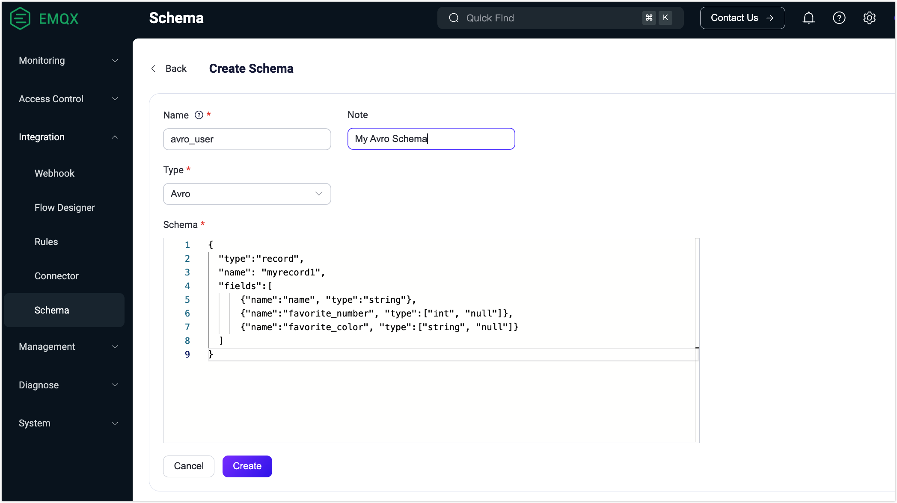

# Schema Registry Example - Avro

::: tip Note

Schema Registry is an EMQX Enterprise feature.

:::

This page demonstrates how the schema registry and rule engine support message encoding and decoding in Avro format.

## Decoding Scenario

A device publishes a binary message encoded using Avro, which needs to be matched by the rule engine and then republished to the topic associated with the `name` field. The format of the topic is `avro_user/${name}`.

For example, you need to republish a message with the `name` field equal to `Shawn` to the topic `avro_user/Shawn`.

### Create Schema

1. Go to the Dashboard, select **Integration** -> **Schema** from the left navigation menu.

2. Create an Avro schema using the following parameters:

   - **Name**: `avro_user`

   - **Type**: `Avro`

   - **Schema**:

     ```json
     {
       "type":"record",
       "name": "myrecord1",
       "fields":[
           {"name":"name", "type":"string"},
           {"name":"favorite_number", "type":["int", "null"]},
           {"name":"favorite_color", "type":["string", "null"]}
       ]
     }
     ```

3. Click **Create**.



### Create Rule
1. In the Dashboard, select **Integration** -> **Rules** from the navigation menu.

2. On the **Rules** page, click **Create** at the top right corner.

3. Use the schema you have just created to write the rule SQL statement:

   ```sql
   SELECT
     schema_decode('avro_user', payload) as avro_user, payload
   FROM
     "t/#"
   WHERE
     avro_user.name = 'Shawn'
   ```

   The key point here is `schema_decode('avro_user', payload)`:

   - The `schema_decode` function decodes the contents of the payload field according to the Schema `avro_user`;
   - `as avro_user` stores the decoded value in the variable `avro_user`.

4. Click **Add Action**.  Select `Republish` from the drop-down list of the **Action** field.
5. In the **Topic** field, type `avro_user/${avro_user.name}` as the destination topic.
6. In the **Payload** field, type message content template: `${avro_user}`.

This action sends the decoded message to the topic `avro_user/${avro_user.name}` in JSON format. `${avro_user.name}` is a variable placeholder that will be replaced at runtime with the value of the `name` field from the decoded message.
### Prepare Device-Side Code

Once the rule is created, you can simulate the data for testing.

The following code uses the Python language to fill a user message, encode it as binary data, then send it to the `t/1` topic. See [full code](https://gist.github.com/thalesmg/bbda65b400f35f8ab0f719b06cf875f6) for details.

```python
def publish_msg(client):
    datum_w = avro.io.DatumWriter(SCHEMA)
    buf = io.BytesIO()
    encoder = avro.io.BinaryEncoder(buf)
    datum_w.write({"name": "Shawn", "favorite_number": 666, "favorite_color": "red"}, encoder)
    message = buf.getvalue()
    topic = "t/1"
    print("publish to topic: t/1, payload:", message)
    client.publish(topic, payload=message, qos=0, retain=False)
```

### Check Rule Execution Results
1) In the Dashboard, select **Diagnose** -> **WebSocket Client**.
2) Fill in the connection information for the current EMQX instance.
   - If you run EMQX locally, you can use the default value.
   - If you have changed EMQX's default configuration. For example, the configuration change on authentication can require you to type in a username and password.
3. Click **Connect** to connect to the EMQX instance as an MQTT client.
4. In the **Subscription** area, type `avro_user/#` in the **Topic** field and click **Subscribe**.

5. Install the Python dependencies and execute the device-side code:

   ```shell
   $ pip3 install avro paho-mqtt

   $ python3 avro_mqtt.py
   Connected with result code 0
   publish to topic: t/1, payload: b'\nShawn\x00\xb4\n\x00\x06red'
   ```

6. Check that a message with the topic `avro_user/Shawn` is received on the Websocket side:

   ```json
   {"favorite_color":"red","favorite_number":666,"name":"Shawn"}
   ```

## Encoding Scenario

A device subscribes to a topic `avro_out` expecting a binary message encoded using Avro. The rule engine is used to encode such message and publish it to the associated topic.

### Create Schema

Use the same schema as described in the [Decoding Scenario](#decoding-scenario).

### Create Rule

1. In the Dashboard, select **Integration** -> **Rules** from the navigation menu.

2. On the **Rules** page, click **Create** at the top right corner.

3. Use the schema you have just created to write the rule SQL statement:

   ```sql
   SELECT
     schema_encode('avro_user', json_decode(payload)) as avro_user
   FROM
     "avro_in"
   ```

   The key point here is `schema_encode('avro_user', json_decode(payload))`:

   - The `schema_encode` function encodes the contents of the payload field according to the Schema `avro_user`;
   - `as avro_user` stores the encoded value in the variable `avro_user`;
   - `json_decode(payload)` is needed because `payload` is generally a JSON-encoded binary, and `schema_encode` requires a Map as its input.

4. Click **Add Action**.  Select `Republish` from the drop-down list of the **Action** field.

5. In the **Topic** field, type `avro_out` as the destination topic.

6. In the **Payload** field, type message content template: `${avro_user}`.

This action sends the Avro-encoded message to the topic `avro_out`. `${avro_user}` is a variable placeholder that will be replaced at runtime with the value of the result of `schema_encode` (a binary value).

### Prepare Device-Side Code

Once the rules have been created, you can simulate the data for testing.

The following code uses the Python language to fill a User message, encode it as binary data, then send it to the `avro_in` topic. See [full code](https://gist.github.com/thalesmg/02046f89e9ceb70b9806dc98e6ed8b55) for details.

```python
def on_message(client, userdata, msg):
    datum_r = avro.io.DatumReader(SCHEMA)
    buf = io.BytesIO(msg.payload)
    decoder = avro.io.BinaryDecoder(buf)
    decoded_payload = datum_r.read(decoder)
    print(msg.topic+" "+str(decoded_payload))
```

### Check Rule Execution Results

1) In the Dashboard, select **Diagnose** -> **WebSocket Client**.
2) Fill in the connection information for the current EMQX instance.
   - If you run EMQX locally, you can use the default value.
   - If you have changed EMQX's default configuration. For example, the configuration change on authentication can require you to type in a username and password.

3. Click **Connect** to connect to the EMQX instance as an MQTT client.

4. In the **Publish** area, type `avro_in` in the **Topic** field and type the following message in the **Payload** field:

   ```json
   {"favorite_color":"red","favorite_number":666,"name":"Shawn"}
   ```

5. Click **Publish**.

6. Install the Python dependencies and execute the device-side code:

   ```shell
   $ pip3 install avro paho-mqtt
   
   $ python3 avro_mqtt_sub.py
   Connected with result code 0
   msg payload b'\nShawn\x00\xb4\n\x00\x06red'
   avro_out {'name': 'Shawn', 'favorite_number': 666, 'favorite_color': 'red'}
   ```

