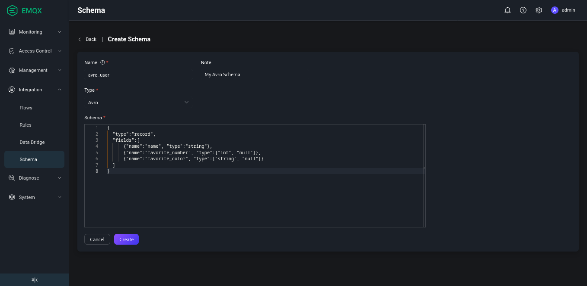

# Schema Registry + Rule Engine Example - Avro

## Decoding Scenario

A device publishes a binary message encoded using Avro, which needs to be matched by the
rule engine and then republished to the topic associated with the `name` field. The format
of the topic is `avro_user/${name}`.

For example, let's see how to republish a message with the `name` field equal to "Shawn"
to the topic `avro_user/Shawn`.

### Create Schema

In the [Dashboard](http://127.0.0.1:18083/#/schema/create) interface of EMQX,
create an Avro Schema using the following parameters:

1. Name: `avro_user`

2. Schema Type: `Avro`

3. Schema:

```json
{
  "type":"record",
  "fields":[
      {"name":"name", "type":"string"},
      {"name":"favorite_number", "type":["int", "null"]},
      {"name":"favorite_color", "type":["string", "null"]}
  ]
}
```



### Creating the rule

**Use the Schema you have just created to write the rule SQL statement:**

```sql
SELECT
  schema_decode('avro_user', payload) as avro_user, payload
FROM
  "t/#"
WHERE
  avro_user.name = 'Shawn'
```

The key point here is `schema_decode('avro_user', payload)`:

- The `schema_decode` function decodes the contents of the payload field according to the
  Schema `avro_user`;
- `as avro_user` stores the decoded value in the variable `avro_user`.

**Then add the action using the following parameters:**

- Action Type: `Republish`
- Destination Topic: `avro_user/${avro_user.name}`
- Message Content Template: `${avro_user}`

This action sends the decoded user to the topic `avro_user/${avro_user.name}` in JSON
format. `${avro_user.name}` is a variable placeholder that will be replaced at runtime
with the value of the `name` field from the decoded message.

### Device side code

Once the rules have been created, it is time to simulate the data for testing.

The following code uses the Python language to fill a User message, encode it as binary
data, then send it to the `t/1` topic. See [full
code](https://gist.github.com/thalesmg/bbda65b400f35f8ab0f719b06cf875f6) for details.

```python
def publish_msg(client):
    datum_w = avro.io.DatumWriter(SCHEMA)
    buf = io.BytesIO()
    encoder = avro.io.BinaryEncoder(buf)
    datum_w.write({"name": "Shawn", "favorite_number": 666, "favorite_color": "red"}, encoder)
    message = buf.getvalue()
    topic = "t/1"
    print("publish to topic: t/1, payload:", message)
    client.publish(topic, payload=message, qos=0, retain=False)
```

### Checking rule execution results

1) In the Dashboard's [Websocket](http://127.0.0.1:18083/#/websocket) tools, log in to a
MQTT Client and subscribe to `avro_user/#`.

2) Install the Python dependencies and execute the device-side code:

```shell
$ pip3 install avro paho-mqtt

$ python3 avro_mqtt.py
Connected with result code 0
publish to topic: t/1, payload: b'\nShawn\x00\xb4\n\x00\x06red'
```

3) Check that a message with the topic `avro_user/Shawn` is received on the Websocket
side:

```
{"favorite_color":"red","favorite_number":666,"name":"Shawn"}
```

## Encoding Scenario

A device subscribes to a topic `avro_out` expecting a binary message encoded
using Avro. The Rule Engine is used to encode such message and publish it to the
associated topic.

### Create Schema

Use the same schema as described in the [decoding scenario](#decoding-scenario).

### Creating the rule

**Use the Schema you have just created to write the rule SQL statement:**

```sql
SELECT
  schema_encode('avro_user', json_decode(payload)) as avro_user
FROM
  "avro_in"
```

The key point here is `schema_encode('avro_user', payload)`:

- The `schema_encode` function encodes the contents of the payload field according to the
  Schema `avro_user`;
- `as avro_user` stores the decoded value in the variable `avro_user`;
- `json_decode(payload)` is needed because `payload` is generally a JSON-encoded binary,
  and `schema_encode` requires a Map as its input.

**Then add the action using the following parameters:**

- Action Type: `Republish`
- Destination Topic: `avro_out`
- Message Content Template: `${avro_user}`

This action sends the Avro encoded user to the topic `avro_out`. `${avro_user}` is a
variable placeholder that will be replaced at runtime with the value of the result of
`schema_encode` (a binary value).

### Device side code

Once the rules have been created, it is time to simulate the data for testing.

The following code uses the Python language to fill a User message, encode it as binary
data, then send it to the `avro_in` topic. See [full code](https://gist.github.com/thalesmg/02046f89e9ceb70b9806dc98e6ed8b55) for details.

```python
def on_message(client, userdata, msg):
    datum_r = avro.io.DatumReader(SCHEMA)
    buf = io.BytesIO(msg.payload)
    decoder = avro.io.BinaryDecoder(buf)
    decoded_payload = datum_r.read(decoder)
    print(msg.topic+" "+str(decoded_payload))
```

### Checking rule execution results

1) In the Dashboard's [Websocket](http://127.0.0.1:18083/#/websocket) tools, log in to a
MQTT Client.

2) Publish a message to the `avro_out` topic:

```json
{"favorite_color":"red","favorite_number":666,"name":"Shawn"}
```

3) Install the Python dependencies and execute the device-side code:

```shell
$ pip3 install avro paho-mqtt

$ python3 avro_mqtt_sub.py
Connected with result code 0
msg payload b'\nShawn\x00\xb4\n\x00\x06red'
avro_out {'name': 'Shawn', 'favorite_number': 666, 'favorite_color': 'red'}
```
