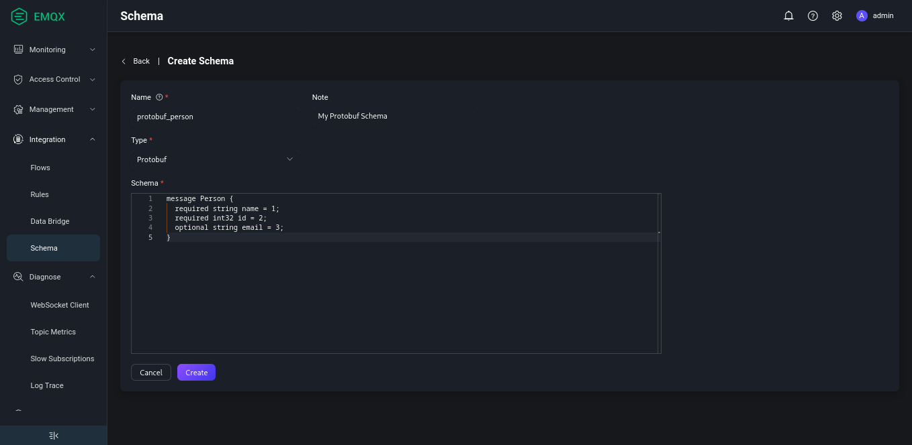

# Schema Registry Example - Protobuf

::: tip Note

Schema Registry is an EMQX Enterprise feature.

:::

This page demonstrates how the schema registry and rule engine support message encoding and decoding in Protobuf format.

## Decoding Scenario

A device publishes a binary message encoded using Protobuf, which needs to be matched by the rule engine and then republished to the topic associated with the `name` field. The format of the topic is `person/${name}`.

For example, you to republish a message with the `name` field equal to "Shawn" to the topic `person/Shawn`.

### Create Schema

1. Go to the Dashboard, select **Integration** -> **Schema** from the left navigation menu.

2. Create a Protobuf schema using the following parameters:

   - **Name**: `protobuf_person`

   - **Type**: `Protobuf`

   - **Schema**:

     ```protobuf
     message Person {
       required string name = 1;
       required int32 id = 2;
       optional string email = 3;
     }
     ```

3. Click **Create**.



### Create Rule
1. In the Dashboard, select **Integration** -> **Rules** from the navigation menu.

2. On the **Rules** page, click **Create** at the top right corner.

3. Use the schema you have just created to write the rule SQL statement:

   ```sql
   SELECT
     schema_decode('protobuf_person', payload, 'Person') as person, payload
   FROM
     "t/#"
   WHERE
     person.name = 'Shawn'
   ```

   The key point here is `schema_decode('protobuf_person', payload, 'Person')`:

   - The `schema_decode` function decodes the contents of the payload field according to the schema `protobuf_person`;
   - `as person` stores the decoded value in the variable `person`;
   - The last argument `Person` specifies that the message type in the payload is the `Person` type defined in the Protobuf schema.

4. Click **Add Action**.  Select `Republish` from the drop-down list of the **Action** field.
5. In the **Topic** field, type `person/${person.name}` as the destination topic.
6. In the **Payload** field, type message content template: `${person}`.

This action sends the decoded "person" message to the topic `person/${person.name}` in JSON format. `${person.name}` is a variable placeholder that will be replaced at runtime with the value of the `name` field from the decoded message.

### Prepare Device-Side Code

Once the rule is created, you can simulate the data for testing.

The following code uses the Python language to fill a user message, encode it as binary data, then send it to the `t/1` topic. See [full code](https://gist.github.com/thalesmg/3c5fdbae2843d63c2380886e69d6123c) for details.

```python
def publish_msg(client):
    p = person_pb2.Person()
    p.id = 1
    p.name = "Shawn"
    p.email = "shawn@example.com"
    message = p.SerializeToString()
    topic = "t/1"
    print("publish to topic: t/1, payload:", message)
    client.publish(topic, payload=message, qos=0, retain=False)
```

### Check Rule Execution Results
1) In the Dashboard, select **Diagnose** -> **WebSocket Client**.
2) Fill in the connection information for the current EMQX instance.
   - If you run EMQX locally, you can use the default value.
   - If you have changed EMQX's default configuration. For example, the configuration change on authentication can require you to type in a username and password.

3. Click **Connect** to connect to the EMQX instance as an MQTT client.
4. In the **Subscription** area, type `person/#` in the **Topic** field and click **Subscribe**.

5. Install the Python dependencies and execute the device-side code:

   ```shell
   $ pip3 install protobuf paho-mqtt
   $ protoc --python_out=. person.proto

   $ python3 protobuf_mqtt.py
   Connected with result code 0
   publish to topic: t/1, payload: b'\n\x05Shawn\x10\x01\x1a\x11shawn@example.com'
   ```

6. Check that a message with the topic `person/Shawn` is received on the Websocket side:

   ```json
   {"name":"Shawn","id":1,"email":"shawn@example.com"}
   ```

## Encoding Scenario

A device subscribes to a topic `protobuf_out` expecting a binary message encoded using Protobuf. The rule engine is used to encode such a message and publish it to the associated topic.

### Create Schema

Use the same schema as described in the [decoding scenario](#decoding-scenario).

### Create Rule

1. In the Dashboard, select **Integration** -> **Rules** from the navigation menu.

2. On the **Rules** page, click **Create** at the top right corner.

3. Use the schema you have just created to write the rule SQL statement:

   ```sql
   SELECT
     schema_encode('protobuf_person', json_decode(payload), 'Person') as protobuf_person
   FROM
     "protobuf_in"
   ```

   The key point here is `schema_encode('protobuf_person', json_decode(payload), 'Person')`:

   - The `schema_encode` function encodes the contents of the payload field according to the schema `protobuf_person`;
   - `as protobuf_person` stores the encoded value in the variable `protobuf_person`;
   - The last argument `Person` specifies that the message type in the payload is the `Person` type defined in the Protobuf schema.
   - `json_decode(payload)` is needed because `payload` is generally a JSON-encoded binary, and `schema_encode` requires a Map as its input.

4. Click **Add Action**.  Select `Republish` from the drop-down list of the **Action** field.
5. In the **Topic** field, type `protobuf_out` as the destination topic.
6. In the **Payload** field, type message content template: `${protobuf_person}`.

This action sends the Protobuf encoded user message to the topic `protobuf_out`. `${protobuf_person}` is a variable placeholder that will be replaced at runtime with the value of the result of `schema_encode` (a binary value).

### Prepare Device-Side Code

Once the rules have been created, you can simulate the data for testing.

The following code uses the Python language to fill a user message, encode it as binary data, then send it to the `protobuf_in` topic. See [full code](https://gist.github.com/thalesmg/c5f03f99f982401d16ef6583e30144fa) for details.

```python
def on_message(client, userdata, msg):
    print("msg payload", msg.payload)
    p = person_pb2.Person()
    p.ParseFromString(msg.payload)
    print(msg.topic+" "+str(p))
```

### Check Rule Execution Results

1) In the Dashboard, select **Diagnose** -> **WebSocket Client**.
2) Fill in the connection information for the current EMQX instance.
   - If you run EMQX locally, you can use the default value.
   - If you have changed EMQX's default configuration. For example, the configuration change on authentication can require you to type in a username and password.

3. Click **Connect** to connect to the EMQX instance as an MQTT client.

4. In the **Publish** area, type `protobuf_in` in the **Topic** field and type the following message in the **Payload** field:

   ```json
   {"name":"Shawn","id":1,"email":"shawn@example.com"}
   ```

5.  Click **Publish**.

6. Install the Python dependencies and execute the device-side code:

   ```shell
   $ pip3 install protobuf paho-mqtt
   
   $ python3 protobuf_mqtt_sub.py
   Connected with result code 0
   msg payload b'\n\x05Shawn\x10\x01\x1a\x11shawn@example.com'
   protobuf_out name: "Shawn"
   id: 1
   email: "shawn@example.com"
   ```
