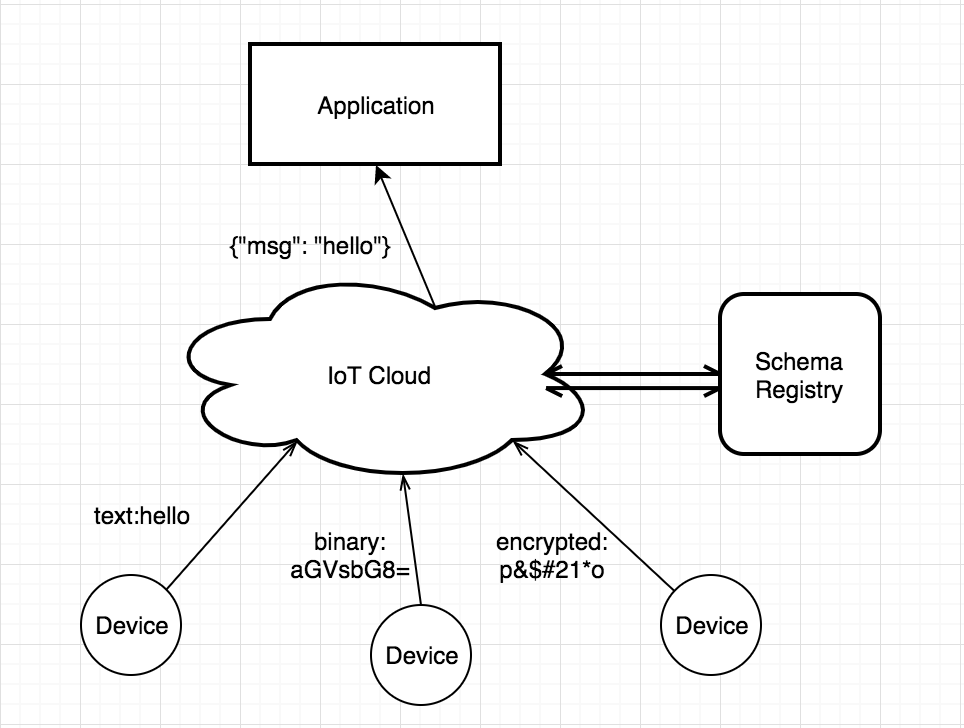
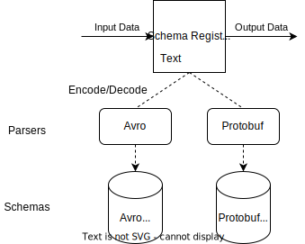

# Introduction to Schema Registry


Because of the variety of IoT device terminals and the different coding formats used by
various manufacturers, the need for a unified data format arises when accessing the IoT
platform for device management by the applications on the platform.

The Schema Registry manages the Schema used for coding and decoding, processes the
encoding or decoding requests, and returns the results. The Schema Registry in
collaboration with the rule engine can be adapted for device access and rule design in
various scenarios.

EMQX Schema Registry currently supports codecs in two formats:
[Avro](https://avro.apache.org) and
[Protobuf](https://developers.google.com/protocol-buffers/). Avro and Protobuf are
Schema-dependent data formats. The encoded data is binary and the decoded data is in Map
format. The decoded data can be used directly by the rule engine and other plugins.

::: tip
Schema Registry maintains Schema text for built-in encoding formats such as Avro and
Protobuf.
:::

## Data Format

The diagram below shows an example of a Schema Registry application. Multiple devices
report data in different formats, which are decoded by Schema Registry into a uniform
internal format and then forwarded to the backend application.




### Binary Format Support

Schema Registry data formats include [Avro](https://avro.apache.org) and
[Protobuf](https://developers.google.com/protocol-buffers/). Avro and Protobuf are
Schema-dependent data formats and encoded as binary data. The internal data format (Map,
explained later) decoded using the Schema Registry can be used directly by Rule Engine.

## Architecture Design

Schema Registry maintains schema text for built-in encoding formats such as Avro and
Protobuf. The Schema API provides for add, query, and delete operations via Schema Name.

The Schema Registry can perform both decoding and encoding.  Schema Name needs to be
specified when encoding and decoding.




Example of an encoding call:

```erlang
schema_encode(SchemaName, Data) -> RawData
```

When encoding data from MQTT messages which are JSON-encoded, one also needs to decode it
to the Map internal format using the `json_decode` function before encoding with schema
function.  For example:

```erlang
schema_encode(SchemaName, json_decode(Data))
```

Example of a decoding call:

```erlang
schema_decode(SchemaName, RawData) -> Data
```

A common use case is to use the Rule Engine to call the encoding and decoding interfaces
provided by the Schema Registry and then use the encoded or decoded data as input for
subsequent actions.

## Codec + Rules Engine

The message processing layer of EMQX can be divided into three parts: Messaging, Rule
Engine, and Data Conversion.

EMQX's PUB/SUB system routes messages to specified topics. The rule engine has the
flexibility to configure business rules for the data, match messages to the rules and then
specify the corresponding action. Data format conversion occurs before the rule matching
process, converting the data into a Map format that can participate in rule matching, and
then matching it.


### Rule Engine Internal Data Format (Map)

The data format used in the internal rule engine is Erlang Map, so if the original data is
in binary or other formats, it must be converted to Map using codec functions (such as
`schema_decode` and `json_decode` as mentioned above).  It is very similar to a JSON
object.

A Map is a data structure of the form Key-Value, in the form `#{key => value}`. For
example, `user = #{id => 1, name => "Steve"} ` defines a `user` Map with `id` of `1` and
`name` of `"Steve"`.

The SQL statement provides the `.` operator to extract and add Map fields in a nested
way. The following is an example of this Map operation using a SQL statement:

```sql
SELECT user.id AS my_id
```

The filter result of the SQL statement is `#{my_id => 1}`.

### JSON Codec

The SQL statements of Rule Engine provide support for encoding and decoding JSON formatted
strings. The SQL functions for converting JSON strings to Map format are `json_decode()`
and `json_encode()`:

```sql
SELECT json_decode(payload) AS p FROM "t/#" WHERE p.x = p.y
```

The SQL statement above will match an MQTT message with the content of the payload as a
JSON string: `{"x" = 1, "y" = 1}`, and the topic as `t/a`.

`json_decode(payload) as p` decodes the JSON string into the following Map data structure
so that the fields in the Map can be used in the `WHERE` clause using p.x and p.y.

```erlang
#{
  p => #{
    x => 1,
    y => 1
  }
}
```

**Note:** The `AS` clause is required to assign the decoded data to a key so that
subsequent operations can be performed on it later.
