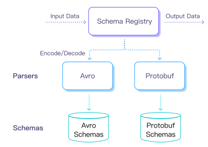

# Schema Registry

::: tip Note

Schema Registry is an EMQX Enterprise feature.

:::

Because of the variety of IoT device terminals and the different coding formats used by various manufacturers, the need for a unified data format arises when accessing the IoT platform for device management by the applications on the platform.

The Schema Registry manages the Schema used for coding and decoding, processes the encoding or decoding requests, and returns the results. The Schema Registry in collaboration with the rule engine can be adapted for device access and rule design in
various scenarios.

EMQX Schema Registry currently supports codecs in the below formats:

- [Avro](https://avro.apache.org)
- [Protobuf](https://developers.google.com/protocol-buffers/)
- [JSON Schema](https://json-schema.org/)

Avro and Protobuf are Schema-dependent data formats. The encoded data is binary and the decoded data is in [Map format](#rule-engine-internal-data-format-map). The decoded data can be used directly by the rule engine and other plugins. Schema Registry maintains Schema text for built-in encoding formats such as Avro and Protobuf.

JSON schema can be used to validate if the input JSON object is following the schema definitions or if the JSON object output from the rule engine is valid before producing the data to downstream.

The diagram below shows an example of a Schema Registry application. Multiple devices report data in different formats, which are decoded by Schema Registry into a uniform internal format and then forwarded to the backend application.


## Architecture Design

EMQX can use schema for encoding, decoding, and validating whether the published messages comply with the schema specifications. It maintains schema text for built-in encoding formats, including Avro and Protobuf.

The Schema API provides for add, query, and delete operations via schema name, so the schema name needs to be specified when encoding and decoding.



A common use case is to use the rule engine to call the encoding and decoding interfaces provided by the Schema Registry and then use the encoded or decoded data as input for subsequent actions.

Example of an encoding call:

```erlang
schema_encode(SchemaName, Map) -> Bytes
```

Example of a decoding call:

```erlang
schema_decode(SchemaName, Bytes) -> Map
```

When encoding data from MQTT messages which are JSON-encoded, you also need to decode it to the Map internal format using the `json_decode` function before encoding with the schema function.  For example:

```erlang
schema_encode(SchemaName, json_decode(Map)) -> Bytes
```

When checking if JSON data can be validated against the JSON schema before encoding or after decoding, use the following schema validation example:

```erlang
schema_check(SchemaName, Map | Bytes) -> Boolean
```

## Schema Registry + Rule Engine

The message processing layer of EMQX can be divided into three parts: Messaging, Rule Engine, and Data Conversion.

EMQX's PUB/SUB system routes messages to specified topics. The rule engine has the flexibility to configure business rules for the data, match messages to the rules and then specify the corresponding action. Data format conversion occurs before the rule matching process, converting the data into a Map format that can participate in rule matching, and then matching it.


### Rule Engine Internal Data Format (Map)

The data format used in the internal rule engine is Erlang Map, so if the original data is in binary or other formats, it must be converted to Map using codec functions (such as `schema_decode` and `json_decode` as mentioned above).  It is very similar to a JSON object.

A Map is a data structure of the form Key-Value, in the form `#{key => value}`. For example, `user = #{id => 1, name => "Steve"} ` defines a `user` Map with `id` of `1` and `name` of `"Steve"`.

The SQL statement provides the `.` operator to extract and add Map fields in a nested way. The following is an example of this Map operation using a SQL statement:

```sql
SELECT user.id AS my_id
```

The filter result of the SQL statement is `#{my_id => 1}`.

### JSON Codec

The SQL statements of the rule engine provide support for encoding and decoding JSON formatted strings. The SQL functions for converting JSON strings to Map format are `json_decode()` and `json_encode()`:

```sql
SELECT json_decode(payload) AS p FROM "t/#" WHERE p.x = p.y
```

The SQL statement above will match an MQTT message with the content of the payload as a JSON string: `{"x" = 1, "y" = 1}`, and the topic as `t/a`.

`json_decode(payload) as p` decodes the JSON string into the following Map data structure so that the fields in the Map can be used in the `WHERE` clause using p.x and p.y.

```erlang
#{
  p => #{
    x => 1,
    y => 1
  }
}
```

**Note:** The `AS` clause is required to assign the decoded data to a key so that subsequent operations can be performed on it later.


## External Schema Registry

Starting with version 5.8.1, EMQX supports configuring an external Confluent Schema Registry (CSR). This feature allows users to dynamically retrieve schemas from external registries during rule processing, enabling efficient message encoding and decoding.

### Create External Schema Registry in Dashboard

You can configure an external schema registry directly through the EMQX Dashboard, making it easy to manage your schema integration.

Go to **Integration** -> **Schema** on EMQX Dashboard. Select the **External** tab on the Schema page.

Click the **Create** button at the upper right corner. Configure the following fields:

- **Name**: Enter an external schema registry name that will be used in the encoding and decoding functions.
- **Type**: Select the type of external schema registry. Currently, only `Confluent` is supported.
- **URL**: Enter the endpoint of your Confluent Schema Registry.
- **Authentication**: If you select `Basic auth`, enter the authentication credentials (username and password) for accessing the external registry.

Click **Create** after you complete the settings.

### Configure External Schema Registry via Configuration File

You can configure an external Confluent Schema Registry via the EMQX configuration file. Here’s an example of how to set it up:


```hcl
schema_registry {
  external {
    my_external_registry {
      type = confluent
      url = "https://confluent.registry.url:8081"
      auth {
        username = "myuser"
        password = "secret"
      }
    }
  }
}
```

In this example:

- `my_external_registry` is the name assigned to the external schema registry.
- `type = confluent` specifies the type of external registry.
- `url` is the endpoint of your Confluent Schema Registry.
- `auth` contains the authentication credentials (username and password) for accessing the external registry.

### Use External Schema Registry in Rule Engine

Once an external registry is configured, you can use several functions in the EMQX rule engine to encode and decode payloads using the schemas stored in the external registry.

The following functions utilize a configured external CSR:

```sql
avro_encode('my_external_registry', payload, my_schema_id)
avro_decode('my_external_registry', payload, my_schema_id)
schema_encode_and_tag('my_local_avro_schema', 'my_external_registry', payload, 'my_subject')
schema_decode_tagged('my_external_registry', payload)
```

#### Function Usage Examples

In all function usage examples below, the following example values and variable names are used:

- `my_external_registry` is the name you assigned to the external registry in EMQX.
- `my_schema_id` is the schema ID registered in the CSR (always an integer in CSR).
- `my_local_avro_schema` is the name of a locally configured Avro schema in EMQX.
- `my_subject` is the subject name defined in the CSR.

##### `avro_encode`

`avro_encode` encodes a payload using the schema ID from the external registry. The schema is retrieved dynamically at runtime and cached for subsequent runs. In Confluent Schema Registry, schema IDs are integers.

::: tip Note

When encoding, the payload must be in the internal data format of the rule engine, which is a decoded map. This is why `json_decode` is used in the example.

:::

Example:

```sql
select
  -- 123 is the schema ID that is registered in CSR
  avro_encode('my_external_registry', json_decode(payload), 123) as encoded
from 't'
```

##### `avro_decode`

This function decodes an Avro payload based on the specified schema ID from the external registry. The schema is dynamically fetched during runtime and cached for subsequent operations.

Example:

```sql
select
  -- 123 is the schema ID that is registered in CSR
  avro_decode('my_external_registry', payload, 123) as decoded
from 't'
```

##### `schema_encode_and_tag` 

This function uses a locally registered Avro schema, an external CSR schema name, and a subject to encode a payload (already in internal map format), and to tag the resulting payload with a schema ID.  The schema ID comes from registering the local schema to CSR.

Example:

```sql
select
  schema_encode_and_tag(
    'my_local_avro_schema',
    'my_external_registry',
    json_decode(payload),
    'my_subject'
  ) as encoded
from 't'
```

##### `schema_decode_tagged` 

This function uses a CSR name to decode a payload, assuming it is tagged with the schema ID retrieved from CSR.

```sql
select
  schema_decode_tagged(
    'my_external_registry',
    payload
  ) as decoded
from 't'
```

