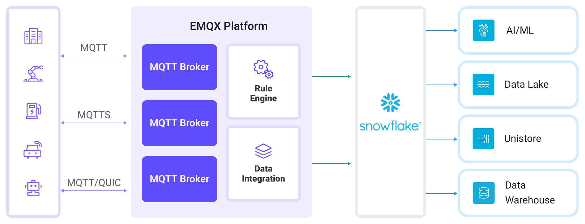

# Ingest MQTT Data into Snowflake

[Snowflake](https://www.snowflake.com/en/) is a cloud-based data platform that provides a highly scalable and flexible solution for data warehousing, analytics, and secure data sharing. Known for its ability to handle structured and semi-structured data, Snowflake is designed to store vast amounts of data while providing fast query performance and seamless integration with various tools and services.

This page provides a detailed introduction to the data integration between EMQX and Snowflake, and provides practical guidance on creating a rule and Sink.

## How It Works

Snowflake data integration in EMQX is a ready-to-use feature that can be easily configured to support complex IoT business workflows. In a typical IoT application, EMQX acts as the IoT platform responsible for device connectivity and message transmission, while Snowflake serves as the data storage and processing platform, handling the ingestion, storage, and analysis of this message data.



EMQX utilizes the rule engine and Sink to forward device events and data to Snowflake. End users and applications can then access data in Snowflake tables. The specific workflow is as follows:

1. **Device Connection to EMQX**: IoT devices trigger an online event upon successfully connecting via the MQTT protocol. The event includes device ID, source IP address, and other identifying properties.

2. **Device Message Publishing and Receiving**: Devices publish telemetry and status data through specific topics. EMQX receives the messages and compares them within the rule engine.

3. **Rules Engine Processing Messages**: The built-in rules engine processes messages and events from specific sources based on topic matching. It matches corresponding rules and processes messages and events, such as data format transformation, filtering specific information, or enriching messages with context information.

4. **Writing to Snowflake**: The rule triggers an action that writes message data to Snowflake, either by batching messages into files and loading them via Stage and Pipe (aggregated mode), or by streaming them directly using the Snowpipe Streaming API (streaming mode).

   ::: tip Note

   Snowpipe Streaming is currently a [preview feature](https://docs.snowflake.com/en/release-notes/preview-features) in Snowflake. It is available only for accounts hosted on AWS.

   ::: 

After events and message data are written to the Snowflake, they can be accessed for a variety of business and technical purposes, including:

- **Data Archiving**: Safely store IoT data in Snowflake for long-term archival, ensuring compliance and historical data availability.
- **Data Analytics**: Leverage Snowflake’s data warehousing and analytics capabilities to perform real-time or batch analysis, enabling predictive maintenance, operational insights, and device performance assessments.

## Features and Advantages

Using Snowflake data integration in EMQX can bring the following features and advantages to your business:

- **Message Transformation**: Messages can undergo extensive processing and transformation in EMQX rules before being written to Snowflake, facilitating subsequent storage and use.
- **Flexible Data Operations**: The Snowflake Sink offers flexibility in data handling by allowing users to select specific fields to write into Snowflake, enabling efficient and dynamic storage configurations tailored to business needs.
- **Integrated Business Processes**: The Snowflake Sink allows device data to be combined with the rich ecosystem applications of Snowflake, enabling more business scenarios like data analysis and archiving.
- **Low-Cost Long-Term Storage**: Snowflake’s scalable storage infrastructure is optimized for long-term data retention at a lower cost compared to traditional databases, making it an ideal solution for storing large volumes of IoT data.

These features enable you to build efficient, reliable, and scalable IoT applications and benefit from business decisions and optimizations.

## Before You Start

This section introduces the preparations required before creating a Snowflake Sink in EMQX.

### Prerequisites

- Understanding of EMQX [rules](./rules.md) and [data integration](./data-bridges.md) concepts.
- A working Snowflake account with admin privileges.

### Choose Upload Mode

::: tip

Choose the mode first, as it determines how you configure both EMQX and your Snowflake environment.

:::

EMQX supports two modes for sending data to Snowflake:

| Mode       | Description                                                  | Requires ODBC |
| ---------- | ------------------------------------------------------------ | ------------- |
| Aggregated | EMQX buffers MQTT messages into local files, then uploads them to a Snowflake stage. A pipe, configured with a `COPY INTO` statement, automatically loads those staged files into a target table. For more details, see [Snowflake Snowpipe Documentation](https://docs.snowflake.com/en/user-guide/data-load-snowpipe-intro). | Yes           |
| Streaming  | Sends data in real time via the Snowpipe Streaming API (AWS-only), writing rows directly to Snowflake tables. | Yes           |

### Initialize Snowflake ODBC Driver

To enable EMQX to communicate with Snowflake and efficiently transfer data, it is necessary to install and configure the Snowflake Open Database Connectivity (ODBC) driver. This driver enables EMQX to write data to a Snowflake stage. It acts as the communication bridge, ensuring that data is properly formatted, authenticated, and transferred.

For more information, refer to the official [ODBC Driver](https://docs.snowflake.com/en/developer-guide/odbc/odbc) page and the [license agreement](https://sfc-repo.snowflakecomputing.com/odbc/Snowflake_ODBC_Driver_License_Agreement.pdf).

#### Initialize Snowflake ODBC Driver on Linux

EMQX provides an [installation script](https://github.com/emqx/emqx/blob/master/scripts/install-snowflake-driver.sh) designed specifically for the quick deployment of the Snowflake ODBC driver on Debian-based systems (such as Ubuntu), along with the required system configuration.

::: tip Note

This script is for testing only, not a recommendation on how to set up the ODBC driver in production environments. You can refer to the official [installation instructions for Linux](https://docs.snowflake.com/en/developer-guide/odbc/odbc-linux).

:::

**Run the Installation Script**

Copy the `scripts/install-snowflake-driver.sh` script to your local machine. Run `chmod a+x` to make the script executable, and run it with `sudo`:

```bash
chmod a+x scripts/install-snowflake-driver.sh
sudo ./scripts/install-snowflake-driver.sh
```

The script automatically downloads the Snowflake ODBC `.deb` installation package (e.g., `snowflake-odbc-3.4.1.x86_64.deb`) to the current working directory. It then installs the driver and updates the following system configuration files:

- `/etc/odbc.ini`: Adds the Snowflake data source configuration
- `/etc/odbcinst.ini`: Registers the Snowflake driver path

**Sample Configuration**

Run the following command to view the configurations in the `/etc/odbc.ini` file:

```
emqx@emqx-0:~$ cat /etc/odbc.ini 

[snowflake]
Description=SnowflakeDB
Driver=SnowflakeDSIIDriver
Locale=en-US
PORT=443
SSL=on

[ODBC Data Sources]
snowflake = SnowflakeDSIIDriver
```

Run the following command to view the configurations in the  `/etc/odbcinst.ini` file:

```
emqx@emqx-0:~$ cat /etc/odbcinst.ini 

[ODBC Driver 18 for SQL Server]
Description=Microsoft ODBC Driver 18 for SQL Server
Driver=/opt/microsoft/msodbcsql18/lib64/libmsodbcsql-18.5.so.1.1
UsageCount=1

[ODBC Driver 17 for SQL Server]
Description=Microsoft ODBC Driver 17 for SQL Server
Driver=/opt/microsoft/msodbcsql17/lib64/libmsodbcsql-17.10.so.6.1
UsageCount=1

[SnowflakeDSIIDriver]
APILevel=1
ConnectFunctions=YYY
Description=Snowflake DSII
Driver=/usr/lib/snowflake/odbc/lib/libSnowflake.so
DriverODBCVer=03.52
SQLLevel=1
UsageCount=1
```

#### Initialize Snowflake ODBC Driver on macOS

To install and configure the Snowflake ODBC driver on macOS, follow these steps:

1. Install unixODBC, for example:

   ```
   brew install unixodbc
   ```

2. [Download and install iODBC](https://github.com/openlink/iODBC/releases/download/v3.52.16/iODBC-SDK-3.52.16-macOS11.dmg).

3. [Download and install the Snowflake ODBC driver](https://sfc-repo.snowflakecomputing.com/odbc/macuniversal/3.3.2/snowflake_odbc_mac_64universal-3.3.2.dmg).

4. Refer to [Installing and configuring the ODBC Driver for macOS](https://docs.snowflake.com/en/developer-guide/odbc/odbc-mac) for detailed installation and configuration instructions.

5. After installation, update the following configuration files:

   - Update permissions and configuration for the Snowflake ODBC driver:

     ```bash
     chown $(id -u):$(id -g) /opt/snowflake/snowflakeodbc/lib/universal/simba.snowflake.ini
     echo 'ODBCInstLib=libiodbcinst.dylib' >> /opt/snowflake/snowflakeodbc/lib/universal/simba.snowflake.ini
     ```

   - Create or update the `~/.odbc.ini` file to configure the ODBC connection:

     ```
     cat << EOF > ~/.odbc.ini
     [ODBC]
     Trace=no
     TraceFile=
     
     [ODBC Drivers]
     Snowflake = Installed
     
     [ODBC Data Sources]
     snowflake = Snowflake
     
     [Snowflake]
     Driver = /opt/snowflake/snowflakeodbc/lib/universal/libSnowflake.dylib
     EOF
     ```

### Create a User Account and Set Up Snowflake Resources

Regardless of upload mode, you must configure your Snowflake environment, such as setting up a user account, database, and related resources for data ingestion. The following credentials will be required later for configuring the Connector and Sink in EMQX:

| Field                  | Value                                            | Description                                                  |
| ---------------------- | ------------------------------------------------ | ------------------------------------------------------------ |
| Data Source Name (DSN) | `snowflake` (aggregated only)                    | ODBC DSN configured in `/etc/odbc.ini`, used for aggregated uploads. |
| Username               | `snowpipeuser`                                   | Snowflake user used to authenticate connections. Must have appropriate privileges for either mode. |
| Password               | `Snowpipeuser99`                                 | Optional if using key-pair authentication.                   |
| Database Name          | `testdatabase`                                   | Snowflake database where the target table is located.        |
| Schema                 | `public`                                         | Schema within the database containing your table and pipe.   |
| Stage (aggregated)     | `emqx`                                           | Snowflake stage used to hold files before ingestion.         |
| Pipe (aggregated)      | `emqx`                                           | Pipe that loads data from the stage into the target table.   |
| Pipe (streaming)       | `emqxstreaming`                                  | Pipe created using `DATA_SOURCE(TYPE => 'STREAMING')` to ingest data via Snowpipe Streaming API. |
| Private Key            | `file://<path to snowflake_rsa_key.private.pem>` | RSA private key used to sign JWTs for API authentication.    |

#### Generate RSA Key Pair (Optional for Aggregated Mode)

Snowflake supports multiple authentication methods. In EMQX, your choice of method depends on the upload mode and how you configure the connection:

| Upload Mode       | Authentication Options                                       | Key Pair Required |
| ----------------- | ------------------------------------------------------------ | ----------------- |
| Streaming (HTTPS) | RSA key pair + JWT (only supported method)                   | Yes               |
| Aggregated (ODBC) | Username/password (via DSN or EMQX)<br />RSA key pair + JWT (optional, configured in EMQX only) | Optional          |

Key pair authentication is mandatory only for streaming mode, where EMQX signs JWTs to securely authenticate to Snowflake's Streaming API.

For the aggregated mode, either username/password or RSA key pair can be used for authentication. You can provide credentials in one of the following ways:

- Enter the username and password directly in the EMQX Connector configuration on the Dashboard.
- Provide the path to a private RSA key (if using key-pair authentication).
- Or, if neither is specified in EMQX, ensure that credentials are correctly configured in your system’s ODBC DSN, such as `/etc/odbc.ini` (Linux) or `~/.odbc.ini` (macOS).

::: tip

Use either Password or Private Key for authentication, not both.

If neither is configured in EMQX, the Connector will fall back to using credentials from `/etc/odbc.ini`.
:::

**Example (`/etc/odbc.ini` with username/password)**

```ini
[snowflake]
Driver=SnowflakeDSIIDriver
Server=<account>.snowflakecomputing.com
UID=snowpipeuser
PWD=Snowpipeuser99
Database=testdatabase
Schema=public
Warehouse=compute_wh
Role=snowpipe
```

> This approach allows EMQX to refer to the `DSN` (`snowflake`) in its configuration without directly including credentials.

**If You Use Key Pair Authentication**

If you choose or are required to use RSA key pair authentication (e.g. for `streaming` mode), use the commands below to generate and configure the keys:

```bash
# Generate private key
openssl genrsa 2048 | openssl pkcs8 -topk8 -inform PEM -out snowflake_rsa_key.private.pem -nocrypt

# Generate public key
openssl rsa -in snowflake_rsa_key.private.pem -pubout -out snowflake_rsa_key.public.pem
```

When EMQX uses key-pair authentication (supported in both aggregated and streaming modes):

- EMQX uses the private RSA key to sign a JWT, which serves as a secure, verifiable identity token.
- Snowflake verifies the token’s signature using the public key.

For more information, refer to [Key-pair authentication and key-pair rotation](https://docs.snowflake.com/en/user-guide/key-pair-auth).

#### Set Up Snowflake Resources Using SQL

After generating the RSA key pair, you’ll set up the necessary Snowflake objects for either `aggregated` or `streaming` ingestion using SQL commands.

This includes:

- Creating a database and table
- Creating a stage and pipe (for `aggregated`)
- Creating a streaming pipe (for `streaming`)
- Creating a user and role, and granting access

1. In the Snowflake console, open the SQL Worksheet and execute the following SQL commands to create the database, table, stage, and pipe:

   ```sql
   USE ROLE accountadmin;
   
   -- Create a database to store your data (if not exists)
   CREATE DATABASE IF NOT EXISTS testdatabase;
   
   -- Create a table to receive MQTT data
   CREATE OR REPLACE TABLE testdatabase.public.emqx (
       clientid STRING,
       topic STRING,
       payload STRING,
       publish_received_at TIMESTAMP_LTZ
   );
   
   -- Create a Snowflake stage for uploading files (aggregated mode only)
   CREATE STAGE IF NOT EXISTS testdatabase.public.emqx
   FILE_FORMAT = (TYPE = CSV PARSE_HEADER = TRUE FIELD_OPTIONALLY_ENCLOSED_BY = '"')
   COPY_OPTIONS = (ON_ERROR = CONTINUE PURGE = TRUE);
   
   -- Create a pipe for aggregated mode that copies from the stage
   CREATE PIPE IF NOT EXISTS testdatabase.public.emqx AS
   COPY INTO testdatabase.public.emqx
   FROM @testdatabase.public.emqx
   MATCH_BY_COLUMN_NAME = CASE_INSENSITIVE;
   
   -- Create a pipe for streaming mode (direct ingestion)
   CREATE PIPE IF NOT EXISTS testdatabase.public.emqxstreaming AS
   COPY INTO testdatabase.public.emqx (
       clientid,
       topic,
       payload,
       publish_received_at
   )
   FROM (
       SELECT
           $1:clientid::STRING,
           $1:topic::STRING,
           $1:payload::STRING,
           $1:publish_received_at::TIMESTAMP_LTZ
       FROM TABLE(DATA_SOURCE(TYPE => 'STREAMING'))
   );
   MATCH_BY_COLUMN_NAME = CASE_INSENSITIVE;
   
   ```

   - The `COPY INTO` inside the pipe ensures Snowflake automatically loads staged or streamed data into your table.
   - The `$1:field` syntax in streaming pipes extracts fields from JSON payloads ingested via EMQX.

2. Create a dedicated user (e.g., `snowpipeuser`) for EMQX to authenticate with, and bind the RSA public key for that user:

   ```sql
   -- Create the user account
   CREATE USER IF NOT EXISTS snowpipeuser
       PASSWORD = 'Snowpipeuser99'
       MUST_CHANGE_PASSWORD = FALSE;
   
   -- Bind the RSA public key to the user
   ALTER USER snowpipeuser SET RSA_PUBLIC_KEY = '
   <YOUR_PUBLIC_KEY_CONTENTS_LINE_1>
   <YOUR_PUBLIC_KEY_CONTENTS_LINE_2>
   <YOUR_PUBLIC_KEY_CONTENTS_LINE_3>
   <YOUR_PUBLIC_KEY_CONTENTS_LINE_4>
   ';
   ```

   ::: tip

   You need to remove the `-----BEGIN PUBLIC KEY-----` and `-----END PUBLIC KEY-----` lines from the PEM file, and include the remaining content-preserving line breaks.

   :::

   This key is uploaded to the Snowflake user and stored inside Snowflake.

3. Create and assign the required role to the user for managing the Snowflake resources:

   ```sql
   CREATE OR REPLACE ROLE snowpipe;
   
   -- Grant usage and read/write permissions
   GRANT USAGE ON DATABASE testdatabase TO ROLE snowpipe;
   GRANT USAGE ON SCHEMA testdatabase.public TO ROLE snowpipe;
   GRANT INSERT, SELECT ON testdatabase.public.emqx TO ROLE snowpipe;
   
   -- Aggregated mode requires access to stage and pipe
   GRANT READ, WRITE ON STAGE testdatabase.public.emqx TO ROLE snowpipe;
   GRANT OPERATE, MONITOR ON PIPE testdatabase.public.emqx TO ROLE snowpipe;
   
   -- Streaming mode requires permissions on the streaming pipe
   GRANT OPERATE, MONITOR ON PIPE testdatabase.public.emqxstreaming TO ROLE snowpipe;
   
   -- Link role to the user and set it as default
   GRANT ROLE snowpipe TO USER snowpipeuser;
   ALTER USER snowpipeuser SET DEFAULT_ROLE = snowpipe;
   ```

## Create a Snowflake Connector for Aggregated Mode

If you plan to use the aggregated upload mode in your Snowflake Sink, you need to create a Snowflake Connector to establish the connection with your Snowflake environment. This connector uses ODBC (via DSN) to connect through a stage.

1. Go to the Dashboard **Integration** -> **Connector** page.

2. Click the **Create** button in the top right corner.

3. Select **Snowflake** as the connector type and click next.

4. Enter the connector name, a combination of upper and lowercase letters and numbers. Here, enter `my-snowflake`.

5. Enter the connection information.

   - **Server Host**: The server host is the Snowflake endpoint URL, typically in the format `<Your Snowflake Organization ID>-<Your Snowflake Account Name>.snowflakecomputing.com`. You need to replace `<Your Snowflake Organization ID>-<Your Snowflake Account Name>` with the subdomain specific to your Snowflake instance.

   - **Account**: Enter your Snowflake Organization ID and Snowflake account name separated by a dash (`-`), which is part of the URL you use to access the Snowflake platform and can be found in your Snowflake console.

   - **Data Source Name (DSN)**: Enter `snowflake`, which corresponds to the DSN configured in the `.odbc.ini` file during ODBC driver setup.

   - **Username**: Enter `snowpipeuser`, as defined during the previous setup process.

   - **Password**: The password for authenticating with Snowflake via ODBC using username/password authentication. This field is optional:

     - You may enter the password here, e.g., `Snowpipeuser99`, as defined during the previous setup process;

     - Or configure it in `/etc/odbc.ini`;

     - If using key-pair authentication instead, leave this field blank.
   
       ::: tip

       Use either Password or Private Key for authentication, not both. If neither is configured here, ensure the appropriate credentials are set in `/etc/odbc.ini`.

       :::

   - **Private Key Path**: The absolute file path to the private RSA key used for authenticating with Snowflake via ODBC. This path must be consistent across all nodes of the cluster. For example:
      `/etc/emqx/certs/snowflake_rsa_key.private.pem`.
   
   - **Private Key Password**: The password used to decrypt the private RSA key file, if the key is encrypted. Leave this field blank if the key was generated without encryption (i.e., with the `-nocrypt` option in OpenSSL).
   
   - **Proxy**: Configuration settings for connecting to Snowflake through an HTTP proxy server. HTTPS proxies are **not** supported. By default, no proxy is used. To enable proxy support, select the `Enable Proxy` and provide the following:

     - **Proxy Host**: The hostname or IP address of the proxy server.
     - **Proxy Port**: The port number used by the proxy server.
   
6. If you want to establish an encrypted connection, click the **Enable TLS** toggle switch. For more information about TLS connection, see [TLS for External Resource Access](../network/overview.md/#tls-for-external-resource-access). TLS must be enabled for streaming mode, as communication is over HTTPS.

7. Advanced settings (optional): See [Advanced Settings](#advanced-settings).

8. Before clicking **Create**, you can click **Test Connectivity** to test if the connector can connect to the Snowflake.

9. Click the **Create** button at the bottom to complete the connector creation.

You have now completed the connector creation and can proceed to create a rule and Sink to specify how the data will be written into Snowflake.

## Create a Rule with Snowflake Sink for Aggregated Mode

This section demonstrates how to create a rule in EMQX to process messages (e.g., from the source MQTT topic `t/#`) and write the processed results to Snowflake through the configured Sink using the aggregated upload mode. This method groups the results of multiple rule triggers into a single file (e.g., a CSV file) and uploads it to Snowflake, reducing the number of files and improving write efficiency.

1. Go to the Dashboard **Integration** -> **Rules** page.

2. Click the **Create** button in the top right corner.

3. Enter the rule ID `my_rule`, and input the following rule SQL in the SQL editor:

   ```sql
   SELECT
     clientid,
     unix_ts_to_rfc3339(publish_received_at, 'millisecond') as publish_received_at,
     topic,
     payload
   FROM
       "t/#"
   ```

   ::: tip

   If you are new to SQL, you can click **SQL Examples** and **Enable Debug** to learn and test the rule SQL results.

   :::
   ::: tip

   For Snowflake integration, it is important that the selected fields exactly match the number of columns and their names of the table defined in Snowflake, so avoid adding extra fields or selecting from `*`. 

   :::


4. Add an action, select `Snowflake` from the **Action Type** dropdown list, keep the **Action** dropdown as the default `Create Action` option, or choose a previously created Snowflake action from the action dropdown. Here, create a new Sink and add it to the rule.

5. Enter the Sink's name (for example, `snowflake_sink`) and a brief description.

6. Select the `my-snowflake` connector created earlier from the **Connectors** dropdown. You can also click the create button next to the dropdown to quickly create a new connector in the pop-up box. The required configuration parameters can be found in [Create a Snowflake Connector for Aggregated Mode](#create-a-snowflake-connector-for-aggregated-mode).

7. Configure the settings for the aggregated upload mode.

   - **Database Name**: Enter `testdatabase`. This is the Snowflake database that was created for storing EMQX data.
   - **Schema**: Enter `public`, the schema within the `testdatabase` where the data table is located.
   - **Stage**: Enter `emqx`, the stage created in Snowflake for holding the data before loading it into the table.
   - **Pipe**: Enter `emqx`, the pipe automating the loading process from the stage to the table.
   - **Pipe User**: Enter `snowpipeuser`, the Snowflake user with the appropriate permissions to manage the pipe.
   - **Private Key**: The RSA private key used by the pipe user to securely access the Snowflake pipe. You can provide the key in one of two formats:
     - **Plain Text**: Paste the full PEM-formatted private key content directly as a string.
     - **File Path**: Specify the path to the private key file, starting with `file://`. The file path must be consistent across all nodes in the cluster and accessible by the EMQX application user. For example, `file:///etc/emqx/certs/snowflake_rsa_key.private.pem`.
   - **Private Key Password**: The password used to decrypt the private RSA key file, if the key is encrypted. Leave this field blank if the key was generated without encryption (i.e., with the `-nocrypt` option in OpenSSL).

   - **Aggregation Upload Format**: Currently, only `csv` is supported. Data will be staged to Snowflake in comma-separated CSV format.
   - **Column Order**: Select the order of the columns from the dropdown list based on your desired arrangement. The generated CSV file will be sorted first by the selected columns, with unselected columns sorted alphabetically afterward.
   - **Max Records**: Set the maximum number of records before aggregation is triggered. For example, you can set it to `1000` to upload after collecting 1000 records. When the maximum number of records is reached, the aggregation of a single file will be completed and uploaded, resetting the time interval.
   - **Time Interval**: Set the time interval (in seconds) at which aggregation occurs. For example, if set to `60`, data will be uploaded every 60 seconds even if the maximum number of records hasn’t been reached, resetting the maximum number of records.
   - **Proxy**: Configuration settings for connecting to Snowflake through an HTTP proxy server. HTTPS proxies are **not** supported. By default, no proxy is used. To enable proxy support, select the `Enable Proxy` and provide the following:
     - **Proxy Host**: The hostname or IP address of the proxy server.
     - **Proxy Port**: The port number used by the proxy server.

8. **Fallback Actions (optional)**: If you want to improve reliability in case of message delivery failure, you can define one or more fallback actions. These actions will be triggered if the primary Sink fails to process a message. See [Fallback Actions](./data-bridges.md#fallback-actions) for more details.

9. Expand **Advanced Settings** and configure the advanced setting options as needed (optional). For more details, refer to [Advanced Settings](#advanced-settings).

10. Use the default values for the remaining settings. Click the **Create** button to complete the Sink creation. After successful creation, the page will return to the rule creation, and the new Sink will be added to the rule actions.

11. Back on the rule creation page, click the **Create** button to complete the entire rule creation process.

You have now successfully created the rule. You can see the newly created rule on the **Rules** page and the new Snowflake Sink on the **Actions (Sink)** tab.

You can also click **Integration** -> **Flow Designer** to view the topology. The topology visually shows how messages under the topic `t/#` are written into the Snowflake after being parsed by the rule `my_rule`.

## Create a Snowflake Streaming Connector

If you plan to use the streaming upload mode in your Snowflake Sink, you need to create a Snowflake Streaming Connector to establish the connection with your Snowflake environment. This connector uses HTTPS and the Snowpipe Streaming REST API (AWS-only).

1. Go to the Dashboard **Integration** -> **Connector** page.

2. Click the **Create** button in the top right corner.

3. Select **Snowflake Streaming** as the connector type and click next.

4. Enter the connector name, a combination of upper and lowercase letters and numbers. Here, enter `my-snowflake-streaming`.

5. Enter the connection information.

   - **Server Host**: The server host is the Snowflake endpoint URL, typically in the format `<Your Snowflake Organization ID>-<Your Snowflake Account Name>.snowflakecomputing.com`. You need to replace `<Your Snowflake Organization ID>-<Your Snowflake Account Name>` with the subdomain specific to your Snowflake instance.
   - **Account**: Enter your Snowflake Organization ID and Snowflake account name separated by a dash (`-`), which is part of the URL you use to access the Snowflake platform and can be found in your Snowflake console.
   - **Pipe User**: The name of a Snowflake user account that has a role with permissions to operate the target Pipe, for example, `snowpipeuser`. The role must have at least the `OPERATE` and `MONITOR` privileges.
   - **Private Key Path**: The absolute file path to the private RSA key. EMQX uses this key to sign JWT tokens to authenticate itself with the Snowflake API. This path must be consistent across all nodes of the cluster. For example:
     `/etc/emqx/certs/snowflake_rsa_key.private.pem`.
   - **Private Key Password**: The password used to decrypt the private RSA key file, if the key is encrypted. Leave this field blank if the key was generated without encryption (i.e., with the `-nocrypt` option in OpenSSL).
   - **Proxy**: Configuration settings for connecting to Snowflake through an HTTP proxy server. HTTPS proxies are **not** supported. By default, no proxy is used. To enable proxy support, select the `Enable Proxy` and provide the following:
     - **Proxy Host**: The hostname or IP address of the proxy server.
     - **Proxy Port**: The port number used by the proxy server.

6. If you want to establish an encrypted connection, click the **Enable TLS** toggle switch. For more information about TLS connection, see [TLS for External Resource Access](../network/overview.md/#tls-for-external-resource-access). TLS must be enabled for streaming mode, as communication is over HTTPS.

7. Advanced settings (optional): See [Advanced Settings](#advanced-settings).

8. Before clicking **Create**, you can click **Test Connectivity** to test if the connector can connect to the Snowflake.

9. Click the **Create** button at the bottom to complete the connector creation.

You have now completed the connector creation and can proceed to create a rule and Sink to specify how the data will be written into Snowflake.

## Create a Rule with Snowflake Sink for Streaming Mode

This section demonstrates how to create a rule in EMQX to process messages (e.g., from the source MQTT topic `t/#`) and write the processed results to Snowflake through the configured Sink using the streaming mode. This mode enables real-time ingestion using the Snowpipe Streaming API.

1. Go to the Dashboard **Integration** -> **Rules** page.

2. Click the **Create** button in the top right corner.

3. Enter the rule ID `my_rule`, and input the following rule SQL in the SQL editor:

   ```sql
   SELECT
     clientid,
     unix_ts_to_rfc3339(publish_received_at, 'millisecond') as publish_received_at,
     topic,
     payload
   FROM
       "t/#"
   ```

   ::: tip

   If you are new to SQL, you can click **SQL Examples** and **Enable Debug** to learn and test the rule SQL results.

   :::
   ::: tip
   
   For Snowflake integration, it is important that the selected fields exactly match the number of columns and their names of the table defined in Snowflake, so avoid adding extra fields or selecting from `*`. 
   
   :::


4. Add an action, select `Snowflake Streaming` from the **Action Type** dropdown list, keep the **Action** dropdown as the default `Create Action` option, or choose a previously created Snowflake action from the action dropdown. Here, create a new Sink and add it to the rule.

5. Enter the Sink's name (for example, `snowflake_sink_streaming`) and a brief description.

6. Select the `my-snowflake-streaming` connector created earlier from the connector dropdown. You can also click the create button next to the dropdown to quickly create a new connector in the pop-up box. The required configuration parameters can be found in [Create a Snowflake Streaming Connector](#create-a-snowflake-streaming-connector).

7. Configure the settings for the streaming upload mode.

   - **Database Name**: Enter `testdatabase`. This is the Snowflake database that was created for storing EMQX data.

   - **Schema**: Enter `public`, the schema within the `testdatabase` where the data table is located.

   - **Pipe**: Enter `emqxstreaming`, the name of the Snowflake Streaming pipe created using a SQL statement. The name must match exactly as defined in Snowflake.

   - **HTTP Pipelining**: The maximum number of HTTP requests that can be sent without waiting for responses. Default: `100`.
   
   - **Connect Timeout**: The time limit for establishing a connection to Snowflake before the attempt is aborted. Default: `15` seconds.
     
   - **Connection Pool Size**: The maximum number of concurrent connections EMQX can maintain to Snowflake for this Sink. Default: `8`.
   
   - **Max Inactive**: The maximum amount of time an idle connection can remain open before being closed. Default: `10` seconds.
   
8. **Fallback Actions (optional)**: If you want to improve reliability in case of message delivery failure, you can define one or more fallback actions. These actions will be triggered if the primary Sink fails to process a message. See [Fallback Actions](./data-bridges.md#fallback-actions) for more details.

9. Expand **Advanced Settings** and configure the advanced setting options as needed (optional). For more details, refer to [Advanced Settings](#advanced-settings).

10. Use the default values for the remaining settings. Click the **Create** button to complete the Sink creation. After successful creation, the page will return to the rule creation, and the new Sink will be added to the rule actions.

11. Back on the rule creation page, click the **Create** button to complete the entire rule creation process.

You have now successfully created the rule. You can see the newly created rule on the **Rules** page and the new Snowflake Sink on the **Actions (Sink)** tab.

You can also click **Integration** -> **Flow Designer** to view the topology. The topology visually shows how messages under the topic `t/#` are written into the Snowflake after being parsed by the rule `my_rule`.

## Test the Rule

This section shows how to test the configured rule.

### Publish a Test Message

Use MQTTX to publish a message to the topic `t/1`:

```bash
mqttx pub -i emqx_c -t t/1 -m '{ "msg": "Hello Snowflake" }'
```

Repeat this step a few times to generate multiple test messages.

### Verify the Data in Snowflake

After sending the test messages, you can verify that the data was successfully written to Snowflake by accessing your Snowflake instance and querying the target table.

1. Open the Snowflake web interface and log in to the Snowflake Console with your credentials.

2. In the Snowflake Console, execute the following SQL query to view the data written by the rule into the `emqx` table:

   ```
   SELECT * FROM testdatabase.public.emqx;
   ```

   This will display all the records uploaded to the `emqx` table, including the `clientid`, `topic`, `payload`, and `publish_received_at` fields.

3. You should see the test messages you sent, such as the message content `{ "msg": "Hello Snowflake" }`, along with other metadata like the topic and timestamp.

## Advanced Settings

This section delves into the advanced configuration options available for the Snowflake Sink. In the Dashboard, when configuring the Sink, you can expand **Advanced Settings** to adjust the following parameters based on your specific needs.

| Field Name                       | Description                                                  | Default Value   |
| -------------------------------- | ------------------------------------------------------------ | --------------- |
| **Buffer Pool Size**             | Specifies the number of buffer worker processes, which are allocated to manage the data flow between EMQX and Snowflake. These workers temporarily store and process data before sending it to the target service, crucial for optimizing performance and ensuring smooth data transmission. | `16` seconds    |
| **Request TTL**                  | The "Request TTL" (Time To Live) configuration setting specifies the maximum duration, in seconds, that a request is considered valid once it enters the buffer. This timer starts ticking from the moment the request is buffered. If the request stays in the buffer for a period exceeding this TTL setting or if it is sent but does not receive a timely response or acknowledgment from Snowflake, the request is deemed to have expired. | `45` seconds    |
| **Health Check Interval**        | Specifies the time interval (in seconds) for the Sink to perform automatic health checks on its connection with Snowflake. | `15` seconds    |
| **Health Check Interval Jitter** | A uniform random delay added on top of the base health check interval to reduce the chance that multiple nodes initiate health checks at the same time. When multiple Actions or Sources share the same Connector, enabling jitter ensures their health checks are initiated at slightly different times. | `0` millisecond |
| **Health Check Timeout**         | Specify the timeout duration for the connector to perform automatic health checks on its connection with S3 Tables. | `60` seconds    |
| **Max Buffer Queue Size**        | Specifies the maximum number of bytes that can be buffered by each buffer worker process in the Snowflake Sink. The buffer workers temporarily store data before sending it to Snowflake, acting as intermediaries to handle the data stream more efficiently. Adjust this value based on system performance and data transmission requirements. | `256` MB        |
| **Query Mode**                   | Allows you to choose between `synchronous` or `asynchronous` request modes to optimize message transmission according to different requirements. In asynchronous mode, writing to Snowflake does not block the MQTT message publishing process. However, this may lead to clients receiving messages before they arrive at Snowflake. | `Asynchronous`  |
| **Batch Size**                   | Specifies the maximum size of data batches transmitted from EMQX to Snowflake in a single transfer operation. By adjusting the size, you can fine-tune the efficiency and performance of data transfer between EMQX and Snowflake.<br />If the "Batch Size" is set to "1," data records are sent individually, without being grouped into batches. | `100`           |
| **Inflight  Window**             | "In-flight queue requests" refer to requests that have been initiated but have not yet received a response or acknowledgment. This setting controls the maximum number of in-flight queue requests that can exist simultaneously during Sink communication with Snowflake. <br/>When **Request Mode** is set to `asynchronous`, the "Request In-flight Queue Window" parameter becomes particularly important. If strict sequential processing of messages from the same MQTT client is crucial, then this value should be set to `1`. | `100`           |

