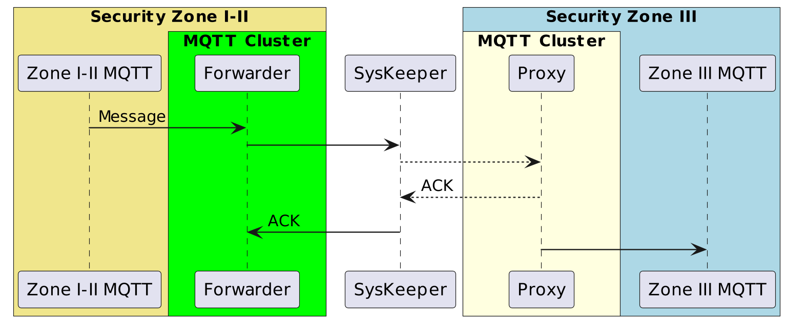

# Ingest MQTT Data with Nari SysKeeper


::: tip

The Nari SysKeeper Sink is an EMQX Enterprise Edition feature. EMQX Enterprise Edition provides comprehensive coverage of key business scenarios, rich data integration, product-level reliability, and 24/7 global technical support. Experience the benefits of this [enterprise-ready MQTT messaging platform](https://www.emqx.com/en/try?product=enterprise) today.
:::



Nari SysKeeper 2000 is a network physical isolation device. EMQX supports data passthrough from the Security Zone I-II of the obverse side to the Security Zone III.
The data integration ensures a single-directional flow, where MQTT messages from EMQX are passthrough to the Nari SysKeeper, leveraging both EMQX's exceptional real-time data ingestion capabilities and SysKeeper's specialized security features.

This page provides a comprehensive introduction to the data integration between EMQX and Nari SysKeeper with practical instructions on creating and validating the data integration.

## How It Works

The Nari SysKeeper data integration is an out-of-the-box feature in EMQX designed to combine the MQTT's real-time data capturing and transmission capabilities with SysKeeper's powerful security capabilities.. With a built-in [rule engine](./rules.md) component, the integration simplifies the process of ingesting data from EMQX to SysKeeper for passthrough, eliminating the need for complex coding.

The diagram below illustrates a typical architecture of data integration between EMQX and SysKeeper. <!-- This image needs to be modified to be SysKeeper specific-->



The workflow of the data integration is as follows:

1. **Message publication and reception**

   Devices, whether they are part of connected vehicles, IIoT systems, or energy management platforms, establish successful connections to EMQX through the MQTT protocol and send messages via MQTT based on their operational states, readings, or triggered events. When EMQX receives these messages, it initiates the matching process within its rules engine.
2. **Message data processing**

   When a message arrives, it passes through the rule engine and is then processed by the rule defined in EMQX. The rules, based on predefined criteria, determine which messages need to be routed to SysKeeper. If any rules specify payload transformations, those transformations are applied, such as converting data formats, filtering out specific information, or enriching the payload with additional context.
3. **Data buffering**

   EMQX provides an in-memory message buffer to prevent data loss when the Security Zone III is unavailable. Data is temporarily held in the buffer, and may be offloaded to disk to prevent memory overload. Note that data is not preserved if the data integration or the EMQX node is restarted.
4. **Data ingestion to SysKeeper**

   Once the rule engine identifies a message for SysKeeper, it triggers an action of forwarding the messages to zone III.
5. **Data Utilization**

   In zone III, the MQTT messages will be republish as it origin form, businesses can harness its querying power for various use cases.

## Features and Benefits

The data integration with SysKeeper offers a range of features and benefits tailored to ensure effective data handling and storage:

- **Real-time Data Streaming**

  EMQX is built for handling real-time data streams, ensuring efficient and reliable data transmission from source systems to SysKeeper. It enables organizations to capture and analyze data in real-time, making it ideal for use cases requiring immediate insights and actions.

- **Flexible Data Transformation**

  EMQX provides a powerful SQL-based Rule Engine, allowing organizations to pre-process data before passthrough it. It supports various data transformation mechanisms, such as filtering, routing, aggregation, and enrichment, enabling organizations to shape the data according to their needs.

- **Scalability and High Throughput**

  EMQX is architected for horizontal scalability, effortlessly managing the surging message traffic generated by an ever-expanding fleet of IoT devices. This solution effortlessly adapts to expanding data volumes and supports high-concurrency access. As a result, IoT time-series workloads can effortlessly manage the increasing requirements of data ingestion, storage, and processing as IoT deployments scale to unprecedented levels.

## Before You Start

This section describes the preparations you must complete before creating the Nari SysKeeper data bridges in EMQX Dashboard.

### Prerequisites

- Knowledge about EMQX data integration [rules](./rules.md)
- Knowledge about [data bridges](./data-bridges.md)

### Start a Nari SysKeeper Proxy in Security Zone III

In order to deliver MQTT messages passthrough Nari SysKeeper, we need to enable data forwarding in Zone I-II and enable data proxy in Zone III.

This section introduces how to start a Nari SysKeeper proxy in Security Zone III.

1. Go to EMQX Dashboard, and click **Integration** -> **Connector**.

2. Click **Create** on the top right corner of the page. Click to select the **SysKeeper Proxy** and click **Next**:

3. Enter a name for the Connector. The name should be a combination of upper/lower case letters or numbers, for example, `my_sysk_proxy`.

4. Set **Listen Address** to `Address:9002`, for example: "172.17.0.1:9002". For the rest, you can keep the default value.

Now you have created a Name SysKeeper Proxy in the Security Zone III. Next, you need to create a rule and Sink to specify the data to be written into the SysKeeper forwarding in the Security Zone I-II.

## Create a Connector

This section demonstrates how to configure a Nari SysKeeper forwarding in Security Zone I-II.

1. Go to EMQX Dashboard, and click **Integration** -> **Connector**.

2. Click **Create** on the top right corner of the page. Click to select the **SysKeeper Forwarder** and click **Next**:

3. Enter a name for the Connector. The name should be a combination of upper/lower case letters or numbers, for example, `my_sysk`.

4. Set **Server** to address of the SysKeeper proxy, for example: `172.17.0.1:9002`.

5. Before clicking **Create**, you can click **Test Connectivity** to test that the Connector can connect to the SysKeeper Proxy.

6. Click **Create** to complete the creation of the Connector.

Now you have created a SysKeeper Forwarder Connector. Next, you need to create a rule and Sink to specify the data to be passthrough to the SysKeeper.

## Create Rule and SysKeeper Forwarder Action

This section demonstrates how to create a rule in EMQX to process messages from the source MQTT topic `root/#`  and send the processed results through the configured SysKeeper Forwarder data bridge to passthrough data to SysKeeper Proxy.

1. Go to the EMQX Dashboard, and click **Integration -> Rules**.

2. Click **Create** on the top right corner of the page.

3. Input a rule ID, for example, `my_rule`.

4. Input the following statement in the SQL editor, which will forward the MQTT messages matching the topic pattern `root/#`:
   ```sql
   SELECT
     *
   FROM
     "root/#"

   ```

5. Click the **Add Action** button, and select **Forwarding with Data Bridge** from the dropdown list. With this action, EMQX sends the data processed by the rule to the data bridge.

6. Click the **+** icon next to the **Data bridge** drop-down box to create a data bridge.

7. Select **SysKeeper Forward** from the **Type of Data Bridge** drop-down list. Fill in the required fields (marked with an asterisk).

8. Enter a name for the data bridge. The name should be a combination of upper/lower case letters and numbers.

9. Select the `my_sysk` just created from the Connector dropdown box. You can also create a new Connector by clicking the button next to the dropdown box. For the configuration parameters, see [Create a Connector](#create-connector).

10. Enter the action information:

   * **Topic**: The topic for the republish messages.

   * **QoS**: The qos for the republish messages.

   * **Message Template**: The payload tempate for the republish messages.

## Test SysKeeper Data Bridge and Rule

You can use the built-in WebSocket client in the EMQX dashboard to test your SysKeeper data bridge and rule.

1. In Security Zone III, Click **Diagnose** -> **WebSocket Client** in the left navigation menu of the Dashboard.

2. Fill in the connection information for the current EMQX instance.

   - If you run EMQX locally, you can use the default value.
   - If you have changed EMQX's default configuration. For example, the configuration change on authentication can require you to type in a username and password.

3. Click **Connect** to connect the client to the EMQX instance.

4. Use this client to subscribe to the topic `root/test`.

5. In Security Zone I-II, repeat the above steps to create a client for publishing.

6. Scroll down to the publish area and type the following:

   - **Topic**: `root/test`

   - **Payload**:

     ```json
     {
       "hello": "I am from the Security Zone I-II"
     }
     ```

   - **QoS**: `1`

7. Click **Publish** to send the message.

8. In Security Zone III, you will see that the client has received this message if everything is correct.
