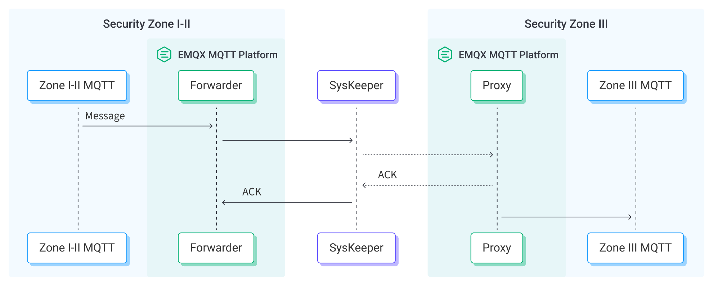

# Ingest MQTT Data into Nari SysKeeper


::: tip

The Nari SysKeeper data integration is an EMQX Enterprise Edition feature. EMQX Enterprise Edition provides comprehensive coverage of key business scenarios, rich data integration, product-level reliability, and 24/7 global technical support. Experience the benefits of this [enterprise-ready MQTT messaging platform](https://www.emqx.com/en/try?product=enterprise) today.
:::



Nari SysKeeper 2000 is a network physical isolation device. As a security management system, it is widely used in various industries, especially in fields requiring high-level security measures such as critical infrastructure and enterprise IT systems. EMQX supports the data integration with SysKeeper to leverage both EMQX's exceptional real-time data ingestion capabilities and SysKeeper's specialized security features. Through the data integration, a single-directional flow of MQTT messages can pass through from Security Zone I-II, which represents more secure, controlled areas within the SysKeeper to Security Zone III, which is a less restrictive area that serves as a bridge between public-facing services and the more secure internal zones.

This page provides a comprehensive introduction to the data integration between EMQX and Nari SysKeeper with practical instructions on creating and validating the data integration.

## How It Works

The Nari SysKeeper data integration is an out-of-the-box feature in EMQX designed to combine the MQTT's real-time data capturing and transmission capabilities with SysKeeper's powerful security capabilities. With a built-in [rule engine](./rules.md) component, the integration simplifies the process of ingesting data from EMQX to SysKeeper for passthrough, eliminating the need for complex coding.

The diagram below illustrates a typical architecture of data integration between EMQX and SysKeeper. <!-- This image needs to be modified to be SysKeeper specific-->



The workflow of the data integration is as follows:

1. **Message publication and reception**: Devices, whether they are part of connected vehicles, IIoT systems, or energy management platforms, establish successful connections to EMQX through the MQTT protocol and send messages via MQTT based on their operational states, readings, or triggered events. When EMQX receives these messages, it initiates the matching process within its rules engine.
2. **Message data processing**: When a message arrives, it passes through the rule engine and is then processed by the rule defined in EMQX. The rule, based on predefined criteria, determines which messages need to be routed to SysKeeper. Payload transformations are applied if specified in the rule, such as converting data formats, filtering out specific information, or enriching the payload with additional context.
4. **Data ingestion to SysKeeper and buffering**: Once the rule engine identifies a message for SysKeeper, it triggers an action of forwarding the messages through the configured SysKeeper Forwarder Sink. With the help of the SysKeeper Forwarder Connector, the SysKeeper Proxy in Security Zone III receives the connection, and messages are ingested into Security Zone III. EMQX provides an in-memory message buffer to prevent data loss when Security Zone III is unavailable. Data is temporarily held in the buffer and may be offloaded to disk to prevent memory overload. Note that data is not preserved if the data integration or the EMQX node is restarted.
5. **Data Utilization**: In Security Zone III, the MQTT messages will be republished as their origin form, and businesses can harness its querying power for various use cases.

## Features and Benefits

The data integration with SysKeeper offers a range of features and benefits tailored to ensure effective data handling and storage:

- **Real-time Data Streaming**: EMQX is built for handling real-time data streams, ensuring efficient and reliable data transmission from source systems to SysKeeper. It enables organizations to capture and analyze data in real-time, making it ideal for use cases requiring immediate insights and actions.

- **Flexible Data Transformation**: EMQX provides a powerful SQL-based Rule Engine, allowing organizations to pre-process data before passing through it. It supports various data transformation mechanisms, such as filtering, routing, aggregation, and enrichment, enabling organizations to shape the data according to their needs.

- **Scalability and High Throughput**: EMQX is architected for horizontal scalability, effortlessly managing the surging message traffic generated by an ever-expanding fleet of IoT devices. This solution effortlessly adapts to expanding data volumes and supports high-concurrency access. As a result, IoT time-series workloads can effortlessly manage the increasing requirements of data ingestion, storage, and processing as IoT deployments scale to unprecedented levels.

## Before You Start

This section describes the preparations you must complete before creating the Nari SysKeeper data integration in the EMQX Dashboard.

### Prerequisites

- Knowledge about EMQX data integration [rules](./rules.md)
- Knowledge about [data integration](./data-bridges.md)

### Start a Nari SysKeeper Proxy in Security Zone III

To deliver MQTT messages to Nari SysKeeper, you need to enable a data proxy in Zone III to receive connections from the SysKeeper Forwarder in Zone I-II.

This section introduces how to start a Nari SysKeeper proxy in Security Zone III.

1. Go to EMQX Dashboard, and click **Integration** -> **Connector**.

2. Click **Create** on the top right corner of the page. Select the **SysKeeper Proxy** and click **Next**:

3. Enter a name for the Connector. The name should combine upper/lower case letters or numbers, for example, `my_sysk_proxy`.

4. Set **Listen Address** to `Address:9002`, for example, `172.17.0.1:9002`. 

5. Leave the values of other configuration options as default.

6. Click the **Create** button.

Now you have created a Nari SysKeeper Proxy in the Security Zone III. Next, you need to create a Nari SysKeeper Forwarder Connector.

## Create a SysKeeper Forwarder Connector

This section demonstrates how to configure a Nari SysKeeper Forwarder Connector in Security Zone I-II to forward the connections to the SysKeeper Proxy.

1. Go to EMQX Dashboard, and click **Integration** -> **Connector**.

2. Click **Create** on the top right corner of the page. Click to select the **SysKeeper Forwarder** and click **Next**.

3. Enter a name for the Connector. The name should combine upper/lower case letters or numbers, for example, `my_sysk`.

4. Set the **Server** to the address of the SysKeeper proxy server, for example, `172.17.0.1:9002`.

5. Before clicking **Create**, you can click **Test Connectivity** to test that the Connector can connect to the SysKeeper Proxy.

6. Click **Create** to complete the creation of the Connector. In the pop-up dialogue, you can click **Back to Connector List** or click **Create Rule** to continue to create a rule and a Sink for specifying the data to be forwarded to SysKeeper. For details steps, refer to [Create a Rule and SysKeeper Forwarder Sink](#create-a-rule-and-syskeeper-forwarder-sink).


## Create a Rule and SysKeeper Forwarder Sink

This section demonstrates how to create a rule in EMQX to process messages from the source MQTT topic `root/#`  and send the processed results through the configured SysKeeper Forwarder Sink to the SysKeeper Proxy.

1. Go to the EMQX Dashboard, and click **Integration -> Rules**.

2. Click **Create** on the top right corner of the page.

3. Enter a rule ID, for example, `my_rule`.

4. Enter the following statement in the SQL editor, which will forward the MQTT messages matching the topic pattern `root/#`:

   ```sql
   SELECT
     *
   FROM
     "root/#"
   
   ```

   ::: tip

   If you are a beginner user, click **SQL Examples** and **Enable Test** to learn and test the SQL rule.

   :::

5. Click the + **Add Action** button to define an action that will be triggered by the rule. With this action, EMQX sends the data processed by the rule to SysKeeper.

6. Select `SysKeeper Forwarder` from the **Type of Action** dropdown list. Keep the **Action** dropdown with the default `Create Action` value. You can also select a Sink if you have created one. This demonstration will create a new Sink.

7. Enter a name for the Sink. The name should combine upper/lower case letters and numbers.

8. Select the `my_sysk` just created from the **Connector** dropdown box. You can also create a new Connector by clicking the button next to the dropdown box. For the configuration parameters, see [Create a SysKeeper Forwarder Connector](#create-a-syskeeper-forwarder-connector).

9. Enter the configuration information:

   - **Topic**: The topic for the republished messages. The placeholders are supported, for example, `${topic}`.
   - **QoS**: The QoS for the republished messages.
   - **Message Template**: The payload template for the republished messages. The placeholders are supported, for example, `${payload}`.

10. Click **Create** to complete the Sink creation. Back on the **Create Rule** page, you will see the new Sink appear under the **Action Outputs** tab.

11. On the **Create Rule** page, verify the configured information. Click the **Create** button to generate the rule.

Now you have successfully created the rule and you can see the new rule appear on the **Rule** page. Click the **Actions(Sink)** tab, you can see the new SysKeeper Forwarder Sink.

You can click **Integration** -> **Flow Designer** to view the topology. It can be seen that the messages under the topic `root/#` are forwarded to SysKeeper after parsing by the rule `my_rule`.

## Test SysKeeper Forwarder Sink and Rule

You can use the built-in WebSocket client in the EMQX dashboard to test your SysKeeper Forwarder Sink and rule.

1. In Security Zone III, Click **Diagnose** -> **WebSocket Client** in the left navigation menu of the Dashboard.

2. Fill in the connection information for the current EMQX instance.

   - If you run EMQX locally, you can use the default value.
   - If you have changed EMQX's default configuration. For example, the configuration change on authentication can require you to type in a username and password.

3. Click **Connect** to connect the client to the EMQX instance.

4. Use this client to subscribe to the topic `root/test`.

5. In Security Zone I-II, repeat the above steps to create a client for publishing.

6. Scroll down to the publish area and type the following:

   - **Topic**: `root/test`

   - **Payload**:

     ```json
     {
       "hello": "I am from the Security Zone I-II"
     }
     ```

   - **QoS**: `1`

7. Click **Publish** to send the message.

8. In Security Zone III, you will see that the client has received this message if everything is correct.