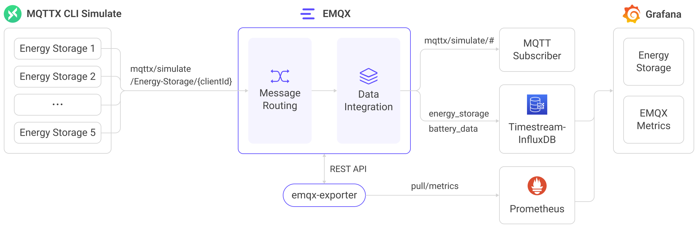

# Ingest MQTT Data into AWS Timestream for InfluxDB

[AWS Timestream for InfluxDB](https://docs.aws.amazon.com/timestream/latest/developerguide/timestream-for-influxdb.html) is a fully managed time series database service that enables you to run InfluxDB 2.x workloads on AWS with simplified data ingestion and real-time analytics. Starting from EMQX 6.1, EMQX adds native support for integrating with Amazon Timestream for InfluxDB in addition to existing support for InfluxDB Cloud, InfluxDB OSS, and InfluxDB Enterprise.

This page provides a comprehensive introduction to data integration between EMQX and Amazon Timestream for InfluxDB, along with practical instructions for configuring and validating the data flow.

## How It Works

Amazon Timestream for InfluxDB integration builds on EMQX’s real-time data processing and routing capabilities and combines them with Timestream’s fully managed, high-performance InfluxDB engine.

Through the built-in [rule engine](./rules.md) and the Timestream for InfluxDB Sink, EMQX transforms MQTT messages and writes them directly into a Timestream for InfluxDB DB instance without requiring custom application code.

The diagram below illustrates the typical data integration architecture between EMQX and Amazon Timestream for InfluxDB in an energy storage scenario.



The integration provides a scalable IoT data pipeline for real-time energy monitoring and analytics. EMQX serves as the IoT messaging layer, handling device connectivity and data routing, while Timestream for InfluxDB provides managed time series storage and query capabilities. The workflow is as follows:

1. **Message publication and reception**: Devices connect to EMQX over MQTT and publish telemetry (e.g., power usage, charge/discharge metrics). When EMQX receives these messages, it initiates the matching process within its rules engine.  
2. **Message processing**: The rule engine matches topics and applies transformations such as filtering, field extraction, or data enrichment, preparing the payload for ingestion into the target Timestream for InfluxDB bucket.
3. **Data ingestion into Timestream**: When a rule triggers the Amazon Timestream Sink, EMQX writes the data using InfluxDB Line Protocol. Templates define how MQTT fields map to measurements, tags, and fields.

Once stored in Timestream for InfluxDB, you can use Flux/InfluxQL queries, the InfluxUI, or tools like Grafana to visualize power metrics or integrate with business systems for monitoring and alerting.

## Features and Benefits

The Amazon Timestream for InfluxDB integration offers the following features and advantages:

- **Efficient Data Processing**: EMQX handles large-scale IoT connections and high-throughput MQTT data, while Timestream for InfluxDB provides fast ingestion and millisecond-level query performance for real-time analytics.
- **Message Transformation**: EMQX rules provide flexible filtering, extraction, and transformation of MQTT messages, allowing data to be formatted as either structured JSON mappings or custom InfluxDB Line Protocol templates before being written to Timestream for InfluxDB.
- **Managed Scalability**: EMQX supports horizontal clustering for massive IoT deployments, and Timestream for InfluxDB provides managed instance scaling, automated backups, and seamless version updates.
- **Rich Query Capabilities**: Timestream for InfluxDB supports the full InfluxDB 2.x query ecosystem, including Flux and InfluxQL, enabling powerful time-series analysis and integration with downstream tools.
- **Optimized Storage**: Timestream for InfluxDB uses AWS-managed storage with preconfigured IOPS and throughput tiers, delivering efficient, cost-optimized performance for time-series data workloads.

## Before You Start

This section outlines the preparations required before creating the data integration, including setting up your Amazon Timestream for InfluxDB environment and obtaining the necessary connection parameters.

### Prerequisites

Before configuring the integration, ensure you have:

- Familiarity with [InfluxDB line protocol](https://docs.influxdata.com/influxdb/v2.5/reference/syntax/line-protocol/), which EMQX uses when writing data to Timestream for InfluxDB.
- Understanding of EMQX data integration [rules](./rules.md) and how the rule engine transforms and routes MQTT messages.
- Basic knowledge of EMQX [data integration](./data-bridges.md), including how Sinks are configured and triggered.

### Prepare Amazon Timestream for InfluxDB

To enable EMQX to send data to your Timestream for InfluxDB instance, complete the following preparation steps in AWS.

::: tip Prerequisite

Ensure you have an AWS account with permissions to create and manage Timestream for InfluxDB resources.

:::

#### Create a Timestream for InfluxDB DB Instance

1. Sign in to the AWS Management Console and open the [Amazon Timestream for InfluxDB console](https://console.aws.amazon.com/timestream/).

2. In the upper-right corner, choose the AWS Region where you want to create the DB instance.

3. In the navigation pane, select **InfluxDB Databases**.

4. Click **Create InfluxDB database**.

5. In **Engine settings**, choose the InfluxDB engine version for your deployment.

   ::: tip Note

   The engine version affects how you later obtain the credentials required for the EMQX Connector. Be sure to select the version that matches your workload and integration needs.

   :::

   

   

6. Complete the remaining configuration steps (deployment settings, storage options, networking, logging, etc.) according to your requirements. For detailed explanations of each option, refer to: [Create an InfluxDB DB Instance](https://docs.aws.amazon.com/timestream/latest/developerguide/timestream-for-influx-getting-started-creating-db-instance.html#timestream-for-influx-getting-started-creating-db-instance-step2).

7. After the database is created, open the instance details page to obtain the AWS-generated endpoint, such as: `c5vasdqn0b-3ksj4dla5nfjhi.timestream-influxdb.us-east-1.on.aws`. You will need this endpoint when configuring the EMQX Connector.

#### Configure Network and Security Groups

To enable EMQX to connect to your Timestream for InfluxDB instance, configure the instance’s VPC security group to permit incoming TCP connections on port 8086 from the network where EMQX is deployed. Use the following settings:

- **Protocol**: TCP
- **Port**: 8086 (the InfluxDB API port used by Timestream for InfluxDB)
- **Source**: The IP address range or security group corresponding to your EMQX deployment environment.

If EMQX is deployed in the same VPC as the Timestream for InfluxDB instance, the connection can occur through private network routes defined within the VPC. If EMQX runs outside AWS, ensure that the security group permits connections from EMQX’s external network. Additionally, verify that no outbound firewall rules in your environment block HTTPS/TCP 8086 traffic from EMQX to the Timestream endpoint.

For more details about connection requirements and security considerations, see the AWS documentation: [Connecting to an Amazon Timestream for InfluxDB DB instance](https://docs.aws.amazon.com/timestream/latest/developerguide/timestream-for-influx-db-connecting.html).

#### Obtain InfluxDB Token, Organization, and Bucket

Token and credential retrieval depend on the **InfluxDB engine version** selected when creating your Timestream for InfluxDB instance.

##### Access Influx UI for InfluxDB v2 DB Instance

1. Open the **Influx UI** using the DB instance endpoint:

   ```
   https://<endpoint>:8086
   ```

   > If your DB instance is not publicly accessible, you must access the InfluxUI from a host within the same VPC (for example, via a bastion host or SSM port forwarding). See the [AWS documentation](https://docs.aws.amazon.com/timestream/latest/developerguide/timestream-for-influx-getting-started-creating-db-instance.html) for details.

2. Log in using the master user credentials created with the DB instance.

3. Generate or retrieve a personal access token with write permissions to the target bucket.

   This is the token EMQX uses to authenticate with Timestream for InfluxDB.

   ::: tip Note

   Newly created tokens are shown only once. Be sure to copy and save them.

   :::

4. Confirm the **Organization** and **Bucket** values configured for your instance. These values must match exactly when configuring EMQX.

Refer to the AWS official documentation for detailed instructions: [Access the InfluxDB UI](https://docs.aws.amazon.com/timestream/latest/developerguide/timestream-for-influx-getting-started-creating-db-instance.html#timestream-for-influx-getting-started-creating-db-instance-step-3).

##### Retrieve Authentication Token for **InfluxDB v3** DB Instances

InfluxDB v3 does not issue API tokens through the InfluxDB UI. Instead, AWS stores the authentication parameters, including the API token, in **AWS Secrets Manager** when the DB instance is created.

1. Open the DB cluster details page in the Timestream console. Locate the field labeled: **Authentication properties Secret manager ARN**.

   

   This ARN points to the Secrets Manager entry that contains the credentials EMQX will use.

2. Go to **AWS Secrets Manager** -> **Secrets** and search for the secret name shown (e.g., `READONLY-InfluxDB-auth-parameters-<cluster-id>`).

3. Open the secret and switch to the **Plaintext** view to retrieve the secret contents.

   

### Required Connection Parameters

When configuring the Amazon Timestream for InfluxDB Connector in EMQX, provide the following parameters according to the InfluxDB engine version used by your Timestream instance:

| Parameter         | Description                                                  |
| ----------------- | ------------------------------------------------------------ |
| **Endpoint**      | The AWS-generated endpoint of your InfluxDB instance, for example: `xxxxxxx-yyyyyyyy.timestream-influxdb.<region>.on.aws` |
| **Port**          | Always **8086**, the InfluxDB API endpoint port.             |
| **Database Name** | (**InfluxDB v3**) The database name specified when creating the v3 DB instance. |
| **Organization**  | (**InfluxDB v2**) The Organization name configured in the InfluxDB UI. |
| **Bucket**        | (**InfluxDB v2**) The Bucket into which EMQX writes telemetry data. |
| **Token**         | The authentication token used by EMQX:<br />**InfluxDB v2:** Personal access token created in the InfluxDB UI<br />**InfluxDB v3:** Token retrieved from AWS Secrets Manager (`token` field) |

## Create a Connector

This section demonstrates how to create a Connector to connect the Sink to the AWS Timestream for the InfluxDB DB instance.

1. Enter the EMQX Dashboard and click **Integration** -> **Connectors**.
2. Click **Create** in the top right corner of the page.
3. On the **Create Connector** page, select **Amazon Timestream** from the **Data Persistence** type, and click **Next**.
4. In the **Configuration** step, configure the following fields:
   - **Connector Name**: A name starting with a letter or number; letters, numbers, hyphens, and underscores are allowed.
      Example: `my_timestream`.
   - **Server Host**: Enter the endpoint and port of your Timestream for InfluxDB instance, for example: `<instance-endpoint>:8086`.
   - **Version of InfluxDB**: Select the version that matches the configuration of your Timestream for InfluxDB instance:
     - `v2` (default): Configure the **Token**, **Organization**, and **Bucket**: Provide the personal access token, organization name, and bucket name collected earlier in [Obtain InfluxDB Token, Organization, and Bucket](#obtain-influxdb-token-organization-and-bucket). These values must match your InfluxDB configuration exactly.
     
     - `v3`: Configure the **Database Name** and **Token**: Enter the database name you provided when creating the DB instance. Enter the secret value you retrieved in [Retrieve Secret Value for InfluxDB v3 DB Instance](#retrieve-authentication-token-for-influxdb-v3-db-instances).
     
   - **TLS** (optional): Enable TLS if your Timestream for InfluxDB endpoint requires HTTPS (recommended). For detailed information on TLS connection options, see [TLS for External Resource Access](../network/overview.md#enabling-tls-for-external-resource-access).
5. Before clicking **Create**, you can click **Test Connectivity** to test if the connector can connect to the Timestream InfluxDB DB instance.
6. Click the **Create** button at the bottom to complete the creation of the connector. In the pop-up dialog, you can click **Back to Connector List** or click **Create Rule** to continue creating rules and Sink to specify the data to be forwarded to Timestream for InfluxDB. For detailed steps, see [Create a Rule with Amazon Timestream Sink](#create-a-rule-with-amazon-timestream-sink).

## Create a Rule with Amazon Timestream Sink

This section demonstrates how to create a rule in EMQX to process messages from the source MQTT topic `t/#`  and send the processed results through a configured Sink to AWS Timestream for InfluxDB. 

### Define Rule SQL

1. Go to EMQX Dashboard, and click **Integration** -> **Rules** from the left navigation menu.

2. Click **Create** on the top right corner of the page.

3. On the **Create Rule** page, enter `my_rule` as the rule ID.

4. In the **SQL Editor**, configure the SQL statement. To forward all messages under topic `t/#`, use the SQL syntax below. 

   ```sql
   SELECT
     *
   FROM
     "t/#"
   ```

   ::: tip

   If you write custom SQL, ensure the fields in the `SELECT` clause include all variables referenced later in the Sink’s data format.

   :::

   > If you are a beginner user, click **SQL Examples** and **Enable Test** to learn and test the SQL rule. 

### Append an Action (Sink) to the Rule

After you define the rule SQL, you need to create an action with Amazon Timestream Sink that the rule will trigger. With this action, EMQX sends the data processed by the rule to Timestream for InfluxDB. 

#### Configure Basic Settings

1. On the **Create Rule** page, click + **Add Action** to define the output of the rule. 

2. From the **Type of Action** dropdown, select `Amazon Timestream`.

   In the **Action** dropdown, keep the default `Create Action`.

   > You may select an existing Sink from the **Action** instead; this example creates a new one.

3. Enter a **Name** and an optional **Description**.

4. From the **Connector** dropdown, select `my_timestream` created before. You can also create a new Connector if needed. Refer to: [Create a Connector](#create-a-connector).

5. Specify the **Time Precision** (default: `millisecond`). 

#### Configure Data Format

Select **Data Format** as `JSON` or `Line Protocol` for how EMQX should serialize data before writing it to Timestream for InfluxDB instance.

##### JSON Format

Use **JSON** format when you prefer structured configuration fields. You need to define structured fields that EMQX automatically converts into InfluxDB line protocol.

- **Measurement**: Specifies the measurement name, for example, `sensor_data`.

  It also supports placeholders, for example:

  - `${topic}`
  - `${payload.measurement}`

- **Timestamp**: (optional) A numeric or placeholder timestamp. If omitted, EMQX uses server time. 

  Examples:

  - `${timestamp}`
  - `${payload.ts}`

- **Fields**: Each field is a key–value pair. All key values can be variables or placeholders, and you can also follow the [InfluxDB line protocol](https://docs.influxdata.com/influxdb/v2.5/reference/syntax/line-protocol/) to set them.

  Examples:

  | Key   | Value               |
  | ----- | ------------------- |
  | temp  | `${payload.temp}`   |
  | hum   | `${payload.hum}`    |
  | count | `${payload.count}i` |

  > **Batch Setting:**
  > For large field lists (hundreds of fields), you may import them via CSV; refer to [Batch Setting](#batch-setting).

- **Tags**: Tags must always be strings and are used for indexing or fast queries.

  Examples:

  | Key    | Value         |
  | ------ | ------------- |
  | device | `${clientid}` |
  | region | `us-east`     |

##### Line Protocol

Use Line Protocol when you want full control over the final write syntax. Enter a template in the **Write Syntax** box, following the [InfluxDB line protocol](https://docs.influxdata.com/influxdb/v2.3/reference/syntax/line-protocol/) syntax:

```
<measurement>[,<tag-key>=<tag-value>...] <field-key>=<field-value>[,<field-key>=<field-value>...] <timestamp>
```

 For example:

```bash
sensor_data,device=${clientid},region=us-east temp=${payload.temp},hum=${payload.hum},precip=${payload.precip}i ${timestamp}
```

**In this example:**

- `sensor_data` represents the measurement.
- `device` and `region` represent tags.
- `temp`, `hum`, and `precip` represent fields.
- `${timestamp}` represents the timestamp and is replaced at runtime.

::: tip

- To write a signed integer type value to InfluxDB 1.x or 2.x, add `i` as the type identifier after the placeholder, for example, `${payload.int}i`. See also [InfluxDB 1.8 write integer value](https://docs.influxdata.com/influxdb/v1.8/write_protocols/line_protocol_reference/#write-the-field-value-1-as-an-integer-to-influxdb).
- To write an unsigned integer type value to InfluxDB 1.x or 2.x, add `u` as the type identifier after the placeholder, for example, `${payload.int}u`. See also [InfluxDB 1.8 write integer value](https://docs.influxdata.com/influxdb/v1.8/write_protocols/line_protocol_reference/#write-the-field-value-1-as-an-integer-to-influxdb).

:::

##### Batch Setting

In InfluxDB, a data entry typically includes hundreds of fields, making the setup of data formats a challenging task. To address this, EMQX offers a feature for batch setting of fields.

When setting data formats via JSON, you can use the batch setting feature to import key-value pairs of fields from a CSV file.

1. Click the **Batch Setting** button in the **Fields** table to open the **Import Batch Setting** popup.

2. Follow the instructions to first download the batch setting template file, then fill in the key-value pairs of Fields in the template file. The default template file content is as follows:

   | Field  | Value              | Remarks (Optional)                                           |
   | ------ | ------------------ | ------------------------------------------------------------ |
   | temp   | ${payload.temp}    |                                                              |
   | hum    | ${payload.hum}     |                                                              |
   | precip | ${payload.precip}i | Append an i to the field value to tell InfluxDB to store the number as an integer. |

   - **Field**: Field key, supports constants or ${var} format placeholders.
   - **Value**: Field value, supports constants or placeholders, can append type identifiers according to the line protocol.
   - **Remarks**: Used only for notes within the CSV file, cannot be imported into EMQX.

   Note that the data in the CSV file for batch setting should not exceed 2048 rows.

3. Save the filled template file and upload it to the **Import Batch Setting** popup, then click **Import** to complete the batch setting.

4. After importing, you can further adjust the key-value pairs of fields in the **Fields** setting table.

#### Finalize Action Creation

1. Configure the **Fallback Actions** and **Advanced Settings** (optional):
   - **Fallback Actions**: If you want to improve reliability in case of message delivery failure, you can define one or more fallback actions. These actions will be triggered if the primary Sink fails to process a message. See [Fallback Actions](./data-bridges.md#fallback-actions) for more details.
   - **Advanced settings**:  See [Advanced Configurations](#advanced-configurations).
2. Click **Test Connectivity** at the bottom of the **Add Action** pane to test if the Sink can be connected to the Timestream for InfluxDB instance.
3. Click **Create** to complete the action creation. Once saved, the Sink appears under **Action Outputs** on the rule page.

### Finalize Rule Creation

On the **Create Rule** page, verify the configured information. Click the **Create** button to generate the rule.

Now you have successfully created the rule and you can see the new rule appear on the **Rule** page. Click the **Actions(Sink)** tab, you can see the new Amazon Timestream Sink.

You can also click **Integration** -> **Flow Designer** to view the topology. It can be seen that the messages under topic `t/#`  are sent and saved to Amazon Timestream after parsing by the rule  `my_rule`.

## Test the Rule

After creating the integration, you can verify that EMQX successfully forwards MQTT messages to your Timestream for InfluxDB instance.

### Publish a Test MQTT Message

Use [MQTTX](https://mqttx.app/)  (or any MQTT client) to publish a message to the topic `t/1`, which matches the rule:

```bash
mqttx pub -i emqx_c -t t/1 -m '{ "temp": "36.5", "hum": "70", "precip": "12" }'
```

This message should trigger the rule and be sent to the configured Timestream for InfluxDB Sink.

### Verify Sink Delivery Status in EMQX

In EMQX Dashboard, click the rule name to enter the rule details page. You should expect one incoming message and one successfully delivered outgoing message.

### Verify Data in Timestream for InfluxDB

#### For InfluxDB v2 instances

Use the InfluxDB UI:

1. Open the InfluxDB UI `https://<endpoint>:8086`.

2. Navigate to **Data Explorer**.

3. Select the **Bucket** configured in the EMQX Sink.

4. Query or browse recent data points. 

   You should see a new point containing the following fields in the selected measurement.

   - `temp`
   - `hum`
   - `precip`

#### For InfluxDB v3 Instances

InfluxDB v3 does not use a UI for data browsing. Use the InfluxDB v3 SQL Query API to verify the ingested data.

Example request:

```bash
curl -G -k "https://<endpoint>:8181/api/v3/query_sql" \
  --header "Authorization: Bearer <your-token>" \
  --data-urlencode "db=<your-database-name>" \
  --data-urlencode "q=SELECT * FROM sensor_data" \
  --data-urlencode "format=jsonl"
```

Expected output contains:

```json
{"temp":36.5,"hum":70,"precip":12,"device":"myclient","region":"us-east", ... }
```

A successful response returns the inserted data in **JSONL** format. 

Refer to the InfluxDB [API documentation](https://docs.influxdata.com/influxdb3/core/api/v3/#tag/Quick-start) for more query examples.

## Advanced Configurations

This section delves deeper into the advanced configuration options available for the Amazon Timestream Connector and Sink. When configuring the Connector and Sink in the Dashboard, navigate to **Advanced Settings** to tailor the following parameters to meet your specific needs.

| **Fields**            | **Descriptions**                                             | **Recommended Value** |
| --------------------- | ------------------------------------------------------------ | --------------------- |
| Start Timeout         | The maximum time (in seconds) the Connector waits for the target resource (such as a Timestream for InfluxDB instance) to become healthy during startup. If the resource is not ready within this time, the creation request fails. | `5`                   |
| Buffer Pool Size      | The number of buffer worker processes used to handle outgoing data before it is sent to Timestream for InfluxDB. Increasing this value can improve throughput under high write load. For ingress-only scenarios, this can be set to `0`. | `4`                   |
| Request TTL           | The maximum time (in seconds) a write request can remain in the buffer. If the request is not successfully sent or acknowledged within this period, it is discarded as expired. | `45`                  |
| Health Check Interval | The interval (in seconds) at which the Sink checks the connectivity and health of the Timestream for InfluxDB endpoint. | `15`                  |
| Max Buffer Queue Size | The maximum amount of data (in bytes) that each buffer worker can hold while waiting to be sent. Increase this value if bursts of data cause temporary backpressure. | `1`                   |
| Max Batch Size        | The maximum number of records sent in a single write request. Larger batch sizes improve throughput but may increase latency. Setting this to `1` disables batching and sends records individually. | `100`                 |
| Query Mode            | Controls whether write operations are performed asynchronously or synchronously. In `Async` mode, writing to Timestream for InfluxDB does not block the MQTT message publish process. However, this might result in clients receiving messages ahead of their arrival in Timestream for InfluxDB. | `Async`               |
| Inflight Window       | The maximum number of write requests that can be in progress simultaneously. When **Query Mode** is set to `Async`, this setting controls concurrency. To guarantee strict ordering for messages from the same MQTT client, set this value to `1`. | `100`                 |
