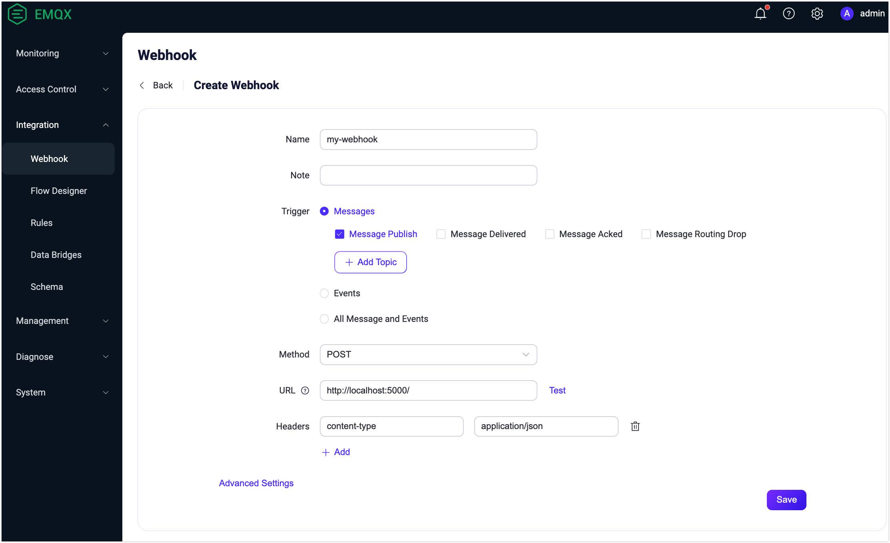

# Webhook

Webhook provides a way to integrate EMQX client messages and events with external HTTP servers. Compared to using rule engines and data bridges, Webhook offers a more straightforward method, significantly lowering the barrier to entry, and quickly enabling integration between EMQX and external systems.

This page comprehensively introduces information related to Webhook, along with practical usage instructions.

## How It Works

When a client publishes a message to a specific topic or performs certain actions, it triggers the Webhook. Webhook is compatible with all messages and events supported by the rule engine.

You can configure Webhook to be triggered in the following scenarios. For the request content of each event, refer to [SQL Data Source and Fields](./rule-sql-events-and-fields.md).


### Messages

When a publisher publishes a message, or the message status changes, including:

- Message published
- Message delivered
- Message acknowledged
- Message forwarded and dropped
- Message delivery dropped

Multiple topic filters can be set for messages; only the matching messages will trigger the Webhook.

### Events

When a client performs specific operations, or the status changes, including:

- Connection established
- Connection terminated
- Connection confirmed
- Authorization result
- Session subscription completed
- Session unsubscribed

## Features

Using EMQX's Webhook integration can bring the following advantages to your business:

- **Pass Data to More Downstream Systems**: Webhook can easily integrate MQTT data into more external systems like analytics platforms, cloud services, etc., enabling multi-system data distribution.
- **Real-Time Response and Trigger Business Processes**: Through Webhook, external systems can receive MQTT data in real-time and trigger business processes, enabling quick responses. For example, receiving alarm data and triggering business workflows.
- **Customize Data Processing**: External systems can further process the received data as needed, implementing more complex business logic, without being limited by EMQX's functionalities.
- **Loosely Coupled Integration Method**: Webhook uses a simple HTTP interface, providing a loosely coupled way of system integration.

In summary, Webhook integration provides real-time, flexible, and customized data integration capabilities, satisfying the need for flexible and rich application development.

## Get Started

This section takes macOS as an example to introduce how to configure and use Webhook.

### Create HTTP Service

Here we quickly create an HTTP server using Python, listening on the local port 8082, and print the URL when receiving a Webhook request. In actual applications, please replace it with your business server:

First, we use Python to build a simple HTTP service to receive `POST /` requests. The service prints the request content and returns 200 OK:

```python
from flask import Flask, json, request

api = Flask(__name__)

@api.route('/', methods=['POST'])
def print_messages():
  reply= {"result": "ok", "message": "success"}
  print("got post request: ", request.get_data())
  return json.dumps(reply), 200

if __name__ == '__main__':
  api.run()
```

Save the above code as `http_server.py` file, and run the following commands in the directory where the file is located:

```shell
# Install flask dependency
pip install flask

# Start Service
python3 http_server.py
```

### Create Webhook

1. Go to Dashboard **Integration** -> **Webhook** page.
2. Click the **Create** button at the top-right corner of the page.
3. Enter Webhook name and notes, which should be a combination of uppercase and lowercase English letters and numbers. Here you can enter `my_webhook`.
4. Select the trigger according to your needs, in this case, select **All messages and events**. For other options, refer to [How it Works](#how-it-works).
5. Select the request method as POST, URL as `http://localhost:5000`. You can test if the connection is configured correctly by clicking the **Test** button next to the URL input box, and use the default values for the rest.
6. Click the **Save** button at the bottom to complete the rule creation.



You have now completed the Webhook creation.

### Test Webhook

Use MQTTX CLI to publish a message to the `t/1` topic:

```bash
mqttx pub -i emqx_c -t t/1 -m '{ "msg": "Hello Webhook" }'
```

This operation will sequentially trigger the following events:

- Connection established
- Connection confirmed
- Authorization checked and completed
- Message published
- Connection terminated

If the `t/1` topic has no subscribers, it will also trigger the **message forwarded and dropped** event after the message is published.

Check whether the corresponding events and message data have been forwarded to the HTTP service. You should see the following data:

```shell
got post request:  b'{"username":"undefined","timestamp":1694681417717,"sockname":"127.0.0.1:1883","receive_maximum":32,"proto_ver":5,"proto_name":"MQTT","peername":"127.0.0.1:61003","node":"emqx@127.0.0.1","mountpoint":"undefined","metadata":{"rule_id":"my-webhook_WH_D"},"keepalive":30,"is_bridge":false,"expiry_interval":0,"event":"client.connected","connected_at":1694681417714,"conn_props":{"User-Property":{},"Request-Problem-Information":1},"clientid":"emqx_c","clean_start":true}'
127.0.0.1 - - [14/Sep/2023 16:50:17] "POST / HTTP/1.1" 200 -
got post request:  b'{"username":"undefined","timestamp":1694681417719,"sockname":"127.0.0.1:1883","reason_code":"success","proto_ver":5,"proto_name":"MQTT","peername":"127.0.0.1:61003","node":"emqx@127.0.0.1","metadata":{"rule_id":"my-webhook_WH_D"},"keepalive":30,"expiry_interval":0,"event":"client.connack","conn_props":{"User-Property":{},"Request-Problem-Information":1},"clientid":"emqx_c","clean_start":true}'
127.0.0.1 - - [14/Sep/2023 16:50:17] "POST / HTTP/1.1" 200 -
got post request:  b'{"username":"undefined","topic":"t/1","timestamp":1694681417728,"result":"allow","peerhost":"127.0.0.1","node":"emqx@127.0.0.1","metadata":{"rule_id":"my-webhook_WH_D"},"event":"client.check_authz_complete","clientid":"emqx_c","authz_source":"file","action":"publish"}'
127.0.0.1 - - [14/Sep/2023 16:50:17] "POST / HTTP/1.1" 200 -
got post request:  b'{"username":"undefined","topic":"t/1","timestamp":1694681417728,"qos":0,"publish_received_at":1694681417728,"pub_props":{"User-Property":{}},"peerhost":"127.0.0.1","payload":"{ \\"msg\\": \\"Hello Webhook\\" }","node":"emqx@127.0.0.1","metadata":{"rule_id":"my-webhook_WH_D"},"id":"0006054DC3E940F8F445000038A60002","flags":{"retain":false,"dup":false},"event":"message.publish","clientid":"emqx_c"}'
127.0.0.1 - - [14/Sep/2023 16:50:17] "POST / HTTP/1.1" 200 -
got post request:  b'{"username":"undefined","topic":"t/1","timestamp":1694681417729,"reason":"no_subscribers","qos":0,"publish_received_at":1694681417728,"pub_props":{"User-Property":{}},"peerhost":"127.0.0.1","payload":"{ \\"msg\\": \\"Hello Webhook\\" }","node":"emqx@127.0.0.1","metadata":{"rule_id":"my-webhook_WH_D"},"id":"0006054DC3E940F8F445000038A60002","flags":{"retain":false,"dup":false},"event":"message.dropped","clientid":"emqx_c"}'
127.0.0.1 - - [14/Sep/2023 16:50:17] "POST / HTTP/1.1" 200 -
got post request:  b'{"username":"undefined","timestamp":1694681417729,"sockname":"127.0.0.1:1883","reason":"normal","proto_ver":5,"proto_name":"MQTT","peername":"127.0.0.1:61003","node":"emqx@127.0.0.1","metadata":{"rule_id":"my-webhook_WH_D"},"event":"client.disconnected","disconnected_at":1694681417729,"disconn_props":{"User-Property":{}},"clientid":"emqx_c"}'
127.0.0.1 - - [14/Sep/2023 16:50:17] "POST / HTTP/1.1" 200 -
```
