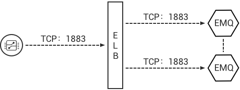
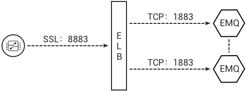

# Deployment

EMQ Cluster can be deployed as an IoT Hub on an enterprise's private cloud, or on public clouds such as AWS, Azure and QingCloud.

## Load Balancer (LB)

The Load Balancer (LB) distributes MQTT connections and traffic from devices across the EMQ clusters. LB enhances the HA of the clusters, balances the loads among the cluster nodes and makes the dynamic expansion possible.

It is recommended that SSL connections are terminated by a LB. The links between devices and the LB are secured by SSL, while the links between the LB and EMQ cluster nodes are plain TCP connections. By this setup, a single EMQ cluster can serve a million devices.

LB products of public cloud providers:

| Cloud provider                       | SSL Termination | LB Product DOC/URL                                                                                         |
| ------------------------------------ | --------------- | ---------------------------------------------------------------------------------------------------------- |
| [ QingCloud ](https://qingcloud.com) | Y               | [ https://docs.qingcloud.com/guide/loadbalancer.html ](https://docs.qingcloud.com/guide/loadbalancer.html) |
| [ AWS ](https://aws.amazon.com)      | Y               | [ https://aws.amazon.com/cn/elasticloadbalancing/ ](https://aws.amazon.com/cn/elasticloadbalancing/)       |
| [ aliyun ](https://www.aliyun.com)   | N               | [ https://www.aliyun.com/product/slb ](https://www.aliyun.com/product/slb)                                 |

LBs for Private Cloud:

| Open-Source LB                       | SSL Termination | DOC/URL                                                                                                          |
| ------------------------------------ | --------------- | ---------------------------------------------------------------------------------------------------------------- |
| [ HAProxy ](https://www.haproxy.org) | Y               | [ https://www.haproxy.com/solutions/load-balancing.html ](https://www.haproxy.com/solutions/load-balancing.html) |
| [ NGINX ](https://www.nginx.com)     | PLUS Edition    | [ https://www.nginx.com/solutions/load-balancing/ ](https://www.nginx.com/solutions/load-balancing/)             |

Recommend AWS with ELB for a public cloud deployment, and HAProxy for a private cloud deployment.

## EMQ Cluster

EMQ cluster nodes are deployed behind LB. It is suggested that the nodes are deployed on VPCs or on a private network. Cloud provider, such as AWS, Azure or QingCloud, usually provides VPC network.

EMQ Provides the MQTT service on following TCP ports by default:

| 1883 | MQTT               |
| ---- | ------------------ |
| 8883 | MQTT/SSL           |
| 8083 | MQTT/WebSocket     |
| 8084 | MQTT/WebSocket/SSL |

Firewall should make the relevant ports accessible for public.

Following ports are opened for cluster internal communication:

| 4369 | Node discovery port |
| ---- | ------------------- |
| 6369 | Cluster channel     |

If deployed between nodes, firewalls should be configured that the above ports are inter-accessible between the nodes.

## Deploying on QingCloud

1. Create VPC network.
2. Create a 'private network' for EMQ cluster inside the VPC network, e.g. 192.168.0.0/24
3. Create 2 EMQ hosts inside the private network, like:

| emq1 | 192.168.0.2 |
| ---- | ----------- |
| emq2 | 192.168.0.3 |

4. Install and cluster EMQ on these two hosts. Please refer to the sections of cluster installation for details.
5. Create LB and assign the public IP address.
6. Create MQTT TCP listener:

Or create SSL listener and terminate the SSL connections on LB:

7. Connect the MQTT clients to the LB using the public IP address and test the deployment.

## Deploying on AWS

1. Create VPC network.
2. Create a 'private network' for EMQ cluster inside the VPC network, e.g. 192.168.0.0/24
3. Create 2 EMQ hosts inside the private network, like:

   | emq1 | 192.168.0.2 |
   | ---- | ----------- |
   | emq2 | 192.168.0.3 |

4. Open the TCP ports for MQTT services (e.g. 1883,8883) on the security group.
5. Install and cluster EMQ on these two hosts. Please refer to the sections of cluster installation for details.
6. Create ELB (Classic Load Balancer), assign the VPC network, and assign the public IP address.
7. Create MQTT TCP listener on the ELB:

Or create SSL listener and terminate the SSL connections on the ELB:

1. Connect the MQTT clients to the ELB using the public IP address and test the deployment.

## Deploying on private network

### Direct connection of EMQ cluster

EMQ cluster should be DNS-resolvable and the clients access the cluster via domain name or IP list:

1. Deploy EMQ cluster. Please refer to the sections of 'Installation' and 'EMQ nodes clustering' for details.
2. Enable the access to the MQTT ports on the firewall (e.g. 1883, 8883).
3. Client devices access the EMQ cluster via domain name or IP list.

::: tip Tip
This kind of deployment is NOT recommended.
:::

### HAProxy -> EMQ Cluster

HAProxy serves as a LB for EMQ cluster and terminates the SSL connections:

1.  Create EMQ Cluster nodes like following:

    | node | IP          |
    | ---- | ----------- |
    | emq1 | 192.168.0.2 |
    | emq2 | 192.168.0.3 |

2.  Modify the /etc/haproxy/haproxy.cfg accordingly. An example:

        listen mqtt-ssl
        bind \*:8883 ssl crt /etc/ssl/emqttd/emq.pem no-sslv3
        mode tcp
        maxconn 50000
        timeout client 600s
        default_backend emq_cluster

        backend emq_cluster
        mode tcp
        balance source
        timeout server 50s
        timeout check 5000
        server emq1 192.168.0.2:1883 check inter 10000 fall 2 rise 5 weight 1
        server emq2 192.168.0.3:1883 check inter 10000 fall 2 rise 5 weight 1
        source 0.0.0.0 usesrc clientip

### NGINX Plus -> EMQ Cluster

NGINX Plus serves as a LB for EMQ cluster and terminates the SSL connections:

1.  Install the NGINX Plus. An instruction for Ubuntu: [ https://cs.nginx.com/repo_setup ](https://cs.nginx.com/repo_setup)
2.  Create EMQ cluster nodes like following:

    | node | IP          |
    | ---- | ----------- |
    | emq1 | 192.168.0.2 |
    | emq2 | 192.168.0.3 |

3.  Modify the /etc/nginx/nginx.conf. An example:

        stream { # Example configuration for TCP load balancing

          upstream stream_backend {
              zone tcp_servers 64k;
              hash $remote_addr;
              server 192.168.0.2:1883 max_fails=2 fail_timeout=30s;
              server 192.168.0.3:1883 max_fails=2 fail_timeout=30s;
          }

          server {
              listen 8883 ssl;
              status_zone tcp_server;
              proxy_pass stream_backend;
              proxy_buffer_size 4k;
              ssl_handshake_timeout 15s;
              ssl_certificate     /etc/emqttd/certs/cert.pem;
              ssl_certificate_key /etc/emqttd/certs/key.pem;
          }

        }
