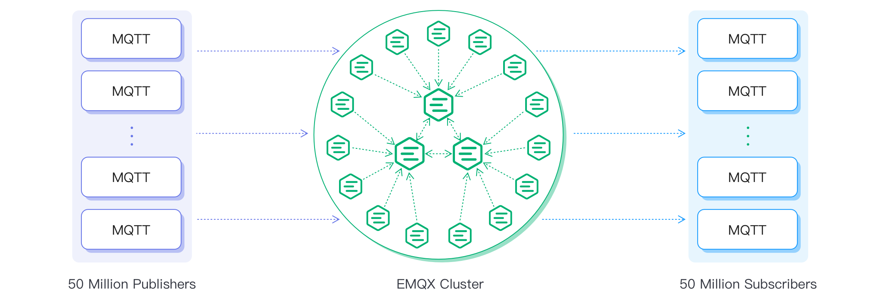

# Cluster

Besides working with a single EMQX node, EMQX also provides the cluster feature for high availability, better scalability, data security, and centralized management. The basic function of a distributed EMQX cluster is to forward and publish messages to different subscribers, as shown below.

## Reasons for Clustering

EMQX clusters bring the users with the following benefits.

1. **Scalability**: EMQX can be easily scaled horizontally by adding more nodes to the cluster, allowing it to handle an increasing number of MQTT messages and clients.
2. **High Availability**: Running in a cluster provides high availability, as the cluster can continue to function even if one or more nodes fail. EMQX uses a distributed architecture that ensures no single point of failure.
3. **Load Balancing**: EMQX nodes in the cluster can be configured to distribute the load of handling MQTT messages, which helps to avoid overload of a single node and allows for better use of available resources.
4. **Centralized Management**: EMQX can be managed centrally, as all nodes in the cluster can be monitored and controlled from a single management console. This makes it easy to manage a large number of devices and messages.

Overall, EMQX cluster can help improve the scalability, availability, reliability and management of IoT messaging systems, which is why clustering is recommended for larger or mission-critical applications.

The basic function of a distributed EMQX cluster is to forward and publish messages to different subscribers, as shown below.

EMQX 5.0 adopts a new [Mria cluster architecture](./mria-introduction.md). With this Mria architecture, one EMQX node can support up to 5 million MQTT connections, and the EMQX cluster can support up to 100 million concurrent MQTT connections.





## Key Features

EMQX adds an abstraction layer with the [Ekka](https://github.com/emqx/ekka) library on top of distributed Erlang, enabling features like auto discovery of EMQX nodes, auto cluster, network partition, autoheal, and autoclean.

### Node Discovery and Auto Clustering

EMQX supports several node discovery strategies:

| Strategy | Description                             |
| -------- | --------------------------------------- |
| `manual` | Manually create a cluster with commands |
| `static` | Autocluster through static node list    |
| `mcast`* | Create a cluster through UDP multicast  |
| `DNS`    | Autocluster through DNS A record        |
| `etcd`   | Autocluster through etcd                |
| `k8s`    | Autocluster provided by Kubernetes      |

[^*]: The multicast discovery strategy has been deprecated and will be removed in future releases.

### Network Partition Autoheal

Network partition autoheal is a feature of EMQX that allows the broker to recover automatically from network partitions without requiring any manual intervention, suitable for mission-critical applications where downtime is not acceptable.

To enable EMQX network partition autoheal, you can work with `cluster.autoheal` configuration item in `emqx.conf`:

```bash
cluster.autoheal = on
```

Once enabled, EMQX will continuously monitor the connectivity between nodes in the cluster. If a network partition is detected, EMQX will isolate the affected nodes and continue to operate with the remaining nodes. Once the network partition is resolved, the broker will automatically re-integrate the isolated nodes into the cluster.

### Cluster Node Autoclean

Cluster node autoclean feature will automatically remove the disconnected nodes from the cluster after the configured time interval. This feature helps to ensure that the cluster is running efficiently and prevent performance degradation over time.

This feature is enabled by default, you can customize the waiting period before removing the disconnected nodes. Default: `5m`

```bash
cluster.autoclean = 5m
```

### Session Across Nodes

The session across nodes feature ensures that the client sessions will not be lost even during client's disconnection. To use this feature, you should first set `clean session` to `false` on the client side, then EMQX will keep the previous session data associated with the Client ID when the client disconnects. If this client reconnects, EMQX will resume the previous sessions, deliver any messages that were queued during the client's disconnection, and maintain the client's subscriptions.

## Network and Hardware Specifications

Below is the network requirements and hardware specifications recommend to run EMQX clusters.

**Network**

Network latency: < 10 ms. The cluster will not be available if the latency is higher than 100 ms. 

The core nodes should be under the same private network. In Mria+RLOG mode, it is also recommended to deploy the replicant nodes in the same private network. 

**CPU and Memory**

You can use the [Server Estimate](https://www.emqx.com/en/server-estimate) to calculate the CPU and memory resources needed under various connections and Pub&Sub TPS. It is recommended to configure a higher memory of the Core nodes. 
