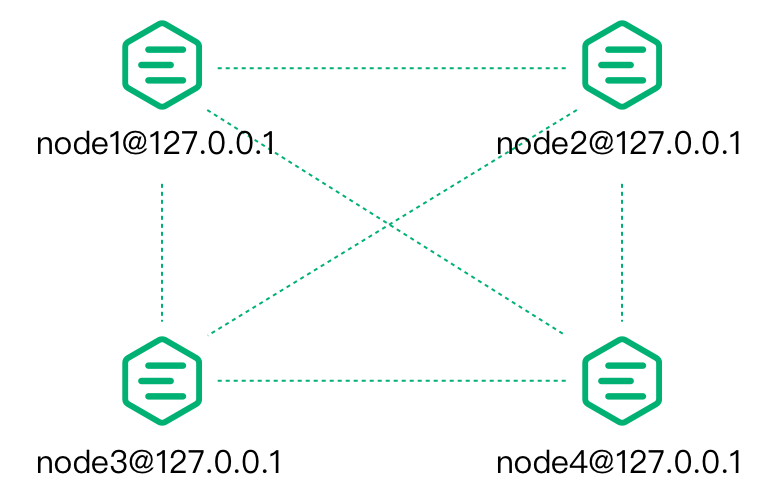

# Introduction

EMQX is powered by Erlang/OTP, the highly scalable distributed platform.

Before we start talking about EMQX clustering, it's necessary to familiarise
ourselves with Erlang/OTP.

## Erlang/OTP

Erlang/OTP is originally a programming language platform designed by Ericsson
for the development of telecommunication equipment systems.

Telecommunication equipment (routers, access gateways) is typically a distributed system that connects the main control board and multiple business boards through
the backplane.

## Distributed Erlang

The distributed programs of the Erlang/OTP platform are composed of distributed
interconnected Erlang runtime systems.
Each Erlang runtime system is called a node.
Nodes are interconnected with TCP to form a network (or a cluster in this context).

Erlang nodes are identified by a unique node name, which consists of two parts
separated by `@`:

```bash
<name>@<ip-address-or-FQDN>
```

Communication between nodes is addressed by node name.
For example, start four shell terminals locally and then use the `-name` parameter to start four Erlang nodes, respectively:

```bash
erl -name node1@127.0.0.1 -setcookie my_nodes
erl -name node2@127.0.0.1 -setcookie my_nodes
erl -name node3@127.0.0.1 -setcookie my_nodes
erl -name node4@127.0.0.1 -setcookie my_nodes
```

The Erlang expression `node().` can be used to view the name of this node,
and `nodes().` can be used to view other nodes that have established a connection
with the current node.

We now go to the console of `node1@127.0.0.1` and check the current node name and
connected nodes:

```bash
(node1@127.0.0.1) 4> node().
'node1@127.0.0.1'

(node1@127.0.0.1) 4> nodes().
[]
```

Then we let `node1` initiate connections with other nodes:

```bash
(node1@127.0.0.1) 1> net_kernel:connect_node('node2@127.0.0.1').
true
(node1@127.0.0.1) 2> net_kernel:connect_node('node3@127.0.0.1').
true
(node1@127.0.0.1) 3> net_kernel:connect_node('node4@127.0.0.1').
true
```

Now we can check other nodes that are already connected to node1:

```bash
(node1@127.0.0.1) 4> nodes().
['node2@127.0.0.1','node3@127.0.0.1','node4@127.0.0.1']
```

We can see that `node2`, `node3`, and `node4` have established a distributed
connection with `node1`, and these four nodes form a cluster.

Note that whenever a new node joins the cluster, it will establish a TCP
connection with all the nodes in the cluster.

At this point, the four nodes have completed the mesh structure shown in the following figure:




## EMQX Broker Distributed cluster design

The basic function of EMQX Broker distribution is to forward and publish messages to
subscribers on each node, as shown in the following figure.


To achieve this, EMQX Broker maintains several data structures: subscription
tables, routing tables, and topic trees.
These tables are stored in the [embedded database](./db.md).

### Subscription Table: Topics-Subscribers

When an MQTT client subscribes to a topic, EMQX Broker maintains a **Subscription Table**
for the Topic-\> Subscriber mapping. The subscription table only exists on
the EMQX Broker node where the subscriber is located, for example:

```bash
node1:

    topic1 -> client1, client2
    topic2 -> client3

node2:

    topic1 -> client4
```

### Route Table: Topic-Node

All nodes in the same cluster will **copy** a topic-to-> node mapping table, for example:

```bash
topic1 -> node1, node2
topic2 -> node3
topic3 -> node2, node4
```

### Topic tree: topic matching with wildcards

In addition to the routing table, each node in the EMQX Broker cluster also maintains a
backup of the **Topic Trie.**

The following topic-subscription relationship is an example:

| Client  | Node  | Subscribed topic |
|---------|-------|------------------|
| client1 | node1 | t/+/x, t/+/y     |
| client2 | node2 | t/#              |
| client3 | node3 | t/+/x, t/a       |

When all subscriptions are completed, EMQX Broker maintains the following Topic Trie and Route Table:


### Message Distribution Process

When an MQTT client publishes a message, the node where it is located retrieves the route table
and forwards the message to the relevant node according to the message topic,
and then the relevant node retrieves the local subscription table and sends the message to the
relevant subscriber.

For example, when `client1` publishes a message to the topic `t/a`.
The routing and distribution of the message between nodes are as follows:

1. Client1 publishes a message with the topic `t/a` to the `node1`.
2. By querying the topic tree, `node1` learns that `t/a` matches two existing subscriptions
   of `t/a` and `t/#`.
3. By querying the route table, `node1` learns that topic `t/a` has subscribers only
   on `node3`, and topic `t/#` has subscribers only on `node2`.
   So `node1` forwards the message to `node2` and `node3`.
4. After node2 receives the forwarded `t/a` message,
   it queries the local subscription table to obtain the subscribers who have subscribed to
   `t/#` on that node and distributes the message to them.
5. After `node3` receives the forwarded `t/a` message, it queries the local subscription table to obtain the subscribers who have subscribed to `t/a` on that node and distributes the message to them.
6. Message forwarding and distribution are finished.

### Data partition and sharing

EMQX Broker's subscription table is partitioned in the cluster,
while the topic tree and routing table are replicated.

## EMQX Node Discovery and Autocluster

On top of distributed Erlang, EMQX added an abstraction layer from the
[Ekka] (https://github.com/emqx/ekka) library.

Ekka is a cluster management library developed for
Erlang/OTP applications, supporting Erlang Node Auto-Discovery, Autocluster,
Network partition autoheal and autoclean.

EMQX supports multiple node discovery strategies:

| Strategy | Description                             |
|----------|-----------------------------------------|
| manual   | Create a cluster through manual command |
| static   | Autocluster of static node list         |
| dns      | Autocluster of DNS A record             |
| etcd     | Autocluster through etcd                |
| k8s      | Autocluster of Kubernetes service       |

Note: mcast discovery strategy has been deprecated and will be removed in the future releases.

### EMQX Broker Cluster protocol settings

Each node in the Erlang cluster can be connected through TCP or TLS,
and the connection method can be configured in `etc/emqx.conf`:

| Configuration name    | Type      | Default value       | Description                                                                                                                                         |
|-----------------------|-----------|---------------------|-----------------------------------------------------------------------------------------------------------------------------------------------------|
| cluster.proto_dist    | enum      | `inet_tcp`          | Distributed protocol with optional values are as follows:<br />  - inet_tcp: use TCP IPv4<br/>  - inet6_tcp: use TCP IPv6<br/>  - inet_tls: use TLS |
| node.ssl_dist_optfile | file path | `etc/ssl_dist.conf` | When `cluster.proto_dist` is selected as inet_tls, you need to configure the ` etc/ssl_dist.conf` file, and specify the TLS certificate.            |

## Network Partition Autoheal

*EMQX* supports Network Partition Autoheal, which can be configured in `etc/emqx.conf`:

```bash
cluster.autoheal = on
```

Network Partition Autoheal Process:

1. The node performs Network Partition confirmation 3 seconds after receiving the
   `inconsistent_database` event from Mnesia;
2. After the node confirms that the Network Partition has occurred,
   it reports the message to the Leader node (the oldest node in the cluster by uptime);
3. After the Leader node delays for a period of time, it creates a
   SplitView when all nodes are online;
4. The Leader node selects the self-healing Coordinator node in the majority partition;
5. The Coordinator node restarts the minority partition node to restore the cluster.

## Autoclean of Cluster nodes

*EMQX* supports cluster Autoclean, which can be configured in `etc/emqx.conf` :

```bash
cluster.autoclean = 5m
```
With this enabled, the disconnected node is automatically removed from the cluster
after the configured time interval.

## What's Next

After some learning, it's time to start clustering EMQX nodes.

* Learn more about the [security](./security.md) aspects of EMQX clusters.
* The classic [Manual clustering](./manual.md)
* The smarter [Auto clustering](./auto.md)
