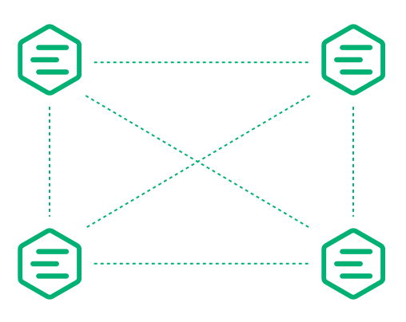

# EMQX Clustering

EMQX Clustering refers to the deployment of multiple EMQX nodes working together as a unified system. These nodes automatically share client sessions, topic subscriptions, and routing information, enabling seamless message delivery and horizontal scalability.

Compared to a standalone EMQX node, which handles all connections and data locally, a clustered setup distributes load across nodes, tolerates failures by rerouting traffic, and ensures continuous service even during node outages.

This architecture is ideal for large-scale, mission-critical IoT and messaging platforms built on MQTT.

## Chapter Preview

This chapter provides a comprehensive overview of EMQX clustering and how to apply it in real-world deployments. You'll learn about:

- The [benefits of clustering](#why-use-emqx-clustering)
- The [Mria and RLOG architecture](./mria-introduction.md)
- How to [create a cluster manually or automatically](./create-cluster.md)
- How to [secure communication between nodes](./security.md)
- How to [implement load balancing](./lb.md)
- How to [rebalance cluster load and evacuate nodes](./rebalancing.md)
- How to [monitor and maintain cluster stability](./performance.md)

Whether you're building a highly available MQTT platform or preparing for production scale, this guide will help you get started with confidence.

## Why Use EMQX Clustering

EMQX clustering is designed for large-scale and mission-critical applications that demand reliability, scalability, and performance. It offers the following key benefits:

- **Scalability**: Easily scale your deployment by adding more nodes, allowing EMQX to handle growing numbers of MQTT clients and messages without service disruption.
- **High Availability**: The distributed architecture ensures no single point of failure. If one or more nodes go offline, the system continues operating seamlessly.
- **Load Balancing**: MQTT traffic and client sessions can be distributed across nodes, helping to prevent bottlenecks and maximize hardware utilization.
- **Centralized Management**: All nodes can be managed and monitored from a single Dashboard or API endpoint, simplifying operations and maintenance.
- **Data Consistency and Security**: Session and routing state are automatically replicated across nodes, ensuring consistency and preserving secure communication across the cluster.

## How Clustering in EMQX Works

An EMQX cluster is made up of multiple broker nodes that work together to route messages, manage MQTT sessions, and deliver high availability and scalability. Each node communicates with others to share client subscriptions and routing information, ensuring that messages reach all relevant subscribers regardless of which node they are connected to.

This distributed design allows EMQX to support mission-critical messaging systems with minimal downtime and flexible expansion.

### Cluster Architecture Evolution

#### Before EMQX 5.0: Mnesia-Based Clustering

Early versions of EMQX relied on Erlang/OTP's built-in Mnesia database and a full-mesh topology. Each node maintained direct TCP connections to all other nodes using the Erlang distribution protocol (default port: 4370), forming a tightly coupled system.


However, this model had the following limitations:

- High synchronization overhead as the cluster size increased
- Risk of instability in clusters larger than 5 nodes
- Limited scalability, typically addressed via vertical scaling

> EMQX 4.3 achieved 10 million concurrent connections in benchmark tests, but this required heavy tuning and high-performance hardware. See the [performance report](https://www.emqx.com/en/resources/emqx-v-4-3-0-ten-million-connections-performance-test-report) for details.

#### EMQX 5.0 and Later: Mria + RLOG

From version 5.0 onward, EMQX introduced a new [Mria cluster architecture](./mria-introduction.md), which supports larger and more stable clusters.

Key changes include:

- **Core and Replicant Roles**: Core nodes handle writes and full data replication, while replicant nodes are read-only and handle client sessions.
- **Replication Log (RLOG)**: Enables asynchronous, high-throughput data replication from cores to replicants.
- **Scalability**: Supports up to 100 million MQTT connections per cluster.


::: tip Note

While there is no strict upper limit, it is advisable to limit the cluster size to three nodes in the open-source edition of EMQX. Using only core-type nodes, a smaller cluster size typically ensures greater stability.

:::

To support this architecture, EMQX relies on Erlang/OTP and a set of internal data structures for routing and delivery. The sections [Erlang/OTP Foundation](#erlang/otp-foundation) and [Cluster Data Structures](#cluster-data-structures) explain the runtime foundation and how these structures operate in the cluster.

### Erlang/OTP Foundation

EMQX is built on Erlang/OTP, a runtime and framework originally designed for building distributed telecom systems. In Erlang, each runtime instance is called a **node**, identified by a name in the format `<name>@<host>`, such as:

```
emqx1@192.168.0.10
```

Erlang nodes connect via TCP and use lightweight message passing to communicate. This forms the basis for EMQX clustering. Each node must use the same cookie for authentication. Once a connection is established and authenticated, a node can join the EMQX cluster automatically. In EMQX 5.x and later, the node's role (Core or Replicant) determines how it participates in data replication and routing.

### Cluster Data Structures

To efficiently route messages in a distributed cluster, EMQX uses three key internal data structures: the subscription table, routing table, and topic tree. These structures work together to ensure that messages are correctly matched to subscribers, even when clients are distributed across many nodes.

#### Subscription Table (partitioned)

 Each EMQX node maintains a local subscription table that maps MQTT topics to clients directly connected to that node. The data is partitioned because each node only stores subscriptions for its own clients, reducing overhead and improving scalability.

When a message is routed to a node, that node uses its subscription table to determine which of its local clients should receive the message.

Example structure:

```
node1:
    topic1 -> client1, client2
    topic2 -> client3

node2:
    topic1 -> client4
```

This example shows how the same topic (`topic1`) can have subscribers on multiple nodes, while each node manages its own local mappings independently.

#### Routing Table (replicated from Core)

The routing table tracks which topics are subscribed to on which nodes. In EMQX 5.x, this table is maintained and replicated only by Core nodes. Replicant nodes receive read-only copies via the RLOG mechanism.

When a client subscribes to a topic on any node (usually a replicant), the subscription event is forwarded to a Core node, which updates the cluster-wide routing table and replicates it to all nodes.

Example structure:

```
topic1 -> node1, node2
topic2 -> node3
topic3 -> node2, node4
```

#### Topic Tree (replicated from Core)

The topic tree is a hierarchical structure used to match published topics against subscription patterns, including [MQTT wildcards](../../design/mqtt-basics.md#mqtt-topics-and-wildcards) (`+` and `#`). It enables EMQX to resolve complex topic filters quickly.

Like the routing table, the topic tree is replicated by Core nodes and shared with Replicant nodes. When a new subscription arrives (e.g., `client1` subscribes to `t/+/x`), the topic tree is updated on all nodes to include this pattern. When a client subscribes to a new pattern (e.g., `t/+/x`), the update is handled by a Core node and then replicated.

Example topic–subscription mapping:

| Client  | Node  | Subscribed topic |
| ------- | ----- | ---------------- |
| client1 | node1 | t/+/x, t/+/y     |
| client2 | node2 | t/#              |
| client3 | node3 | t/+/x, t/a       |

After these subscriptions are in place, EMQX constructs the following topic tree and routing table:



#### Example Message Flow

When a message is published:

- The publishing node (Core or Replicant) uses the replicated topic tree to match the topic against subscription patterns.
- It uses the routing table to identify which nodes have interested subscribers.
- The message is forwarded only to those nodes.
- Each receiving node checks its local subscription table and delivers the message to its clients.

To better understand how clustering in EMQX works, you can continue to read the [Design for EMQX Clustering](../../design/clustering.md).

## Clustering Features Overview

EMQX provides a set of advanced clustering capabilities powered by its [Ekka](https://github.com/emqx/ekka) library, which extends the native distributed Erlang system. This abstraction enables key features such as automatic node discovery, dynamic cluster formation, network partition handling, and node cleanup.

### Node Discovery and Auto Clustering

EMQX supports multiple node discovery mechanisms, allowing clusters to form automatically in diverse deployment environments:

| Strategy | Description                             |
| -------- | --------------------------------------- |
| `manual` | Manually create a cluster with commands |
| `static` | Autocluster through static node list    |
| `DNS`    | Autocluster through DNS A and SRV records        |
| `etcd`   | Autocluster through etcd                |
| `k8s`    | Autocluster provided by Kubernetes      |

For detailed information, see [Create and Manage Cluster](./create-cluster.md).

### Network Partition Autoheal

Network partition autoheal is a feature of EMQX that allows the broker to recover automatically from network partitions without requiring any manual intervention, valuable for mission-critical applications where downtime is not acceptable.

The feature is controlled by the `cluster.autoheal` setting and is enabled by default.

```bash
cluster.autoheal = true
```

With this feature enabled, EMQX continuously monitors the connectivity between nodes in the cluster. If a network partition is detected, EMQX isolates the affected nodes and continues to operate with the remaining nodes. Once the network partition is resolved, the broker automatically re-integrates the isolated nodes into the cluster.

### Cluster Node Autoclean

The cluster node autoclean feature automatically removes the disconnected nodes from the cluster after the configured time interval. This feature helps to ensure that the cluster is running efficiently and prevents performance degradation over time.

This feature is enabled by default and controlled by the `cluster.autoclean` setting (default: 24h).

```bash
cluster.autoclean = 24h
```

### Session Across Nodes

EMQX supports cross-node session persistence, ensuring that client sessions and subscriptions are preserved even when clients temporarily disconnect.

To enable this feature:

- **MQTT 3.x clients**: set `clean_start = false`
- **MQTT 5.0 clients**: set `clean_start = false` and `session_expiry_interval > 0`

With these settings, EMQX keeps the previous session data associated with the Client ID when the client disconnects. Upon reconnection, EMQX resumes the previous sessions, delivers any messages that were queued during the client's disconnection, and maintains the client's subscriptions.

## Network Requirements

To ensure optimal performance, the network latency for operating EMQX clusters should be less than 10 milliseconds. The cluster will not be available if the latency is higher than 100 ms.

The Core nodes should be under the same private network. In Mria+RLOG mode, it is also recommended to deploy the replicant nodes in the same private network.
