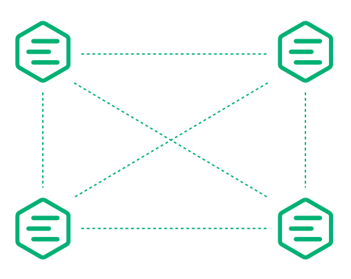

# Introduction

<<<<<<< HEAD
EMQX Cluster uses a distributed architecture, where each node in the cluster runs an instance of the EMQX broker, and each node communicates with the other nodes in the cluster to share information about client connections, subscriptions, and published messages. This allows the cluster to automatically distribute the load across the nodes and provide high availability in case of a node failure.

EMQX Cluster also provides data redundancy by maintaining multiple copies of the data across different nodes in the cluster. This ensures that if a node fails, the data is still available on other nodes in the cluster.

In addition, EMQX Cluster provides scalability by allowing you to add new nodes to the cluster as your MQTT application grows. This allows you to handle an increasing number of clients and messages without having to worry about the limitations of a single broker.

EMQX is powered by Erlang/OTP, the highly scalable distributed platform.
=======
EMQX cluster adopts a distributed architecture, which can handle a large number of clients and messages while ensuring high availability, fault tolerance and scalability.
>>>>>>> ac37bc2bda45385d1edf17b0ae646093ee3439ce

EMQX 5.0 adopts the new [Mria cluster architecture](./mria-introduction.md) compared to the previous version's cluster design. With this Mria architecture, one EMQX node can support up to 5 million MQTT connections, and the EMQX cluster can support up to 100 million concurrent MQTT connections.

This chapter will introduce the distributed EMQX cluster and its working mode to help you get started. 

## Working principles

In a distributed EMQX cluster, one EMQX instance runs on each node. All nodes within the cluster communicate with each other and share information on client connections, subscriptions, and published messages. So the EMQX cluster can automatically distribute the load across the nodes, thus ensuring the system's high availability.

EMQX cluster provides data redundancy by maintaining multiple copies of the data across different cluster nodes. If one node malfunctions, the data is still available on other nodes.

In addition, you can continuously add new nodes to one cluster to scale up the system's capabilities, so you can better handle an increasing number of clients and messages without worrying about the limitations of a single broker.

EMQX is powered by [Erlang/OTP](https://www.erlang.org/), the programming language platform Ericsson developed for telecommunication equipment systems. Before we talk about EMQX clustering, let's first talk about what is Erlang/OTP. 

## Erlang/OTP and Erlang node

Telecom equipment, such as routers and access gateways, are usually distributed systems with the main control board and multiple business boards connected via the backplane.

The distributed programs of the Erlang/OTP platform are multiple distributed yet interconnected Erlang runtime systems.
Each Erlang runtime system is called a node. Nodes are interconnected with TCP to form a network (or a cluster).

Erlang nodes are identified by a unique node name, which consists of two parts separated by `@`:

```bash
<name>@<ip-address-or-FQDN>
```

Communication between nodes is addressed by node name. Next, we will illustrate how to create nodes and clusters in Erlang REPL. 

1. Start four shell terminals locally and then use the `-name` parameter to start four Erlang nodes with the same `cookie`:

```bash
erl -name node1@127.0.0.1 -setcookie my_nodes
erl -name node2@127.0.0.1 -setcookie my_nodes
erl -name node3@127.0.0.1 -setcookie my_nodes
erl -name node4@127.0.0.1 -setcookie my_nodes
```

2. Visit the console (`node1@127.0.0.1`) and check the name of the current node and connected nodes, among which, `node().` is to check the node name and `nodes().` is to check the connected nodes.

```bash
(node1@127.0.0.1) 4> node().
'node1@127.0.0.1'

(node1@127.0.0.1) 4> nodes().
[]
```

3. Let `node1` initiate a connection to other nodes:

```bash
(node1@127.0.0.1) 1> net_kernel:connect_node('node2@127.0.0.1').
true
(node1@127.0.0.1) 2> net_kernel:connect_node('node3@127.0.0.1').
true
(node1@127.0.0.1) 3> net_kernel:connect_node('node4@127.0.0.1').
true
```

4. Rerun the command in step 2 and recheck the connected nodes. 

```bash
(node1@127.0.0.1) 4> nodes().
['node2@127.0.0.1','node3@127.0.0.1','node4@127.0.0.1']
```

We can see that `node2`, `node3`, and `node4` have established a distributed connection with `node1`, and these four nodes form a cluster.

Whenever a new node joins the cluster, it will establish a TCP
connection with all the nodes in the cluster. Connection among these 4 nodes is shown below:


## Distributed EMQX cluster

The basic function of a distributed EMQX cluster is to forward and publish messages to different subscribers, as shown below.


To achieve this, EMQX maintains several data structures in [embedded database](./mria-introduction.md):

- Subscription table
- Routing table
- Topic tree

### Subscription table: topics-subscribers

EMQX maintains a subscription table to store the topic-\> subscriber mapping and ensure the incoming messages are routed to the correct clients. This data is only stored on the EMQX node where the subscribers are located. The table scheme is as follows: 

<!-- TODO 数据分区跟这个有关吗 -->

```bash
node1:

    topic1 -> client1, client2
    topic2 -> client3

node2:

    topic1 -> client4
```

### Route table: topic-node

The route table stores the mapping between the topic and the node, that is, the topic list of each client on all nodes, and ensures the incoming messages are routed to the correct clients. This data will be duplicated among all nodes within the cluster. The table scheme is as follows: 

```bash
topic1 -> node1, node2
topic2 -> node3
topic3 -> node2, node4
```

### Topic tree: topic matching with wildcards

Topic tree has a hierarchical data structure. It stores information on topic hierarchies for matching messages to subscribed clients.

This data will be duplicated among all nodes within the cluster. Below is a topic tree example:

| Client  | Node  | Subscribed topic |
|---------|-------|------------------|
| client1 | node1 | t/+/x, t/+/y     |
| client2 | node2 | t/#              |
| client3 | node3 | t/+/x, t/a       |

When all subscriptions are completed, EMQX will maintain the following topic tree table and route table:



### Message distribution process

When an MQTT client publishes a message, the node where it is located retrieves the route table and forwards the message to the target node according to the message topic. 
The target node then retrieves the local subscription table and sends the message to the target subscribers.

For example, when `client1` publishes a message to topic `t/a`, the routing and distribution of the message between nodes are as follows:

1. `client1` publishes a message with topic `t/a` to `node1`.

2. `node1` queries the topic tree and locate `t/#` and `t/a` that match topic `t/a`. 

3.  `node1` queries the route table and fins:
   
   1. Some clients on `node2` subscribed topic `t/#`;
   
   2. Some clients on `node3 `subscribed topic `t/a`;
   
      So `node1` will forward the message to `node2` and `node3`.
   
4. `node2` receives the forwarded `t/a` message, queries the local subscription table, and then distributes the message to clients subscribed to the topic.

5. `node3` receives the forwarded `t/a` message, queries the local subscription table, and then distributes the message to clients subscribed to the topic.

6. Message forwarding and distribution are finished.

### Data partition and sharing

<!-- TODO 何为分区存放，用处是什么 -->

EMQX's subscription table is partitioned in the cluster, while the topic tree and routing table are replicated within the cluster.

## EMQX cluster node discovery and autocluster

EMQX added an abstraction layer with the [Ekka](https://github.com/emqx/ekka) library on top of distributed Erlang. 

Ekka is a cluster management library developed for
Erlang/OTP applications, enabling features like auto discovery of EMQX nodes, auto cluster, network partition autoheal and autoclean.

EMQX supports several node discovery strategies:

| Strategy | Description                             |
| -------- | --------------------------------------- |
| Manual   | Manually create a cluster with commands |
| Static   | Autocluster through static node list    |
| DNA      | Autocluster through DNS A record        |
| etcd     | Autocluster through etcd                |
| k8s      | Autocluster provided by Kubernetes      |

### EMQX cluster protocol settings

Each Erlang node can be connected via TCP or TLS,
and the connection method can be configured in `etc/emqx.conf`:

| Configuration item    | Type      | Default value       | Description                                                  |
| --------------------- | --------- | ------------------- | ------------------------------------------------------------ |
| cluster.proto_dist    | enum      | `inet_tcp`          | Distributed protocol with optional values are:<br />  - inet_tcp: use TCP IPv4<br/>  - inet6_tcp: use TCP IPv6<br/>  - inet_tls: use TLS |
| node.ssl_dist_optfile | file path | `etc/ssl_dist.conf` | When `cluster.proto_dist` is selected as `inet_tls`, you need to configure the ` etc/ssl_dist.conf` file and specify the TLS certificate. |

## Network partition autoheal

EMQX supports network partition autoheal, which can be configured in `etc/emqx.conf`:

```bash
cluster.autoheal = on
```

The work process is as follows:

1. The node receives `inconsistent_database` from Mnesia and waits 3 seconds before starting the network partition confirmation;
2. After the node confirms the network partition, it reports to the Leader node (the cluster node that starts first);
3. After the Leader node delays for a while, it creates a
   SplitView when all nodes are online;
4. The Leader node selects the self-healing coordinator node in the majority partition;
5. The coordinator node restarts the nodes in the minority partition to restore the cluster.

## Autoclean of cluster nodes

EMQX supports cluster autoclean, which can be configured in `etc/emqx.conf` :

```bash
cluster.autoclean = 5m
```
With this feature enabled, the disconnected node will be automatically removed from the cluster after the configured time interval.

## Further reading

You can continue to read the following chapters on how to cluster EMQX nodes.

* EMQX cluster [security setting](./security.md)
* [Manual clustering](./manual.md)
* [Auto clustering](./auto.md)
