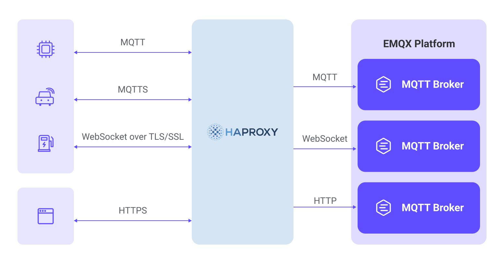
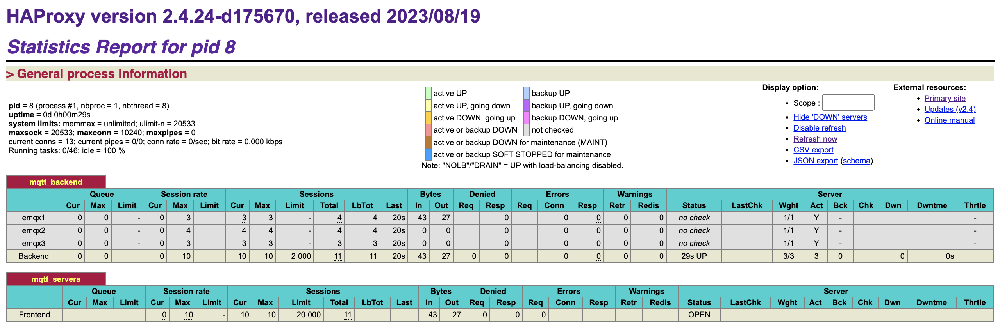
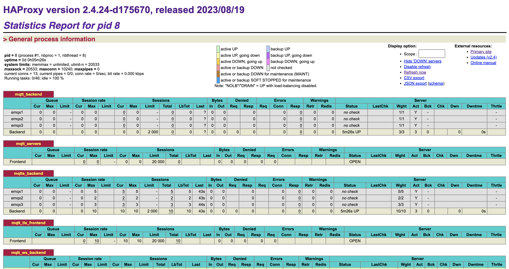

# Load Balance EMQX Cluster with HAProxy

HAProxy is a free, fast, and reliable load-balancing software that distributes client network connection requests to multiple backend servers. EMQX natively supports a distributed cluster architecture composed of multiple MQTT servers. By deploying EMQX clusters with HAProxy, you can load balance MQTT connections from IoT devices, distributing a large number of device connections across different EMQX nodes in the cluster.

This page primarily explains how to install and configure HAProxy to set up MQTT servers for load balancing within an EMQX cluster.

## Features and Advantages

When using HAProxy for EMQX MQTT load balancing, you benefit from the following features and advantages:

- Deploying EMQX clusters with HAProxy hides backend node information behind a reverse proxy, providing a unified access address externally, and enhancing system maintainability and scalability.
- Support for terminating MQTT over TLS connections, reducing EMQX's SSL encryption computational load, and simplifying certificate deployment and management.
- Built-in support for the MQTT protocol, enabling the parsing of MQTT messages to implement session stickiness and intelligent load balancing mechanisms, as well as identifying illegal connections for enhanced security protection.
- Provides a high-availability mechanism with primary and standby servers, combined with backend health checks, enabling sub-millisecond fault switching to ensure continuous service availability.



## Quick Start

Here is a Docker Compose configuration with practical examples that allow you to easily try and validate the setup. You can follow these steps:

1. Clone the example repository and navigate to the `mqtt-lb-haproxy` directory:

```bash
git clone https://github.com/emqx/emqx-usage-example
cd emqx-usage-example/mqtt-lb-haproxy
```

2. Start the example using Docker Compose:

```bash
docker compose up -d
```

3. Establish 10 TCP connections using [MQTTX](https://mqttx.app/) CLI to simulate MQTT client connections:

```bash
mqttx bench conn -c 10
```

4. You can view the HAProxy connection monitoring and the distribution of EMQX client connections.

   - Check the client connection status through the HAProxy stats monitoring page http://localhost:8888/stats:

   

   This will display the current active connection count and request handling statistics for the servers.

   - Use the following commands to view the client connection status for each EMQX node:

   ```bash
   docker exec -it emqx1 emqx ctl broker stats | grep connections.count
   docker exec -it emqx2 emqx ctl broker stats | grep connections.count
   docker exec -it emqx3 emqx ctl broker stats | grep connections.count
   ```

   This will display the connection count and active connection count for each node, with 10 connections evenly distributed across the cluster nodes:

   ```bash
   connections.count             : 4
   live_connections.count        : 4
   connections.count             : 3
   live_connections.count        : 3
   connections.count             : 3
   live_connections.count        : 3
   ```

Through these steps, you can verify the load-balancing functionality of HAProxy in the example and observe the distribution of client connections in the EMQX cluster. You can also customize the configuration for validation by modifying the `emqx-usage-example/mqtt-lb-haproxy/haproxy.conf` file.

## Install and Use HAProxy

This section introduces how to install and use HAProxy in detail.

### Prerequisites

Before you begin, ensure you have created a cluster consisting of the following three EMQX nodes. To learn how to create an EMQX cluster, see [Creating a Cluster](./create-cluster.md) for details.

| Node Address          | MQTT TCP Port | MQTT WebSocket Port |
| --------------------- | ------------- | ------------------- |
| emqx1-cluster.emqx.io | 1883          | 8083                |
| emqx2-cluster.emqx.io | 1883          | 8083                |
| emqx3-cluster.emqx.io | 1883          | 8083                |

The examples on this page will use a single Nginx server configured as a load balancer to distribute requests to a cluster composed of these three EMQX nodes.

### Install HAProxy

Here are the steps to install HAProxy on an Ubuntu 22.04 LTS system:

```bash
# Update the package index
sudo apt update 

# Install HAProxy
sudo apt install haproxy

# Check the version
haproxy -v
```

### Get Started

HAProxy's configuration file is located by default at `/etc/haproxy/haproxy.cfg`. You can refer to the example in this page to add configuration to the end of the file. During the running, HAProxy continuously logs to `/var/log/haproxy.log`, which you can check for debugging purposes.

Here are some basic commands to get started with HAProxy:

Check the configuration file for correctness:

```bash
sudo haproxy -c -f /etc/haproxy/haproxy.cfg
```

Start HAProxy:

```bash
sudo systemctl start haproxy
```

Reload HAProxy to apply new configurations. It's recommended to check the configuration first:

```bash
sudo systemctl reload haproxy
```

Stop HAProxy:

```bash
sudo systemctl stop haproxy
```

View the running status of HAProxy:

```bash
sudo systemctl status haproxy
```

## Configure HAProxy for Reverse Proxy and Load Balancing

This section explains how to configure HAProxy to meet various load-balancing requirements.

### Basic Configuration

Here is a reference configuration you need to start a HAProxy server. Ensure that the `haproxy.cfg` configuration file includes these two configuration items.

```bash
global  
  log 127.0.0.1 local3 info 
  daemon  
  maxconn 1024000

defaults  
  log global 
  mode tcp 
  option tcplog 
  #option dontlognull  
  timeout connect 10000 
  # timeout > mqtt's keepalive * 1.2  
  timeout client 240s  
  timeout server 240s 
  maxconn 20000
```

### Configure Reverse Proxy for MQTT

You can add the following configuration to HAProxy's configuration file to reverse proxy MQTT connections and route client requests to backend MQTT servers.

```bash
backend mqtt_backend
  mode tcp
  stick-table type string len 32 size 100k expire 30m
  stick on req.payload(0，0)，mqtt_field_value(connect，client_identifier)

  # Adding send-proxy will pass the real IP to EMQX, and the corresponding backend listener needs to enable proxy_protocol
  # server emqx1 emqx1-cluster.emqx.io:1883 check send-proxy-v2
  server emqx1 emqx1-cluster.emqx.io:1883
  server emqx2 emqx2-cluster.emqx.io:1883
  server emqx3 emqx3-cluster.emqx.io:1883

frontend mqtt_servers
  bind *:1883
  mode tcp
  # Wait for the buffer to fill up to parse the MQTT message
  tcp-request inspect-delay 10s
  # Reject non-MQTT connections
  tcp-request content reject unless { req.payload(0，0)，mqtt_is_valid }
  default_backend mqtt_backend
```

### Configure Reverse Proxy for MQTT SSL

You can use the following configuration to have HAProxy reverse proxy MQTT and decrypt TLS connections, forwarding encrypted MQTT requests from clients to backend MQTT servers to ensure communication security.

Simply add SSL and certificate-related parameters to the basic TCP configuration:

:::tip Tip
HAProxy's certificate file needs to include both the certificate and the key, and you can use the `cat` command to merge them into one file.

```bash
cat server.crt server.key > server.pem
```

:::

```bash
backend mqtt_backend
  mode tcp
  balance roundrobin
 
  # Adding send-proxy will pass the real IP to EMQX, and the corresponding backend listener needs to enable proxy_protocol
  server emqx1 emqx1-cluster.emqx.io:1883 check-send-proxy send-proxy-v2
  server emqx2 emqx2-cluster.emqx.io:1883 check-send-proxy send-proxy-v2
  server emqx3 emqx3-cluster.emqx.io:1883 check-send-proxy send-proxy-v2

frontend mqtt_tls_frontend
  bind *:8883 ssl crt /etc/haproxy/certs/server.pem 
  # Mutual authentication
  # bind *:8883 ssl ca-file /etc/haproxy/certs/cacert.pem crt /etc/haproxy/certs/server.pem verify required
  mode tcp
  default_backend mqtt_backend
```

### Configure Reverse Proxy for MQTT WebSocket

You can use the following configuration to have HAProxy reverse proxy MQTT WebSocket connections, forwarding client requests to backend MQTT servers. Specify the HTTP domain name or IP address using `server_name`.

```bash
backend mqtt_ws_backend
  mode tcp
  balance roundrobin
  server emqx1 emqx1-cluster.emqx.io:8083 check
  server emqx2 emqx2-cluster.emqx.io:8083 check
  server emqx3 emqx3-cluster.emqx.io:8083 check

frontend mqtt_ws_frontend
  bind *:8083 
  mode tcp
  default_backend mqtt_ws_backend
```

### Configure Reverse Proxy for MQTT WebSocket SSL

You can use the following configuration to have HAProxy reverse proxy MQTT WebSocket connections and decrypt TLS connections, forwarding encrypted MQTT requests from clients to backend MQTT servers to ensure communication security. Specify the HTTP domain name or IP address using `server_name`.

Simply add SSL and certificate-related parameters to the basic WebSocket configuration:

:::tip Tip
HAProxy's certificate file needs to include both the certificate and the key, and you can use the `cat` command to merge them into one file.

```bash
cat server.crt server.key > server.pem
```

:::

```bash
backend mqtt_ws_backend
  mode tcp
  balance roundrobin
  server emqx1 emqx1-cluster.emqx.io:8083 check
  server emqx2 emqx2-cluster.emqx.io:8083 check
  server emqx3 emqx3-cluster.emqx.io:8083 check

frontend mqtt_ws_tls_frontend
  bind *:8084 ssl crt /etc/haproxy/certs/server.pem
  mode tcp 
  default_backend mqtt_ws_backend
```

### Configure Load-Balancing Strategies

HAProxy provides various load-balancing strategies to control how connections are distributed. In practical use, it's important to choose the appropriate load-balancing strategy based on your server performance, traffic requirements, and other factors.

Here are load-balancing strategies supported by HAProxy along with their configuration examples.

#### Round Robin

This is the default load balancing strategy, which distributes requests to each backend server in a circular manner. This evenly distributes the load and is suitable for situations where backend servers have similar performance.

```bash
backend mqtt_backend
  mode tcp
  balance roundrobin
  server emqx1 emqx1-cluster.emqx.io:1883 check
  server emqx2 emqx2-cluster.emqx.io:1883 check
  server emqx3 emqx3-cluster.emqx.io:1883 check
```

#### Weighted Round Robin

Building on round robin, this strategy assigns different weights to each EMQX node to influence the distribution of requests. Servers with higher weights receive more requests.

```bash
backend mqtt_backend
  mode tcp
  balance roundrobin
  server emqx1 emqx1-cluster.emqx.io:1883 check weight 5
  server emqx2 emqx2-cluster.emqx.io:1883 check weight 2
  server emqx3 emqx3-cluster.emqx.io:1883 check weight 3
```

#### IP Hash

This strategy calculates a hash based on the client's IP address and then assigns the request to a fixed backend server. This ensures that requests from the same client are always directed to the same server.

```bash
backend mqtt_backend
  mode tcp
  balance source
  server emqx1 emqx1-cluster.emqx.io:1883
  server emqx2 emqx2-cluster.emqx.io:1883
  server emqx3 emqx3-cluster.emqx.io:1883
```

#### Least Connections

Requests are directed to the server with the fewest current connections, ensuring that the load is distributed as evenly as possible. This is suitable for situations where there is a significant difference in server performance.

```bash
backend mqtt_backend
  mode tcp
  balance leastconn
  server emqx1 emqx1-cluster.emqx.io:1883
  server emqx2 emqx2-cluster.emqx.io:1883
  server emqx3 emqx3-cluster.emqx.io:1883
```

### Configure MQTT Sticky Sessions Load Balancing

MQTT sticky session load balancing was introduced in HAProxy 2.4.

"Sticky" refers to the load balancer's ability to route the client to the same server when reconnecting, avoiding session takeover in MQTT. This is particularly useful for cases where multiple clients frequently reconnect or problematic clients disconnect and reconnect frequently, as it improves effectiveness.

To implement sticky sessions, the server needs to identify the client identifier in the connection request (typically the client ID). This requires the load balancer to inspect MQTT packets. Once the client identifier is obtained, for static clusters, the server can hash it to a server ID, or the load balancer can maintain a mapping table of client identifiers to target node IDs for more flexible routing.

```bash
backend mqtt_backend
  mode tcp
  # Create a sticky session table
  stick-table type string len 32 size 100k expire 30m

  # Use the client ID as the key
  stick on req.payload(0，0)，mqtt_field_value(connect，client_identifier)
 
  server emqx1 emqx1-cluster.emqx.io:1883
  server emqx2 emqx2-cluster.emqx.io:1883
  server emqx3 emqx3-cluster.emqx.io:1883
```

## Monitor HAProxy Status

HAProxy can be configured with a special frontend to enable status monitoring. This allows you to view the connection status of each backend and frontend, as well as global connection statistics. Refer to [Exploring the HAProxy Stats Page](https://www.haproxy.com/blog/exploring-the-haproxy-stats-page) for more details:

```bash
frontend stats
  mode http
  bind *:8888
  stats enable
  stats uri /stats
  stats refresh 10s
```

Open http://localhost:8888/stats to view the status data:



### HAProxy High Availability Solution Introduction

HAProxy and Keepalived are a common combination of high-availability and load-balancing solutions. Keepalived is a lightweight high-availability solution for Linux that can manage virtual IP addresses (VIPs) across multiple servers and ensure that a VIP is moved to another server when one becomes unavailable, providing high availability. Keepalived can also monitor the HAProxy process and restart it when necessary to ensure the availability of the load-balancing service.

By using Keepalived, you can ensure high availability for HAProxy. If the primary HAProxy server fails, Keepalived will automatically move the VIP to a backup server, ensuring the continuity of service. To learn how to implement this solution, refer to the [HAProxy documentation](https://www.haproxy.com/documentation/hapee/latest/high-availability/active-standby/).

## More Information

EMQX provides a wealth of resources for learning about HAProxy. Check out the following links for more information:

**Blogs:**

- [Build an EMQX cluster based on HAProxy](https://www.emqx.com/en/blog/emqx-haproxy)
- [Sticky session load balancing - MQTT broker clustering part 2](https://www.emqx.com/en/blog/mqtt-broker-clustering-part-2-sticky-session-load-balancing)
