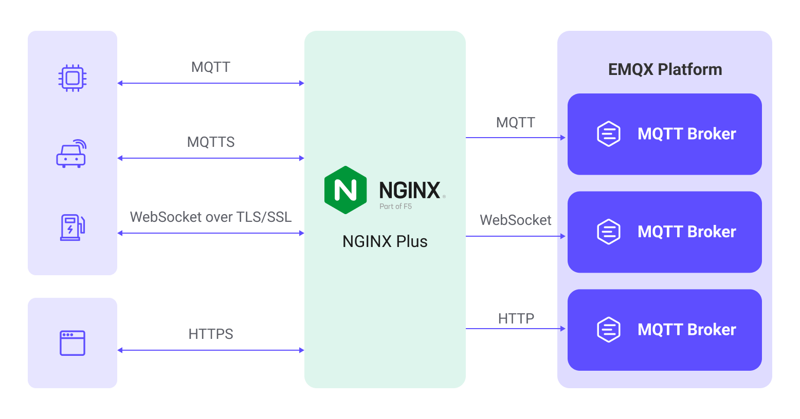

# Load Balance EMQX Cluster with NGINX

NGINX is a high-performance, multifunctional server software that can serve as a web server and reverse proxy server. Additionally, NGINX can function as a load balancer, distributing client requests to multiple backend servers to ensure load balancing and performance optimization. NGINX is particularly well-suited for IoT applications, where handling a large number of concurrent requests is crucial. In IoT, there are typically a large number of devices, which requires a server that is capable of handling a high request load. EMQX natively supports a distributed cluster architecture consisting of multiple MQTT servers. Therefore, deploying NGINX for load balancing and an EMQX cluster ensures high availability and scalability.

This page introduces how to install NGINX and configure NGINX for reverse proxy and load balancing purposes to set up MQTT servers for an EMQX cluster. It also introduces how to use NGINX Plus to optimize EMQX deployment.

## Features and Benefits

Using NGINX to load balance an EMQX cluster offers several features and advantages:

- As a reverse proxy server, NGINX sits on the MQTT server side, representing MQTT clients to initiate MQTT connection requests to the EMQX cluster and handling requests on behalf of the EMQX cluster. It then returns the EMQX cluster's response to the MQTT clients. This configuration hides multiple clusters and exposes a single access point to MQTT clients. MQTT clients only need to communicate with NGINX and do not need to know about the number and layout of the clusters behind it. This approach enhances system maintainability and scalability.
- NGINX can be used to terminate SSL-encrypted MQTT connections between MQTT clients and the EMQX cluster, reducing the encryption and decryption load on the EMQX cluster. This offers several advantages, such as improved performance, simplified certificate management, and enhanced security.
- NGINX provides flexible load balancing strategies to determine which EMQX node in the cluster should receive requests, helping distribute traffic and requests, thereby improving performance and reliability. For example, sticky load balancing can route requests to the same backend server, enhancing performance and session persistence.



## Quick Start

This section provides a Docker Compose configuration with actual examples to allow you to easily verify and test the NGINX function. You can follow these steps to proceed:

1. Clone the example repository and enter the `mqtt-lb-NGINX` directory:

```bash
git clone https://github.com/emqx/emqx-usage-example
cd emqx-usage-example/mqtt-lb-NGINX
```

2. Start the example via Docker Compose:

```bash
docker compose up -d
```

3. Use the [MQTTX](https://mqttx.app) CLI to establish 10 TCP connections, simulating MQTT client connections:

```bash
mqttx bench conn -c 10
```

4. You can view the NGINX connection monitoring and the distribution of EMQX client connections:

   - View NGINX connection monitoring with the following command:

     ```bash
     $ curl http://localhost:8888/status                                
     Active connections: 11 
     server accepts handled requests
      60 60 65 
     Reading: 0 Writing: 1 Waiting: 0
     ```

     This displays the current active connections and server request handling statistics, including reading, writing, and waiting states.

   - Use the following commands to view the client connection situation of each EMQX node, respectively:

     ```bash
     docker exec -it emqx1 emqx ctl broker stats | grep connections.count
     docker exec -it emqx2 emqx ctl broker stats | grep connections.count
     docker exec -it emqx3 emqx ctl broker stats | grep connections.count
     ```

     This shows the number of connections for each node and the number of active connections, with the 10 connections evenly distributed across the cluster nodes:

     ```bash
     connections.count             : 3
     live_connections.count        : 3
     connections.count             : 4
     live_connections.count        : 4
     connections.count             : 3
     live_connections.count        : 3
     ```

Through these steps, you can verify the NGINX load balancing functionality in the example and the distribution of client connections in the EMQX cluster. You can also modify the `emqx-usage-example/mqtt-lb-NGINX/NGINX.conf` file for custom configuration verification.

## Install and Use NGINX

This section introduces how to install and use NGINX in detail.

### Prerequisites

Before getting started, ensure that you have created a cluster consisting of the following 3 EMQX nodes. To learn how to create an EMQX cluster, see [Create a Cluster](./create-cluster.md) for details.

| Node Address          | MQTT TCP Port | MQTT WebSocket Port |
| --------------------- | ------------- | ------------------- |
| emqx1-cluster.emqx.io | 1883          | 8083                |
| emqx2-cluster.emqx.io | 1883          | 8083                |
| emqx3-cluster.emqx.io | 1883          | 8083                |

The examples in this page will use a single NGINX server configured as a load balancer to forward requests to the cluster composed of these 3 EMQX nodes.

### Install NGINX

The demonstration installs NGINX on an Ubuntu 22.04 LTS system using source code compilation. You can also install NGINX using Docker or binary packages.

#### Required Dependencies 

Before compiling and installing NGINX, ensure that the following dependencies are installed on your system:

- GNU C and C++ compilers
- PCRE (Perl Compatible Regular Expressions) library
- zlib compression library
- OpenSSL library

You can install these dependencies on an Ubuntu system with the following commands:

```bash
sudo apt-get update
sudo apt-get install build-essential libpcre3-dev zlib1g-dev libssl-dev
```

#### Download Source Code

You can download the latest stable version of NGINX from the [NGINX official website](https://nginx.org/en/download.html). For example:

```bash
wget https://nginx.org/download/nginx-1.24.0.tar.gz
```

#### Configure and Compile

After downloading, extract the source code and navigate to the source code directory:

```bash
tar -zxvf nginx-1.24.0.tar.gz
cd nginx-1.24.0
```

Configure the compilation options with the following command:

```bash
./configure \
 --with-threads \
 --with-http_stub_status_module \
  --with-http_ssl_module \
  --with-http_realip_module \
  --with-stream \
  --with-stream_ssl_module
```

In the above command, the `--with-http_ssl_module` parameter is used to add SSL support, while the `--with-stream` and `--with-stream_ssl_module` parameters are used to add TCP reverse proxy support.

#### Compile and Install

Start the compilation with the following command:

```bash
make
```

After compilation, you can install NGINX with the following command:

```bash
sudo make install
```

Create a symbolic link to the NGINX executable in a directory in your system's PATH:

```bash
sudo ln -s /usr/local/nginx/sbin/nginx /usr/local/bin/nginx
```

### Get Started

NGINX's configuration file is located by default at `/usr/local/nginx/conf/nginx.conf`. Simply add the configuration examples from this page to the end of the file. The basic NGINX operation commands are as follows:

Check the configuration file:

```bash
sudo nginx -t
```

If the NGINX configuration file is validated successfully, you can start NGINX:

```bash
sudo nginx
```

To reload a running NGINX and apply new configurations, it's recommended to check the configuration for errors before performing the operation:

```bash
sudo nginx -s reload
```

To stop NGINX:

```bash
sudo nginx stop
```

## Configure NGINX for Reverse Proxy and Load Balancing

This section explains how to configure NGINX to meet various load-balancing requirements.

### Configure Reverse Proxy MQTT

You can use the following configuration in NGINX's configuration file to reverse proxy MQTT connection requests from clients and forward them to the backend MQTT servers:

```bash
stream {
  upstream mqtt_servers {
    # down: indicates the current server temporarily does not participate in the load balancing
    # max_fails: the number of allowed failed requests; defaults to 1
    # fail_timeout: the timeout for failed requests, defaults to 10s when max_fails is reached
    # backup: when all non-backup servers are down or busy, requests go to backup servers

    server emqx1-cluster.emqx.io:1883 max_fails=2 fail_timeout=10s;
    server emqx2-cluster.emqx.io:1883 down;
    server emqx3-cluster.emqx.io:1883 backup;
  }

  server {
    listen 1883;
    proxy_pass mqtt_servers;

    # When enabling this option, the corresponding backend listener also needs to enable proxy_protocol
    proxy_protocol on;
    proxy_connect_timeout 10s;
    # Default keep-alive time is 10 minutes
    proxy_timeout 1800s;
    proxy_buffer_size 3M;
    tcp_nodelay on;
  }
}
```

### Configure Reverse Proxy MQTT SSL

You can configure NGINX to reverse proxy MQTT and decrypt TLS connections, forwarding encrypted MQTT requests from clients to the backend MQTT servers to ensure communication security. You only need to add SSL-related parameters on top of the TCP-based configuration:

```bash
stream {
  upstream mqtt_servers {
    server emqx1-cluster.emqx.io:1883;
    server emqx2-cluster.emqx.io:1883;
  }

  server {
    listen 8883 ssl;

    ssl_session_cache shared:SSL:10m;
    ssl_session_timeout 10m;
    ssl_certificate /usr/local/nginx/certs/emqx.pem;
    ssl_certificate_key /usr/local/nginx/certs/emqx.key;
    ssl_verify_depth 2;
    ssl_protocols TLSv1 TLSv1.1 TLSv1.2;
    ssl_ciphers HIGH:!aNULL:!MD5;

    # To enable mutual authentication, add the CA certificate and client certificate verification
    # ssl_client_certificate /usr/local/nginx/certs/ca.pem;
    # ssl_verify_client on;
    # ssl_verify_depth 1;

    proxy_pass mqtt_servers;

    # When enabling this option, the corresponding backend listener also needs to enable proxy_protocol
    proxy_protocol on;
    proxy_connect_timeout 10s;
    # Default keep-alive time is 10 minutes
    proxy_timeout 1800s;
    proxy_buffer_size 3M;
    tcp_nodelay on;
  }
}
```

### Configure Reverse Proxy MQTT WebSocket

You can use the following configuration to reverse proxy MQTT WebSocket connections in NGINX, forwarding client requests to the backend MQTT servers. You need to specify an HTTP domain name or IP address using `server_name`:

```bash
http {
  upstream mqtt_websocket_servers {
    server emqx1-cluster.emqx.io:8083;
    server emqx2-cluster.emqx.io:8083;
  }

  server {
    listen 80;
    server_name mqtt.example.com;

    location /mqtt {
      proxy_pass http://mqtt_websocket_servers;

      proxy_http_version 1.1;
      proxy_set_header Upgrade $http_upgrade;
      proxy_set_header Connection "Upgrade";

      # Disable caching
      proxy_buffering off;

      proxy_connect_timeout 10s;
      # WebSocket connection timeout
      # If there's no data exchange within this time, the WebSocket connection will automatically disconnect; default is 60s
      proxy_send_timeout 3600s;
      proxy_read_timeout 3600s;

      # Reverse proxy real IP
      proxy_set_header Host $host;
      proxy_set_header X-Real-IP $remote_addr;
      proxy_set_header REMOTE-HOST $remote_addr;
      proxy_set_header X-Forwarded-For $proxy_add_x_forwarded_for;
    }
  }
}
```

### Configure Reverse Proxy MQTT WebSocket SSL

You can configure NGINX to reverse proxy MQTT WebSocket and decrypt TLS connections, forwarding encrypted MQTT requests from clients to the backend MQTT servers to ensure communication security. Specify an HTTP domain name or IP address using `server_name`. To achieve this, you only need to add SSL and certificate-related parameters on top of the WebSocket-based configuration:

```bash
http {
  upstream mqtt_websocket_servers {
    server emqx1-cluster.emqx.io:8083;
    server emqx2-cluster.emqx.io:8083;
  }

  server {
    listen 443 ssl;
    server_name mqtt.example.com;

    ssl_session_cache shared:SSL:10m;
    ssl_session_timeout 10m;
    ssl_certificate /usr/local/nginx/certs/emqx.pem;
    ssl_certificate_key /usr/local/nginx/certs/emqx.key;
    ssl_protocols TLSv1 TLSv1.1 TLSv1.2;
    ssl_ciphers HIGH:!aNULL:!MD5;

    # To enable mutual authentication, add the CA certificate and client certificate verification
    # ssl_client_certificate /usr/local/nginx/certs/ca.pem;
    # ssl_verify_client on;

    location /mqtt {
        proxy_pass http://mqtt_websocket_servers;
        proxy_http_version 1.1;
        proxy_set_header Upgrade $http_upgrade;
        proxy_set_header Connection "Upgrade";

        # Reverse proxy real IP
        proxy_set_header Host $host;
        proxy_set_header X-Real-IP $remote_addr;
        proxy_set_header REMOTE-HOST $remote_addr;
        proxy_set_header X-Forwarded-For $proxy_add_x_forwarded_for;

        # Disable caching
        proxy_buffering off;
    }
  }
}
```

### Configure Load-Balancing Strategies

NGINX provides several load-balancing strategies for controlling how connections are distributed. In real-world usage, it's essential to choose the appropriate load-balancing strategy based on your server performance, traffic requirements, and other factors. Here are some common NGINX load-balancing strategies that you can configure in the `upstream` block:

#### Round Robin

This is the default load-balancing strategy. It evenly distributes requests to each backend server in a circular manner. This is suitable when backend servers have similar performance.

```bash
upstream backend_servers {
  server emqx1-cluster.emqx.io:1883;
  server emqx2-cluster.emqx.io:1883;
  server emqx3-cluster.emqx.io:1883;
}
```

#### Weighted Round Robin

Building on Round Robin, you can assign different weights to each EMQX node. This affects the distribution ratio of requests. Servers with higher weights receive more requests.

```bash
upstream backend_servers {
  server emqx1-cluster.emqx.io:1883 weight=3;
  server emqx2-cluster.emqx.io:1883 weight=2;
  server emqx3-cluster.emqx.io:1883 weight=1;
}
```

#### IP Hash

This strategy calculates a hash based on the client's IP address and then assigns the request to a specific backend server. This ensures that requests from the same client are always routed to the same server.

```bash
upstream backend_servers {
  ip_hash;
  server emqx1-cluster.emqx.io:1883;
  server emqx2-cluster.emqx.io:1883;
  server emqx3-cluster.emqx.io:1883;
}
```

#### Least Connections

Requests are distributed to the server with the fewest current connections, ensuring that the load on each server is as balanced as possible. This is suitable when there are significant differences in server performance.

```bash
upstream backend_servers {
  least_conn;
  server emqx1-cluster.emqx.io:1883;
  server emqx2-cluster.emqx.io:1883;
  server emqx3-cluster.emqx.io:1883;
}
```

## Use NGINX Plus to Optimize EMQX Deployment

This setion introduces how to configure the NGINX Plus specific features to optimize the EMQX deployment. Since the configuration examples for features in this section are only available in the NGINX Plus version, the NGINX version compiled and installed on this page cannot refer to these configurations. For information on optimizing MQTT connections using NGINX Plus, refer to this [document](https://www.nginx.com/blog/optimizing-mqtt-deployments-in-enterprise-environments-nginx-plus/).

### Configure MQTT Sticky Session Load Balancing

"Sticky" refers to the load balancer's ability to route clients back to the same server when they reconnect, preventing session takeover. This is particularly useful for clients that frequently reconnect or problematic clients that disconnect and reconnect, improving efficiency.

To implement stickiness, the server needs to identify the client identifier (usually the client ID) in the connection request. This requires the load balancer to inspect MQTT packets. Once the client identifier is obtained, for static clusters, the server can hash it to a server ID, or the load balancer can maintain a mapping table of client identifiers to destination node IDs for more flexible routing.

Here is a configuration example for this feature:

```bash
mqtt_preread on;

upstream backend_servers {
    hash $mqtt_preread_clientid consistent;
    server emqx1-cluster.emqx.io:1883;
    server emqx2-cluster.emqx.io:1883;
    server emqx3-cluster.emqx.io:1883;
}
```

Please note that the example above may need adjustments according to your specific setup. The modules used in the configuration (such as `ip_hash` and `least_conn`) are built-in NGINX modules and do not require additional module dependencies.

### Configure Client ID Replacement Feature

Security is crucial in MQTT communication. Devices often use sensitive data such as serial numbers as their Client IDs, and storing them in the MQTT server's database may pose security risks. NGINX Plus offers a client ID replacement feature, allowing the client ID to be replaced with another value set in the NGINX Plus configuration.

Here is a configuration example for this feature:

```bash
stream {
    mqtt on;

    server {
        listen 1883 ssl;
        ssl_certificate /etc/NGINX/certs/emqx.pem;
        ssl_certificate_key /etc/NGINX/certs/emqx.key;
        ssl_client_certificate /etc/NGINX/certs/ca.crt;      
        ssl_session_cache shared:SSL:10m;
        ssl_verify_client on;
        proxy_pass 10.0.0.113:1883;
        proxy_connect_timeout 1s;  

        mqtt_set_connect clientid $ssl_client_serial;
    }
}
```

In this example, we enabled mutual authentication for the client and extracted the certificate serial number from the client's SSL certificate as a unique identifier to replace the original client ID. You can also use other values like `$ssl_client_s_dn` to extract the certificate DN.

## Optimize NGINX Performance and Enable Monitoring

This section explains how to optimize the performance of NGINX through configuration and enable the status monitoring feature.

### NGINX Basic Configuration Adjustments

- `worker_processes`: The number of worker processes. Set it close to the number of CPU cores on your server, but avoid setting too many processes to prevent resource contention.
- `worker_connections`: The maximum number of simultaneous connections that a single worker process can handle. Ensure it does not exceed the maximum file descriptor limit allowed by the operating system.

```bash
worker_processes auto;

events {
 worker_connections 20480;
}
```

### NGINX Multi-NIC Support for Handling Massive Connections in Reverse Proxy

In reverse proxy scenarios, NGINX establishes connections to backend EMQX nodes as a client. In such cases, a single IP address can create approximately 60,000 long-lived connections at most. To support more connections, you can choose to deploy multiple NGINX servers or configure multiple IP addresses.

Here's an example of configuring multiple IPs using NGINX's built-in `split_clients` module to define a variable `$multi_ip`. It distributes requests based on the client's IP address and port number. Ensure that the IP addresses you use are available locally.

```bash
stream {
 split_clients "$remote_addr$remote_port" $multi_ip {
    20% 10.211.55.5;
    20% 10.211.55.20;
    20% 10.211.55.21;
    20% 10.211.55.22;
    * 10.211.55.23;
  }

  upstream mqtt_servers {
    server emqx1-cluster.emqx.io:1883;
    server emqx2-cluster.emqx.io:1883;
  }

  server {
    listen 1883;

    proxy_pass mqtt_servers;
    proxy_bind $multi_ip;
  }
}
```

### NGINX Status Monitoring

To enable NGINX status monitoring, ensure that the monitoring module `http_stub_status_module` is installed. If it's installed, you can enable status monitoring for NGINX:

```bash
http {
  server {
    listen 8888;

    location /status {
      stub_status on;
      access_log off;
    }
  }
}
```

You can access the status data by opening http://localhost:8888/status:

```bash
$ curl http://localhost:8888/status
Active connections: 12
server accepts handled requests
 25 25 60
Reading: 0 Writing: 1 Waiting: 1
```

## Appendix: Explanation of Main Parameters

Here are explanations of the main parameters used in the example configurations. These parameters ensure stable connections to the backend MQTT servers or ensure that MQTT communication is encrypted and protected via NGINX while following best security practices to safeguard communication privacy and integrity for IoT applications.

| Parameter Name         | Explanation                                                  |
| ---------------------- | ------------------------------------------------------------ |
| proxy_protocol         | Enables the PROXY protocol, allowing NGINX to attach additional proxy information at the beginning of the connection when forwarding requests. This ensures that EMQX can obtain the real client IP. |
| proxy_pass             | Defines the address of the backend MQTT servers, indicating that all requests from clients will be forwarded to this address. |
| proxy_connect_timeout  | Timeout for establishing a connection to the backend MQTT servers. If the connection is not established within this time, NGINX will abort the connection attempt. |
| proxy_timeout          | Timeout for the backend MQTT server. If no response is received from the backend within this time, NGINX will close the connection. |
| proxy_buffer_size      | Size of the buffer used to store data received from the backend MQTT server. Ensures a sufficient buffer size to handle large data streams. |
| tcp_nodelay            | Enables the TCP_NODELAY option and disables the Nagle algorithm. This can reduce packet transmission latency, benefiting real-time MQTT communication. |
| ssl_session_cache      | Configures a shared SSL session cache. This stores the state of SSL sessions to speed up the handshake process when clients reconnect. `shared:SSL:10m` specifies the cache name and size, which is 10MB here. |
| ssl_session_timeout    | Sets the timeout for SSL sessions to 10 minutes. Sessions not reused within this time will be cleared. |
| ssl_certificate        | Specifies the path to the SSL certificate file. This certificate is used to prove the server's identity. |
| ssl_certificate_key    | Specifies the path to the private key file corresponding to the SSL certificate. |
| ssl_protocols          | Specifies the allowed SSL/TLS protocol versions.             |
| ssl_ciphers            | Configures allowed encryption algorithms (cipher suites). `HIGH:!aNULL:!MD5` specifies the use of strong cipher suites while excluding some insecure options, such as empty cipher suites and the MD5 hashing algorithm. |
| ssl_client_certificate | Specifies the path to the Certificate Authority (CA) certificate file used to verify the authenticity of client certificates. |
| ssl_verify_client      | Enables client certificate verification. When set to `on`, NGINX requires clients to provide valid SSL certificates. |
| ssl_verify_depth       | Sets the maximum depth for verifying client certificates. Here, it's set to `1`, indicating that only one level of verification beyond the client certificate and CA certificate is performed. |

## More Information

EMQX provides a wealth of resources for learning about NGINX. Check out the following links for more information:

**Blogs:**

- [Harnessing Sticky Sessions in EMQX with NGINX Plus: Using 'Client ID' as the Magic Key](https://www.emqx.com/en/blog/harnessing-sticky-sessions-for-mqtt-load-balancing-with-nginx-plus)
- [Securing Your MQTT-Based Applications with NGINX Plus's Client ID Substitution and EMQX Enterprise](https://www.emqx.com/en/blog/securing-your-mqtt-based-applications-with-nginx-plus-client-id-substitution-and-emqx-enterprise)
- [Elevating MQTT security with Client Certificate Authentication in EMQX and NGINX Plus](https://www.emqx.com/en/blog/elevating-mqtt-security-with-client-certificate-authentication)
